# ARM64 BBML 源码分析:BBML0~BBML3

> **源码基线**: Linux 7.2-rc7 + BBML3 系列 patch(含 Mikołaj Lenczewski 的 BBML2 四部曲 `3eb06f6ce3af`/`5aa4b625762e`/`212c439bdd8f`/`83bbd6be7d17`,以及 BBML3 演进 `f8d0751426dd`/`267b481d0b94`/`06468bc3c936`/`4955df16ff99`)
>
> **Spec 基线**: 本文以 **PE/MMU 侧 spec(ARM ARM, DDI 0487M.b)为主**,所有架构规则原文均引自 ARM ARM;SMMU spec(IHI 0070H.a)只在 ARM ARM 未给出具体软件序列的地方作补充,并明确标注来源
>
> **代码范围**: `arch/arm64/mm/`(contpte.c / mmu.c)、`arch/arm64/kernel/cpufeature.c`、`arch/arm64/kvm/hyp/pgtable.c`、`drivers/iommu/arm/arm-smmu-v3/`(仅 SVA 一节)
>
> **视角约定**: 本文所说"MMU 侧"指 PE 自己的地址翻译硬件——包括 stage1(进程/内核页表)和 stage2(KVM 给虚机配的第二级翻译,由 EL2 软件管理、PE 硬件遍历)。SMMU/IOMMU 是另一套翻译器,只在对照处出现。


---

## 一、BBM 是什么:Break Before Make 的字面与本质

### 1.1 字面拆解

**Break-Before-Make(BBM)**:在 **Make**(写入新 PTE)之前,必须先 **Break**(把旧 PTE 置 invalid 并广播刷新 TLB)。

字面上只有两个动作,但每个动作都同时作用于**两个对象**:

- **页表 entry**(源头):存在内存中,软件可写;
- **TLB entry**(缓存副本):硬件持有,软件**不能直接写**,只能用 TLBI 指令驱逐。

**TLBI 是什么**(首次出现,全文大量使用):**TLB Invalidation,TLB 无效化指令**——ARM 的 TLB 维护指令族,软件操作 TLB 的唯一接口(只能驱逐缓存 entry,不能读、不能写入):

- `TLBI IPAS2E1IS`:按 IPA 无效化 stage2 entry(KVM 拆页用的就是它,见 5.5);
- `TLBI VMALLE1IS`:无效化 EL1&0 翻译 regime 的全部 entry(5.5 里刷 S1 用它);
- **IS 后缀** = Inner Shareable,广播到共享域内所有 PE(跨核驱逐必需);无 IS = 仅本核;range 版(FEAT_TLBIRANGE)支持按范围批量无效化。

所以完整的 **Break** 包含两步,**缺一不可**:

- **① 把内存中的页表 entry 改为 invalid**:从源头切断旧翻译,让后续的页表遍历不会再读到旧值。
	- 作用：防止再读错的页表。
	- 如，`stage2_try_set_pte`纯内存写，WRITE_ONCE/cmpxchg 把 bits63:60 写成 LOCKED
- **② 广播 TLBI 驱逐所有缓存副本**:清掉其他 PE 硬件中缓存的旧翻译,包括 TLB entry、中间级 walk cache、walk 硬件的临时寄存器。
	- 作用：扔掉该页表已经存在的缓存。
	- 如，`kvm_call_hyp(__kvm_tlb_flush_vmid_ipa)`中，`__tlbi_level(ipas2e1is) + dsb`就是操作 TLB 的部分。

**只做 ① 不做 ②**:内存虽然改了,但其他 PE 的 TLB 缓存里还存着旧翻译,仍然按旧地址翻译,直到缓存被自然替换——这段时间窗口内可能读到错误数据。

**只做 ② 不做 ①**:TLB 缓存虽然清了,但内存里的页表 entry 还是旧值,下一个 PE 发生 TLB miss 重新遍历页表时,又会把旧翻译重新加载回 TLB,等于白清。

### 1.2 Spec 对"TLB entry"的定义(为什么两个对象缺一不可)

ARM ARM D8.17 对 TLB entry 的定义非常宽:

- **RRVJDB(TLB entry 的宽定义)**:TLB entry 不只是"TLB 里的翻译缓存"——任何持有页表 entry 的结构都算,包括中间级 walk cache 和 walk 硬件的临时寄存器(原文见附录A);
- **RFFWJK(TLB 无硬件一致性)**:TLB 不保证与页表修改自动保持一致——data cache 有硬件一致性协议(MESI),TLB 没有,必须软件显式维护(原文见附录A)。这就是 BBM 存在的根本原因:**页表改了,硬件缓存不会自动跟着改**。

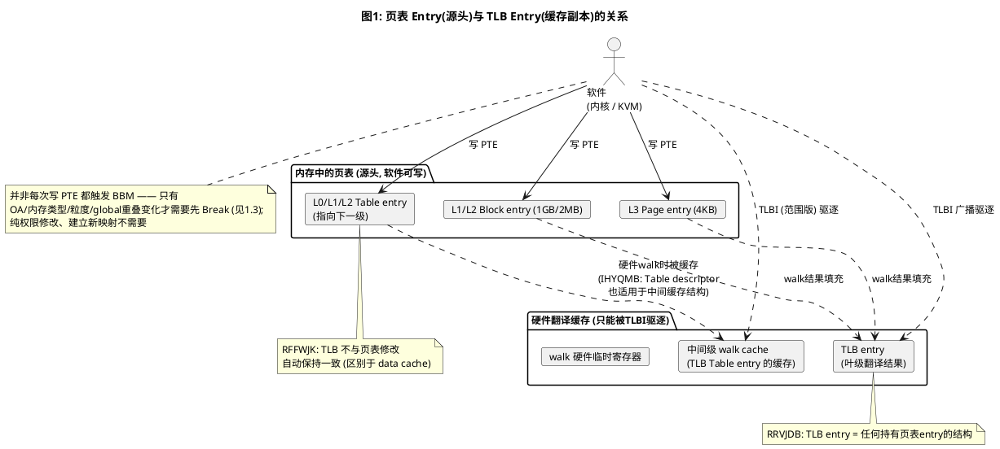

- 从上述流程也可以看出，TLB 不止存叶子节点的 TLB entry,还有中间级（walk cache）TLB(Table) entry。

### 1.3 哪些 PTE 修改会触发 BBM(概览)

图1 里软件对三级描述符都有"写 PTE"动作,但**并非任何写 PTE 都需要走 BBM 序列**。按"旧值 → 新值"的写模式分四种情形:

| 写 PTE 的情形 | 需要 BBM? | 需要 TLBI? | 依据 |
|---|---|---|---|
| invalid → valid(建立新映射) | 否 | **否** | IWZCBG:fault entry 从不被缓存 |
| 只改权限位(AP/XN/S2AP) | 否 | 是(改后刷,让新权限可见) | RWHZWS 清单不含;RGPPYH |
| 改 OA / 内存类型 / 粒度(block↔table) / global 重叠 | **是** | —(BBM 六步自带) | RWHZWS ①~④ |
| valid → invalid(unmap) | 否(没有 Make 步) | 是 | RGPPYH |

- **IWZCBG(fault entry 不缓存)**:产生 Translation/Address size/Access flag fault 的 entry 从不进 TLB——所以从 invalid 建立新映射**连 TLBI 都不需要**,只需一次 context synchronization event(如 ISB)让修改影响后续取指(原文见附录A)。

理解这张表的关键(三点):

- **TLB 只缓存"成功的翻译"**:invalid entry 从不进 TLB,所以 invalid → valid 建新映射天然安全,没有缓存副本可言;
- **BBM 处理的局面**:旧的**成功翻译**还缓存在 TLB 里、新的翻译又要诞生——两者可能冲突;
- **触发条件**:旧值 valid,且新值与缓存副本冲突(OA / 属性 / 粒度不同)——此时才需要先 Break。

> RWHZWS 完整原文与四类场景的详细展开在 3.1 节,本节只是前向概览。后文的两个案例分析(五、六章)全部围绕第三行(粒度变化)展开;级别相关的完整路径见 4.7 矩阵。

---

## 二、预备知识

### 2.1 OA 是什么:Output Address

**OA = Output Address(输出地址)**,即**本级翻译的产出地址**:

| 翻译级 | 输入(IA) | 输出(OA) |
|---|---|---|
| Stage 1 | VA(虚拟地址) | IPA(中间物理地址) |
| Stage 2 | IPA | PA(真正的物理地址) |
| KVM 视角 | Guest IPA | Host PA |

描述符里的 `OA[47:n]` 字段存的就是这个输出地址。**"OA 变化"** = 同一个 VA/IPA 改指向了不同的物理地址(页面迁移、remap)。spec 专门补了一条定义:

- **IWZRHR(OA 变化的定义)**:翻译 OA 空间的变化就视为翻译 OA 的变化——remap、页面迁移都算;什么场景会出现"VA 不变、OA 改变"见 3.1 的场景表(原文见附录A)。

### 2.2 描述符格式:Table / Block / Page

4KB granule、48-bit OA、4 级页表下(每级 9 bit 索引 + 12 bit 页内偏移),三种描述符的 bit 布局:

**Table descriptor(L0/L1/L2,指向下一级页表)**

| bits | 字段 | 含义 |
|---|---|---|
| [63:52] | 上层属性 | stage1: NSTable/APTable/XNTable 等;stage2: RES0 |
| [51:12] | **NLTA** | Next-Level Table Address,下一级页表物理地址(页对齐) |
| [11:2] | IGNORED / AF | bit[10] 为硬件管理的 AF |
| **[1]** | **1** | **Table descriptor 标识** |
| **[0]** | **1** | **Valid** |

**Block descriptor(L1/L2,叶子,大页)**

| bits | 字段 | 含义 |
|---|---|---|
| [63:55] | 上层属性 | stage2 的 XN 在 [54:53] |
| [52] | Contiguous | 连续 PTE 提示(FEAT_BBM 相关,见 RKHRBC) |
| [51:48] | OA 高位 | 仅 52-bit OA 时有效 |
| **[47:n]** | **OA** | L1: n=30 → **1GB**;L2: n=21 → **2MB** |
| [17] | — | (属下层属性区) |
| **[16]** | **nT** | **FEAT_BBML1 专用**:=1 表示翻译有效但不缓存(见 4.3 节) |
| [11:2] | 下层属性 | nG(11)、AF(10)、SH(9:8)、AP/S2AP(7:6)、AttrIndx/MemAttr(5:2) |
| **[1]** | **0** | **Block descriptor 标识** |
| **[0]** | **1** | **Valid** |

**Page descriptor(L3,叶子,只有 4KB)**

| bits | 字段 | 含义 |
|---|---|---|
| [63:52] | 上层属性 | 同 Block(含 Contiguous bit[52]) |
| **[47:12]** | **OA** | n=12 → **4KB**(L3 不能再分) |
| [11:2] | 下层属性 | 同 Block |
| **[1]** | **1** | **Page descriptor 标识(L3 没有 nT!)** |
| **[0]** | **1** | **Valid** |

**级别 × 粒度 × 覆盖大小对照(4KB granule)**

| 级别 | 可用描述符 | n 值 | 覆盖大小 |
|---|---|---|---|
| L0 | 仅 Table | — | — |
| L1 | Table / **Block** | 30 | **1GB** |
| L2 | Table / **Block** | 21 | **2MB** |
| L3 | 仅 Page(bit[1] 恒 1) | 12 | **4KB** |

**Block 和 L3 Page 的区别**(都是叶子,翻译结果都进 TLB):

| 维度 | Block | L3 Page |
|---|---|---|
| 粒度 | 1GB / 2MB | 固定 4KB |
| bit[1] | 0 | 1 |
| nT 位 | **有**(FEAT_BBML1) | **没有** |
| 能否指向下一级 | 否(本身是叶子) | 否(L3 是最后一级) |
| 所在级别 | L1/L2 | L3 |

各级叶子映射的地址位域,用一把"尺子"对照——通用形式即叶子描述符的 **OA[47:n]**(n=30/21/12),偏移位不存、由 VA 低位透传:

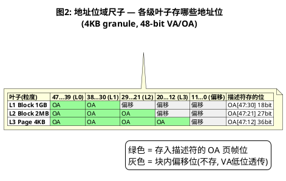

再看一个具体的 entry 是怎么填出来的——以 stage2 映射 IPA `0x12345678` → PA `0x6789A543`(RW、Normal WB、AF=1)为例:

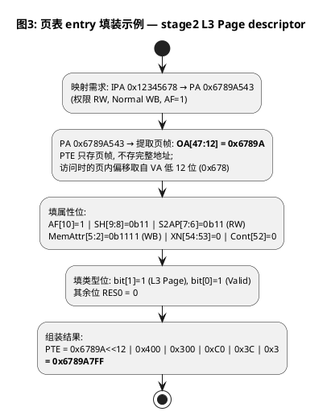

**拆大页的本质**:把 L2 的 Block descriptor(bit[1]=0)换成 Table descriptor(bit[1]=1),指向一个新页表页,里面 512 个 L3 Page entry 复刻原 block 的 OA + 属性。**bit[1] 从 0 变 1 的这一下,就是触发 BBM 要求的"块大小变化"。**

### 2.3 TLB entry 的结构:键 / 值 / 属性

TLB 里存的是页表翻译后的结果。一个概念正确的 TLB entry 结构:

| 组成 | 内容 | 示例(以 2MB block entry 为例) |
|---|---|---|
| **键(Tag)** | VA/IPA 高位 + **覆盖大小(1GB/2MB/4KB)** + **翻译上下文**(RNWYRD):Security state、翻译 regime、VMID(stage2)、global/非 global、ASID(非全局) | `VA[47:21]=0x91, size=2MB, VMID=0x5` |
| **值(Value)** | OA/PA 页帧(位宽随粒度变化,见下表) | `PA[47:21]=0x6789A` |
| **属性** | AP/UXN/PXN/S2AP/XN、AttrIndx(内存类型)、SH、nG、Contiguous、AF、DBM | RW, User, WB-cacheable, AF=1 |

- **键(输入信号)**:给出虚拟地址 `0x12345678`,硬件截取 VA 高位去匹配。注意**键里必须包含翻译上下文和覆盖大小**——翻译上下文(RNWYRD,原文见附录A)= Security state + 翻译 regime + VMID(如适用)+ global/非 global + ASID(非全局时);
- **值(目标地址)**:匹配成功后,硬件直接吐出 OA 高位,拼上页内偏移(如 `0x678`)访问内存。
- **属性**:决定能不能读写/执行这段内存。nT=1 的翻译**根本不会**被缓存成 TLB entry(见 4.3),所以缓存住的 entry 不存在"nT=1"的有效语义。

**各级叶子在 TLB 中的存储(4KB granule、48-bit VA)**——TLB **区分** block 和 L3 page,依据就是键里的覆盖大小:

| 叶子 | 键(Tag) | 值(Value) | 偏移 |
|---|---|---|---|
| L1 Block(1GB) | `VA[47:30]` + size=1GB + 上下文 | `PA[47:30]`(18 bit 页帧) | VA[29:0] 透传 |
| L2 Block(2MB) | `VA[47:21]` + size=2MB + 上下文 | `PA[47:21]`(27 bit 页帧) | VA[20:0] 透传 |
| L3 Page(4KB) | `VA[47:12]` + size=4KB + 上下文 | `PA[47:12]`(36 bit 页帧) | VA[11:0] 透传 |

- **值的位宽随粒度变化**:粒度越粗,需要存的 PA 位越少——页内偏移不用存,硬件拿 VA 低位直接拼接;
- **同一 VA 不同粒度 = 两条不同的 entry**:只要翻译上下文相同,它们可以在 TLB 里并存(IHYQMB:"multiple translation table entries that all translate the same IA");
- **架构上 size 必须是 entry 的一部分**,三个证据:
	- ①RFVQCK 说 "the address matches multiple entries"——能同时匹配多条,前提是每条记得自己的覆盖大小;
	- ②IHYQMB 的同 IA 多 entry 并存;
	- ③FEAT_TTL 的 level hint——TLBI 指令可带 level 编码定向失效(`__tlbi_level(ipas2e1is, ipa, level)`),内核注释明说 "If the level is wrong, no invalidation may take place",按级别定向失效能成立,前提是 TLB entry 带级别/大小信息;

**什么时候同一 IPA 会有多个粒度并存?** 稳态下不会——合法页表中一个 VA 在任一时刻只有一种粒度,walk 只产生一种翻译。并存只出现在**变更窗口**和**错误场景**:

| 场景 | 并存的两条 entry | 结果 |
|---|---|---|
| 拆大页(block→pages) | 旧 2MB entry + 新 4KB entry | BBML0 用 BBM 杜绝;BBML2/3 容忍瞬态 |
| 合并小页(pages→block) | 旧 4KB entries + 新 2MB entry | 同上 |
| contig fold/unfold | 旧非 contig 单页 entry + 新 contig entry | contpte_convert 跳过中间 TLBI 后的瞬态(即"Contig bit 误编程"形态,RNGLXZ) |
| 软件错误 | Contig bit 误编程 / CnP 配置不一致 | RQLGWZ:"Multiple hits in a TLB, which is permitted to generate a TLB conflict abort" |

场景 1~3 正是 BBM 要杜绝、BBML2/3 要定义行为的对象(四、五章展开)。

**TLB 怎么区分 size?** 架构只约束行为,不约束实现:

- **架构行为**:size/level 是 entry 自带的标签——缓存的是描述符拷贝,描述符来自哪一级(L1/L2/L3)决定了覆盖多大,entry 天然带级别语义;RZYZYK 还允许"Indexing an intermediate TLB structure by the IA"(中间级结构可按 IA 索引);
- **实现风格 A:统一 TLB**,tag 里带 size/level 位,查找时按各自位宽匹配 VA 高位(可变掩码);
- **实现风格 B:按粒度/级别分 bank/分结构**,如大页翻译与小页放不同结构——对外仍表现为"entry 带 size";
- 两种风格都 IMPLEMENTATION DEFINED,但架构行为必须等价于"size 是 entry 的一部分"。

**TLB 查找的真实机制——并行掩码比较,不是单 key 查找:**

- **不是"从 VA 算一个 tag 查哈希表"**:那样不同粒度 = 不同 key,确实无法同时命中——这与实际不符;
- **也不是"遍历所有 size 逐个试"**:没有循环,没有"先试 2MB 再试 4KB"的顺序逻辑;
- **真实机制:CAM(内容寻址存储)并行掩码比较**——VA **同时广播**到所有 entry,每条 entry 用**自己的 size 派生掩码**在**同一时钟周期**内独立完成比较(与 entry 数量无关);
- tag 和掩码在**填充时**随 walk 结果写入 entry:walk 到 L2 Block → 带 2MB 掩码;walk 到 L3 Page → 带 4KB 掩码。**查找时硬件不"选"tag**——tag 是每条 entry 自己存的一部分。

VA 0x12345678 同时匹配 2MB 和 4KB 两条 entry 的过程:

| entry | 粒度 | 掩码(填充时写入) | 比较(VA 广播后各自计算) | 命中? |
|---|---|---|---|---|
| [0] | 2MB | 取 VA[47:21] | 0x12345678 >> 21 = 0x91 = tag(0x91) | ✓ |
| [1] | 4KB | 取 VA[47:12] | 0x12345678 >> 12 = 0x12345 = tag(0x12345) | ✓ |
| [2] | 2MB | 取 VA[47:21] | 0x91 ≠ tag(0x678) | ✗ |
| [3] | 4KB | 取 VA[47:12] | 0x12345 ≠ tag(0x99) | ✗ |

2MB 范围与 4KB 范围是**包含关系**——同一个 VA 同时落在两者之内,两条 entry 同时报告命中 = **multi-hit**。这就是 multi-hit 架构上可能的原因,也是 BBML2/3 必须定义 multi-hit 行为(abort 或一致结果)的原因。

**TLB entry 的物理形态——不是 struct,是 CAM 段 + SRAM 段的宽位线:**

- **OA 不在 tag 里**:tag(钥匙)= VA 高位 + size + VMID + ASID + global,参与**匹配**;OA(答案)= 命中后从 SRAM 段读出的数据——如果 OA 也参与匹配,就成了"已经知道 PA 还要查 TLB"的悖论;
- **不是字节编址的 struct**:TLB entry 是一根固定宽度的**位向量**(IMPLEMENTATION DEFINED,约 100~200 bit),物理上分两段:

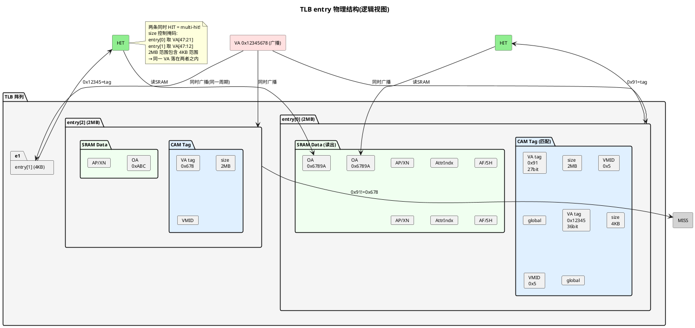

- **VA tag 位数取决于粒度**:2MB entry = VA[47:21] = 27 bit(L0+L1+L2 索引拼接);4KB entry = VA[47:12] = 36 bit(L0+L1+L2+L3 拼接);1GB entry = VA[47:30] = 18 bit;物理上按最宽(36 bit)分配,size 字段控制哪些位参与比较;

- **CAM 段**:VA 广播进来,每一位与 entry 存的对应位**硬件直连比较**(异或+全等判定),size 字段决定掩码(哪些 VA 位参与比较),VMID/ASID/global 同时并行比较——所有比较信号汇总成一条 HIT 线;
- **SRAM 段**:HIT 线拉高时,这一段(OA + 权限 + 属性)**一次性整体读出**,不参与任何匹配。

> 🎬 **交互演示**:同一个 VA 如何同时命中 2MB 和 4KB 两条 entry——点击下方动画,逐步体验"VA 广播 → 并行掩码比较 → 双命中":

<iframe src="tlb-multihit.html" style="width:100%;height:680px;border:1px solid #ddd;border-radius:8px" title="TLB Multi-Hit 演示"></iframe>

TLB entry 的填装与命中流程(数字沿用上文示例):

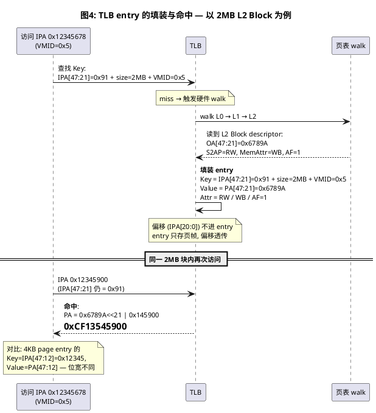

**multi-match 是 BBM 全部问题的根源**:同一个 VA `0x12345678` 既可能命中 2MB 的键 `VA[47:21]=0x91`,也可能命中 4KB 的键 `VA[47:12]=0x12345`。两条都命中 = 同一地址多个 TLB entry = 翻译结果不确定——而这两条 entry 能同时存在且都被匹配到,前提正是覆盖大小在键里(否则就是同一条 entry)。

### 2.4 翻译路径:任何访问都先查 TLB

MMU 的翻译路径:**先查 TLB,命中则直接用缓存翻译(权限检查也在这一层做),miss 才做硬件 page table walk(可能命中中间级 walk cache),walk 结果回填 TLB**。

**"可能命中 walk cache"意味着 TLB 不止存叶子表项**:

- **TLB 本体**存叶子(Block/Page descriptor)——完整翻译结果;
- **walk cache 存的是非叶子**(L0/L1/L2 的 Table descriptor,指向下一级页表的指针,不是翻译结果):walk 到某级时若该级 table entry 已缓存,直接拿到下一级页表地址,**省一次内存读**;
- **RRVJDB 的宽定义就涵盖它**:"a TLB entry is any structure that holds a translation table entry, including intermediate TLB caching structures..."(TLB entry = 任何持有页表 entry 的结构,含中间级缓存结构与 walk 硬件临时寄存器);
- 这也是拆大页必须用 **range 版 TLBI** 的原因:换掉的是 Table descriptor,walk cache 里缓存的旧指针必须整体驱逐(见 5.4 的 `kvm_tlb_flush_vmid_range`)。

这就是 stale TLB entry 有实际影响的原因:**权限 enforcement 发生在 TLB 命中层,而不是每次都重读页表**。内存里的 PTE 已经改成只读,但某个 PE 的 TLB 里还有旧的 RW entry,这个 PE 的写请求就被旧 entry 放行了。

这句话的意义要读对——它论证的是**TLB 维护的必要性**,不是 BBM 的必要性:

- **它说明的事实**:TLB 缓存副本是权限检查的依据——任何 PTE 修改(含权限)不做 TLBI,对其他 PE 都不生效;BBM 只是 TLB 维护中**最严格的一类**(哪些修改必须"先断后建",判定标准见 3.1);
- **权限修改的序列与 BBM 方向相反**:BBM = flush-then-make(先断后建);权限修改 = **make-then-flush**(先改内存再 TLBI)——先改内存,再刷 TLBI,差别只是中间一小段权限不一致的 gap(架构允许,边界是 TLBI+DSB 完成);
- **为什么权限可以后刷**:新旧 entry 并存是"一致翻译"(同 OA、同内存类型),不会 multi-match;gap 内旧 RW entry 放行写是架构允许的,软件要收口——KVM 脏页跟踪正是故意利用这个 gap 捕捉脏写(详见 3.1);
- **页表内存本身不需要软件同步**:页表也是内存,走 data cache 硬件一致性协议(MESI),一个 PE 的写对其他 PE 的 walk 自动可见;DSB 只保证"写 PTE"先于 TLBI 可见的**顺序**;**TLB 是整个链条里唯一不自动一致的环节**(RFFWJK "distinct from data caches" 的深意),所以 TLBI 是必须的。

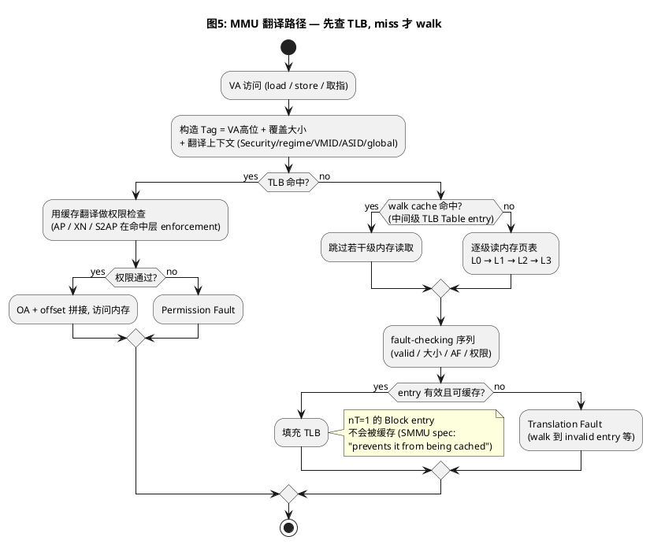

### 2.5 DSB 与 ISB 简述

BBM 六步序列里出现了三次 DSB,先弄清这两个屏障:

- **DSB(Data Synchronization Barrier,数据同步屏障)**:它**之前的所有内存访问全部完成**之前,它之后的指令不执行。带作用域后缀——页表是 Inner Shareable 的,所以用 `DSB ISH`(覆盖共享该页表的所有核)。BBM 里三处 DSB 分别保证:invalid entry 对各 PE 可见 → TLBI 广播驱逐完成 → 新 entry 可见。
- **ISB(Instruction Synchronization Barrier,指令同步屏障)**:丢弃流水线中已预取的指令,之后的指令重新取指。用于**改系统寄存器后**(VTTBR/TCR/SCTLR)让修改对后续执行生效(context synchronization)。KVM 的 `enter_vmid_context`/`exit_vmid_context` 切完 VMID 后的 `isb()` 就是这个。

一句话:**DSB 管数据访问完成,ISB 管取指上下文同步**。

---

## 三、ARM ARM 的 BBM 规则(本文 spec 引用均出自 DDI 0487M.b)

### 3.1 哪些修改必须 BBM:RWHZWS

ARM ARM D8.17.1 用一条规则列出了必须走 BBM 序列的全部场景:

| 必须走 BBM 的修改 |
|---|
| 内存类型 / Shareability / Cacheability 变化 |
| **OA 变化**,且(新旧任一可写,或 新 OA 与旧 OA 的内存内容不一致) |
| **块大小变化**(smaller↔larger,如 L2 Table↔Block 互换)——前提是 FEAT_BBML1/2 未实现 |
| 创建 global entry 且可能与 TLB 中已有的非 global entry 重叠 |

- **RWHZWS(必须 BBM 的场景清单)**:多线程共用页表时,上表四类修改必须走 BBM 序列;OA 变化还附带可写性/内容一致性条件(原文见附录A);
- **ITHWDH(BBM 能防止什么)**:BBM 保证新旧 entry 不会同时对不同线程可见,从而防止:同地址多 TLB entry、破坏一致性/单副本原子性/排序保证/单处理器语义、Exclusive monitor 清除失败(原文见附录A)。

**什么情况下会出现 VA 不变、OA 改变?**(表中第 2 行的实例支撑)——同一个虚拟地址改指向另一个物理页,按页表归属分:

| 页表 | 场景 | 触发 | VA/OA 变化 |
|---|---|---|---|
| Stage1 | **页面迁移** | NUMA balancing 自动迁移、compaction、`mbind()`/`move_pages()` 显式迁移、内存分层 demote、hwpoison soft-offline | 内容拷贝到新页,同 VA 换新 PFN |
| Stage1 | **COW(fork 写时复制)** | 子/父进程写共享只读页 → `wp_page_copy()` | 同 VA 从共享页换成私有副本页 |
| Stage1 | **KSM 合并** | 相同匿名页去重 | 同 VA 换成共享 ksmpage |
| Stage1 | **THP collapse** | khugepaged / `MADV_COLLAPSE` | 同 VA,粒度(4K→2M)和 OA **同时**变 |
| Stage2 | **host 迁移 guest backing 页** | NUMA balancing/compaction 碰到 guest 内存 → mmu_notifier → unmap 旧 HPA → guest refault 新 HPA | IPA 不变,HPA 变 |
| Stage2 | **memslot 更新** | `KVM_SET_USER_MEMORY_REGION` 换 userspace_addr | IPA 不变,整段换 host 内存 |
| SMMU | **IOVA 复用** | 同一 IOVA 先后映射不同 DMA buffer | IOVA 不变,PA 变 |

两个洞察:

- **内核的实现天然是 BBM 序列**:上述场景几乎都不做"原子换 PTE"——COW 走 `ptep_clear_flush` 再装新 PTE;迁移走 migration entry(本身就是那个 break)→ flush → 新 PTE;NUMA balancing 先把 PTE 改成 PROT_NONE 再迁移。RWHZWS 的 OA 条款管的是"想跳过 invalid 窗口直接替换"的写法——内核选择老老实实走窗口,所以这条规则在 CPU 侧很少被直接感知;它真正咬人的地方是 **SMMU**(DMA 流停不下来,invalid 窗口对设备流是伤害,这正是 SMMU 侧 BBML 讨论的原始动机);
- **RWHZWS 的 OA 条件有豁免边界**:要求 BBM 的条件是 OA 变化**且**(新旧任一可写,或新旧内容不一致)——两个都只读且内容一致(如只读镜像切换)的双可见是无害的,不强制。

**权限变化为什么不在清单里?**

- 新旧 entry 指向**同一个 OA、同样的内存类型**,唯一差别是权限检查结果;
- 旧 entry 说 RW、新 entry 说 RO——访问用哪一个都是"一致的翻译",不会破坏数据、不会写散、不会破坏一致性;
- 所以不需要 BBM。但架构仍要求改完后做 TLBI 让新权限**可见**(见下):

- **RGPPYH(改后可见性)**:改完 entry 必须 TLBI,新值才对后续执行生效——**含推测执行**:CPU 会提前推测性地翻译地址,这些翻译同样用 TLB 缓存副本,刷完之前连"还没发生"的访问都可能用旧权限(原文见附录A)。

注意区别:**"不需要 BBM" ≠ "不需要 TLBI"**。

- **BBM** 是"改之前先断旧映射";**RGPPYH** 是"改之后刷掉旧缓存"——方向相反;
- 窗口期内一次写可能被旧 entry 放行,这是软件要自己收口的。KVM 脏页跟踪正是这样做的:写保护 → flush → 再查 dirty bit 捕捉并发写;
- 代码佐证:`stage2_pte_needs_update()` 把权限位从"需要 break 更新"的条件里显式排除——`(old ^ new) & ~KVM_PTE_LEAF_ATTR_S2_PERMS`,只改权限就原地更新。

两条路径的直观对比——顺序完全相反,窗口期的"不一致"性质也不同(BBM 是映射缺失,仅 TLBI 是权限滞后):

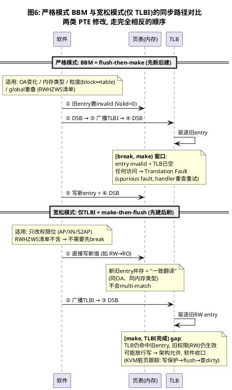

### 3.2 标准序列:RDDMVT 六步 —— BBML0 纯软件路径

- **RDDMVT(BBM 六步序列)**:①旧 entry 置 invalid ②DSB ③广播 TLBI ④DSB ⑤写新 entry ⑥DSB——完整展开见下图与 5.4 映射表(原文见附录A)。

六步中每一步干什么:

| 步骤 | 操作 | 作用 |
|---|---|---|
| ① | 旧 entry 置 invalid(Valid=0) | 从页表源头断旧——后续 walk 读不到旧值 |
| ② | DSB | 确保①的 invalid 写对其他 PE 可见 |
| ③ | 广播 TLBI | **驱逐 TLB 中已缓存的旧 entry**(旧翻译的缓存副本) |
| ④ | DSB | 确保③的驱逐广播完成——此刻 TLB 里该地址的 entry 为空 |
| ⑤ | 写新 entry(Valid=1) | 从页表源头建新——后续 walk 读到新翻译 |
| ⑥ | DSB | 确保⑤的新 entry 对其他 PE 可见——后续 miss → walk → 填充新 TLB entry |

> 注意:BBML0 六步里只有**一次 TLBI**(第③步,驱逐旧 entry);BBML1 有**两次**(②驱逐旧 + ⑤清理替换后的残留);BBML2/3 有**零次中间 TLBI**,但调用者会做一次**最终 TLBI**(见 4.4,清掉新旧并存的所有 entry)。

六步按目的精确划分为两个阶段——**Break(①~④)= 断旧**(把旧翻译从页表和 TLB 里彻底清掉)、**Make(⑤~⑥)= 建新**(写入新翻译并保证可见):

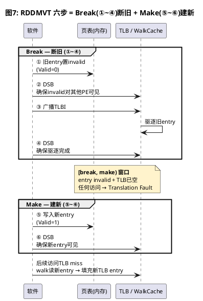

**这六步是 BBML0 的纯软件路径;BBML1 上仍可使用(正确但非必需);BBML2/3 上也依然正确**——它是基线,在任何硬件上都不会错。后面 4.1 的 RKFLJB 会给出级别与路径的关系。

**[break, make) 窗口期**:六步序列天然产生一段"映射缺失"窗口——

- 窗口内:内存中 entry invalid + TLB 已驱逐 → 本核/他核/walk 中的任何访问得到 **Translation Fault**。这正是 `Valid=0` 的直接作用。
- **Valid 会被置回来吗?会。** Make 步骤写入的新 entry 自带 Valid=1(拆页场景:新 Table descriptor Valid=1,它指向的 512 个 PTE 也各带 Valid=1),窗口结束后映射以新粒度恢复。
- **不依赖缓存自然刷新**:TLBI 已经把旧缓存驱逐;Make 之后的 walk 直接读新 entry 填充 TLB。正确性不靠"等下一次刷新"。
- 窗口期的 fault 是 **spurious fault(虚假故障)**:fault handler 重查页表发现映射已存在(Make 已完成)→ 直接重试。KVM 场景:guest 访问 → stage2 fault 退出 → `user_mem_abort()` 重查映射存在 → 重入 guest。这就是"性能抖动/虚假故障"的机理,也是 BBML1 出现的动机。

### 3.3 违反后果:multi-match 之后会发生什么

不做 BBM(或 BBM 做了一半),TLB 中同一地址的多个 entry 并存,架构给出的行为约束:

**通用规则(BBM 章节本身)**:

- **RFVQCK(multi-match 的允许行为)**:TLB 同时持有多个副本时,允许:①TLB conflict abort;②CONSTRAINED UNPREDICTABLE——与某条匹配 entry 一致的结果,或**多条融合(amalgamation)**,但不得越权访问(原文见附录A)。

**Contiguous bit 误编程场景的规则**(这正是后文 contpte_convert 跳过中间 TLBI 时所处的瞬态——部分 PTE 带 contig、部分不带,恰是"misprogramming"定义):

- **RNGLXZ(Contig bit 误编程的查找行为)**:允许:①与任一编程值一致的结果;②BBML1/2 未实现时还允许**不一致**结果(最危险);③TLB conflict abort(原文见附录A);
- **RJQQTC(Contig bit 一致但其余误编程)**:只允许返回与**任一**已编程值一致的结果(原文见附录A)。

注意关键差异:**BBML0 下允许"融合/不一致"(最危险);BBML1/2 下收敛为"abort 或与任一编程值一致的结果"(绝不融合)**。这就是内核敢在 BBML2+ 上跳过中间 TLBI 的全部理论依据。

---

## 四、BBML0 / BBML1 / BBML2 / BBML3:四级实现

**先看全貌——三级优化各自优化了什么?**

| 维度 | BBML0 | BBML1(nT 方案) | BBML2/3 |
|---|---|---|---|
| multi-entry 共存 | 不允许(软件杜绝) | **不允许**(nT 阻新缓存 + TLBI 清旧 = 替换时零副本) | **允许**(硬件消解) |
| 中间 TLBI 次数 | **1 次** | **2 次**(②和⑤)——反而更多 | **0 次** |
| fault 窗口 | **有**([break,make) 内 Translation Fault) | **无**(Valid 恒 1,翻译从不中断) | 无 |
| 额外代价 | fault 处理抖动 | nT 期间每次访问都 walk | 无 |

- BBML1 要**多付一次 TLBI** 的代价(2 vs BBML0 的 1),换来"全程 Valid=1、翻译从不中断"——这是**可靠性优化**,不是性能优化;
- BBML1 的动机来自 SMMU 侧:**不可停的 DMA 流**(网卡/GPU)在 BBML0 的 fault 窗口内会吃 Translation Fault → 掉线/驱动挂死;BBML1 让 I/O 流"无感"通过;
- BBML2/3 才是**性能优化**:0 次中间 TLBI + 无 nT walk 惩罚;
- 演进链:**BBML0(1 TLBI + fault 窗口)→ BBML1(2 TLBI + 无 fault,可靠性)→ BBML2/3(0 TLBI + 无 fault,性能+可靠性双优)**;
- 这也解释了内核为什么跳过 BBML1:CPU 侧场景可用 BBML0 忍受或规避 fault 窗口,BBML2/3 严格优于 BBML1,没有理由停在中间。

### 4.1 检测:ID_AA64MMFR2_EL1.BBM

CPU 的 BBM 支持级别由 `ID_AA64MMFR2_EL1.BBM`(bits [55:52])报告:

| 编码 | 级别 | 含义 |
|---|---|---|
| 0b0000 | BBML0 | 必须使用 BBM 序列 |
| 0b0001 | BBML1 | Level 1:支持改 block 大小 |
| 0b0010 | BBML2 | Level 2:支持改 block 大小 |
| 0b0011 | BBML3 | (2025 Architecture Extensions 定义,见 4.5) |

- **ID_AA64MMFR2_EL1.BBM(DDI 0487M.b D24.2)**:报告硬件改 block/table 大小时对 BBM 的要求,编码含义见上表(原文见附录A)。

> 手头的 DDI 0487M.b 里 BBM 字段只定义到 0b0010 且"其余值保留";**0b0011(BBML3)来自 2025 Architecture Extensions**(内核 commit `267b481d0b94` 给出了文档链接)。所以本文 spec 原文部分以 M.b 为准,BBML3 一节以内核 commit 与 2025 扩展文档为准,注意版本差异。

### 4.2 BBML0:六步纯软件序列

即 3.2 的 RDDMVT 六步。**软件承担全部同步责任**:invalid → DSB → 广播 TLBI → DSB → Make → DSB,保证任意时刻系统里同一地址只有一份有效翻译。第五章的 KVM stage2 拆大页就是完整的 BBML0 代码案例。

> 注意:KVM **不检测**硬件 BBM 级别,无条件按 BBML0 假设写代码——在任何硬件上都正确,代价是每次拆页的 TLBI 开销和 fault 窗口。

### 4.3 BBML1:nT 位方案

ARM ARM 把各级别与软件可选路径的关系写成一条规则:

- **RKFLJB(级别与可选路径)**:改 table/block 大小时
	- 无 BBML1 → 必须 BBM
	- 有 BBML1 → 可用 BBM **或** nT 位;
	- 有 BBML2 → 直接改、无需 BBM(原文见附录A);
- **RPVTFW(适用范围的硬约束)**:本节所有放松仅适用于**只改 table/block 大小、不改其他任何需要 BBM 的属性**——物理位置、内存类型等都不能变(原文见附录A)。

**RPVTFW 的规则化含义**:

- **BBML 的全部优化只覆盖两类修改**:块大小变化 + Contiguous bit 变化;RWHZWS 的另外三类(内存类型/OA/global 重叠)在任何硬件上——包括 BBML3——都只能走 BBML0 六步序列;
- 全场景 × 四级的支持矩阵见 4.7(一张表查清"我的场景在这块硬件上能走什么路径")。

**nT 位的 spec 定义(D8.7.3 Table and Block entry,需 FEAT_BBML1)**:

- **IPJZBK(nT 的位置)**:nT 在 VMSAv8-64 的 **Block descriptor**(bit[16])和 VMSAv9-128 SKL≠0 的描述符中——**VMSAv8-64 的 Table descriptor 和 L3 Page descriptor 没有 nT**(描述符格式见 [2.2 节](#描述符格式table-block-page);原文见附录A);
- **IXPRKH(nT 的保证)**:nT=1 期间改变 table/block 大小,由该 entry 翻译的访问不会破坏一致性/排序/单处理器语义,也不会导致 Exclusive monitor 清除失败(原文见附录A);
- **RMRRPW(nT 的代价之一)**:nT=1 时是否报 Translation fault 由实现定义;不报 fault 仍可能 TLB conflict abort(原文见附录A);
- **IDXRJK(nT 的代价之二)**:nT=1 期间翻译性能可能**显著受损**——每次访问都要重新 walk、不被缓存,所以 nT 只能是**过渡态**,用完要清掉(原文见附录A)。

nT 的语义本质(SMMU spec IHI 0070H.a 3.21.1.1,原文见附录B):nT 允许一个 valid 的 Block descriptor 参与翻译,但阻止它以可能与现存 TLB entry 冲突的方式被缓存——**参与翻译,但不进缓存**。

**BBML1 全程的 TLB 状态时间线——新旧 entry 从不同时存在于 TLB**(这正是 nT 的设计目的,也是 BBML1 与 BBML2/3 的本质区别):

| 时间段 | TLB 里有什么 | 访问走哪条路 | 有"选哪个"问题吗? |
|---|---|---|---|
| ① nT=1 之后、② TLBI 之前 | **只有旧 2MB entry**(nT 不删已有缓存) | TLB **命中旧 entry**——命中就用,不会去 walk 内存 | 没有(TLB 只有一种) |
| ② TLBI 之后、④ 替换之前 | **空**(旧的被驱逐,nT 阻止新的被缓存) | TLB miss → walk → Block(nT=1) → 翻译有效但不缓存 | 没有(TLB 空,直接用内存描述符) |
| ④ 替换之后 | 空,开始填新 entry | miss → walk Table→PTE → 4KB entry 被缓存 | 没有(只有新的一种) |

TLB 命中优先于 walk——命中就不查内存,miss 才读内存描述符。每个时刻 TLB 里**最多只有一种粒度的 entry**,不存在"硬件选哪个"的问题。

**nT 的核心作用——空窗期行为详解**:②(TLBI)到 ④(替换)之间的空窗期是理解 nT 的关键:

- **②(TLBI)之后**:旧 2MB entry 已被驱逐,TLB 中该地址的副本为空;
- **空窗期内的并发访问**:TLB miss → walk → 读到 Block(nT=1) → 翻译**有效**(2MB,OA 正确),但**不存进 TLB**——nT=1 禁止了 walk 结果的缓存;
- **如果没有 nT**:同一次 walk 会读 Block descriptor(仍 valid)→ 把 2MB 翻译**重新缓存**回 TLB → 到 ④ 替换成 Table 后,TLB 里 2MB(重缓存的)+ 4KB(新的)并存 = multi-match;
- **有 nT=1**:TLB 保持空 → ④ 替换发生时系统里该地址副本数为 **0** → 之后只有新 4KB entry 进来 → 永不冲突。

即:**TLBI 清"过去"(已缓存的旧副本),nT 管"未来"(空窗期内 walk 不许重缓存)——两者配合让替换(④)发生的瞬间系统零副本。** "性能差"(IDXRJK)的原因是空窗期每次访问都要 walk、TLB 不填充。

**BBML1 的完整软件序列**(ARM ARM 只说"可以用 nT",逐步序列是 SMMU spec IHI 0070H.a 3.21.1.2 以 Note 形式给出的权威操作;CPU 侧软件遵循同样的模式):

**拆大页(block → pages,最常见,如热迁移拆大页)——必须 nT-first,四步:**

```
① 旧 Block descriptor: nT 0→1   (Valid 保持 1,翻译仍有效)
② 广播 TLBI 该 block            (驱逐已缓存进去的旧 2MB 翻译)
③ DSB                           (确保 TLBI 完成)
④ 原子替换为 Table descriptor    (指向含 512 个等价 PTE 的新页表)
⑤ 广播 TLBI 受影响范围
⑥ DSB
```

**合并(pages → block)——四步:**

```
① 中间级 Table descriptor 直接替换为 nT=1 的 Block descriptor
② 广播 TLBI 受影响范围           (驱逐旧的 4KB 翻译缓存)
③ DSB
④ 新 Block descriptor: nT 1→0   (恢复可缓存)
⑤ 广播 TLBI 该 block
⑥ DSB
```

**为什么拆分必须 nT-first 而不能 make-first?**

- make-first 的问题:直接把 block 换成 table,walk 会立刻把 4KB entry 缓存进 TLB,与 stale 的 2MB entry 并存 → multi-match——这是 BBML2 才容忍的行为;
- nT-first 两步配合:**置 nT 管"未来"**(nT=1 后的新 walk 不再产生缓存)、**TLBI 清"过去"**(已有的缓存副本被驱逐);
- 结论:第 ③ 步结构替换发生时,系统里该地址的缓存副本数为零,永远不会出现 multi-match。

**"BBML1 是不是不用 break 把旧 TLB entry 写成 invalid?"** ——软件根本无法直接写 TLB entry。BBML1 全程 Valid=1、没有"置 invalid"这一步,靠的是 nT(阻止未来缓存)+ TLBI(清理过去缓存)的组合,而不是"写 invalid"。

**SMMU 与 PE 的严格度差异**(SMMU spec 3.21.1.2,原文见附录B):PE 侧允许对 nT=1 报 Translation fault(ARM ARM fault-checking 序列第 8 步),SMMU Level 1 明确**禁止**此 fault——SMMU 比 PE 更严格,因为设备的翻译 fault 更难恢复。

**BBML1 与 Contiguous bit**:BBML1 还顺带放开了 Contiguous bit 的修改:

- **RKHRBC(BBML1 放开 Contig bit)**:实现 BBML1 时,只改 Contiguous bit 无需 BBM(原文见附录A);
- **RFCPSG**:改 Contiguous bit 时仍可能产生 TLB conflict abort(同 IA 多 entry);
- **ICFFVK**:产生 conflict abort 后需要 TLB 维护清除多个 entry(Table descriptor 场景含中间缓存结构)。

**L3 Page descriptor 没有 nT,怎么享受 BBML1 的放松?** 因为 BBML1 包含**两个独立的放松机制**,nT 只是其中之一:

- **机制一:粒度变化(L1/L2 专属)→ nT 位**:拆/合大页改的是 L2 entry(Block↔Table 类型转换),nT 挂在转换点上抑制期间的新缓存;L3 是最后一级,不能变 Table、不能再拆,L3 entry **从不经历类型转换**,nT 无用武之地(VMSAv9-128 佐证:它的 Table descriptor 也有 nT,因为小表本身可改大小——nT 永远跟着转换点走,不跟着描述符类型走);
- **机制二:Contig bit 变化(Block 或 Page 都适用)→ 硬件直接容忍,不用 nT**:只翻 bit[52]、OA/权限/内存类型全不变,entry 仍是叶子,没有结构交换——瞬态只是"同范围内部分 entry 带 cont、部分不带"(RNGLXZ 的 misprogramming 形态),硬件保证查找要么 abort、要么返回与任一编程值一致的结果;SMMU spec 3.21.1.2 明说 Contig 变化无需 BBM 也无需 nT;
- **但 RFCPSG:PE 侧 BBML1 的 Contig 放松仍可能 TLB conflict abort**——这正是内核 contpte 场景额外要求 noabort(演进为 BBML3)的原因(见 6.3)。

**L3 叶子节点自己的 BBM 场景分诊**(L3 不存在粒度变化,但其余场景齐全):

| L3 场景 | 性质 | 路径 |
|---|---|---|
| 4K 页迁移 / COW / KSM | OA 变化 | 完整六步(任何硬件,见 3.1 场景表) |
| unmap / swap-out | 无 Make 步 | 仅 TLBI |
| mprotect | 权限变化 | make-then-flush(见 3.1/图6) |
| contpte fold / unfold | Contig bit | BBML1 起放松;内核要求 noabort → BBML3(见 6.3) |
| KFENCE / debug_pagealloc | 权限变化(线性映射) | make-then-flush |

### 4.4 BBML2:硬件容忍 multi-hit

RKFLJB 第三条:软件**直接改**,不 invalid、不用 nT、无中间 TLBI,硬件保证不破坏一致性/排序/单处理器语义/Exclusive monitor。

**硬件"透明处理"的确切含义**——不是"硬件去更新 TLB",而是**硬件消解 multi-hit 的后果**。

**新旧 entry 为什么会在 TLB 里同时存在?**

- **旧 entry 早就缓存了**:拆大页之前 2MB Block 是正常有效映射,之前的访问已把它缓存进 TLB;软件做 BBML2 操作时(直接写新 Table entry)**没有做 TLBI**,旧 2MB entry 一直在;
- **新 entry 有不同的 Tag 所以能共存**:旧 entry 键 = `VA[47:21]+size=2MB`,新 walk 产生的 4KB entry 键 = `VA[47:12]+size=4KB`——**两条不同的 TLB entry**(不同键),walk 不检查"此 VA 是否已有其他粒度 entry",直接填入;
- **访问可能命中旧也命中新**:TLB 查找只做 tag 匹配,**不检查 entry 是否"过期"**——在新 entry 被 walk 填充之前,访问命中旧 2MB entry(返回旧翻译,正确,因为 OA/属性没变);新 entry 填进来之后,同一 VA 查找可能同时命中两条 = multi-hit;
- 结果:TLB 里 2MB(旧的)+ 4KB(新的)物理共存,同一个 VA 0x12345678 同时匹配两条 entry = **multi-hit**。

**multi-hit 时硬件返回哪条?**——协议规定允许的行为,实现选择走哪条:

| 级别 | 允许的行为 | 谁决定 | 关键约束 |
|---|---|---|---|
| BBML0 | abort / **融合(amalgamation)** / 一致结果 | 实现定义 | 最危险:可以拼凑新旧属性,可能越权 |
| BBML2 | abort / **与任一编程值一致的结果** | **实现定义**(厂商选一条) | **禁止融合**(RNGLXZ):必须返回某一条 entry 的完整翻译,不能把旧 OA + 新权限拼在一起 |
| BBML3 | **只允许一致结果**(abort 被禁止) | 架构强制 | 厂商没得选 |

- **"一致结果"≠"择优返回"**:架构不规定返回旧还是新,只保证返回的是某一条 entry 的**完整**翻译(OA + 权限 + 属性都来自同一条);**具体返回旧 2MB 还是新 4KB = IMPLEMENTATION DEFINED**(厂商硬件自己定,没有"优先新""优先大"之类的架构规则);因为 BBML2 的前提是 RPVTFW(OA 和属性都没变,只变了粒度),旧 2MB 和新 4KB 的 OA + 属性本就一致,返回哪个都正确;
- **"abort"≠"不返回"**:abort 是报 TLB conflict abort **异常**,访问以异常结束(不是静默丢弃)。

ARM ARM 侧的表述就是 3.3 的 RNGLXZ/RJQQTC;SMMU spec(3.21.1.3,原文见附录B)说得更工程化:**忽略 nT 位、自动消解任何 multi-hit 场景、F_TLB_CONFLICT 永不发生;翻译至多使用一条匹配 entry 的信息,绝不组合多条 entry、不组合描述符更新前后的状态。**

**注意一个关键差异**:CPU 侧 BBML2 **不禁止** TLB conflict abort——

- **IHYQMB(不 TLBI 则可能 abort)**:改完不做 TLBI → TLB 可能存在多条同 IA entry,可产生 TLB conflict abort;Table descriptor 场景还适用于中间级缓存结构(原文见附录A)。

也就是说,**BBML2 的收敛仍然要靠软件的最终 TLBI(或自然淘汰)**。典型模式:

```
直接写入新 entry → (窗口期新旧并存, 硬件消解后果) → 调用者最终TLBI清掉新旧 → 只剩新翻译
```

**最终 TLBI 清什么?**——清掉**新旧并存的所有 entry**:

- 窗口期内 TLB 里有旧 entry(如 2MB block,拆页前缓存的)+ 新 entry(如 4KB page,拆页后 walk 填充的),两者并存;
- 最终 TLBI 把它们**全部驱逐**——之后下次访问 miss → walk 读到(已是新的)页表 → 填充新翻译;
- 被最终 TLBI 覆盖到的 entry:即时清除;未被覆盖的 stale entry:靠 TLB 自然淘汰(不保证时间,但正确性不受影响)。

> 对比:BBML0 六步里的 TLBI(第③步)只清**旧 entry**(因为新 entry 还没写入);BBML2/3 的最终 TLBI 清**新旧全部**(因为新 entry 早在直接写入时就进了 TLB)。

**BBML2 的适用场景**:**仅限"改 table/block 大小(双向)"+ Contiguous bit 修改**(RKHRBC 对 BBML1 成立,BBML2 当然继承)。**不适用**的:

- 内存类型/Cacheability 变化 → 任何级别都必须完整 BBM(RWHZWS 第 1 条不豁免);
- OA 变化(remap)→ 任何级别都必须完整 BBM(RWHZWS 第 2 条不豁免);
- 需要讨论"数据写散到新旧两个物理地址"的场景根本不存在——因为纯大小变化要求 OA 不变(RPVTFW)。

### 4.5 BBML3:BBML2 + 永不 abort 的架构化

**"BBML3 就是 BBML2 的 noabort 方案吗?"——是,分三层说:**

1. **语义上**:BBML3 = BBML2 的全部放松(免 break、免 nT、免中间 TLBI)+ **"永不产生 TLB conflict abort"**。BBML2 允许实现选择 abort 路径(RNGLXZ/IHYQMB);BBML3 把这条路径堵死,multi-hit 时硬件只能返回与任一编程值一致的结果。
2. **历史上**:内核先有的是 `ARM64_HAS_BBML2_NOABORT`(2025-06,Mikołaj 四部曲)——当时架构只有 BBML0/1/2,内核只能用 **MIDR 白名单**逐个信任"不 abort"的 BBML2 实现;2025 Architecture Extensions 把这个约定架构化为 FEAT_BBML3(ID 编码 0b0011)后,内核 rename commit 原文:"As bbml2_noabort is functionally equivalent to bbml3, rename cpu/system_supports_bbml2_noabort to cpu/system_supports_bbml3"。
3. **代码上**:检测函数先读 `ID_AA64MMFR2_EL1.BBM >= 3`,MIDR 白名单降级为 fallback(见 6.2)。

**为什么 noabort 是刚需?**

- 内核的大量关键路径(缺页处理、mTHP 折叠/展开)本身就运行在 abort 处理上下文中;
- 这些路径里若触发 TLB conflict abort,就是**递归 abort**,无法恢复;
- Mikołaj patch 2 的 commit message 说得直白:"Not causing aborts avoids us having to prove that no recursive faults can be induced in any path that uses BBML2, allowing its use for **arbitrary kernel mappings**."(不产生 abort 就不用证明任何 BBML2 路径都不会诱导递归 fault,从而能用于任意内核映射。)

**BBML3 的流程**:与 BBML2 完全一致(直接写入新 entry → 最终 TLBI 或自然淘汰),唯一区别是窗口期 multi-hit 时硬件**不会** abort。

### 4.6 常见误解纠错表

围绕 BBML1 流转很广的一段"理解",逐条核验(spec 依据见上文):

| 说法 | 判定 | 纠正 |
|---|---|---|
| "nT 向硬件发'正在施工'信号,可以先 Make 再清理旧缓存" | **顺序错** | 拆分方向必须 **nT-first**:nT=1 → TLBI → 替换 → TLBI。先 Make 再清只对"合并"方向成立 |
| "BBML0 窗口期 DMA 报错,网卡/GPU 掉线或驱动挂死" | 方向对、程度夸大 | 取决于 stream 能否 stall:SVA 可 stall 重试;不可 stall 的内核 DMA 才是硬错误 |
| "SMMU 读旧(TLB 命中)或读新(内存预取)" | 用词错 | "内存预取"应为 **TLB miss 后的 page table walk** |
| "数据一部分写到旧地址、一部分写到新地址,软件要同步处理" | **错误** | 纯大小变化 **OA 不变**(RPVTFW:不能改任何其他属性),不存在写散 |
| "致命问题:设备拿到 TLB 缓存返回错误物理地址" | **错误** | 纯大小变化中 stale entry 返回的 OA 是**正确的**(只是粒度粗);真实残余风险是 **TLB conflict abort** |
| "场景A:大页拆合时新旧物理空间'重叠'" | 措辞不准 | 不是重叠,是**完全相同**(纯粒度变化要求 OA+属性都不变) |
| "场景B:remap 到不同地址要先停设备" | 结论对、定性错 | OA 变化**根本不在 BBML1/2/3 的放松范围**(RWHZWS 第 2 条任何级别不豁免),必须传统 BBM |
| "BBML1 主要服务属性变更或粒度变更" | **半错** | 粒度变更 ✅;权限变更(RW→RO)**从来不需要 BBM**(只需 RGPPYH 的改后 TLBI);内存类型变更(WB→NC)**任何级别都不豁免** |
| "BBML1/2/3 让所有 BBM 场景都快了" | **错误** | 放松的只有块大小 + Contig bit 两类(RPVTFW);内存类型/OA/global 变化任何级别都走完整六步,见 4.7 矩阵 |
| "减少性能抖动/虚假故障" | 正确 | BBML1 消除 Valid=0 窗口,fault 不再发生 |

### 4.7 场景 × BBML 级别支持矩阵(速查)

开发者视角的最终速查表——"我要改这种 PTE,这块硬件上能走什么路径":

| # | 修改场景 | BBML0 | BBML1 | BBML2 | BBML3 | 依据 |
|---|---|---|---|---|---|---|
| **A** | **级别无关——本来就不需要 BBM**(行1~3) | | | | | |
| 1 | 建立新映射(invalid→valid) | 免 TLBI,仅需 ISB | 同左 | 同左 | 同左 | IWZCBG |
| 2 | unmap(valid→invalid) | 仅 TLBI | 同左 | 同左 | 同左 | RGPPYH |
| 3 | 权限变化(AP/XN/S2AP) | make-then-flush | 同左 | 同左 | 同左 | RWHZWS 不含 |
| **B** | **级别无关——必须完整 BBM,BBML 优化不覆盖**(行4~6) | | | | | |
| 4 | 内存类型/SH/Cacheability 变化 | 六步 BBM | 同左 | 同左 | 同左 | RWHZWS① |
| 5 | OA 变化(迁移/COW/KSM) | 六步 BBM | 同左 | 同左 | 同左 | RWHZWS② |
| 6 | global 与非 global 重叠 | 六步 BBM | 同左 | 同左 | 同左 | RWHZWS④ |
| **C** | **仅有的两类随级别放松**(行7~8) | | | | | |
| 7 | 块大小变化(拆/合大页,L1/L2) | 六步 BBM | 六步 **或 nT 方案** | **直接改**+最终 TLBI(仍可 abort) | **直接改**+最终 TLBI(**永不 abort**) | RKFLJB;RWHZWS③ |
| 8 | Contig bit 变化(Block/**Page**) | 六步 BBM | **直接翻**(仍可 abort) | **直接翻**(仍可 abort) | **直接翻**(**永不 abort**) | RKHRBC;RFCPSG |

图例:**六步 BBM** = RDDMVT 完整序列(图7);**直接改/直接翻** = 免 break、免 nT、免中间 TLBI,收敛靠最终 TLBI 或自然淘汰;**abort** = TLB conflict abort 可能性;同左 = 与 BBML0 列相同。

三段的读法:

- **A 段(行1~3)与硬件级别无关**——本来就不需要 BBM,四级完全一致;
- **B 段(行4~6)是 RPVTFW 的规则化含义**——BBML 优化完全不覆盖,即使 BBML3 也只能走 BBML0 六步;
- **C 段(行7~8)是 BBML1/2/3 全部优化所在**——且只有这两行;行8 是唯一 L3 Page descriptor 也受益的行(机制见 4.3 双机制分析)。

> 五、六章的案例全部落在 C 段:KVM stage2 拆大页 = **行7 的 BBML0 列**软件实现;contpte fold/unfold = **行8 的 BBML3 列**硬件方案。

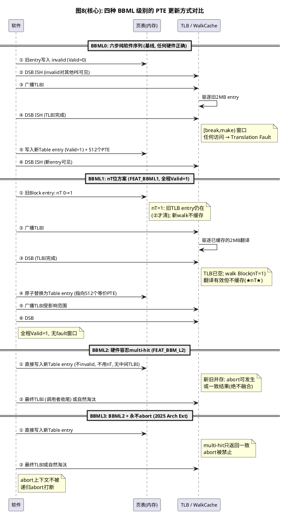

---

## 五、案例一:KVM Stage2 拆大页 —— BBML0 纯软件方案

**结论:KVM stage2 主线代码没有适配任何 BBML 优化——全树搜索 `system_supports_bbml3()` 调用点,arch/arm64/kvm/ 下为零。** KVM 不检测硬件 BBM 级别,无条件走 BBML0 六步(invalid → DSB → TLBI → DSB → make → DSB),在任何硬件上都正确。

> **RFC 预览**:社区已有 KVM 侧 BBML3 的 RFC(Mostafa Saleh / Google,两个 patch),落在 `BBML3` 分支未合入主线——见 5.7 节。

KVM 的 stage2 是 **PE MMU 的第二级翻译**:VTTBR_EL2 指向页表,由 EL2 软件管理、PE 硬件遍历——所以前文所有 ARM ARM 规则直接适用。

- **策略**:KVM **不检测** `ID_AA64MMFR2_EL1.BBM`,无条件按 BBML0 假设实现——在任何硬件上都正确,代价是每次拆页的 TLBI 开销和 fault 窗口;
- **嵌套虚拟化**:KVM 还向 Guest 隐藏该字段(nested.c 的 `limit_nv_id_registers` 强制 Guest 看到 BBM=0),因为 S1/S2 由不同实体管理时 BBM 保证无法跨级维护。

> 注意:KVM stage2 有两个**非 BBML 的 TLB 优化**——`stage2_unmap_defer_tlb_flush()`(FEAT_TLBIRANGE + FWB 时延迟到 walk 结束再用 range 版 TLBI 批量刷)和 `kvm_tlb_flush_vmid_range()`(range 版 TLBI 代替逐条)。这些是**TLB 指令层面的优化**(减少 TLBI 次数),不是 BBM 级别放松(仍然做完整 BBM 序列,只是把多次 TLBI 合并成一次 range 版)。`SKIP_BBM_TLBI` 仅用于 `create_unlinked()` 建离线子树(子树未挂载进 live 页表),与硬件 BBM 级别无关。

### 5.1 触发场景

最常见的是**热迁移脏页跟踪的 eager split**:用户态(QEMU)通过 `KVM_SET_USER_MEMORY_REGION` 开启 memslot 脏页跟踪 → 脏页位图是 4K 粒度,2MB block 无法提供 → 必须预先把所有大页拆成 4K:

```
kvm_mmu_split_memory_region()        // mmu.c, eager split 入口
 └─ kvm_mmu_split_huge_pages()       // 按 chunk 迭代, 预填 split_page_cache
     └─ kvm_pgtable_stage2_split()   // hyp/pgtable.c, 组装 walker
```

### 5.2 walker 回调机制:框架与业务分层

KVM 的 stage2 页表操作全部构建在一个通用 walker 框架上(映射、unmap、改属性、split、destroy、dump 都复用它)。框架负责遍历,业务通过回调函数注入:

```c
// walker 框架的核心数据结构
struct kvm_pgtable_walker {
	const kvm_pgtable_visitor_fn_t cb;      // 业务回调: map/unmap/split...各不相同
	void * const                   arg;     // 回调私有参数
	const enum kvm_pgtable_walk_flags flags;
};

// 框架在"访问"每个页表项时构造的上下文
struct kvm_pgtable_visit_ctx {
	kvm_pte_t *ptep;    // 当前PTE指针
	kvm_pte_t old;      // 当前PTE旧值
	void      *arg;     // walker->arg
	struct kvm_pgtable_mm_ops *mm_ops;
	u64 start, addr, end;
	s8  level;          // 当前页表层数
	enum kvm_pgtable_walk_flags flags;
};
```

框架的遍历核心 `__kvm_pgtable_visit()`(简化):

```c
static inline int __kvm_pgtable_visit(...)
{
	struct kvm_pgtable_visit_ctx ctx = {
		.ptep  = ptep,
		.old   = READ_ONCE(*ptep),     // 读取旧值
		.arg   = data->walker->arg,
		.level = level,
		.flags = flags,
	};
	bool table = kvm_pte_table(ctx.old, level);

	// entry 是 table 且设置了 TABLE_PRE 标志 → 先序回调
	if (table && (ctx.flags & KVM_PGTABLE_WALK_TABLE_PRE)) {
		ret = kvm_pgtable_visitor_cb(data, &ctx, KVM_PGTABLE_WALK_TABLE_PRE);
		// 回调可能已替换该entry → reload
	}

	// entry 是叶子(block/page)且设置了 LEAF 标志 → 叶子回调
	if (!table && (ctx.flags & KVM_PGTABLE_WALK_LEAF)) {
		ret = kvm_pgtable_visitor_cb(data, &ctx, KVM_PGTABLE_WALK_LEAF);
	}

	// reload: 回调可能把 block 换成了 table, 让框架能下降进新子树
	...
	if (!table) {
		// 叶子处理完, addr 前进一个 granule, 继续同级
		data->addr = ALIGN_DOWN(data->addr, kvm_granule_size(level));
		data->addr += kvm_granule_size(level);
		goto out;
	}

	// 是 table → 下降一级递归
	ret = __kvm_pgtable_walk(data, mm_ops, childp, level + 1);
	// TABLE_POST 回调(拆页不用)
}
```

拆页的入口只注册叶子回调:

```c
int kvm_pgtable_stage2_split(struct kvm_pgtable *pgt, u64 addr, u64 size,
			     struct kvm_mmu_memory_cache *mc)
{
	struct kvm_pgtable_walker walker = {
		.cb	= stage2_split_walker,        // 业务回调
		.flags	= KVM_PGTABLE_WALK_LEAF,       // 只访问叶子
		.arg	= mc,                          // 页表页预留缓存
	};

	ret = kvm_pgtable_walk(pgt, addr, size, &walker);
	dsb(ishst);      // RDDMVT 第6步: 确保新entry可见
	return ret;
}
```

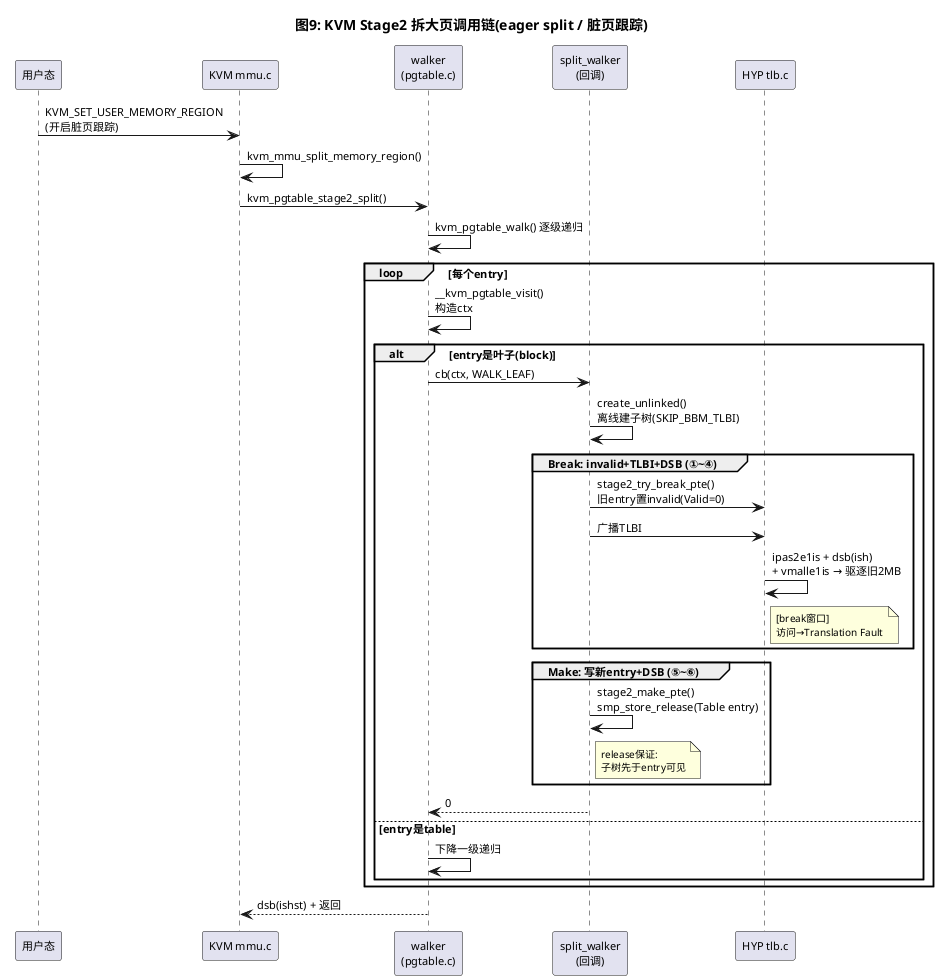

### 5.3 stage2_split_walker:三步策略

**先理解"live 页表 vs 离线子树"——这是三步策略的心智模型:**

```
拆页前的 live 页表:                create_unlinked() 建的离线子树:
L2: [Block(2MB, OA=X)]            L2(新页表页, 从memcache分配)
      ↑ 硬件正用这个翻译              └─ 512个L3 PTE:
                                      [Page(4KB, OA=X+0)]
                                      [Page(4KB, OA=X+4K)]
                                      ...
                                      (复刻block的OA+属性)
                                      ↑ 无entry指向它, 硬件不可达!
```

- **live 页表**:VTTBR_EL2 指向的、PE 硬件正在遍历的那棵页表——拆页前 L2 上是旧 Block entry;
- **离线子树**:从 `split_page_cache` 新分配的页表页,内容是 512 个 L3 PTE(复刻原 block 的 OA 区间和属性),**此时没有任何 live entry 指向它**——硬件 walk 从 VTTBR 出发永远走不到这里,所以不可能有 TLB entry / walk cache 引用它的 PTE;
- 这就是 `SKIP_BBM_TLBI` 的依据:子树内部 PTE 的写入不需要 BBM(无引用),BBM 只在"挂载"那一下(替换 L2 entry)才需要。

**三步各自操作的对象不同,只有 Step2/3 需要 BBM:**

| Step | 操作 | 对象 | 需要 BBM? | 原因 |
|---|---|---|---|---|
| ① create_unlinked | 分配新页表页,填 512 个 PTE | **离线子树**(无 entry 指向) | **否** | 硬件不可达,无缓存副本,`SKIP_BBM_TLBI` 跳过 TLBI |
| ② try_break_pte | 旧 Block entry → invalid + TLBI | **live 页表的 L2 entry**(正被硬件使用) | **是** | 旧 2MB 翻译已缓存进 TLB,直接改 = multi-match |
| ③ make_pte | L2 entry ← 新 Table entry(指向子树) | 同一个 L2 entry | — | 写新值 + `smp_store_release` 保证可见 |

**核心:BBM 的对象是 live 的 L2 entry(块大小变化),不是离线子树。** 离线建子树只是把 RDDMVT 六步序列中"⑤写新 entry"的**准备工作提前做掉**,与"①~④断旧"解耦,缩短 Break 窗口。

```c
static int stage2_split_walker(const struct kvm_pgtable_visit_ctx *ctx,
			       enum kvm_pgtable_walk_flags visit)
{
	struct kvm_mmu_memory_cache *mc = ctx->arg;
	struct kvm_s2_mmu *mmu;
	kvm_pte_t pte = ctx->old, new, *childp;
	...

	/* L3 没有大页可拆 */
	if (level == KVM_PGTABLE_LAST_LEVEL)
		return 0;

	/* 只拆 valid 的 block mapping */
	if (!kvm_pte_valid(pte))
		return 0;

	nr_pages = stage2_block_get_nr_page_tables(level);  // 评估需要的页表页数
	// memcache充足 → force_pte=true 建满整棵子树
	// 不足 → 只建一层, 留给下次递归再拆
	if (mc->nobjs < nr_pages)
		return -ENOMEM;

	phys = kvm_pte_to_phys(pte);
	prot = kvm_pgtable_stage2_pte_prot(pte);

	// ── 第一步: 离线建好整棵新子树 ──────────────────────
	// 关键: 内部walk带 KVM_PGTABLE_WALK_SKIP_BBM_TLBI
	// 子树还没挂进live页表, 硬件不可能有引用它的TLB entry
	childp = kvm_pgtable_stage2_create_unlinked(mmu->pgt, phys,
						    level, prot, mc, force_pte);
	if (IS_ERR(childp))
		return PTR_ERR(childp);

	// ── 第二步: Break ─────────────────────────────────
	if (!stage2_try_break_pte(ctx, mmu)) {
		kvm_pgtable_stage2_free_unlinked(mm_ops, childp, level);
		return -EAGAIN;                  // 他人持锁 → 丢弃子树重试
	}

	// ── 第三步: Make ──────────────────────────────────
	// 注释原文: 子树内容保证先于新PTE可见,
	// 因为 stage2_make_pte() 用 smp_store_release() 写PTE
	new = kvm_init_table_pte(childp, mm_ops);
	stage2_make_pte(ctx, new);
	return 0;
}
```

### 5.4 stage2_try_break_pte ↔ RDDMVT 六步映射

BBML0 的核心原语,注意 invalid entry 的编码用 bits[63:60]:

```c
static bool stage2_try_break_pte(const struct kvm_pgtable_visit_ctx *ctx,
				 struct kvm_s2_mmu *mmu)
{
	struct kvm_pgtable_mm_ops *mm_ops = ctx->mm_ops;
	kvm_pte_t locked_pte;

	// 软件锁检查: 他人已锁定 → false → 调用方返回 -EAGAIN
	if (stage2_pte_is_locked(ctx->old)) {
		WARN_ON(!kvm_pgtable_walk_shared(ctx));
		return false;
	}

	// RDDMVT 第1步: 旧entry替换为invalid
	// 编码 = KVM_INVALID_PTE_TYPE_LOCKED (bits[63:60]=1, Valid=0)
	// 双重身份: 既是BBM的"Break", 又是KVM自己的软件锁(防并发软件walker)
	// 独占访问: WRITE_ONCE; 共享walk: cmpxchg(失败即并发冲突)
	locked_pte = FIELD_PREP(KVM_INVALID_PTE_TYPE_MASK,
				KVM_INVALID_PTE_TYPE_LOCKED);
	if (!stage2_try_set_pte(ctx, locked_pte))
		return false;

	if (!kvm_pgtable_walk_skip_bbm_tlbi(ctx)) {
		// RDDMVT 第3步: 广播TLBI, 按旧entry类型选粒度
		if (kvm_pte_table(ctx->old, ctx->level)) {
			// 旧entry是table → 刷整个范围
			// (walk cache缓存了Table descriptor, 必须范围版驱逐!)
			kvm_tlb_flush_vmid_range(mmu, addr, size);
		} else if (kvm_pte_valid(ctx->old)) {
			// 旧entry是block/page → 只刷该IPA+level
			kvm_call_hyp(__kvm_tlb_flush_vmid_ipa, mmu,
				     ctx->addr, ctx->level);
		}
	}

	if (stage2_pte_is_counted(ctx->old))
		mm_ops->put_page(ctx->ptep);   // 页表页引用计数

	return true;
}

static void stage2_make_pte(const struct kvm_pgtable_visit_ctx *ctx, kvm_pte_t new)
{
	WARN_ON(!stage2_pte_is_locked(*ctx->ptep));   // 必须处于LOCKED态

	if (stage2_pte_is_counted(new))
		mm_ops->get_page(ctx->ptep);

	// RDDMVT 第5步: 写新entry; release语义保证
	// 新子树内容先于Table entry对硬件可见
	smp_store_release(ctx->ptep, new);
}
```

**与 RDDMVT 六步的映射表:**

| RDDMVT | KVM 实现 |
|---|---|
| 1. 置 invalid | `stage2_try_set_pte(locked_pte)`,bits[63:60] 编码 LOCKED |
| 2. DSB(可见性) | 折叠进 hyp 调用边界 + 后续广播 TLBI 语义 |
| 3. broadcast TLBI | `__tlbi_level(ipas2e1is)`;table entry 用 `kvm_tlb_flush_vmid_range` |
| 4. DSB(完成) | `__kvm_tlb_flush_vmid_ipa` 内 `dsb(ish)` |
| 5. 写新 entry | `stage2_make_pte` → `smp_store_release` |
| 6. DSB(可见) | `kvm_pgtable_stage2_split` 结尾 `dsb(ishst)` |

### 5.5 __kvm_tlb_flush_vmid_ipa:TLBI 的硬件细节

```c
void __kvm_tlb_flush_vmid_ipa(struct kvm_s2_mmu *mmu,
			      phys_addr_t ipa, int level)
{
	struct tlb_inv_context cxt;

	enter_vmid_context(mmu, &cxt, false);   // 切到目标VMID

	// 广播TLBI, 带level提示优化
	__tlbi_level(ipas2e1is, ipa, level);

	// 必须先确保S2失效完成
	dsb(ish);
	// 额外把S1全刷!
	__tlbi(vmalle1is);
	__tlbi_sync_s1ish_hyp();
	isb();

	exit_vmid_context(&cxt);
}
```

代码注释解释了为什么连 S1 一起刷:"We have to ensure completion of the invalidation at Stage-2, since **a table walk on another CPU could refill a TLB with a complete (S1 + S2) walk based on the old Stage-2 mapping** if the Stage-1 invalidation happened first."(另一个 CPU 可能基于旧 S2 映射补全一次 S1+S2 完整 walk 并回填 TLB——组合翻译的缓存副本必须整体失效,这正是 RRVJDB"TLB entry 包括组合 S1+S2 信息的结构"的体现。)

### 5.6 SKIP_BBM_TLBI 的真实语义(≠ BBML2)

`KVM_PGTABLE_WALK_SKIP_BBM_TLBI` 很容易被误读为"用了 BBML2"。**不是**。它跳过 TLBI 的依据是:**子树尚未挂载进 live 页表,硬件不可能持有引用它的 TLB entry / walk cache**——这是"无引用"逻辑,与硬件 BBM 级别无关,在 BBML0 上同样成立。KVM 是彻底的 BBML0 软件方案。

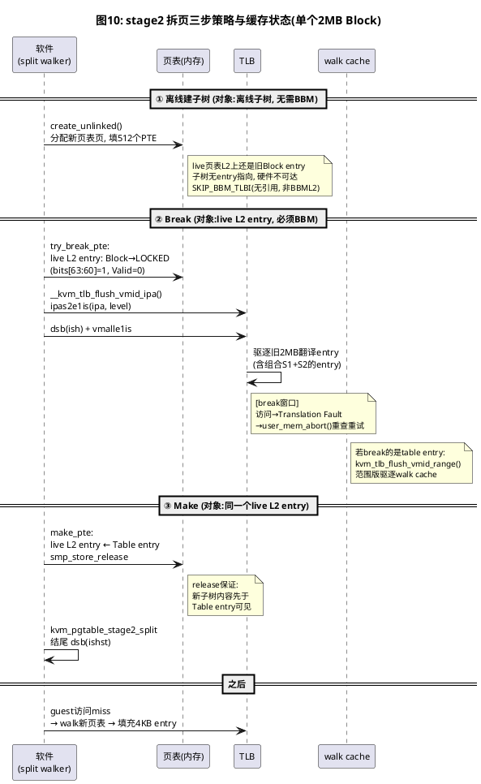

### 5.7 KVM BBML3(RFC 预览,未合入主线)

社区已有 KVM 侧 BBML3 支持的 RFC(Mostafa Saleh / Google,两个 patch,`BBML3` 分支):

- `8c44dbf89352` — 添加 `stage2_clean_old_pte()`:把原 `stage2_try_break_pte()` 中的 TLBI + put_page 逻辑**抽取成独立函数**,供 BBML3 路径复用(软件 BBM 路径行为不变,仅重构);
- `5adaf55fb3bd` — KVM 支持 BBM Level 3:新增 `stage2_use_bbml3()` 门控 + `stage2_try_break_pte()` / `stage2_make_pte()` 双路径。

#### 门控:三个条件同时满足

```c
static bool stage2_use_bbml3(void)
{
    return system_supports_bbml3() &&
           cpus_have_final_cap(ARM64_HAS_STAGE2_FWB) &&
           cpus_have_final_cap(ARM64_HAS_CACHE_DIC);
}
```

- **BBML3**:基础 BBM 级别保证;
- **FWB(Stage2 Forced Write-Back)**:stage2 不需要 CMO(cache maintenance operation);
- **DIC(Device ICache clean)**:指令 cache 隐含维护;
- **为什么要限制 FWB+DIC**:BBML3 用 `cmpxchg` 原子替换 PTE,只有在替换失败时才知道有并发——而 CMO 必须在写入前做,并发时会做**冗余 CMO**。限制在 DIC+FWB 系统避免这个问题(commit message 原文:"racing cores will issue redundant CMOs. To avoid this, limit BBML3 support for systems with DIC and FWB, which does not require CMOs")。

#### 新序列:Make-first + TLBI 后置

| 步骤 | BBML0(软件六步) | BBML3(RFC 新序列) |
|---|---|---|
| ① | 旧 entry 置 invalid(Valid=0) | **get ref on new PTE** |
| ② | DSB | **原子替换 PTE**(cmpxchg,Valid 恒 1) |
| ③ | 广播 TLBI | **TLBI(驱逐旧 entry)** |
| ④ | DSB | **drop ref on old PTE** |
| ⑤ | 写新 entry | — |
| ⑥ | DSB | — |
| fault 窗口 | **有** | **无**(Valid 恒 1) |
| 软件锁 | LOCKED(bits[63:60]) | **不需要**(cmpxchg 失败即 -EAGAIN) |

#### 代码路径

`stage2_try_break_pte()` 在 BBML3 下**直接 return true(跳过 break)**:

```c
static bool stage2_try_break_pte(...)
{
    kvm_pte_t locked_pte;

    /* All handled in stage2_make_pte() */
    if (stage2_use_bbml3() && kvm_pte_valid(ctx->old))
        return true;                    // ← BBML3: 不置 invalid, 不锁定, 直接跳过

    // 以下 BBML0 路径不变...
    locked_pte = FIELD_PREP(KVM_INVALID_PTE_TYPE_MASK,
                            KVM_INVALID_PTE_TYPE_LOCKED);
    if (!stage2_try_set_pte(ctx, locked_pte))
        return false;
    stage2_clean_old_pte(ctx, mmu);
    return true;
}
```

`stage2_make_pte()` 在 BBML3 下走 **make-first** 路径:

```c
static bool stage2_make_pte(ctx, mmu, new)
{
    if (stage2_pte_is_counted(new))
        mm_ops->get_page(ctx->ptep);

    if (stage2_use_bbml3() && kvm_pte_valid(ctx->old)) {
        smp_wmb();                      // 保证新内容先于 PTE 可见
        if (!stage2_try_set_pte(ctx, new)) {  // cmpxchg 原子替换
            mm_ops->put_page(ctx->ptep);     // 失败: 回滚 ref, -EAGAIN
            return false;
        }
        stage2_clean_old_pte(ctx, mmu);      // 成功: 后置 TLBI + put_page
        return true;
    }

    // BBML0 路径不变...
    WARN_ON(!stage2_pte_is_locked(*ctx->ptep));
    smp_store_release(ctx->ptep, new);
    return true;
}
```

**前置约束**(commit message 原文):"We assume that KVM will never change the OA of an active translation. If the host needs to move the backing PFN, it should do an explicit unmap to issue the required TLBI."——KVM 承诺不在 BBML3 路径上改变活跃翻译的 OA(需要 remap 时走显式 unmap,走传统 BBM)。

三个调用点(`stage2_map_walker_try_leaf` / `stage2_map_walk_leaf` / `stage2_split_walker`)都适配了 `-EAGAIN` 重试。

---

## 六、BBML1 / BBML2 / BBML3 的代码实现与使用场景

本章按级别逐一解析内核代码——发现 BBML1 被完全跳过、BBML2 仅 SMMU 侧检测、BBML3 是 CPU 侧主力。先看全貌:

| # | 场景 | 函数 | 优化内容 | 侧 |
|---|---|---|---|---|
| 1 | mTHP contig PTE 折叠/展开 | `contpte_convert()` | 跳过中间 TLBI(最核心场景) | CPU MM(stage1) |
| 2 | 线性映射 | `force_pte_mapping()` | BBML3 保留 block mapping,不强制 PTE 化 | CPU MM(stage1) |
| 3 | KFENCE pool | `arch_kfence_init_pool()` | 拆页后跳过 TLBI("larger entries may safely linger") | CPU MM(stage1) |
| 4 | KPTI 混合拓扑 | `linear_map_split_to_ptes()` + `idmap_kpti_bbml3_flag` | 核间握手,拆分窗口期处理 | CPU MM(stage1) |
| 5 | SMMU SVA | `arm_smmu_sva_supported()` | CPU+SMMU 双侧 noabort 门控(共享页表) | SMMU + CPU MM |
| 6 | KVM stage2 拆大页/映射(RFC) | `stage2_make_pte()` + `stage2_clean_old_pte()` | 跳过 break,make-first + TLBI 后置 | KVM stage2 |

> 前 5 项由 `system_supports_bbml3()` 门控,主线已合入;第 6 项在 RFC 分支(Mostafa Saleh / Google),见 5.7 节。

### 6.1 BBML1：被跳过的一级(无内核实现)

**sysreg 定义了 BBML1 但内核从不用它。** 搜索全树确认:

| 搜索项 | 结果 |
|---|---|
| `arch/arm64/tools/sysreg` 中 BBM 枚举 | `0b0001` 有定义(Level 1) |
| `pgtable-hwdef.h` 中 nT 位定义 | **无**——内核页表格式不定义 nT 位 |
| `cpufeature.c` 中 BBML1 能力 | **无**——只有 `ARM64_HAS_BBML3` |
| `contpte.c` / `mmu.c` 中 nT 操作 | **无**——没有任何读/写 nT 位的代码 |
| KVM 中 BBML3 使用 | 主线**无**(无条件 BBML0);RFC 分支已实现(见 5.7) |

内核从 BBML0(软件 6 步)**直接跳到** BBML2_NOABORT(现 BBML3),完全跳过 BBML1。原因:

- **性能差**:nT=1 空窗期每次访问都 walk 且不缓存(IDXRJK)——比 BBML2/3 的"直接改"差一个数量级;
- **安全不足**:BBML1 的 Contig 放松仍可能产生 TLB conflict abort(RFCPSG)——内核缺页处理等路径运行在 abort 上下文中,递归 abort 无法恢复;
- **BBML2/3 严格优于 BBML1**:免 nT、免中间 TLBI,BBML3 还额外消除 abort——没有任何场景会让内核选 BBML1。

> 4.3 节里的 nT 位四步序列是 SMMU spec(IHI 0070H.a 3.21.1.2)的 Note,**不是内核 C 代码**——SMMU 实现可能内部使用 nT,但内核软件不碰它。

### 6.2 BBML2：SMMU 侧检测 + SVA 门控

BBML2 在内核中**只有两个代码点**,都在 SMMU 驱动里:

**① 硬件探测——读 SMMU IDR3.BBM 字段:**

```c
// drivers/iommu/arm/arm-smmu-v3/arm-smmu-v3.c
if (FIELD_GET(IDR3_BBM, reg) == 2)
    smmu->features |= ARM_SMMU_FEAT_BBML2;
```

SMMU spec(IHI 0070H.a)比 ARM ARM 更严格:IDR3.BBM==2 时**保证 F_TLB_CONFLICT 永不发生**(3.21.1.3)——SMMU 的 BBML2 就等价于 ARM 的 BBML3(noabort)。所以内核的 `ARM_SMMU_FEAT_BBML2` 本质是"SMMU 侧的 BBML3"。

**② SVA 门控——CPU 和 SMMU 双侧都满足才开 SVA:**

```c
// drivers/iommu/arm/arm-smmu-v3/arm-smmu-v3-sva.c
bool arm_smmu_sva_supported(struct arm_smmu_device *smmu)
{
    u32 feat_mask = ARM_SMMU_FEAT_COHERENCY;
    ...
    if (system_supports_bbml3())       // CPU 侧必须支持 BBML3(原 bbml2_noabort)
        feat_mask |= ARM_SMMU_FEAT_BBML2;

    if ((smmu->features & feat_mask) != feat_mask)  // SMMU 侧也必须支持
        return false;
    ...
}
```

**使用场景**:SVA(Shared Virtual Addressing)下 CPU 和 SMMU **共享同一套进程页表**。页表更新时(如 contpte fold/unfold)CPU 侧跳过了中间 TLBI——SMMU 也必须能在不中断 DMA 的前提下容忍新旧 entry 并存。这就是双侧都要 noabort 的原因。

**最低公共级别原则**(SMMU spec 3.21.1.1,原文见附录B):多个组件共享一张页表时,必须按**最低公共 BBML 级别**行为更新。CPU 侧 BBML3 + SMMU 侧 BBML2(=SMMU 的 noabort)= 双方都满足 noabort → SVA 可以安全跳过中间 TLBI。

> ⚠️ rename commit `94104e3cfa80` 漏改了此文件——仍调用已不存在的 `system_supports_bbml2_noabort()`,SVA config 开启时编译会失败。**主线已正式合入修复**(Will Deacon, `d8fc0793cf68`:"Use system_supports_bbml3() to detect CPU feature")。

### 6.3 BBML3：CPU 侧检测 + 五个使用场景

BBML3 是内核中**唯一有实际代码使用的 BBML 级别**(KVM 不使用,见第五章)。代码分布在 `cpufeature.c` / `contpte.c` / `mmu.c` / `proc.S` / `nested.c` / `sys_regs.c`。

#### 6.3.1 检测:cpu_supports_bbml3()

```c
// arch/arm64/kernel/cpufeature.c
bool cpu_supports_bbml3(void)
{
    /* CPUs that support BBML3 but dont advertise through ID_AA64MMFR2_EL1 */
    static const struct midr_range supports_bbml3_list[] = {
        MIDR_REV_RANGE(MIDR_CORTEX_X4,       0, 3, 0xf),
        MIDR_REV_RANGE(MIDR_NEOVERSE_V3,     0, 2, 0xf),
        MIDR_REV_RANGE(MIDR_NEOVERSE_V3AE,   0, 2, 0xf),
        MIDR_ALL_VERSIONS(MIDR_NVIDIA_OLYMPUS),
        MIDR_ALL_VERSIONS(MIDR_AMPERE1),
        MIDR_ALL_VERSIONS(MIDR_AMPERE1A),
        MIDR_ALL_VERSIONS(MIDR_CORTEX_A520AE),
        MIDR_ALL_VERSIONS(MIDR_CORTEX_A715),
        MIDR_ALL_VERSIONS(MIDR_CORTEX_A720AE),
        MIDR_ALL_VERSIONS(MIDR_CORTEX_A725),
        MIDR_ALL_VERSIONS(MIDR_NEOVERSE_N3),
        MIDR_ALL_VERSIONS(MIDR_C1_NANO),
        MIDR_ALL_VERSIONS(MIDR_C1_PRO),
        /* Erratum 3683289 fixed in r1p1:
         * C1-Ultra/Premium 在r1p0及以前必须遵守完整BBM, 否则livelock */
        MIDR_RANGE(MIDR_C1_ULTRA,   1, 1, 0xf, 0xf),
        MIDR_RANGE(MIDR_C1_PREMIUM, 1, 1, 0xf, 0xf),
        {}
    };
    u64 mmfr2 = __read_sysreg_by_encoding(SYS_ID_AA64MMFR2_EL1);

    if (SYS_FIELD_GET(ID_AA64MMFR2_EL1, BBM, mmfr2) >= ID_AA64MMFR2_EL1_BBM_3)
        return true;

    return is_midr_in_range_list(supports_bbml3_list);
}
```

**为什么要 MATCH_ALL_EARLY_CPUS?**

- 检测依据是 MIDR(非 sanitised 寄存器),SCOPE_SYSTEM 那种"SMP 启动完成后统一检查"不适用;
- 新类型要求**每个 early CPU 本地检查、全部满足才启用**;late CPU 必须具备该特性;
- 能力表项:`ARM64_HAS_BBML3`,`type = ARM64_CPUCAP_EARLY_LOCAL_CPU_FEATURE`。

**erratum 3683289**:C1-Ultra/C1-Premium 在受影响修订版上不遵守 BBM 会触发 livelock,白名单只放行 r1p1+——说明 MIDR fallback 不只是信任清单,每款 CPU 还要逐个核对微架构 bug。

#### 6.3.2 使用场景①:contpte_convert()——mTHP contiguous PTE 折叠/展开

**这是 BBML3 最核心的使用场景。** `contpte_convert()` 同时服务 fold(N 个非 contig PTE → 1 个 contig block)和 unfold(反向):

```c
// arch/arm64/mm/contpte.c
static void contpte_convert(struct mm_struct *mm, unsigned long addr,
                            pte_t *ptep, pte_t pte)
{
    struct vm_area_struct vma = TLB_FLUSH_VMA(mm, 0);
    ...
    // 第一步: 聚合AF/dirty位, PTE清为invalid
    for (i = 0; i < CONT_PTES; i++, ptep++, addr += PAGE_SIZE) {
        pte_t ptent = __ptep_get_and_clear(mm, addr, ptep);
        if (pte_dirty(ptent))
            pte = pte_mkdirty(pte);
        if (pte_young(ptent))
            pte = pte_mkyoung(pte);
    }

    // 关键: BBML0系统才需要中间tlbi; BBML3直接跳过
    if (!system_supports_bbml3())
        __flush_tlb_range(&vma, start_addr, addr, PAGE_SIZE, 3,
                          TLBF_NOWALKCACHE);

    // 第二步: 重绘为contig block
    __set_ptes(mm, start_addr, start_ptep, pte, CONT_PTES);
}
```

**使用场景体现**:mTHP(Transparent Huge Pages for mTHP)在用户进程页表上做 contig PTE 的动态折叠/展开。触发路径:

- `__contpte_try_fold()`(pgtable.h)→ 检查连续性满足 → 调 `contpte_convert()` 折叠;
- `__contpte_try_unfold()`(contpte.c)→ 反向 → 同调 `contpte_convert()` 展开;
- 调用者:`set_ptes` / `ptep_get_and_clear` / `contpte_try_unfold_partial` 等常规页表操作。

**BBML3 在代码中的体现**:`if (!system_supports_bbml3())` 是唯一的分支点——BBML3 系统**跳过中间 TLBI**,直接从 invalid 重绘成 contig block;非 BBML3 系统必须先 `__flush_tlb_range()` 再重绘(BBML0 的 make-then-flush 反向 = flush-then-make)。

**跳过的正确性**(内核注释引 RNGLXZ/RJQQTC):

- 跳过后旧的单页 entry(如 RW,n)和新的 contig entry(RO,c)可能同时存在于 TLB——不同 Tag(4KB vs 64KB contig)所以能共存;
- multi-match 时,BBML3 硬件**只返回一致结果、绝不融合、永不 abort**;
- 调用者对变更页的**最终 TLBI** 清掉新旧;其余 stale entry 靠自然淘汰。

`TLBF_NOWALKCACHE`:只刷 TLB entry、不动 walk cache——contig 位变化不改变层级结构,walk cache 无需无效化。

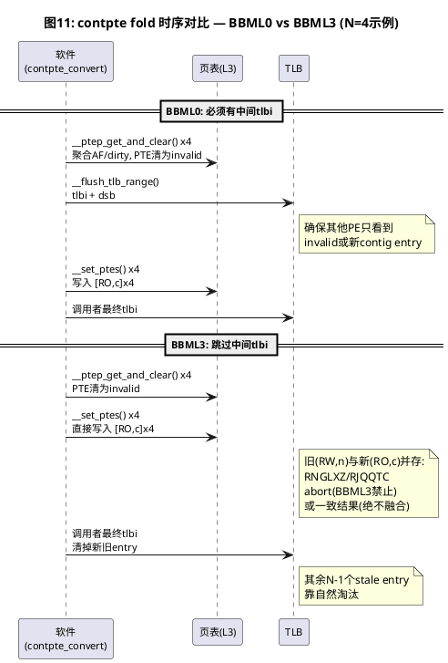

#### 6.3.3 使用场景②:force_pte_mapping()——线性映射保留 block

**使用场景**:内核线性映射(direct map)要不要强制拆成 4K PTE?BBML3 系统保留 2M/1G block mapping:

```c
// arch/arm64/mm/mmu.c
static inline bool force_pte_mapping(void)
{
    const bool bbml3 = system_capabilities_finalized() ?
        system_supports_bbml3() : cpu_supports_bbml3();

    if (debug_pagealloc_enabled())
        return true;
    if (bbml3)
        return false;                       // ← BBML3: 保留block mapping
    return rodata_full || arm64_kfence_can_set_direct_map() || is_realm_world();
}
```

**使用场景体现**:

- 非 BBML3 系统:`rodata=full` / KFENCE / Realm 都要求线性映射全部 PTE 化(因为后续要原地改权限/拆页,而 BBML0 下改 live block 需要完整 BBM 序列);
- BBML3 系统:保留 block mapping——后续可以**在 live block 上原地改权限**(权限变化不在 RWHZWS 的 BBM 清单里,见 3.1/图6)或**拆页时允许旧的大 entry 留在 TLB**(`split_kernel_leaf_mapping()`)。

设置点:`linear_map_requires_bbml3 = !force_pte_mapping() && can_set_direct_map()`(mmu.c)。

#### 6.3.4 使用场景③:KFENCE pool 初始化——"larger entries may safely linger"

**使用场景**:KFENCE 是内核的内存错误检测框架,初始化时需要把线性映射的一段拆成 4K PTE 以便单独设置权限。

```c
// arch/arm64/mm/mmu.c
bool arch_kfence_init_pool(void)
{
    ...
    ret = range_split_to_ptes(start, end, GFP_PGTABLE_KERNEL);
    ...
}
```

注释原文:

> "Since the system supports bbml3, tlb invalidation is not required here; the pgtable mappings have been split to pte but **larger entries may safely linger in the TLB**."

**BBML3 在代码中的体现**:拆页后**不做 TLBI**——因为 BBML3 保证 multi-hit 时硬件返回一致结果,旧的大 block entry 和新的 4K entry 并存不会出错。

#### 6.3.5 使用场景④:KPTI 混合 CPU 拓扑——idmap_kpti_bbml3_flag 握手

**使用场景**:boot CPU 支持 BBML3 但 secondary CPU 不支持(混合 big.LITTLE)。此时 `linear_map_requires_bbml3 && !system_supports_bbml3()`——boot CPU 需要在 secondary 被锁在 idmap 中时把线性映射全拆成 PTE:

```c
// arch/arm64/mm/mmu.c
if (linear_map_requires_bbml3 && !system_supports_bbml3()) {
    init_idmap_kpti_bbml3_flag();
    stop_machine(linear_map_split_to_ptes, NULL, cpu_online_mask);
}
```

**核间握手**用 `idmap_kpti_bbml3_flag`(proc.S 汇编):

```c
u32 idmap_kpti_bbml3_flag;

static void __init init_idmap_kpti_bbml3_flag(void)
{
    WRITE_ONCE(idmap_kpti_bbml3_flag, 1);
    /* Must be visible to other CPUs before stop_machine() is called. */
}
```

- boot CPU 设置 flag → secondary 自增 → `smp_cond_load_acquire` 等 secondary 到齐 → boot CPU `stop_machine` 拆分 → 释放;
- 若任一 secondary 不支持 BBML3 → 写 0 → 中止拆分,回退到全 PTE 化。

#### 6.3.6 使用场景⑤:KVM 隐藏 BBM 字段——不向 Guest 暴露

**使用场景**:KVM 嵌套虚拟化场景下,Guest 看到的 `ID_AA64MMFR2_EL1.BBM` 被清零。

```c
// arch/arm64/kvm/nested.c (limit_nv_id_registers)
case SYS_ID_AA64MMFR2_EL1:
    val &= ~(ID_AA64MMFR2_EL1_BBM |
             ID_AA64MMFR2_EL1_TTL |
             ...);
```

```c
// arch/arm64/kvm/hyp/nvhe/sys_regs.c
MAX_FEAT(ID_AA64MMFR2_EL1, BBM, 2),  // nVHE 侧允许最大 BBM=2
```

**原因**:Guest 的 stage1 页表和 Host 的 stage2 页表由不同实体管理;BBM 的保证需要跨 S1+S2 共同维护,当前不支持暴露给 Guest。Guest 看到 BBM=0 → 必须用软件 BBM。

### 6.4 演进时间线(commit 链)

| 时间 | commit | 内容 |
|---|---|---|
| 2025-06 | `3eb06f6ce3af` | cpufeature: 引入 `ARM64_CPUCAP_MATCH_ALL_EARLY_CPUS` 能力类型 |
| 2025-06 | `5aa4b625762e` | cpufeature: 添加 `ARM64_HAS_BBML2_NOABORT`(MIDR 白名单) |
| 2025-06 | `212c439bdd8f` | iommu/arm: SMMU 侧 BBML2 特性与 SVA 门控 |
| 2025-06 | `83bbd6be7d17` | mm: contpte_convert() 在 BBML2 下跳过 tlbi(四部曲完成) |
| 2026-07 | `f8d0751426dd` | 扩大白名单(A520AE/A715/A720AE/A725/N3/C1 家族 + erratum 3683289) |
| 2026-07 | `267b481d0b94` | sysreg: ID_AA64MMFR2_EL1.BBM 增加 0b0011(BBM_3) |
| 2026-07 | `94104e3cfa80` | **Rename: BBML2_NOABORT → BBML3**(主线版) |
| 2026-07 | `879aca5119cd` | 检测改为 ID 寄存器优先,MIDR 白名单降级为 fallback(主线版) |
| 2026-08 | `d8fc0793cf68` | SVA: `bbml2_noabort()` → `bbml3()` 修复正式合入主线(Will Deacon) |
| 2026-07 | `8c44dbf89352` | KVM: 添加 `stage2_clean_old_pte()`(RFC,Mostafa Saleh) |
| 2026-07 | `5adaf55fb3bd` | KVM: 支持 BBM Level 3(RFC,见 5.7) |

演进逻辑:内核最初只有 BBML2_NOABORT(MIDR 白名单信任"不 abort 的 BBML2 实现")→ 2025 Architecture Extensions 把"BBML2+noabort"架构化为 FEAT_BBML3(ID 编码 0b0011)→ 内核重命名、改用 ID 寄存器检测。

---

## 七、总结

### 7.1 四级实现方案对照

| 维度 | BBML0 | BBML1 | BBML2 | BBML3 |
|---|---|---|---|---|
| 硬件保证 | 无 | nT 位语义 | 免 BBM,multi-hit 消解 | BBML2 + 永不 abort |
| 软件路径 | 六步序列(invalid→DSB→TLBI→DSB→make→DSB) | nT=1→TLBI→替换→TLBI(拆分方向) | 直接写入新 entry | 同 BBML2 |
| 有无 fault 窗口 | **有**([break,make) 内 Translation Fault) | 无(Valid 恒 1) | 无 | 无 |
| multi-hit 可能性 | 不允许(软件杜绝) | 不允许(nT+TLBI 杜绝) | 允许,abort **可能** | 允许,abort **禁止** |
| 放开范围 | — | 块大小 + Contig bit | 块大小 + Contig bit | 同 BBML2 |
| 性能代价 | 每次 TLBI + fault 窗口抖动 | nT 期间性能显著受损 | 几乎无 | 几乎无 |
| 不放开的(任何级别) | — | — | **内存类型变化、OA 变化、global 重叠**(RWHZWS 不豁免) | 同左 |

### 7.2 两个代码案例的对比

| 维度 | KVM Stage2(CPU MM 侧软件方案) | Linux arm64 mm(CPU MM 侧硬件方案) |
|---|---|---|
| 依赖硬件级别 | 无(按 BBML0 假设,任何硬件正确) | BBML3(或白名单认证的 BBML2 noabort) |
| 检测方式 | 不检测(嵌套虚拟化还向 Guest 隐藏 BBM 字段) | ID 寄存器优先 + MIDR fallback + erratum 规避 |
| Break 实现 | LOCKED invalid PTE(bits[63:60])+ ipas2e1is | 不需要 |
| 额外软件锁 | LOCKED 编码兼防并发软件 walker | mmap_lock/ptl |
| TLBI 开销 | 每次拆页两次(单 IPA / 范围) | 跳过中间 TLBI,只留最终一次或自然淘汰 |
| 为什么这样选 | stage2 由 KVM 全权管理,正确性优先 | 性能优先,但 abort 上下文不可递归 → 必须 noabort(BBML3) |

### 7.3 决策树

表格速查版见 4.7 矩阵,本图是同一决策的流程形态:


### 7.4 核心结论

1. **BBM 的本质是驱逐缓存的同步协议**:页表 entry 是源头、TLB entry(含 walk cache、walk 临时寄存器)是缓存副本,TLB 没有硬件一致性,软件必须显式维护。
2. **权限变化不需要 BBM**(只需改后 TLBI),**内存类型/OA/global 变化任何级别都不豁免**,BBML 系列放开的**只有**块大小(双向)和 Contiguous bit——且要求 OA 与其他属性完全不变(RPVTFW)。
3. **BBML1 的 nT 是"施工围挡"**:管未来(nT=1 不缓存)+ TLBI 清过去,替换瞬间系统零缓存副本;代价是 nT 期间每次访问都 walk。
4. **BBML2 是"硬件消解 multi-hit"**:允许新旧并存,硬件保证 abort 或一致结果、绝不融合;收敛靠最终 TLBI 或自然淘汰。
5. **BBML3 = BBML2 + 永不 abort 的架构化**(2025 Architecture Extensions):内核从 MIDR 白名单信任(BBML2_NOABORT)演进到读 ID 寄存器;abort 上下文不能递归 fault 是 noabort 的刚需。
6. **KVM stage2 是教科书级 BBML0 实现**:`stage2_try_break_pte` 与 RDDMVT 六步一一对应,LOCKED invalid PTE 一石二鸟(Break + 软件锁),`SKIP_BBM_TLBI` 是"无引用"逻辑而非 BBML2。
7. **contpte_convert 是 BBML2/3 的标准用法**:跳过中间 tlbi,瞬态 multi-hit 由 RNGLXZ/RJQQTC 兜底,最终 TLBI + 自然淘汰完成收敛。

---

## 附录A:ARM ARM(DDI 0487M.b)规则索引

按正文首次出现顺序排列。正文中的粗体规则 ID 均可在此查到完整原文与翻译。

**RRVJDB — TLB entry 的宽定义(D8.17)**

> "For the purpose of TLB maintenance, a TLB entry is any structure that holds a translation table entry, including intermediate TLB caching structures and temporary working registers in translation table walk hardware."
> (出于 TLB 维护的目的,TLB entry 是任何持有页表 entry 的结构,包括中间级 TLB 缓存结构和页表遍历硬件中的临时工作寄存器。)

**RFFWJK — TLB 无硬件一致性(D8.17)**

> "TLBs, or TLB caching structures, are not guaranteed to remain coherent with changes to translation table entries, and are therefore distinct from data caches."
> (TLB 或 TLB 缓存结构不保证与页表 entry 的修改保持一致,因此区别于 data cache——data cache 有硬件一致性协议,TLB 没有。)

**RNWYRD — 翻译上下文的组成(D8.16)**

> "Entries held in a TLB are distinguished by translation context. The translation context is all of the following context information: The Security state. The translation regime, with the exception that hardware is not required to distinguish between EL2 and EL2&0 TLB entries. If applicable to the translation regime, then the VMID. If applicable to the translation regime, then whether the translation is global or non-global. If the translation is non-global, then the ASID."
> (TLB 中的 entry 以翻译上下文区分。翻译上下文 = Security state + 翻译 regime(硬件不要求区分 EL2 与 EL2&0)+ VMID(如适用)+ global/非 global(如适用)+ ASID(非全局时)。)

**IWZCBG — fault entry 不被缓存(D8.17)**

> "When a translation table entry that generates a Translation fault, Address size fault, or Access flag fault is changed to one that does not fault, all of the following apply to software: TLB invalidation is not required because an entry that generates one of the listed faults is never cached in a TLB. A Context synchronization event is required to ensure that the completed change to the translation table entry affects subsequent instruction fetches."
> (把产生 Translation fault/Address size fault/Access flag fault 的 entry 改成不 fault 的 entry 时:不需要 TLBI——产生这些 fault 的 entry 从不会被缓存在 TLB 中;但需要 context synchronization event(如 ISB)确保修改影响后续取指。)

**IWZRHR — OA 变化的定义(D8.17.1)**

> "A change to the translation OA space is considered a change to the translation OA."
> (翻译 OA 空间的变化视为翻译 OA 的变化。)

**RWHZWS — 必须 BBM 的场景清单(D8.17.1)**

> "If multiple execution threads use the same translation tables, then when a translation table entry is modified in one or more of the following ways, the architecture requires software to use a break-before-make sequence: A change to the memory type, Shareability or Cacheability. The translation OA is changed and one or more of the following apply: Either or both of the old and new translations grant write permission, including cases where the DBM bit is 1 and hardware updates of the dirty state is enabled. The memory contents at the new OA do not match the memory contents at the previous OA. If software does not follow the sequence enabled by FEAT_BBML1 and FEAT_BBML2 is not implemented, all of the following changes to the block size used by the translation system: Changing from a smaller size to a larger size, such as when a level 2 Table descriptor is replaced with a Block descriptor. Changing from a larger size to a smaller size, such as when a level 2 Block descriptor is replaced with a Table descriptor. A global entry is created that might overlap with non-global entries in a TLB."
> (多个执行线程使用相同页表时,以下列方式修改页表 entry,架构要求软件使用 BBM 序列:①内存类型/Shareability/Cacheability 变化;②OA 变化且新旧任一可写(含 DBM=1 且硬件更新脏位使能)或新 OA 内存内容与旧 OA 不一致;③若软件不使用 FEAT_BBML1/FEAT_BBML2 使能的序列,则块大小的所有变化——小变大(如 L2 Table 换 Block)、大变小(如 L2 Block 换 Table);④创建可能与 TLB 中非全局 entry 重叠的全局 entry。)

**ITHWDH — BBM 能防止什么(D8.17)**

> "Use of a break-before-make sequence to ensure that old and new translation table entries are never simultaneously visible to different execution threads is guaranteed to prevent all of the following problems: Creating multiple TLB entries that apply to the same address. The effects of TLB caching breaking coherency. The effects of TLB caching breaking single-copy atomicity properties. The effects of TLB caching breaking ordering guarantees or uniprocessor semantics. The effects of TLB caching causing a failure to clear the Exclusive monitors."
> (使用 BBM 序列保证新旧 entry 不会同时对不同执行线程可见,可防止:同一地址出现多个 TLB entry;TLB 缓存破坏一致性;破坏单副本原子性;破坏排序保证/单处理器语义;导致 Exclusive monitor(原子操作的监视器)清除失败。)

**RGPPYH — 改后可见性(D8.17)**

> "When a translation table entry associated with a specific VMID or ASID is modified, software is required to invalidate the corresponding TLB entry to ensure that the modified translation table entry is visible to subsequent execution, including speculative execution."
> (修改与特定 VMID/ASID 关联的页表 entry 后,软件需无效化对应 TLB entry,确保修改对后续执行(含推测执行)可见。)

**RDDMVT — BBM 六步序列(D8.17)**

> "A break-before-make sequence requires all of the following steps: 1. Replace the old translation table entry with an invalid entry. 2. Execute a DSB instruction to ensure the invalid entry is visible. 3. Invalidate TLB entries based on the translation table entry with a broadcast TLB invalidation instruction. 4. Execute a DSB instruction to ensure the invalidation completes. 5. Write the new translation table entry. 6. Execute a DSB instruction to ensure the new entry is visible."
> (BBM 序列需要以下全部步骤:1. 将旧 entry 替换为 invalid;2. 执行 DSB 确保 invalid entry 可见;3. 用广播 TLB 无效化指令无效化 TLB;4. 执行 DSB 确保无效化完成;5. 写入新 entry;6. 执行 DSB 确保新 entry 可见。)

**RFVQCK — multi-match 的允许行为(D8.17)**

> "If translation table entries are changed without appropriate TLB maintenance operations, including in the case where use of the break-before-make sequence is required but software does not follow the break-before-make sequence, it is possible that TLBs concurrently hold multiple different copies of those translation table entries. In this situation, the following behaviors are permitted for a speculative or architectural access to the address resolved by those TLB entries: Use of the address matches multiple entries in a TLB, and a TLB conflict abort is detected. In this case, no access is made to memory based on those TLB entries. If the access is architectural, then the TLB conflict abort is reported as an exception. The resulting behavior is CONSTRAINED UNPREDICTABLE, and gives a behavior consistent with translation using one of the matching entries, or an amalgamation of more than one of the matching entries, but cannot permit access to memory regions with permissions or attributes that would not be possible in the current Security state at the current Exception level."
> (页表 entry 未配合适当 TLB 维护就被修改时,TLB 可能同时持有多个不同副本。此时对 speculative 或架构性访问,允许的行为是:①地址匹配多个 entry,检测到 TLB conflict abort(不访问内存,架构性访问则上报为异常);②行为 CONSTRAINED UNPREDICTABLE——给出与某个匹配 entry 一致的结果,或多个 entry 的融合(amalgamation),但不得访问当前 Security state/Exception level 下不可能获得的权限或属性。)

**RNGLXZ — Contig bit 误编程的查找行为(D8.7.1.1)**

> "For a TLB lookup in a contiguous region mapped by translation table entries that have the Contiguous bit misprogrammed, that TLB lookup is permitted to produce one of the following: An OA, access permissions, and memory attributes that are consistent with any of the programmed translation table values. If BBM support levels 1 and 2 are not implemented, then an OA, access permissions, or memory attributes that are inconsistent with any of the programmed translation table values. A TLB conflict abort."
> (对 Contiguous bit 误编程区域内的 TLB 查找,允许产生:①与任一已编程页表值一致的 OA/权限/内存属性;②若 BBML1/2 未实现,还允许不一致的 OA/权限/属性;③TLB conflict abort。)

**RJQQTC — Contig bit 一致但其余误编程(D8.7.1.1)**

> "For a TLB lookup in a contiguous region mapped by translation table entries that have consistent values for the Contiguous bit, but have the OA, attributes, or permissions misprogrammed, that TLB lookup is permitted to produce an OA, access permissions, and memory attributes that are consistent with any one of the programmed translation table values."
> (Contiguous bit 一致但 OA/属性/权限误编程时,TLB 查找允许产生与任一已编程值一致的结果。)

**RZYZYK — 中间级结构可按 IA 索引(D8.17)**

> "Indexing an intermediate TLB structure by the IA is permitted."
> (允许按 IA 索引中间级 TLB 结构。)

**RQLGWZ — CnP 配置不一致的后果(D8.16.3.4)**

> "For a common not private translation table, if a TTBR_ELx does not point to the same translation table as the other TTBR_ELx registers, then the system is misconfigured and an address translation using that TTBR_ELx causes one of the following to occur: Multiple hits in a TLB, which is permitted to generate a TLB conflict abort. A CONSTRAINED UNPREDICTABLE result due to caching of control or data values."
> (CnP 共享页表场景下,若各 TTBR_ELx 不指向同一页表,系统配置错误,翻译会导致:TLB 多命中(可产生 TLB conflict abort),或因控制/数据值缓存导致的 CONSTRAINED UNPREDICTABLE 结果。)

**RKFLJB — 级别与可选路径(D8.17.2)**

> "When a translation table entry is modified to change the table or block size, the hardware provides one of the following possible implementations affecting the break-before-make requirement to avoid breaking coherency, ordering guarantees or uniprocessor semantics, or failing to clear the Exclusive monitors: If FEAT_BBML1 is not implemented, then software is required to use the break-before-make sequence. If FEAT_BBML1 is implemented, then software can use all of the following: The break-before-make sequence. The nT bit in the Table descriptor or Block descriptor. If FEAT_BBML2 is implemented, then software can change table or block size without breaking coherency, ordering guarantees or uniprocessor semantics, or failing to clear the Exclusives monitors."
> (修改 entry 以改变 table/block 大小时:未实现 FEAT_BBML1 → 软件必须用 BBM 序列;实现了 FEAT_BBML1 → 软件可用 BBM 序列或 Table/Block descriptor 中的 nT 位;实现了 FEAT_BBML2 → 软件可在不破坏一致性/排序/单处理器语义/Exclusive monitor 的前提下直接改大小。)

**RPVTFW — BBML 章节的适用范围(D8.17.2)**

> "All statements in this section apply only to changing table or block size without changing any other property requiring break-before-make as specified in the rule RWHZWS."
> (本节所有陈述仅适用于只改 table/block 大小、不改其他任何需要 BBM 的属性。)

**IPJZBK — nT 的位置(D8.7.3)**

> "The nT bit is supported in the following descriptors: VMSAv8-64 Block descriptors. VMSAv9-128 descriptors, when the SKL field in that descriptor is not 0."
> (nT 位支持于:VMSAv8-64 Block descriptor(bit[16]);VMSAv9-128 中 SKL≠0 的描述符。)

**IXPRKH — nT 的保证(D8.7.3)**

> "Setting the nT bit in a Table descriptor or Block descriptor guarantees that, when changing the table or block size, accesses translated by the translation table entry do not break coherency, ordering guarantees or uniprocessor semantics, or fail to clear the Exclusives monitors."
> (设置 nT 位保证:改变 table/block 大小期间,由该 entry 翻译的访问不会破坏一致性/排序保证/单处理器语义,也不会导致 Exclusive monitor 清除失败。)

**RMRRPW — nT 的代价之一(D8.7.3)**

> "When using a Table descriptor or Block descriptor with the nT bit set to 1, all of the following apply: It is IMPLEMENTATION DEFINED whether a Translation fault is generated. If a Translation fault is not generated, a TLB conflict abort can be generated."
> (使用 nT=1 的 descriptor 时:①是否产生 Translation fault 是 IMPLEMENTATION DEFINED;②若不产生 fault,仍可能产生 TLB conflict abort。)

**IDXRJK — nT 的代价之二(D8.7.3)**

> "If the nT bit in a Table descriptor or Block descriptor is 1, then the translation performance can be significantly impacted."
> (nT=1 时翻译性能可能显著受损。)

**RKHRBC — BBML1 放开 Contig bit(D8.17.2)**

> "If FEAT_BBML1 is implemented, then changing the Contiguous bit in a set of Block descriptors or Page descriptors can be done without breaking coherency, ordering guarantees or uniprocessor semantics, or failing to clear the Exclusives monitors."
> (实现 BBML1 时,只改 Contiguous bit 无需 BBM。)

**RFCPSG — Contig bit 变化仍可 abort(D8.17.2)**

> "If FEAT_BBML1 is implemented and the Contiguous bit in a set of Block descriptors or Page descriptors is changed, then a TLB conflict abort can be generated because multiple translation table entries might exist within a TLB that translates the same IA."
> (实现 BBML1 且改 Contiguous bit 时,仍可能因 TLB 内同 IA 多 entry 产生 TLB conflict abort。)

**ICFFVK — conflict abort 后的清理(D8.17.2)**

> "If FEAT_BBML1 is implemented and a TLB conflict abort is generated, then TLB maintenance is required to remove the multiple TLB entries that translate the same address. For Table descriptors, this also applies to intermediate TLB caching structures."
> (实现 BBML1 且产生 TLB conflict abort 后,需要 TLB 维护清除多个同地址 entry;Table descriptor 场景还适用于中间级缓存结构。)

**IHYQMB — 不 TLBI 则可能 abort(D8.17.2)**

> "If the TLB entries are not invalidated after the writes that modified the translation table entries are completed, then a TLB conflict abort can be generated because in a TLB there might be multiple translation table entries that all translate the same IA. For Table descriptors, this also applies to intermediate TLB caching structures."
> (修改完成后若不做 TLBI,TLB 中可能存在多个翻译同一 IA 的 entry,可以产生 TLB conflict abort;Table descriptor 场景还适用于中间级缓存结构。)

**ID_AA64MMFR2_EL1.BBM — 级别检测字段(D24.2)**

> "Allows identification of the requirements of the hardware to have break-before-make sequences when changing block or table size for a translation. The value of this field is an IMPLEMENTATION DEFINED choice of: 0b0000: Break-before-make sequence must be used. 0b0001: Level 1 support for changing block size is supported. 0b0010: Level 2 support for changing block size is supported. All other values are reserved."
> (用于识别硬件在改变翻译的 block/table 大小时对 BBM 序列的要求:0 必须使用 BBM;1 支持 Level 1;2 支持 Level 2;其余值保留。注:0b0011(BBML3)由 2025 Architecture Extensions 增加,DDI 0487M.b 尚未收录。)

## 附录B:SMMU spec(IHI 0070H.a)引用索引

**nT 的语义(3.21.1.1)**

> "The nT bit allows a valid Block descriptor to be used for translation but prevents it from being cached in a way that can cause a TLB conflict with existing TLB entries."
> (nT 允许一个 valid 的 Block descriptor 参与翻译,但阻止它以可能与现存 TLB entry 冲突的方式被缓存。)

**nT fault 的 PE/SMMU 严格度差异(3.21.1.2)**

> "Setting nT == 1 does not cause a fault. ... A Translation Fault is a permitted behavior for a PE implementing FEAT_BBML1 with nT == 1, but this is prohibited in a level 1 SMMU."
> (nT=1 本身不导致 fault;PE 侧允许对 nT=1 报 Translation fault,但 Level 1 SMMU 明确禁止此 fault。)

**BBML2 的行为保证(3.21.1.3)**

> "The implementation ignores the nT bit in the Block descriptor and a change to a translation size can be performed without using break-before-make and without using the nT bit. The implementation automatically resolves any TLB multi-hit scenarios and an F_TLB_CONFLICT fault does not occur. If a change is made to the size of a valid translation without first making the translation invalid, then: A TLB conflict does not occur and F_TLB_CONFLICT is never reported. All of the following apply for translations that might discover multiple matching TLB entries for an address: They are translated using information from at most one of the matching entries. They do not experience a fault that would not otherwise be possible using the translation table descriptor state from either before or after the update. The result of a translation: Does not combine information from multiple matching TLB entries. Does not combine information from the state of a descriptor both before and after the update. Does not contain information that was not present in a valid descriptor."
> (实现忽略 nT 位,改翻译大小无需 BBM、无需 nT;自动消解任何 multi-hit 场景,F_TLB_CONFLICT 不发生;翻译至多使用一条匹配 entry 的信息,不会出现更新前后状态都不允许的 fault;结果不组合多条 entry、不组合更新前后状态、不包含有效描述符中不存在的信息。)

**共享页表的最低公共级别(3.21.1.1)**

> "When multiple system components, whether SMMU, PE or other, are sharing one translation table then behavior according to the lowest common break-before-make Level must be used when updating the table."
> (多个系统组件(SMMU/PE/其他)共享一张页表时,更新页表必须按最低公共 BBML 级别行为。)
