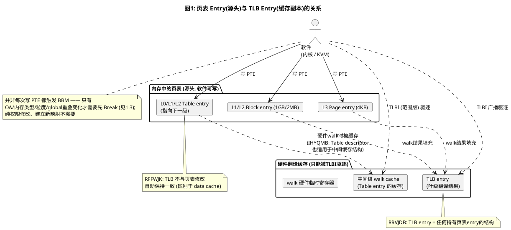
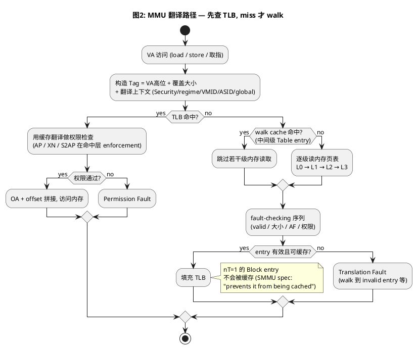
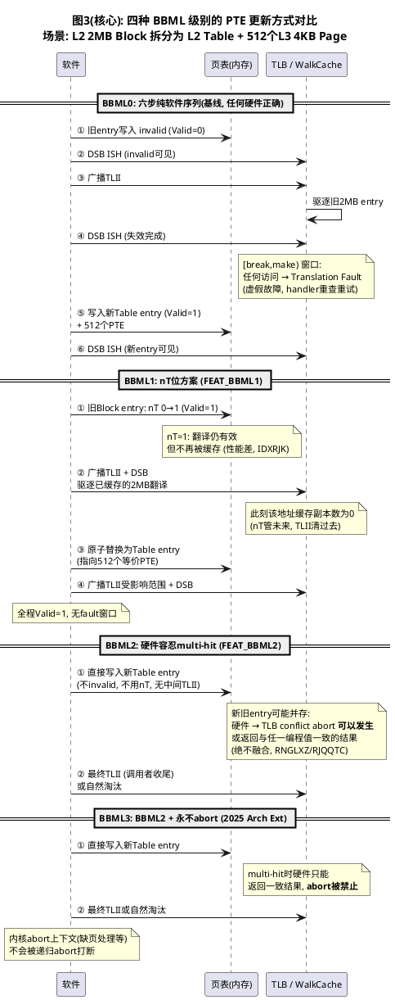
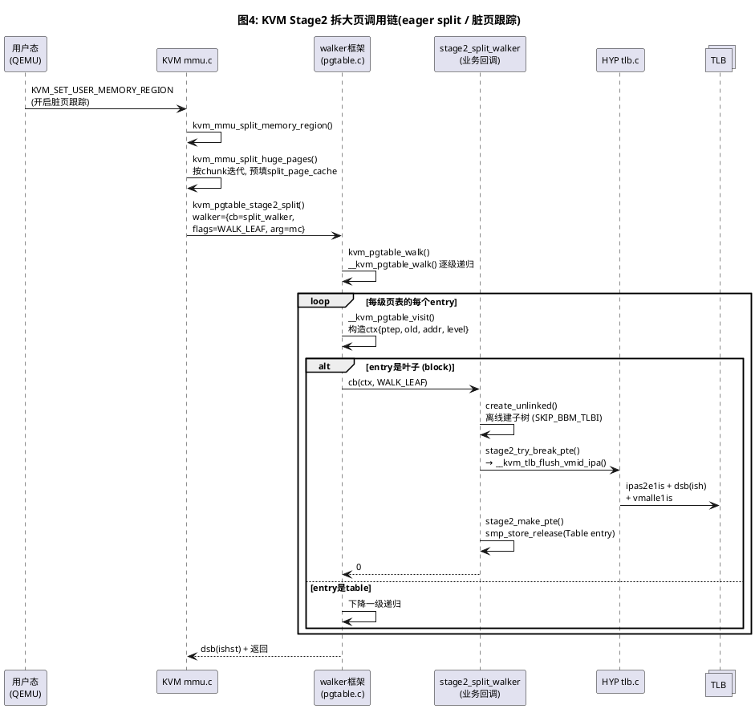
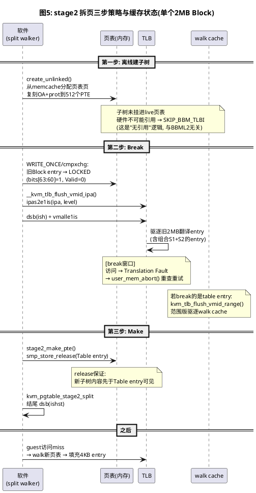
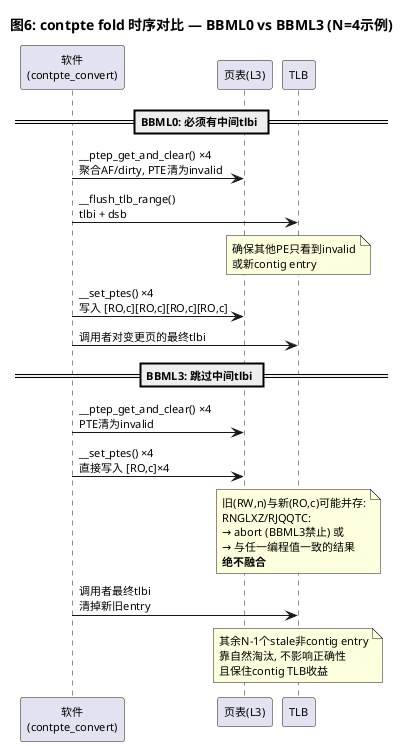
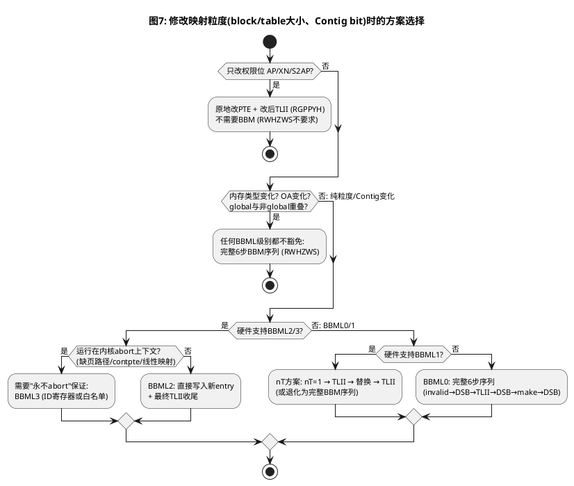

# ARM64 BBML 源码分析:BBML0~BBML3

> **源码基线**: Linux 7.2-rc7 + BBML3 系列 patch(含 Mikołaj Lenczewski 的 BBML2 四部曲 `3eb06f6ce3af`/`5aa4b625762e`/`212c439bdd8f`/`83bbd6be7d17`,以及 BBML3 演进 `f8d0751426dd`/`267b481d0b94`/`06468bc3c936`/`4955df16ff99`)
>
> **Spec 基线**: 本文以 **PE/MMU 侧 spec(ARM ARM, DDI 0487M.b)为主**,所有架构规则原文均引自 ARM ARM;SMMU spec(IHI 0070H.a)只在 ARM ARM 未给出具体软件序列的地方作补充,并明确标注来源
>
> **代码范围**: `arch/arm64/mm/`(contpte.c / mmu.c)、`arch/arm64/kernel/cpufeature.c`、`arch/arm64/kvm/hyp/pgtable.c`、`drivers/iommu/arm/arm-smmu-v3/`(仅 SVA 一节)
>
> **视角约定**: 本文所说"MMU 侧"指 PE 自己的地址翻译硬件——包括 stage1(进程/内核页表)和 stage2(KVM 给虚机配的第二级翻译,由 EL2 软件管理、PE 硬件遍历)。SMMU/IOMMU 是另一套翻译器,只在对照处出现。

---

## 一、BBM 是什么:Break Before Make 的字面与本质

### 1.1 字面拆解

**Break-Before-Make(BBM)**:在 **Make**(写入新 PTE)之前,必须先 **Break**(把旧 PTE 置 invalid 并广播刷新 TLB)。

字面上只有两个动作,但每个动作都同时作用于**两个对象**:

- **页表 entry**(源头):存在内存中,软件可写;
- **TLB entry**(缓存副本):硬件持有,软件**不能直接写**,只能用 TLBI 指令驱逐。

所以完整的 **Break** 包含两步,**缺一不可**:

- **① 把内存中的页表 entry 改为 invalid**:从源头切断旧翻译,让后续的页表遍历不会再读到旧值。
	- 作用：防止再读错的页表。
	- 如，`stage2_try_set_pte`纯内存写，WRITE_ONCE/cmpxchg 把 bits63:60 写成 LOCKED
- **② 广播 TLBI 驱逐所有缓存副本**:清掉其他 PE 硬件中缓存的旧翻译,包括 TLB entry、中间级 walk cache、walk 硬件的临时寄存器。
	- 作用：扔掉该页表已经存在的缓存。
	- 如，`kvm_call_hyp(__kvm_tlb_flush_vmid_ipa)`中，`__tlbi_level(ipas2e1is) + dsb`就是操作 TLB 的部分。

**只做 ① 不做 ②**:内存虽然改了,但其他 PE 的 TLB 缓存里还存着旧翻译,仍然按旧地址翻译,直到缓存被自然替换——这段时间窗口内可能读到错误数据。

**只做 ② 不做 ①**:TLB 缓存虽然清了,但内存里的页表 entry 还是旧值,下一个 PE 发生 TLB miss 重新遍历页表时,又会把旧翻译重新加载回 TLB,等于白清。

### 1.2 Spec 对"TLB entry"的定义(为什么两个对象缺一不可)

ARM ARM D8.17 对 TLB entry 的定义非常宽:

- **RRVJDB**:"For the purpose of TLB maintenance, a TLB entry is **any structure that holds a translation table entry**, including intermediate TLB caching structures and temporary working registers in translation table walk hardware."
  (出于 TLB 维护的目的,TLB entry 是任何持有页表 entry 的结构,包括中间级 TLB 缓存结构和页表遍历硬件中的临时工作寄存器。)

- **RFFWJK**:"TLBs, or TLB caching structures, **are not guaranteed to remain coherent with changes to translation table entries**, and are therefore distinct from data caches."
  (TLB 或 TLB 缓存结构不保证与页表 entry 的修改保持一致,因此区别于数据 cache——data cache 有硬件一致性协议,TLB 没有,必须软件显式维护。)

这就是 BBM 存在的根本原因:**页表改了,硬件缓存不会自动跟着改**。



### 1.3 哪些 PTE 修改会触发 BBM(概览)

图1 里软件对三级描述符都有"写 PTE"动作,但**并非任何写 PTE 都需要走 BBM 序列**。按"旧值 → 新值"的写模式分四种情形:

| 写 PTE 的情形 | 需要 BBM? | 需要 TLBI? | 依据 |
|---|---|---|---|
| invalid → valid(建立新映射) | 否 | **否** | IWZCBG:fault entry 从不被缓存 |
| 只改权限位(AP/XN/S2AP) | 否 | 是(改后刷,让新权限可见) | RWHZWS 清单不含;RGPPYH |
| 改 OA / 内存类型 / 粒度(block↔table) / global 重叠 | **是** | —(BBM 六步自带) | RWHZWS ①~④ |
| valid → invalid(unmap) | 否(没有 Make 步) | 是 | RGPPYH |

- **IWZCBG**:"When a translation table entry that generates a Translation fault, Address size fault, or Access flag fault is changed to one that does not fault, all of the following apply to software: TLB invalidation is not required because an entry that generates one of the listed faults is never cached in a TLB. A Context synchronization event is required to ensure that the completed change to the translation table entry affects subsequent instruction fetches."
  (把产生 Translation fault/Address size fault/Access flag fault 的 entry 改成不 fault 的 entry 时:不需要 TLBI——产生这些 fault 的 entry 从不会被缓存在 TLB 中;但需要 context synchronization event(如 ISB)确保修改影响后续取指。)

理解这张表的关键:**TLB 只缓存"成功的翻译"**。invalid entry 不会进 TLB,所以从 invalid 建立新映射天然安全(fault entry 没有缓存副本可言);而 BBM 处理的是"旧的**成功翻译**还缓存在 TLB 里、新的翻译又要诞生"的局面——只有旧值 valid 且新值会与缓存副本冲突(OA 不同、属性不同、粒度不同)时,才需要先 Break。

> RWHZWS 完整原文与四类场景的详细展开在 3.1 节,本节只是前向概览。后文的两个案例分析(五、六章)全部围绕第三行(粒度变化)展开。

---

## 二、预备知识

### 2.1 OA 是什么:Output Address

**OA = Output Address(输出地址)**,即**本级翻译的产出地址**:

| 翻译级 | 输入(IA) | 输出(OA) |
|---|---|---|
| Stage 1 | VA(虚拟地址) | IPA(中间物理地址) |
| Stage 2 | IPA | PA(真正的物理地址) |
| KVM 视角 | Guest IPA | Host PA |

描述符里的 `OA[47:n]` 字段存的就是这个输出地址。**"OA 变化"** = 同一个 VA/IPA 改指向了不同的物理地址(页面迁移、remap)。spec 专门补了一条定义:

- **IWZRHR**:"A change to the translation OA space is considered a change to the translation OA."(翻译 OA 空间的变化视为翻译 OA 的变化。)

### 2.2 描述符格式:Table / Block / Page

4KB granule、48-bit OA、4 级页表下(每级 9 bit 索引 + 12 bit 页内偏移),三种描述符的 bit 布局:

**Table descriptor(L0/L1/L2,指向下一级页表)**

| bits | 字段 | 含义 |
|---|---|---|
| [63:52] | 上层属性 | stage1: NSTable/APTable/XNTable 等;stage2: RES0 |
| [51:12] | **NLTA** | Next-Level Table Address,下一级页表物理地址(页对齐) |
| [11:2] | IGNORED / AF | bit[10] 为硬件管理的 AF |
| **[1]** | **1** | **Table descriptor 标识** |
| **[0]** | **1** | **Valid** |

**Block descriptor(L1/L2,叶子,大页)**

| bits | 字段 | 含义 |
|---|---|---|
| [63:55] | 上层属性 | stage2 的 XN 在 [54:53] |
| [52] | Contiguous | 连续 PTE 提示(FEAT_BBM 相关,见 RKHRBC) |
| [51:48] | OA 高位 | 仅 52-bit OA 时有效 |
| **[47:n]** | **OA** | L1: n=30 → **1GB**;L2: n=21 → **2MB** |
| [17] | — | (属下层属性区) |
| **[16]** | **nT** | **FEAT_BBML1 专用**:=1 表示翻译有效但不缓存(见 4.3 节) |
| [11:2] | 下层属性 | nG(11)、AF(10)、SH(9:8)、AP/S2AP(7:6)、AttrIndx/MemAttr(5:2) |
| **[1]** | **0** | **Block descriptor 标识** |
| **[0]** | **1** | **Valid** |

**Page descriptor(L3,叶子,只有 4KB)**

| bits | 字段 | 含义 |
|---|---|---|
| [63:52] | 上层属性 | 同 Block(含 Contiguous bit[52]) |
| **[47:12]** | **OA** | n=12 → **4KB**(L3 不能再分) |
| [11:2] | 下层属性 | 同 Block |
| **[1]** | **1** | **Page descriptor 标识(L3 没有 nT!)** |
| **[0]** | **1** | **Valid** |

**级别 × 粒度 × 覆盖大小对照(4KB granule)**

| 级别 | 可用描述符 | n 值 | 覆盖大小 |
|---|---|---|---|
| L0 | 仅 Table | — | — |
| L1 | Table / **Block** | 30 | **1GB** |
| L2 | Table / **Block** | 21 | **2MB** |
| L3 | 仅 Page(bit[1] 恒 1) | 12 | **4KB** |

**Block 和 L3 Page 的区别**(都是叶子,翻译结果都进 TLB):

| 维度 | Block | L3 Page |
|---|---|---|
| 粒度 | 1GB / 2MB | 固定 4KB |
| bit[1] | 0 | 1 |
| nT 位 | **有**(FEAT_BBML1) | **没有** |
| 能否指向下一级 | 否(本身是叶子) | 否(L3 是最后一级) |
| 所在级别 | L1/L2 | L3 |

**拆大页的本质**:把 L2 的 Block descriptor(bit[1]=0)换成 Table descriptor(bit[1]=1),指向一个新页表页,里面 512 个 L3 Page entry 复刻原 block 的 OA + 属性。**bit[1] 从 0 变 1 的这一下,就是触发 BBM 要求的"块大小变化"。**

### 2.3 TLB entry 的结构:键 / 值 / 属性

TLB 里存的是页表翻译后的结果。一个概念正确的 TLB entry 结构:

| 组成 | 内容 | 示例 |
|---|---|---|
| **键(Tag)** | VA/IPA 高位 + **覆盖大小(2MB/4KB)** + **翻译上下文**(RNWYRD):Security state、翻译 regime、VMID(stage2)、global/非 global、ASID(非全局) | `VA[47:21]=0x91, size=2MB, VMID=0x5` |
| **值(Value)** | OA/PA 页帧 | `PA[47:21]=0x6789A` |
| **属性** | AP/UXN/PXN/S2AP/XN、AttrIndx(内存类型)、SH、nG、Contiguous、AF、DBM | RW, User, WB-cacheable, AF=1 |

- **键(输入信号)**:给出虚拟地址 `0x12345678`,硬件截取 VA 高位去匹配。注意**键里必须包含翻译上下文和覆盖大小**——spec 原文(RNWYRD)定义了翻译上下文的组成:"Entries held in a TLB are distinguished by translation context. The translation context is all of the following context information: The Security state; The translation regime...; If applicable to the translation regime, then the VMID; ... whether the translation is global or non-global; If the translation is non-global, then the ASID."
- **值(目标地址)**:匹配成功后,硬件直接吐出 OA 高位,拼上页内偏移(如 `0x678`)访问内存。
- **属性**:决定能不能读写/执行这段内存。nT=1 的翻译**根本不会**被缓存成 TLB entry(见 4.3),所以缓存住的 entry 不存在"nT=1"的有效语义。

**multi-match 是 BBM 全部问题的根源**:同一个 VA `0x12345678` 既可能命中 2MB 的键 `VA[47:21]=0x91`,也可能命中 4KB 的键 `VA[47:12]=0x12345`。两条都命中 = 同一地址多个 TLB entry = 翻译结果不确定。

### 2.4 翻译路径:任何访问都先查 TLB

MMU 的翻译路径:**先查 TLB,命中则直接用缓存翻译(权限检查也在这一层做),miss 才做硬件 page table walk(可能命中中间级 walk cache),walk 结果回填 TLB**。

这就是 stale TLB entry 有实际影响的原因:**权限 enforcement 发生在 TLB 命中层,而不是每次都重读页表**。内存里的 PTE 已经改成只读,但某个 PE 的 TLB 里还有旧的 RW entry,这个 PE 的写请求就被旧 entry 放行了。



### 2.5 DSB 与 ISB 简述

BBM 六步序列里出现了三次 DSB,先弄清这两个屏障:

- **DSB(Data Synchronization Barrier,数据同步屏障)**:它**之前的所有内存访问全部完成**之前,它之后的指令不执行。带作用域后缀——页表是 Inner Shareable 的,所以用 `DSB ISH`(覆盖共享该页表的所有核)。BBM 里三处 DSB 分别保证:invalid entry 对各 PE 可见 → TLBI 广播驱逐完成 → 新 entry 可见。
- **ISB(Instruction Synchronization Barrier,指令同步屏障)**:丢弃流水线中已预取的指令,之后的指令重新取指。用于**改系统寄存器后**(VTTBR/TCR/SCTLR)让修改对后续执行生效(context synchronization)。KVM 的 `enter_vmid_context`/`exit_vmid_context` 切完 VMID 后的 `isb()` 就是这个。

一句话:**DSB 管数据访问完成,ISB 管取指上下文同步**。

---

## 三、ARM ARM 的 BBM 规则(本文 spec 引用均出自 DDI 0487M.b)

### 3.1 哪些修改必须 BBM:RWHZWS

ARM ARM D8.17.1 用一条规则列出了必须走 BBM 序列的全部场景:

| # | 必须走 BBM 的修改 |
|---|---|
| 1 | 内存类型 / Shareability / Cacheability 变化 |
| 2 | **OA 变化**,且(新旧任一可写,或 新 OA 与旧 OA 的内存内容不一致) |
| 3 | **块大小变化**(smaller↔larger,如 L2 Table↔Block 互换)——前提是 FEAT_BBML1/2 未实现 |
| 4 | 创建 global entry 且可能与 TLB 中已有的非 global entry 重叠 |

- **RWHZWS**:"If multiple execution threads use the same translation tables, then when a translation table entry is modified in one or more of the following ways, the architecture requires software to use a break-before-make sequence: A change to the memory type, Shareability or Cacheability. The translation OA is changed and one or more of the following apply: Either or both of the old and new translations grant write permission, including cases where the DBM bit is 1 and hardware updates of the dirty state is enabled. The memory contents at the new OA do not match the memory contents at the previous OA. If software does not follow the sequence enabled by FEAT_BBML1 and FEAT_BBML2 is not implemented, all of the following changes to the block size used by the translation system: Changing from a smaller size to a larger size, such as when a level 2 Table descriptor is replaced with a Block descriptor. Changing from a larger size to a smaller size, such as when a level 2 Block descriptor is replaced with a Table descriptor. A global entry is created that might overlap with non-global entries in a TLB."
  (多个执行线程使用相同页表时,以下列方式修改页表 entry,架构要求软件使用 BBM 序列:内存类型/Shareability/Cacheability 变化;OA 变化且新旧任一可写(含 DBM=1 且硬件更新脏位使能)或新 OA 内存内容与旧 OA 不一致;若软件不使用 FEAT_BBML1 和 FEAT_BBML2 使能的序列,则块大小的所有变化——小变大(如 L2 Table 换 Block)、大变小(如 L2 Block 换 Table);创建可能与 TLB 中非全局 entry 重叠的全局 entry。)

- **ITHWDH**(BBM 能防止什么):"Use of a break-before-make sequence to ensure that old and new translation table entries are never simultaneously visible to different execution threads is guaranteed to prevent all of the following problems: Creating multiple TLB entries that apply to the same address. The effects of TLB caching breaking coherency. The effects of TLB caching breaking single-copy atomicity properties. The effects of TLB caching breaking ordering guarantees or uniprocessor semantics. The effects of TLB caching causing a failure to clear the Exclusive monitors."
  (使用 BBM 序列保证新旧 entry 不会同时对不同执行线程可见,可防止:同一地址出现多个 TLB entry;TLB 缓存破坏一致性;破坏单副本原子性;破坏排序保证/单处理器语义;导致 Exclusive monitor(原子操作的监视器)清除失败。)

**权限变化为什么不在清单里?**

纯权限变化(AP/S2AP/XN)时,新旧 entry 指向**同一个 OA、同样的内存类型**,唯一差别是权限检查结果。旧 entry 说 RW、新 entry 说 RO,访问用哪一个都是"一致的翻译",不会破坏数据、不会写散、不会破坏一致性——所以不需要 BBM。但架构仍要求改完后做 TLBI 让新权限**可见**:

- **RGPPYH**:"When a translation table entry associated with a specific VMID or ASID is modified, software is required to invalidate the corresponding TLB entry to ensure that the modified translation table entry is visible to subsequent execution, including speculative execution."
  (修改与特定 VMID/ASID 关联的页表 entry 后,软件需要无效化对应 TLB entry,确保修改对后续执行(含推测执行)可见。)

注意区别:**"不需要 BBM" ≠ "不需要 TLBI"**。BBM 是"改之前先断旧映射",RGPPYH 是"改之后刷掉旧缓存"。窗口期内一次写可能被旧 entry 放行——这是软件要自己收口的(KVM 脏页跟踪正是:写保护 → flush → 再查 dirty bit 捕捉并发写)。内核代码佐证:`stage2_pte_needs_update()` 把权限位从"需要 break 更新"的条件里显式排除——`(old ^ new) & ~KVM_PTE_LEAF_ATTR_S2_PERMS`,只改权限就原地更新。

### 3.2 标准序列:RDDMVT 六步 —— BBML0 纯软件路径

- **RDDMVT**:"A break-before-make sequence requires all of the following steps: 1. Replace the old translation table entry with an invalid entry. 2. Execute a DSB instruction to ensure the invalid entry is visible. 3. Invalidate TLB entries based on the translation table entry with a broadcast TLB invalidation instruction. 4. Execute a DSB instruction to ensure the invalidation completes. 5. Write the new translation table entry. 6. Execute a DSB instruction to ensure the new entry is visible."
  (BBM 序列需要以下全部步骤:1. 将旧 entry 替换为 invalid;2. 执行 DSB 确保 invalid entry 可见;3. 用广播 TLB 无效化指令基于该 entry 无效化 TLB;4. 执行 DSB 确保无效化完成;5. 写入新 entry;6. 执行 DSB 确保新 entry 可见。)

用 `Valid` 位表述就是:

```
Valid=0 (Break: 页表entry置invalid) → DSB → 广播TLBI → DSB → Make(写入新entry, Valid=1) → DSB
```

**这六步是 BBML0 的纯软件路径;BBML1 上仍可使用(正确但非必需);BBML2/3 上也依然正确**——它是基线,在任何硬件上都不会错。后面 4.1 的 RKFLJB 会给出级别与路径的关系。

**[break, make) 窗口期**:六步序列天然产生一段"映射缺失"窗口——

- 窗口内:内存中 entry invalid + TLB 已驱逐 → 本核/他核/walk 中的任何访问得到 **Translation Fault**。这正是 `Valid=0` 的直接作用。
- **Valid 会被置回来吗?会。** Make 步骤写入的新 entry 自带 Valid=1(拆页场景:新 Table descriptor Valid=1,它指向的 512 个 PTE 也各带 Valid=1),窗口结束后映射以新粒度恢复。
- **不依赖缓存自然刷新**:TLBI 已经把旧缓存驱逐;Make 之后的 walk 直接读新 entry 填充 TLB。正确性不靠"等下一次刷新"。
- 窗口期的 fault 是 **spurious fault(虚假故障)**:fault handler 重查页表发现映射已存在(Make 已完成)→ 直接重试。KVM 场景:guest 访问 → stage2 fault 退出 → `user_mem_abort()` 重查映射存在 → 重入 guest。这就是"性能抖动/虚假故障"的机理,也是 BBML1 出现的动机。

### 3.3 违反后果:multi-match 之后会发生什么

不做 BBM(或 BBM 做了一半),TLB 中同一地址的多个 entry 并存,架构给出的行为约束:

**通用规则(BBM 章节本身)**:

- **RFVQCK**:"If translation table entries are changed without appropriate TLB maintenance operations, including in the case where use of the break-before-make sequence is required but software does not follow the break-before-make sequence, it is possible that TLBs concurrently hold multiple different copies of those translation table entries. In this situation, the following behaviors are permitted for a speculative or architectural access to the address resolved by those TLB entries: Use of the address matches multiple entries in a TLB, and a TLB conflict abort is detected. In this case, no access is made to memory based on those TLB entries. If the access is architectural, then the TLB conflict abort is reported as an exception. The resulting behavior is CONSTRAINED UNPREDICTABLE, and gives a behavior consistent with translation using one of the matching entries, or an amalgamation of more than one of the matching entries, but cannot permit access to memory regions with permissions or attributes that would not be possible in the current Security state at the current Exception level."
  (页表 entry 未配合适当 TLB 维护就被修改时,TLB 可能同时持有多个不同副本。此时对 speculative 或架构性访问,允许的行为是:①地址匹配多个 entry,检测到 TLB conflict abort(不访问内存,架构性访问则上报为异常);②行为 CONSTRAINED UNPREDICTABLE——给出与某个匹配 entry 一致的结果,或多个 entry 的**融合(amalgamation)**,但不得访问当前 Security state/Exception level 下不可能获得的权限或属性。)

**Contiguous bit 误编程场景的规则**(这正是后文 contpte_convert 跳过中间 TLBI 时所处的瞬态——部分 PTE 带 contig、部分不带,恰是"misprogramming"定义):

- **RNGLXZ**:"For a TLB lookup in a contiguous region mapped by translation table entries that have the Contiguous bit misprogrammed, that TLB lookup is permitted to produce one of the following: An OA, access permissions, and memory attributes that are consistent with any of the programmed translation table values. If BBM support levels 1 and 2 are not implemented, then an OA, access permissions, or memory attributes that are inconsistent with any of the programmed translation table values. A TLB conflict abort."
  (对 Contiguous bit 误编程区域内的 TLB 查找,允许产生:①与任一已编程页表值一致的 OA/权限/内存属性;②若 BBML1/2 未实现,还允许**不一致**的 OA/权限/属性;③TLB conflict abort。)

- **RJQQTC**:"For a TLB lookup in a contiguous region mapped by translation table entries that have consistent values for the Contiguous bit, but have the OA, attributes, or permissions misprogrammed, that TLB lookup is permitted to produce an OA, access permissions, and memory attributes that are consistent with any one of the programmed translation table values."
  (Contiguous bit 一致但 OA/属性/权限误编程时,TLB 查找允许产生与**任一**已编程值一致的结果。)

注意关键差异:**BBML0 下允许"融合/不一致"(最危险);BBML1/2 下收敛为"abort 或与任一编程值一致的结果"(绝不融合)**。这就是内核敢在 BBML2+ 上跳过中间 TLBI 的全部理论依据。

---

## 四、BBML0 / BBML1 / BBML2 / BBML3:四级实现

### 4.1 检测:ID_AA64MMFR2_EL1.BBM

CPU 的 BBM 支持级别由 `ID_AA64MMFR2_EL1.BBM`(bits [55:52])报告:

| 编码 | 级别 | 含义 |
|---|---|---|
| 0b0000 | BBML0 | 必须使用 BBM 序列 |
| 0b0001 | BBML1 | Level 1:支持改 block 大小 |
| 0b0010 | BBML2 | Level 2:支持改 block 大小 |
| 0b0011 | BBML3 | (2025 Architecture Extensions 定义,见 4.5) |

- **ID_AA64MMFR2_EL1.BBM 字段描述(DDI 0487M.b D24.2)**:"Allows identification of the requirements of the hardware to have break-before-make sequences when changing block or table size for a translation. 0b0000: Break-before-make sequence must be used. 0b0001: Level 1 support for changing block size is supported. 0b0010: Level 2 support for changing block size is supported. All other values are reserved."
  (用于识别硬件在改变翻译的 block/table 大小时对 BBM 序列的要求:0 必须使用 BBM;1 支持 Level 1;2 支持 Level 2;其余值保留。)

> 手头的 DDI 0487M.b 里 BBM 字段只定义到 0b0010 且"其余值保留";**0b0011(BBML3)来自 2025 Architecture Extensions**(内核 commit `267b481d0b94` 给出了文档链接)。所以本文 spec 原文部分以 M.b 为准,BBML3 一节以内核 commit 与 2025 扩展文档为准,注意版本差异。

### 4.2 BBML0:六步纯软件序列

即 3.2 的 RDDMVT 六步。**软件承担全部同步责任**:invalid → DSB → 广播 TLBI → DSB → Make → DSB,保证任意时刻系统里同一地址只有一份有效翻译。第五章的 KVM stage2 拆大页就是完整的 BBML0 代码案例(值得注意:KVM **不检测**硬件 BBM 级别,无条件按 BBML0 假设写代码——在任何硬件上都正确,代价是每次拆页的 TLBI 开销和 fault 窗口)。

### 4.3 BBML1:nT 位方案

ARM ARM 把各级别与软件可选路径的关系写成一条规则:

- **RKFLJB**:"When a translation table entry is modified to change the table or block size, the hardware provides one of the following possible implementations affecting the break-before-make requirement to avoid breaking coherency, ordering guarantees or uniprocessor semantics, or failing to clear the Exclusive monitors: If FEAT_BBML1 is not implemented, then software is required to use the break-before-make sequence. If FEAT_BBML1 is implemented, then software can use all of the following: The break-before-make sequence. The nT bit in the Table descriptor or Block descriptor. If FEAT_BBML2 is implemented, then software can change table or block size without breaking coherency, ordering guarantees or uniprocessor semantics, or failing to clear the Exclusives monitors."
  (修改 entry 以改变 table/block 大小时:未实现 FEAT_BBML1 → 软件必须用 BBM 序列;实现了 FEAT_BBML1 → 软件可用 BBM 序列**或** Table/Block descriptor 中的 nT 位;实现了 FEAT_BBML2 → 软件可在不破坏一致性/排序/单处理器语义/Exclusive monitor 的前提下直接改大小。)

- **RPVTFW**(适用范围的硬约束):"All statements in this section apply only to changing table or block size **without changing any other property** requiring break-before-make as specified in the rule RWHZWS."
  (本节所有陈述仅适用于**只改 table/block 大小、不改其他任何需要 BBM 的属性**——物理位置、内存类型等都不能变。)

**nT 位的 spec 定义(D8.7.3 Table and Block entry,需 FEAT_BBML1)**:

- **IPJZBK**:"The nT bit is supported in the following descriptors: VMSAv8-64 Block descriptors. VMSAv9-128 descriptors, when the SKL field in that descriptor is not 0."
  (nT 位支持于:VMSAv8-64 **Block descriptor**(bit[16]);VMSAv9-128 中 SKL≠0 的描述符。注意 **VMSAv8-64 的 Table descriptor 和 L3 Page descriptor 没有 nT**。)

- **IXPRKH**:"Setting the nT bit in a Table descriptor or Block descriptor guarantees that, when changing the table or block size, accesses translated by the translation table entry do not break coherency, ordering guarantees or uniprocessor semantics, or fail to clear the Exclusives monitors."
  (设置 nT 位保证:改变 table/block 大小期间,由该 entry 翻译的访问不会破坏一致性/排序保证/单处理器语义,也不会导致 Exclusive monitor 清除失败。)

- **RMRRPW**:"When using a Table descriptor or Block descriptor with the nT bit set to 1, all of the following apply: It is IMPLEMENTATION DEFINED whether a Translation fault is generated. If a Translation fault is not generated, a TLB conflict abort can be generated."
  (使用 nT=1 的 descriptor 时:①是否产生 Translation fault 是 IMPLEMENTATION DEFINED;②若不产生 fault,仍可能产生 TLB conflict abort。)

- **IDXRJK**:"If the nT bit in a Table descriptor or Block descriptor is 1, then the translation performance can be significantly impacted."
  (nT=1 时翻译性能可能**显著受损**——每次访问都要重新 walk,不被缓存。所以 nT 只能是**过渡态**,用完要清掉。)

nT 的语义本质(补充引用 SMMU spec IHI 0070H.a 3.21.1.1,因为 ARM ARM 只给了规则没给直观描述):"The nT bit allows a valid Block descriptor to be **used for translation but prevents it from being cached** in a way that can cause a TLB conflict with existing TLB entries."(nT 允许一个 valid 的 Block descriptor 参与翻译,但阻止它以可能与现存 TLB entry 冲突的方式被缓存。)

**BBML1 的完整软件序列**(ARM ARM 只说"可以用 nT",逐步序列是 SMMU spec IHI 0070H.a 3.21.1.2 以 Note 形式给出的权威操作;CPU 侧软件遵循同样的模式):

**拆大页(block → pages,最常见,如热迁移拆大页)——必须 nT-first,四步:**

```
① 旧 Block descriptor: nT 0→1   (Valid 保持 1,翻译仍有效)
② 广播 TLII 该 block + DSB       (驱逐已经缓存进去的旧 2MB 翻译)
③ 原子替换为 Table descriptor     (指向含 512 个等价 PTE 的新页表)
④ 广播 TLII 受影响范围 + DSB
```

**合并(pages → block)——四步:**

```
① 中间级 Table descriptor 直接替换为 nT=1 的 Block descriptor
② 广播 TLII 受影响范围 + DSB     (驱逐旧的 4KB 翻译缓存)
③ 新 Block descriptor: nT 1→0   (恢复可缓存)
④ 广播 TLII 该 block + DSB
```

**为什么拆分必须 nT-first 而不能 make-first?** 如果直接把 block 换成 table(先 Make),walk 会立刻把 4KB entry 缓存进 TLB,与 stale 的 2MB entry 并存 → multi-match——这是 BBML2 才容忍的行为。nT-first 的效果:**①置 nT 管"未来"**(nT=1 后的新 walk 不再产生缓存),**②TLII 清"过去"**(已有的缓存副本被驱逐),两者配合后,第 ③ 步结构替换发生时系统里该地址的缓存副本数为零,永远不会出现 multi-match。

**"BBML1 是不是不用 break 把旧 TLB entry 写成 invalid?"** ——软件根本无法直接写 TLB entry。BBML1 全程 Valid=1、没有"置 invalid"这一步,靠的是 nT(阻止未来缓存)+ TLII(清理过去缓存)的组合,而不是"写 invalid"。

**SMMU 与 PE 的严格度差异**(对照,引用 IHI 0070H.a 3.21.1.2):"Setting nT == 1 does not cause a fault... A Translation Fault is a permitted behavior for a PE implementing FEAT_BBML1 with nT == 1, but this is prohibited in a level 1 SMMU."(PE 侧允许对 nT=1 报 Translation fault——ARM ARM 的 fault-checking 序列第 8 步;SMMU Level 1 明确**禁止**此 fault。SMMU 比 PE 更严格,因为设备的翻译 fault 更难恢复。)

**BBML1 与 Contiguous bit**:BBML1 还顺带放开了 Contiguous bit 的修改:

- **RKHRBC**:"If FEAT_BBML1 is implemented, then changing the Contiguous bit in a set of Block descriptors or Page descriptors can be done without breaking coherency, ordering guarantees or uniprocessor semantics, or failing to clear the Exclusives monitors."(实现 BBML1 时,只改 Contiguous bit 无需 BBM。)
- **RFCPSG**:改 Contiguous bit 时仍可能产生 TLB conflict abort(multiple entries translate same IA)。
- **ICFFVK**:产生 conflict abort 后需要 TLB 维护清除多个 entry(Table descriptor 场景含中间缓存结构)。

### 4.4 BBML2:硬件容忍 multi-hit

RKFLJB 第三条:软件**直接改**,不 invalid、不用 nT、无中间 TLII,硬件保证不破坏一致性/排序/单处理器语义/Exclusive monitor。

**硬件"透明处理"的确切含义**——不是"硬件去更新 TLB",而是**硬件消解 multi-hit 的后果**。ARM ARM 侧的表述就是 3.3 的 RNGLXZ/RJQQTC(multi-hit 时要么 abort、要么返回与任一编程值一致的结果,绝不融合);SMMU spec(IHI 0070H.a 3.21.1.3,作为对照)说得更工程化:

> "The implementation ignores the nT bit in the Block descriptor and a change to a translation size can be performed without using break-before-make and without using the nT bit. The implementation automatically resolves any TLB multi-hit scenarios and an F_TLB_CONFLICT fault does not occur. ... They are translated using information from **at most one** of the matching entries. ... The result of a translation: Does not combine information from multiple matching TLB entries. Does not combine information from the state of a descriptor both before and after the update. Does not contain information that was not present in a valid descriptor."
> (实现忽略 nT 位,不改大小的翻译可不用 BBM 不用 nT。实现自动消解任何 TLB multi-hit 场景,F_TLB_CONFLICT 不发生。翻译至多使用一个匹配 entry 的信息;不组合多个匹配 entry;不组合描述符更新前后的状态;不包含有效描述符中不存在的信息。)

**注意一个关键差异**:CPU 侧 BBML2 **不禁止** TLB conflict abort——

- **IHYQMB**:"If the TLB entries are not invalidated after the writes that modified the translation table entries are completed, then a TLB conflict abort can be generated because in a TLB there might be multiple translation table entries that all translate the same IA. For Table descriptors, this also applies to intermediate TLB caching structures."
  (修改完成后若不做 TLII,TLB 中可能存在多个翻译同一 IA 的 entry,**可以产生 TLB conflict abort**;Table descriptor 场景还适用于中间级缓存结构。)

也就是说:**BBML2 的收敛仍然要靠软件的最终 TLII(或自然淘汰)**。典型模式:直接写入新 entry → (窗口期新旧并存,硬件消解后果) → 调用者做一次最终 TLII 清掉新旧 → 之后只剩新翻译。contpte_convert 之外,未被最终 TLII 覆盖的 entry 靠 TLB 自然淘汰(不保证时间,但正确性不受影响,见 6.3)。

**BBML2 的适用场景**:**仅限"改 table/block 大小(双向)"+ Contiguous bit 修改**(RKHRBC 对 BBML1 成立,BBML2 当然继承)。**不适用**的:

- 内存类型/Cacheability 变化 → 任何级别都必须完整 BBM(RWHZWS 第 1 条不豁免);
- OA 变化(remap)→ 任何级别都必须完整 BBM(RWHZWS 第 2 条不豁免);
- 需要讨论"数据写散到新旧两个物理地址"的场景根本不存在——因为纯大小变化要求 OA 不变(RPVTFW)。

### 4.5 BBML3:BBML2 + 永不 abort 的架构化

**"BBML3 就是 BBML2 的 noabort 方案吗?"——是,分三层说:**

1. **语义上**:BBML3 = BBML2 的全部放松(免 break、免 nT、免中间 TLII)+ **"永不产生 TLB conflict abort"**。BBML2 允许实现选择 abort 路径(RNGLXZ/IHYQMB);BBML3 把这条路径堵死,multi-hit 时硬件只能返回与任一编程值一致的结果。
2. **历史上**:内核先有的是 `ARM64_HAS_BBML2_NOABORT`(2025-06,Mikołaj 四部曲)——当时架构只有 BBML0/1/2,内核只能用 **MIDR 白名单**逐个信任"不 abort"的 BBML2 实现;2025 Architecture Extensions 把这个约定架构化为 FEAT_BBML3(ID 编码 0b0011)后,内核 rename commit 原文:"As bbml2_noabort is functionally equivalent to bbml3, rename cpu/system_supports_bbml2_noabort to cpu/system_supports_bbml3"。
3. **代码上**:检测函数先读 `ID_AA64MMFR2_EL1.BBM >= 3`,MIDR 白名单降级为 fallback(见 6.2)。

**为什么 noabort 是刚需?** 内核的大量关键路径(缺页处理、mTHP 折叠/展开)本身就运行在 abort 处理上下文中。如果 CPU 在这些路径里触发 TLB conflict abort,就是**递归 abort**,无法恢复。Mikołaj patch 2 的 commit message 说得直白:"Not causing aborts avoids us having to prove that no recursive faults can be induced in any path that uses BBML2, allowing its use for **arbitrary kernel mappings**."(不产生 abort 就不用证明任何 BBML2 路径都不会诱导递归 fault,从而能用于任意内核映射。)

**BBML3 的流程**:与 BBML2 完全一致(直接写入新 entry → 最终 TLII 或自然淘汰),唯一区别是窗口期 multi-hit 时硬件**不会** abort。

### 4.6 常见误解纠错表

围绕 BBML1 流转很广的一段"理解",逐条核验(spec 依据见上文):

| 说法 | 判定 | 纠正 |
|---|---|---|
| "nT 向硬件发'正在施工'信号,可以先 Make 再清理旧缓存" | **顺序错** | 拆分方向必须 **nT-first**:nT=1 → TLII → 替换 → TLII。先 Make 再清只对"合并"方向成立 |
| "BBML0 窗口期 DMA 报错,网卡/GPU 掉线或驱动挂死" | 方向对、程度夸大 | 取决于 stream 能否 stall:SVA 可 stall 重试;不可 stall 的内核 DMA 才是硬错误 |
| "SMMU 读旧(TLB 命中)或读新(内存预取)" | 用词错 | "内存预取"应为 **TLB miss 后的 page table walk** |
| "数据一部分写到旧地址、一部分写到新地址,软件要同步处理" | **错误** | 纯大小变化 **OA 不变**(RPVTFW:不能改任何其他属性),不存在写散 |
| "致命问题:设备拿到 TLB 缓存返回错误物理地址" | **错误** | 纯大小变化中 stale entry 返回的 OA 是**正确的**(只是粒度粗);真实残余风险是 **TLB conflict abort** |
| "场景A:大页拆合时新旧物理空间'重叠'" | 措辞不准 | 不是重叠,是**完全相同**(纯粒度变化要求 OA+属性都不变) |
| "场景B:remap 到不同地址要先停设备" | 结论对、定性错 | OA 变化**根本不在 BBML1/2/3 的放松范围**(RWHZWS 第 2 条任何级别不豁免),必须传统 BBM |
| "BBML1 主要服务属性变更或粒度变更" | **半错** | 粒度变更 ✅;权限变更(RW→RO)**从来不需要 BBM**(只需 RGPPYH 的改后 TLII);内存类型变更(WB→NC)**任何级别都不豁免** |
| "减少性能抖动/虚假故障" | 正确 | BBML1 消除 Valid=0 窗口,fault 不再发生 |



---

## 五、案例一:KVM Stage2 拆大页 —— BBML0 纯软件方案

KVM 的 stage2 是 **PE MMU 的第二级翻译**(VTTBR_EL2 指向页表,由 EL2 软件管理、PE 硬件遍历),所以前文所有 ARM ARM 规则直接适用。KVM **不检测** `ID_AA64MMFR2_EL1.BBM`,无条件按 BBML0 假设实现——甚至嵌套虚拟化时还向 Guest 隐藏该字段(nested.c 的 `limit_nv_id_registers` 强制 Guest 看到 BBM=0,因为 S1/S2 由不同实体管理时 BBM 保证无法跨级维护)。

### 5.1 触发场景

最常见的是**热迁移脏页跟踪的 eager split**:用户态(QEMU)通过 `KVM_SET_USER_MEMORY_REGION` 开启 memslot 脏页跟踪 → 脏页位图是 4K 粒度,2MB block 无法提供 → 必须预先把所有大页拆成 4K:

```
kvm_mmu_split_memory_region()        // mmu.c, eager split 入口
 └─ kvm_mmu_split_huge_pages()       // 按 chunk 迭代, 预填 split_page_cache
     └─ kvm_pgtable_stage2_split()   // hyp/pgtable.c, 组装 walker
```

### 5.2 walker 回调机制:框架与业务分层

KVM 的 stage2 页表操作全部构建在一个通用 walker 框架上(映射、unmap、改属性、split、destroy、dump 都复用它)。框架负责遍历,业务通过回调函数注入:

```c
// walker 框架的核心数据结构
struct kvm_pgtable_walker {
	const kvm_pgtable_visitor_fn_t cb;      // 业务回调: map/unmap/split...各不相同
	void * const                   arg;     // 回调私有参数
	const enum kvm_pgtable_walk_flags flags;
};

// 框架在"访问"每个页表项时构造的上下文
struct kvm_pgtable_visit_ctx {
	kvm_pte_t *ptep;    // 当前PTE指针
	kvm_pte_t old;      // 当前PTE旧值
	void      *arg;     // walker->arg
	struct kvm_pgtable_mm_ops *mm_ops;
	u64 start, addr, end;
	s8  level;          // 当前页表层数
	enum kvm_pgtable_walk_flags flags;
};
```

框架的遍历核心 `__kvm_pgtable_visit()`(简化):

```c
static inline int __kvm_pgtable_visit(...)
{
	struct kvm_pgtable_visit_ctx ctx = {
		.ptep  = ptep,
		.old   = READ_ONCE(*ptep),     // 读取旧值
		.arg   = data->walker->arg,
		.level = level,
		.flags = flags,
	};
	bool table = kvm_pte_table(ctx.old, level);

	// entry 是 table 且设置了 TABLE_PRE 标志 → 先序回调
	if (table && (ctx.flags & KVM_PGTABLE_WALK_TABLE_PRE)) {
		ret = kvm_pgtable_visitor_cb(data, &ctx, KVM_PGTABLE_WALK_TABLE_PRE);
		// 回调可能已替换该entry → reload
	}

	// entry 是叶子(block/page)且设置了 LEAF 标志 → 叶子回调
	if (!table && (ctx.flags & KVM_PGTABLE_WALK_LEAF)) {
		ret = kvm_pgtable_visitor_cb(data, &ctx, KVM_PGTABLE_WALK_LEAF);
	}

	// reload: 回调可能把 block 换成了 table, 让框架能下降进新子树
	...
	if (!table) {
		// 叶子处理完, addr 前进一个 granule, 继续同级
		data->addr = ALIGN_DOWN(data->addr, kvm_granule_size(level));
		data->addr += kvm_granule_size(level);
		goto out;
	}

	// 是 table → 下降一级递归
	ret = __kvm_pgtable_walk(data, mm_ops, childp, level + 1);
	// TABLE_POST 回调(拆页不用)
}
```

拆页的入口只注册叶子回调:

```c
int kvm_pgtable_stage2_split(struct kvm_pgtable *pgt, u64 addr, u64 size,
			     struct kvm_mmu_memory_cache *mc)
{
	struct kvm_pgtable_walker walker = {
		.cb	= stage2_split_walker,        // 业务回调
		.flags	= KVM_PGTABLE_WALK_LEAF,       // 只访问叶子
		.arg	= mc,                          // 页表页预留缓存
	};

	ret = kvm_pgtable_walk(pgt, addr, size, &walker);
	dsb(ishst);      // RDDMVT 第6步: 确保新entry可见
	return ret;
}
```



### 5.3 stage2_split_walker:三步策略

```c
static int stage2_split_walker(const struct kvm_pgtable_visit_ctx *ctx,
			       enum kvm_pgtable_walk_flags visit)
{
	struct kvm_mmu_memory_cache *mc = ctx->arg;
	struct kvm_s2_mmu *mmu;
	kvm_pte_t pte = ctx->old, new, *childp;
	...

	/* L3 没有大页可拆 */
	if (level == KVM_PGTABLE_LAST_LEVEL)
		return 0;

	/* 只拆 valid 的 block mapping */
	if (!kvm_pte_valid(pte))
		return 0;

	nr_pages = stage2_block_get_nr_page_tables(level);  // 评估需要的页表页数
	// memcache充足 → force_pte=true 建满整棵子树
	// 不足 → 只建一层, 留给下次递归再拆
	if (mc->nobjs < nr_pages)
		return -ENOMEM;

	phys = kvm_pte_to_phys(pte);
	prot = kvm_pgtable_stage2_pte_prot(pte);

	// ── 第一步: 离线建好整棵新子树 ──────────────────────
	// 关键: 内部walk带 KVM_PGTABLE_WALK_SKIP_BBM_TLBI
	// 子树还没挂进live页表, 硬件不可能有引用它的TLB entry
	childp = kvm_pgtable_stage2_create_unlinked(mmu->pgt, phys,
						    level, prot, mc, force_pte);
	if (IS_ERR(childp))
		return PTR_ERR(childp);

	// ── 第二步: Break ─────────────────────────────────
	if (!stage2_try_break_pte(ctx, mmu)) {
		kvm_pgtable_stage2_free_unlinked(mm_ops, childp, level);
		return -EAGAIN;                  // 他人持锁 → 丢弃子树重试
	}

	// ── 第三步: Make ──────────────────────────────────
	// 注释原文: 子树内容保证先于新PTE可见,
	// 因为 stage2_make_pte() 用 smp_store_release() 写PTE
	new = kvm_init_table_pte(childp, mm_ops);
	stage2_make_pte(ctx, new);
	return 0;
}
```

### 5.4 stage2_try_break_pte ↔ RDDMVT 六步映射

BBML0 的核心原语,注意 invalid entry 的编码用 bits[63:60]:

```c
static bool stage2_try_break_pte(const struct kvm_pgtable_visit_ctx *ctx,
				 struct kvm_s2_mmu *mmu)
{
	struct kvm_pgtable_mm_ops *mm_ops = ctx->mm_ops;
	kvm_pte_t locked_pte;

	// 软件锁检查: 他人已锁定 → false → 调用方返回 -EAGAIN
	if (stage2_pte_is_locked(ctx->old)) {
		WARN_ON(!kvm_pgtable_walk_shared(ctx));
		return false;
	}

	// RDDMVT 第1步: 旧entry替换为invalid
	// 编码 = KVM_INVALID_PTE_TYPE_LOCKED (bits[63:60]=1, Valid=0)
	// 双重身份: 既是BBM的"Break", 又是KVM自己的软件锁(防并发软件walker)
	// 独占访问: WRITE_ONCE; 共享walk: cmpxchg(失败即并发冲突)
	locked_pte = FIELD_PREP(KVM_INVALID_PTE_TYPE_MASK,
				KVM_INVALID_PTE_TYPE_LOCKED);
	if (!stage2_try_set_pte(ctx, locked_pte))
		return false;

	if (!kvm_pgtable_walk_skip_bbm_tlbi(ctx)) {
		// RDDMVT 第3步: 广播TLII, 按旧entry类型选粒度
		if (kvm_pte_table(ctx->old, ctx->level)) {
			// 旧entry是table → 刷整个范围
			// (walk cache缓存了Table descriptor, 必须范围版驱逐!)
			kvm_tlb_flush_vmid_range(mmu, addr, size);
		} else if (kvm_pte_valid(ctx->old)) {
			// 旧entry是block/page → 只刷该IPA+level
			kvm_call_hyp(__kvm_tlb_flush_vmid_ipa, mmu,
				     ctx->addr, ctx->level);
		}
	}

	if (stage2_pte_is_counted(ctx->old))
		mm_ops->put_page(ctx->ptep);   // 页表页引用计数

	return true;
}

static void stage2_make_pte(const struct kvm_pgtable_visit_ctx *ctx, kvm_pte_t new)
{
	WARN_ON(!stage2_pte_is_locked(*ctx->ptep));   // 必须处于LOCKED态

	if (stage2_pte_is_counted(new))
		mm_ops->get_page(ctx->ptep);

	// RDDMVT 第5步: 写新entry; release语义保证
	// 新子树内容先于Table entry对硬件可见
	smp_store_release(ctx->ptep, new);
}
```

**与 RDDMVT 六步的映射表:**

| RDDMVT | KVM 实现 |
|---|---|
| 1. 置 invalid | `stage2_try_set_pte(locked_pte)`,bits[63:60] 编码 LOCKED |
| 2. DSB(可见性) | 折叠进 hyp 调用边界 + 后续广播 TLII 语义 |
| 3. broadcast TLII | `__tlbi_level(ipas2e1is)`;table entry 用 `kvm_tlb_flush_vmid_range` |
| 4. DSB(完成) | `__kvm_tlb_flush_vmid_ipa` 内 `dsb(ish)` |
| 5. 写新 entry | `stage2_make_pte` → `smp_store_release` |
| 6. DSB(可见) | `kvm_pgtable_stage2_split` 结尾 `dsb(ishst)` |

### 5.5 __kvm_tlb_flush_vmid_ipa:TLII 的硬件细节

```c
void __kvm_tlb_flush_vmid_ipa(struct kvm_s2_mmu *mmu,
			      phys_addr_t ipa, int level)
{
	struct tlb_inv_context cxt;

	enter_vmid_context(mmu, &cxt, false);   // 切到目标VMID

	// 广播TLII, 带level提示优化
	__tlbi_level(ipas2e1is, ipa, level);

	// 必须先确保S2失效完成
	dsb(ish);
	// 额外把S1全刷!
	__tlbi(vmalle1is);
	__tlbi_sync_s1ish_hyp();
	isb();

	exit_vmid_context(&cxt);
}
```

代码注释解释了为什么连 S1 一起刷:"We have to ensure completion of the invalidation at Stage-2, since **a table walk on another CPU could refill a TLB with a complete (S1 + S2) walk based on the old Stage-2 mapping** if the Stage-1 invalidation happened first."(另一个 CPU 可能基于旧 S2 映射补全一次 S1+S2 完整 walk 并回填 TLB——组合翻译的缓存副本必须整体失效,这正是 RRVJDB"TLB entry 包括组合 S1+S2 信息的结构"的体现。)

### 5.6 SKIP_BBM_TLBI 的真实语义(≠ BBML2)

`KVM_PGTABLE_WALK_SKIP_BBM_TLBI` 很容易被误读为"用了 BBML2"。**不是**。它跳过 TLII 的依据是:**子树尚未挂载进 live 页表,硬件不可能持有引用它的 TLB entry / walk cache**——这是"无引用"逻辑,与硬件 BBM 级别无关,在 BBML0 上同样成立。KVM 是彻底的 BBML0 软件方案。



---

## 六、案例二:CPU MM 侧 —— BBML2 → BBML3 硬件方案

Linux arm64 的进程/内核页表(stage1)是 BBML2/3 的受益者:`arch/arm64/mm/` 在 BBML2_NOABORT(现 BBML3)系统上跳过大量中间 TLII。

### 6.1 演进时间线

| 时间 | commit | 内容 |
|---|---|---|
| 2025-06 | `3eb06f6ce3af` | cpufeature: 引入 `ARM64_CPUCAP_MATCH_ALL_EARLY_CPUS` 能力类型 |
| 2025-06 | `5aa4b625762e` | cpufeature: 添加 `ARM64_HAS_BBML2_NOABORT`(MIDR 白名单) |
| 2025-06 | `212c439bdd8f` | iommu/arm: SMMU 侧 BBML2 特性与 SVA 门控 |
| 2025-06 | `83bbd6be7d17` | mm: contpte_convert() 在 BBML2 下跳过 tlbi(四部曲完成) |
| 2026-07 | `f8d0751426dd` | 扩大白名单(A520AE/A715/A720AE/A725/N3/C1 家族 + erratum 3683289) |
| 2026-07 | `267b481d0b94` | sysreg: ID_AA64MMFR2_EL1.BBM 增加 0b0011(BBM_3) |
| 2026-07 | `06468bc3c936` | **Rename: BBML2_NOABORT → BBML3**(功能等价,2025 Architecture Extensions) |
| 2026-07 | `4955df16ff99` | 检测改为 ID 寄存器优先,MIDR 白名单降级为 fallback |

### 6.2 特性检测:cpu_supports_bbml3()

**为什么要 MATCH_ALL_EARLY_CPUS?** 因为检测依据是 MIDR(非 sanitised 寄存器),SCOPE_SYSTEM 在 SMP 启动完成后基于 sanitised ID 寄存器的统一检查不适用;新类型要求**每个 early CPU 本地检查、全部满足才启用**,late CPU 必须具备该特性。能力表项:`ARM64_HAS_BBML3`,`type = ARM64_CPUCAP_EARLY_LOCAL_CPU_FEATURE`,`matches = has_bbml3`。

```c
bool cpu_supports_bbml3(void)
{
	u64 mmfr2;

	// 优先: 架构化路径, 直接读ID寄存器
	mmfr2 = __read_sysreg_by_encoding(SYS_ID_AA64MMFR2_EL1);
	if (SYS_FIELD_GET(ID_AA64MMFR2_EL1, BBM, mmfr2) >= ID_AA64MMFR2_EL1_BBM_3)
		return true;

	// fallback: 支持BBML3但没有通过ID寄存器广播的CPU
	// (X4/V3这批"先行者": 实现了noabort语义但早于架构化定义)
	static const struct midr_range supports_bbml3_list[] = {
		MIDR_REV_RANGE(MIDR_CORTEX_X4,       0, 3, 0xf),
		MIDR_REV_RANGE(MIDR_NEOVERSE_V3,     0, 2, 0xf),
		MIDR_REV_RANGE(MIDR_NEOVERSE_V3AE,   0, 2, 0xf),
		MIDR_ALL_VERSIONS(MIDR_NVIDIA_OLYMPUS),
		MIDR_ALL_VERSIONS(MIDR_AMPERE1),
		MIDR_ALL_VERSIONS(MIDR_AMPERE1A),
		MIDR_ALL_VERSIONS(MIDR_CORTEX_A520AE),
		MIDR_ALL_VERSIONS(MIDR_CORTEX_A715),
		MIDR_ALL_VERSIONS(MIDR_CORTEX_A720AE),
		MIDR_ALL_VERSIONS(MIDR_CORTEX_A725),
		MIDR_ALL_VERSIONS(MIDR_NEOVERSE_N3),
		MIDR_ALL_VERSIONS(MIDR_C1_NANO),
		MIDR_ALL_VERSIONS(MIDR_C1_PRO),
		/* Erratum 3683289 fixed in r1p1:
		 * C1-Ultra/Premium 在r1p0及以前必须遵守完整BBM, 否则livelock */
		MIDR_RANGE(MIDR_C1_ULTRA,   1, 1, 0xf, 0xf),
		MIDR_RANGE(MIDR_C1_PREMIUM, 1, 1, 0xf, 0xf),
		{}
	};

	if (is_midr_in_range_list(supports_bbml3_list))
		return true;

	return false;
}
```

注意 **erratum 3683289**:C1-Ultra/C1-Premium 在受影响修订版上不遵守 BBM 会触发 livelock,所以白名单只放行 r1p1+——"实现承诺"之外还有微架构 bug 要规避,这也是内核不信任 ID 寄存器之外承诺的原因之一。

### 6.3 contpte_convert():mTHP contiguous PTE 折叠/展开

这是 BBML2/3 最核心的使用场景。`contpte_convert()` 一个函数同时服务 fold(4 个非 contig PTE → 1 个 contig block)和 unfold(反向),内核源码里有约 140 行注释完整论证了正确性:

```c
static void contpte_convert(struct mm_struct *mm, unsigned long addr,
			    pte_t *ptep, pte_t pte)
{
	struct vm_area_struct vma = TLB_FLUSH_VMA(mm, 0);
	...
	// 对齐到contig block边界
	start_ptep = ptep = contpte_align_down(ptep);
	start_addr = addr = ALIGN_DOWN(addr, CONT_PTE_SIZE);

	// 第一步: 聚合AF/dirty位, PTE清为invalid
	for (i = 0; i < CONT_PTES; i++, ptep++, addr += PAGE_SIZE) {
		pte_t ptent = __ptep_get_and_clear(mm, addr, ptep);
		if (pte_dirty(ptent))
			pte = pte_mkdirty(pte);
		if (pte_young(ptent))
			pte = pte_mkyoung(pte);
	}

	// ... 140行注释论证跳过此处tlbi的正确性 ...

	// 关键: BBML0系统才需要中间tlbi; BBML3直接跳过
	if (!system_supports_bbml3())
		__flush_tlb_range(&vma, start_addr, addr, PAGE_SIZE, 3,
				  TLBF_NOWALKCACHE);

	// 第二步: 重绘为contig block
	__set_ptes(mm, start_addr, start_ptep, pte, CONT_PTES);
}
```

内核注释里的 BBML0 vs BBML2 时序(以 N=4 为例):

```
BBML0 折叠:  [RO,n][RO,n][RO,n][RW,n] → 全部清零 → tlbi+dsb → [RO,c][RO,c][RO,c][RO,c]
BBML2/3折叠: [RO,n][RO,n][RO,n][RW,n] → 全部清零 → 直接重绘 [RO,c]×4 (跳过中间tlbi+dsb)
```

跳过中间 tlbi 的正确性论证(注释原文引 RNGLXZ/RJQQTC,翻译):

- 跳过后,旧的单页 entry(如 RW,n)和新的 contig entry(RO,c)可能同时存在于 TLB;
- 此时的瞬态正是"Contiguous bit 误编程"场景:multi-match 时,**要么 TLB conflict abort(BBML3 实现不会),要么返回与任一编程值一致的结果,绝不融合(amalgamate)**;
- 调用者对变更页的**最终 tlbi+dsb** 会把新旧 entry 一起清掉;
- 其余 N-1 个非 contig 的 stale entry **靠自然 TLB 压力淘汰**——注释:"over time, natural TLB pressure will cause the non-contiguous pte TLB entries to be flushed, leaving only the contiguous block TLB entry"。(省掉中间 tlbi 不仅正确,还保住了 contig entry 带来的 TLB 收益。)

`TLBF_NOWALKCACHE` 的含义:只无效化 TLB entry,**不动 walk cache**(L3 PTE 之下的 walk cache 缓存的是 L2 Table entry,拆大页才需要动它;contig 位变化不改变层级结构,walk cache 无需无效化)。



### 6.4 内核线性映射:force_pte_mapping / KFENCE / KPTI

**线性映射要不要强制 4K PTE 化?** 非 BBML3 系统上,`rodata=full`、KFENCE、Realm 场景都要求线性映射全部拆成 4K PTE(因为后续要原地改权限/拆页,而 BBML0 下改 live block 需要 BBM 序列,干脆一开始就 PTE 化);BBML3 系统直接保留 2M/1G block mapping:

```c
static inline bool force_pte_mapping(void)
{
	const bool bbml3 = system_capabilities_finalized() ?
		system_supports_bbml3() : cpu_supports_bbml3();

	if (debug_pagealloc_enabled())
		return true;
	if (bbml3)
		return false;                       // ← 保留block mapping
	return rodata_full || arm64_kfence_can_set_direct_map() || is_realm_world();
}
```

**为什么 BBML3 就敢保留 block?** 因为后续的权限位修改(PXN/RDONLY/WRITE/NG 等,`update_mapping_prot()` 的 mask)不属于 RWHZWS 的必须-BBM 清单,可以**在 live block 上原地改 + 最终 TLII**(权限变化的豁免,见 3.1);而真要拆页时,`split_kernel_leaf_mapping()` 在 BBML3 下允许"拆完后旧的大 entry 留在 TLB 里不管"。

**KFENCE pool 初始化**,`arch_kfence_init_pool()` 注释原文:

> "Since the system supports bbml3, tlb invalidation is not required here; the pgtable mappings have been split to pte but **larger entries may safely linger in the TLB**."
> (系统支持 bbml3,此处无需 TLII;页表已拆成 pte,但 TLB 里残留的大 entry 是安全的——因为 multi-hit 时硬件返回一致结果。)

**KPTI + 混合 CPU 拓扑**(boot CPU 有 BBML3、secondary 没有):`linear_map_requires_bbml3 && !system_supports_bbml3()` 时,boot CPU 在 secondary CPU 被锁在 idmap 中的窗口期(`stop_machine(linear_map_split_to_ptes, ...)`),把线性映射全部拆成 PTE;汇编侧用 `idmap_kpti_bbml3_flag`(proc.S)做核间同步握手,等所有 secondary 到位后 boot CPU 才开始动 swapper 页表。

### 6.5 SMMU SVA:双侧检测与"最低公共级别"原则

SVA(Shared Virtual Addressing)场景下 CPU 和 SMMU **共享同一套进程页表**,所以必须双侧都支持:

```c
// drivers/iommu/arm/arm-smmu-v3/arm-smmu-v3-sva.c
bool arm_smmu_sva_supported(struct arm_smmu_device *smmu)
{
	u32 feat_mask = ARM_SMMU_FEAT_COHERENCY;
	...
	if (system_supports_bbml3())          // CPU侧
		feat_mask |= ARM_SMMU_FEAT_BBML2;

	if ((smmu->features & feat_mask) != feat_mask)   // SMMU侧: IDR3.BBM==2
		return false;
	...
}
```

```c
// arm-smmu-v3.c: 硬件探测
if (FIELD_GET(IDR3_BBM, reg) == 2)
	smmu->features |= ARM_SMMU_FEAT_BBML2;
```

共享页表时的原则(IHI 0070H.a 3.21.1.1):"When multiple system components, whether SMMU, PE or other, are sharing one translation table then behavior according to the **lowest common break-before-make Level** must be used when updating the table."(多个组件共享一张页表时,必须按**最低公共 BBML 级别**行为更新页表。)

> ⚠️ **顺带发现并修复的一个问题**:rename commit `06468bc3c936` 漏改了 `arm-smmu-v3-sva.c`,它仍在调用已不存在的 `system_supports_bbml2_noabort()`——该驱动在 SVA 相关 config 开启时**编译会失败**。本文分析时已将其修正为 `system_supports_bbml3()`(一行,未提交)。这也是 patch 重命名类改动的典型遗漏点:跨子系统引用要用 `grep -r` 全量核查。

---

## 七、总结

### 7.1 四级实现方案对照

| 维度 | BBML0 | BBML1 | BBML2 | BBML3 |
|---|---|---|---|---|
| 硬件保证 | 无 | nT 位语义 | 免 BBM,multi-hit 消解 | BBML2 + 永不 abort |
| 软件路径 | 六步序列(invalid→DSB→TLII→DSB→make→DSB) | nT=1→TLII→替换→TLII(拆分方向) | 直接写入新 entry | 同 BBML2 |
| 有无 fault 窗口 | **有**([break,make) 内 Translation Fault) | 无(Valid 恒 1) | 无 | 无 |
| multi-hit 可能性 | 不允许(软件杜绝) | 不允许(nT+TLII 杜绝) | 允许,abort **可能** | 允许,abort **禁止** |
| 放开范围 | — | 块大小 + Contig bit | 块大小 + Contig bit | 同 BBML2 |
| 性能代价 | 每次 TLII + fault 窗口抖动 | nT 期间性能显著受损 | 几乎无 | 几乎无 |
| 不放开的(任何级别) | — | — | **内存类型变化、OA 变化、global 重叠**(RWHZWS 不豁免) | 同左 |

### 7.2 两个代码案例的对比

| 维度 | KVM Stage2(CPU MM 侧软件方案) | Linux arm64 mm(CPU MM 侧硬件方案) |
|---|---|---|
| 依赖硬件级别 | 无(按 BBML0 假设,任何硬件正确) | BBML3(或白名单认证的 BBML2 noabort) |
| 检测方式 | 不检测(嵌套虚拟化还向 Guest 隐藏 BBM 字段) | ID 寄存器优先 + MIDR fallback + erratum 规避 |
| Break 实现 | LOCKED invalid PTE(bits[63:60])+ ipas2e1is | 不需要 |
| 额外软件锁 | LOCKED 编码兼防并发软件 walker | mmap_lock/ptl |
| TLII 开销 | 每次拆页两次(单 IPA / 范围) | 跳过中间 TLII,只留最终一次或自然淘汰 |
| 为什么这样选 | stage2 由 KVM 全权管理,正确性优先 | 性能优先,但 abort 上下文不可递归 → 必须 noabort(BBML3) |

### 7.3 决策树



### 7.4 核心结论

1. **BBM 的本质是驱逐缓存的同步协议**:页表 entry 是源头、TLB entry(含 walk cache、walk 临时寄存器)是缓存副本,TLB 没有硬件一致性,软件必须显式维护。
2. **权限变化不需要 BBM**(只需改后 TLII),**内存类型/OA/global 变化任何级别都不豁免**,BBML 系列放开的**只有**块大小(双向)和 Contiguous bit——且要求 OA 与其他属性完全不变(RPVTFW)。
3. **BBML1 的 nT 是"施工围挡"**:管未来(nT=1 不缓存)+ TLII 清过去,替换瞬间系统零缓存副本;代价是 nT 期间每次访问都 walk。
4. **BBML2 是"硬件消解 multi-hit"**:允许新旧并存,硬件保证 abort 或一致结果、绝不融合;收敛靠最终 TLII 或自然淘汰。
5. **BBML3 = BBML2 + 永不 abort 的架构化**(2025 Architecture Extensions):内核从 MIDR 白名单信任(BBML2_NOABORT)演进到读 ID 寄存器;abort 上下文不能递归 fault 是 noabort 的刚需。
6. **KVM stage2 是教科书级 BBML0 实现**:`stage2_try_break_pte` 与 RDDMVT 六步一一对应,LOCKED invalid PTE 一石二鸟(Break + 软件锁),`SKIP_BBM_TLBI` 是"无引用"逻辑而非 BBML2。
7. **contpte_convert 是 BBML2/3 的标准用法**:跳过中间 tlbi,瞬态 multi-hit 由 RNGLXZ/RJQQTC 兜底,最终 TLII + 自然淘汰完成收敛。
