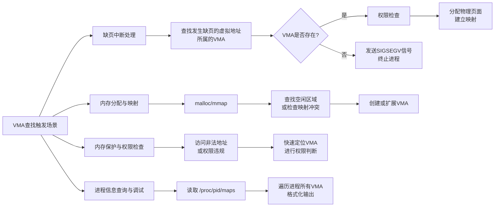
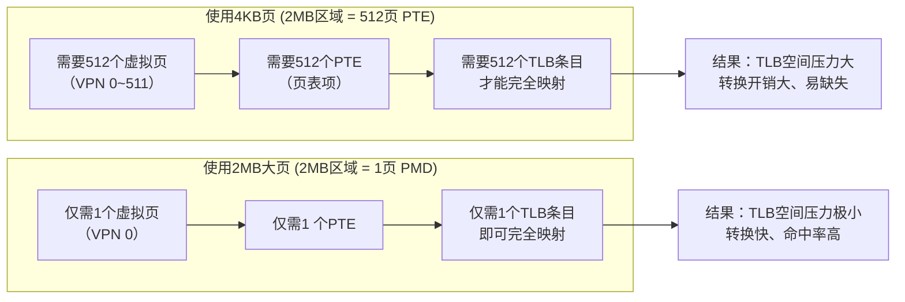
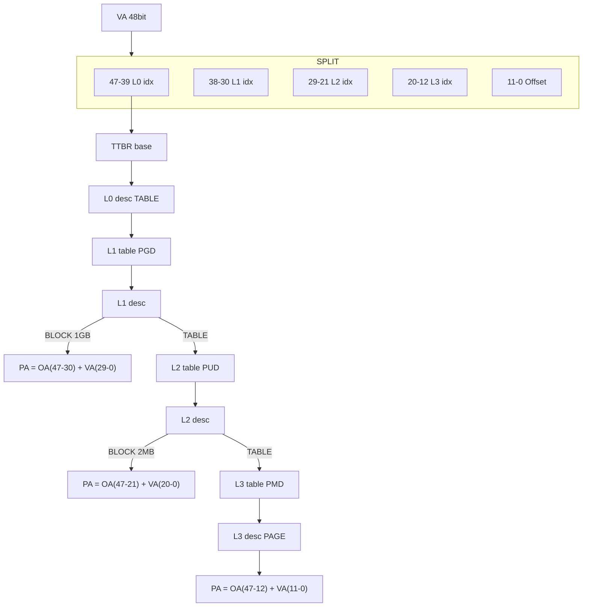
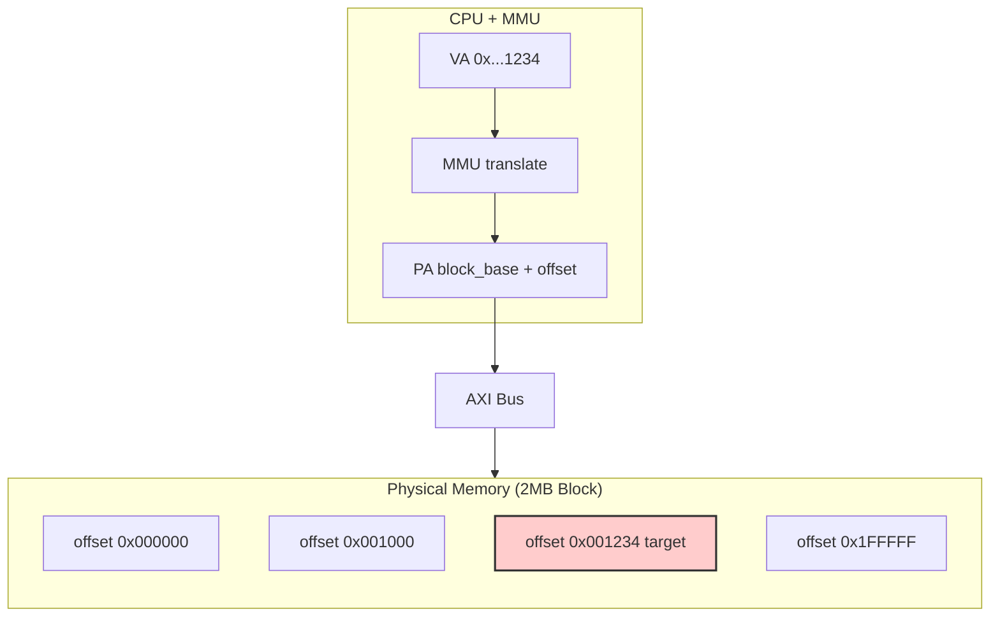
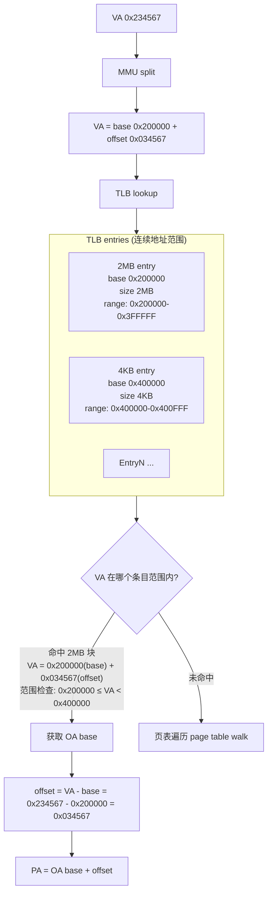

>[ARM64内存虚拟化](https://www.cnblogs.com/LoyenWang/p/13584020.html)

> [ARM内存屏障 DMB\DSB\ISB](https://zhuanlan.zhihu.com/p/601037646)

DSB SY：数据屏障指令，多核数据同步问题，主要解决内存数据还未写入，就被乱序的指令读取的问题。

- dsb(sy) 会等待其他核的广播应答后，才算完成

ISB：指令屏障，清空 ISB 后面的指令，并把还没执行的指令丢掉，重新取值（比如让CPU重新读取寄存器状态）。ISB 不会管TLB缓存是否一致，只管指令状态，所以只用 ISB 会存在缓存一致性问题。

- ISB不会等广播应答

# 内存基础知识


**内存是什么？**

- 内存又称主存（DDR5，平常说的dimms就是用来插DDR的插槽），是 CPU 能直接寻址的存储空间，由半导体器件制成；
- 内存的特点是存取速率快，断电一般不保存数据，非持久化设备；

**内存的作用**

- 暂时存放 cpu 的运算数据
- 硬盘等外部存储器交换的数据
- 保障 cpu 计算机的稳定性和高性能


在linux内核中，内存管理子系统可以抽象为下面的模块：

```text
用户空间进程
    │
    ▼
系统调用接口
    │
    ├── mmap() ──┐
    ├── brk()   │
    ├── malloc()│
    └── 其他内存相关系统调用
    │
    ▼
虚拟内存管理器 (Virtual Memory Manager)
    ├── 地址空间管理 (mm_struct)
    ├── 虚拟内存区域管理 (vm_area_struct)
    ├── 页表管理
    ├── 缺页异常处理
    └── 页面回收与换出 (LRU / Swap / Watermark)
    │
    ▼
物理内存管理器
    ├── 伙伴系统 (Buddy System)
    ├── SLAB/SLUB分配器
    ├── 每CPU页框缓存
    └── 内存区域管理 (ZONE)
    │
    ▼
硬件抽象层
    ├── MMU接口
    ├── TLB管理
    └── 架构特定代码
```

# 内存管理篇

## 每个进程的空间分配

32 位系统下，地址总线是 32 位，**能寻址的范围是 2^32 = 4GB**。这 4GB 是**虚拟地址空间**的大小，不是物理内存大小——物理内存可能只有 512MB 甚至更少，但每个进程"看到"的地址空间都是 4GB。

**每个进程都有自己独立的 4GB 虚拟地址空间视图**，都按 3:1 划分：


关键区别：

- **用户空间（0~3GB）**：每个进程独立，通过各自不同的页表映射到不同的物理页。进程A的 0x400000 和进程B的 0x400000 指向不同的物理内存。
- **内核空间（3GB~4GB）**：所有进程**共享同一份**。所有进程的 3GB~4GB 页表项都指向相同的物理内存。这样进程切换时内核空间不需要换页表，系统调用时也不需要切换地址空间。

ARM64 上不再是 3:1。ARM64 使用 48 位虚拟地址，地址空间大得多，用户空间和内核空间各占一半：

```text
ARM64 (48位虚拟地址)：

用户空间: 0x0000_0000_0000_0000 ~ 0x0000_FFFF_FFFF_FFFF  (低128TB)
                          ↑ bit 47 = 0

内核空间: 0xFFFF_0000_0000_0000 ~ 0xFFFF_FFFF_FFFF_FFFF  (高128TB)
                          ↑ bit 47 = 1

中间 0x0000_8000...~0xFFFE_7FFF... 是未定义区域（空洞）
```

这也是为什么 ARM64 有两个 TTBR 寄存器——TTBR0 指向用户空间页表，TTBR1 指向内核空间页表，各管一半。

## 多进程内存分配


- 虚拟存储器：操作系统为每个进程提供的抽象内存空间。它让每个进程都认为自己拥有连续、独占的大块内存（通常从0到最大地址），实际上这些数据可能分散在物理内存的不同位置，甚至暂时存储在磁盘上。
- 虚拟地址空间：每个进程独立的地址视图。两个进程可以使用相同的虚拟地址，但它们映射到不同的物理内存区域。
- 物理存储器：计算机实际的硬件内存（RAM）。这是数据真正存储的地方，由物理地址直接访问。
- 页帧：物理内存被划分的固定大小块。例如4KB、2MB或1MB。每个页帧有一个唯一的物理页帧号（PFN）。
- 虚拟页帧号（VPN）：**由虚拟地址中的高 N 位组成**，用于页表翻译时的查表。**虚拟地址 = VPN + 偏移量（Offset）**。例如在4KB分页、48位虚拟地址的系统中：
    - 高36位：VPN
    - 低12位：偏移量（0-4095）
- 物理页帧号（PFN）：物理内存中页帧的编号。物理地址 = PFN + 偏移量。VPN通过页表映射到PFN。
- 页表 PT：**存储虚拟地址到物理地址映射关系的数据结构。每个进程都有自己的页表。页表本质是一个数组，索引是VPN，元素是页表项。**
- 页表项 PTE：页表中的每个条目，包含：
    - PFN：对应的物理页帧号
    - 有效位：该页是否在物理内存中
    - 读/写/执行权限位：控制访问权限
    - 脏位：页是否被修改过
    - 访问位：页是否被访问过
    - 其他控制位：如缓存策略、用户/内核模式等

他们之间的结构关系为：

```
页表（PT）
  ├── PTE[0] ──> PFN: 123  (VPN 0映射到物理页帧123)
  ├── PTE[1] ──> PFN: 456  (VPN 1映射到物理页帧456)
  ├── PTE[2] ──> 无效位=1 (该页不在内存中)
  └── PTE[n] ──> PFN: 789  (VPN n映射到物理页帧789)
```

查找过程
1. VPN作为索引：用虚拟页帧号（VPN）直接访问页表数组

2. 从PTE中提取PFN：页表项中存储了物理页帧号

3. 组合成物理地址：PFN + 偏移量

查找过程可以概括为以下的过程：


## 虚拟地址翻译流程


虚拟地址到物理地址的映射由 MMU 来实现，是纯硬件实现的，它的地址翻译流程如下所示，这里只画出了二级页表的情况，实际上现代系统普遍使用多级页表，ARM64 架构通常支持三级或四级页表（取决于虚拟地址位数和配置）：

<!--  -->


现代 Linux 内核在 ARM64 上默认使用 **四级页表（PGD → PUD → PMD → PTE）**。

假设目前有一个页，它的64bit虚拟地址是[VFN=0xffff018140e09]+[offset=0x000]。由于内存是字节寻址的，因此我们可以以字节的形式进行访问，所以这个例子是:

```
访问这个页的第一个字节，地址是[0xffff018140e09]000

访问这个页的第二个字节，地址是[0xffff018140e09]001

访问这个页的第二个字节，地址是[0xffff018140e09]002

...
```

这一整个PTE页所有 entry 的高 36 位都是一样的。

虽然地址翻译由 MMU 硬件完成，但页表由操作系统软件管理。需要通过软件维护页表，比如创建页表、更新页表项、通过设置页表项中的权限位来控制访问权限（如读写权限、用户态/内核态权限等）.

## 用户/内核空间页面管理

linux 系统把地址空间分为**用户空间和内核空间两部分**，用户空间的地址由用户态程序使用，内核空间的地址由操作系统内核使用。

- 较低的地址范围用于用户空间（0~3GB）
- 较高的地址范围用于内核空间（3GB~4GB）


<!--  -->



- 匿名页面（通常是进程的私有数据）、page cache、slab都有自己的链表结构来组织页面

- 对于页面回收而言，内核比较喜欢回收干净的page cache

- ksm是服务虚机的，系统中创建很多一样的虚机，会产生很多相同的匿名页面，所以ksm的作用就是把他们合并起来，减少内存占用

## 大页（Huge Page）

我们常用的页大小是4KB，但在某些场景下，使用更大的页（如2MB或1GB）可以显著提高性能，减少TLB miss的次数。

```
48位虚拟地址
┌────────────────────────────────────────────────────────────────────┐
│ 47                                                               0 │
└────────────────────────────────────────────────────────────────────┘

─────────────────────────────────────────────────────────────────────
4KB 页分配 (页大小 = 4KB = 2^12)
┌────────────────────────────┬────────────────┐
│       PFN (36 bits)        │offset(12 bits) │
│       [47 ... 12]          │ [11 ... 0]     │
└────────────────────────────┴────────────────┘

─────────────────────────────────────────────────────────────────────
2MB 页分配 (页大小 = 2MB = 2^21)
┌────────────────────┬─────────────────────────┐
│    PFN (27 bits)   │      offset(21 bits)    │
│    [47 ... 21]     │      [20 ... 0]         │
└────────────────────┴─────────────────────────┘

─────────────────────────────────────────────────────────────────────
```

对比说明：

- offset 位数 = log2(页大小)
- PFN 位数 = 48 - offset 位数
- 页越大，offset 占用位数越多，PFN 位数越少，TLB 条目覆盖范围越大

大页：mmu访问页表的消耗是很严重的，以二级页表为例，一次tlb miss就会导致两次内存访存；所以huge page的最大的好处是可以减少 tlb miss 次数，比如，你现在需要分配2mb内存，如果使用4k的页面，需要tlb miss 512次

<!--  -->



大页虽然对大内存很友好，但是分配小内存是就会有浪费的问题。

如果在开启了2MB大页的情况下，你的应用只需要4KB的内存，整个映射和查找过程操作系统必须在物理内存中找到一段连续的2MB物理内存块。这与普通4KB页不同，普通页只需4KB连续，而**大页强制要求2MB连续。**

结果：一个页表项（PDE）直接映射了2MB的物理空间。虽然你只用了4KB，但在硬件看来，这2MB空间现在都属于你。

地址计算：命中后，直接用物理地址高位（PPN）拼接虚拟地址的低位（Offset，即页内偏移），得到最终物理地址。对于2MB页，偏移量是21位。

现代操作系统的解决方案（**透明大页 THP**）：

Linux的透明大页（THP）机制很好地解决了你的疑虑。它的行为是动态的：
- 进程申请内存，内核默认按4KB页分配。
- 内核后台线程扫描，发现进程占用了大量连续的4KB页。
- 内核尝试将这些连续的4KB页合并成一个2MB大页。
- 如果进程后续只访问其中4KB，或者修改局部权限，内核甚至可以将大页拆分回4KB页。

结论： 如果是静态开启大页（如HugeTLB），映射和查找都按2MB粒度进行，TLB中只有一条记录，效率极高但内存浪费严重；如果是透明大页，内核会动态调整，尽量让你“既享受大页的速度，又不失小页的灵活”。

2MB大页的页表结构：

| 逻辑名称 | Linux内核常用名 | 索引级别 | 区间 |
| --- | --- | --- | --- |
| Page Global Directory | PGD | 一级 | [47-39] |
| Page Upper Directory | PUD | 二级 | [38-30] |
| Page Middle Directory | PMD | 三级（关键转折点） | [29-21] |
| Page Table Entry | PTE | 四级（2MB大页时无四级） | [20-12] |

第 4 级 PTE 页表每个 entry 能映射的内存空间大小是由 offset 位数决定的，比如当前 offset 有 12 位，那么 PTE 页表项就能映射 2^12 = 4KB 的内存空间。

那么同理，每个 PMD 页表项能映射的内存空间大小就是 2^(12+9) = 2^21 = 2MB 的内存空间了。

从上面的表格分段情况也可以看出，4 级页表中，每级页表用 9 bit 来索引，所以每级页表有 512 个 entry（2^9 = 512），每个 entry 可以映射 4KB 的页，所以每级页表可以映射 512 * 4KB = 2MB 的内存空间，这也是为什么 PMD 级别的一页可以直接映射一个 2MB 大页的原因。

以一个2MB大页为例，48 bit 地址长度为例，虚拟地址的页表翻译过程如下图所示，在：

<!--  -->



可以看出，在2MB大页模式下，PMD级别的页表项直接指向一个2MB的物理内存块，而不需要再访问PTE级别的页表了，这样就减少了一次内存访问，提高了地址翻译的效率。

在这种页表翻译的情况下，拿到实际 PA 物理地址后，也会通过地址总线访问内存

<!--  -->



访问 2mb 大页其中一个 4k 内存时，tlb的地址命中过程如下：



> [内存管理源码分析](https://blog.csdn.net/u011649400/article/details/105984564)


# linux 内存结构


## 基础结构-VMA

`vm_area_struct (VMA)` 是 Linux 内核**管理进程用户态虚拟内存的基础结构（基础单元）**。只要在虚拟地址空间分配了具有特定属性的连续内存，内核就会创建对应的 VMA。为了兼顾遍历与查找效率，这些 VMA 会同时挂入两个结构：

- 按地址排序的 `mm_struct->mmap` 双向链表
- 以及用于 O(logN) 快速查找的 `mm_struct->mm_rb` 红黑树。

需要明确区分，**mm_struct 中的 mmap 字段与系统调用 mmap() 是完全不同的概念。**前者是内核存储 VMA 的数据结构（名词），后者是用户态申请内存映射的接口（动词）。调用系统调用 mmap() 的结果，就是向 mm_struct->mmap 链表中插入一条新的 VMA 节点。

反之，**并非只有 mmap() 才会操作这个链表。**VMA 作为虚拟地址空间的唯一"账本"，记录了所有内存分配行为。其他系统调用同样会触发 VMA 的增删改：

- **brk()**：调整堆空间大小，内核直接修改堆 VMA 的 vm_end 指针。
- **execve()**：加载程序时，为代码段、数据段创建初始 VMA。
- **mprotect() / munmap()**：修改现有 VMA 权限或从链表中摘除节点。

简言之，`mm_struct->mmap` 链表是进程虚拟内存的"总账本"，而 mmap()、brk() 等系统调用只是触发该账本更新的不同操作指令。

linux 内存中，重要的结构体：


```c
task_struct            // 进程描述符：内核中每个进程的唯一"身份证"，包含指向内存管理的入口
    │
    │  task_struct->mm  ──指向──▶  mm_struct
    │
    ▼
mm_struct              // 进程内存管理结构体：描述进程的整个虚拟地址空间全貌
    ├── pgd            // 指向页全局目录(PGD)，是进程整棵页表树的"根"，也是该进程一级页表的基地址，进程运行时，该地址经物理地址转换后加载到 TTBR 寄存器中
    ├── mmap           // VMA 链表头，按地址顺序串联所有虚拟内存区域
    ├── mm_rb          // VMA 红黑树根，用于 O(logN) 快速查找地址所属区域
    └── total_vm       // 进程总共映射的虚拟页数
        │
        │  mm_struct->mmap ──指向──▶  vm_area_struct
        │
        ▼
vm_area_struct (VMA)   // 虚拟内存区域：描述一段连续的虚拟地址区间（如代码段、堆、mmap区）
    ├── vm_start       // 区域起始虚拟地址
    ├── vm_end         // 区域结束虚拟地址（区间: [vm_start, vm_end)）
    ├── vm_flags       // 权限标志（VM_READ / VM_WRITE / VM_EXEC）
    ├── vm_file        // 如果是文件映射，指向 file → address_space
    └── vm_ops         // VMA 操作函数集（缺页回调 fault()、页移除 open() 等）
        │
        │  缺页时 → 遍历页表 → 最终落到物理页
        │
        ▼
┌─────────────────────────────────────────────────────────────┐
│              页表层级结构（软件维护，硬件MMU遍历）               │
│                                                             │
│  pgd_t  (PGD)     一级 页全局目录   索引[47-39]  512项       │
│    └── p4d_t      （五级页表时才有）                          │
│        └── pud_t  (PUD)  二级 页上级目录 索引[38-30]  512项  │
│            └── pmd_t(PMD) 三级 页中间目录 索引[29-21]  512项 │
│                └── pte_t(PTE) 四级 页表项   索引[20-12]  512项│
│                    └── pfn ──指向──▶  物理页帧(page)         │
└─────────────────────────────────────────────────────────────┘
```

以上就是**虚拟内存侧**的核心结构体链条：`task_struct → mm_struct → vm_area_struct → 页表(PGD/PUD/PMD/PTE) → page`。


## task_struct 与 mm_struct 的粒度

上面提到 task_struct 和 mm_struct，需要搞清楚它们的粒度：**不是"一个内核/虚机挂一个"，而是每个线程/进程各有一个。**

- **task_struct：每个线程一个。** Linux 内核不区分进程和线程，线程本质上是轻量级进程（通过 `clone()` 创建），每个线程都有自己独立的 `task_struct`。
- **mm_struct：每个进程（线程组）一个。** 同一进程下的多个线程**共享**同一个 `mm_struct`，因为它们共享地址空间、页表、VMA 链表。只有 `clone()` 时带 `CLONE_VM` 标志（即创建线程），才会共享 mm_struct。

```text
进程 P1（线程组 TID=100）
├── task_struct(线程100) ──┐
├── task_struct(线程101) ──┼──▶ 共享同一个 mm_struct
└── task_struct(线程102) ──┘

进程 P2（线程组 TID=200）
└── task_struct(线程200) ──▶ 独立的 mm_struct
```

内核线程是特例：它没有用户态地址空间，`task_struct->mm` 为 NULL，只借用一个 `active_mm` 临时使用。

至于 KVM 虚机，在 host 内核视角下一个虚机就是一个 QEMU 进程，有自己的 `task_struct` 和 `mm_struct`，虚机内存是 mm_struct 里 mmap 出来的一块普通用户态内存。guest OS 内部的 task_struct / mm_struct 对 host 内核不可见。

## mm_struct->pgd 与 TTBR 的关系

上面结构体中 `mm_struct->pgd` 指向进程的 PGD 页表页，它就是四级页表（PGD → PUD → PMD → PTE）的**最顶层一级页表**，也就是整棵页表树的"根"。

**每个进程都有自己的 PGD。** 因为每个进程有自己的 `mm_struct`，而 `mm_struct->pgd` 指向各自独立的 PGD 页表页。一个系统中同时运行 N 个进程，物理内存里就同时躺着 N 张不同的 PGD 页表。

但同一时刻只有一张 PGD 是"生效"的——当前正在 CPU 上跑的那个进程的 PGD。进程切换时，内核把下一个进程的 `pgd` 经 `__pa()` 转换为物理地址后写入 TTBR0，MMU 从此用新进程的页表做翻译：

```text
进程切换时（schedule → switch_mm）：

    mm_struct->pgd  (内核虚拟地址)
         │
         │  __pa() 转换为物理地址
         ▼
    物理地址  ──写入──▶  TTBR0_EL1 寄存器
                            │
                            ▼
                     MMU 从此地址开始遍历四级页表
                     同时刷新 TLB（旧进程的TLB缓存失效）
```

需要注意，`mm_struct->pgd` 存的是内核虚拟地址，而 TTBR 需要物理地址，因为 MMU 硬件用物理地址遍历页表。

另外在 ARM64 上有两个 TTBR：

- **TTBR0**：存用户空间进程的 PGD 地址，每个进程不同，进程切换时更新。
- **TTBR1**：存内核空间的 PGD 地址，所有进程共享，开机时设置一次就不变了。

# 内存初始化

## 内存节点：UMA / NUMA

物理内存的组织方式取决于硬件架构，分为两种模型：

- **UMA（Uniform Memory Access）**：**所有 CPU 通过同一条总线访问同一块物理内存，访问延迟一致。**典型场景是单路服务器、嵌入式设备、手机等只有一颗 CPU 芯片的系统。
- **NUMA（Non-Uniform Memory Access）**：多颗 CPU 芯片各自拥有本地内存，访问本地内存快、访问其他 CPU 的远程内存慢。典型场景是双路/四路服务器。

```text
UMA (Single Socket)            NUMA (Dual Socket)

     ┌─────────┐              ┌─────────┐  QPI  ┌─────────┐
     │  CPU    │              │ Socket0 │◄─────►│ Socket1 │
     └────┬────┘              └────┬────┘       └────┬────┘
          │ Bus                    │                 │
     ┌────┴────┐               ┌───┴────┐       ┌────┴───┐
     │ Memory  │               │ Node0  │       │ Node1  │
     │ (Only)  │               │ Memory │       │ Memory │
     └─────────┘               └────────┘       └────────┘
     Uniform Access             Local Fast, Remote Slow
```

一个 Socket（CPU 插槽）通常对应一个 NUMA 节点。每个 NUMA 节点在内核中由一个 `pg_data_t` 结构体描述，管理该节点下的所有 zone 和 page。UMA 系统中只有一个 `pg_data_t`，NUMA 系统中每个节点一个。

常用查看命令：

```bash
# 查看 NUMA 节点数量、各节点的 CPU 和内存分布
$ numactl --hardware
available: 2 nodes (0-1)
node 0 cpus: 0 1 2 3 4 5 6 7
node 1 cpus: 8 9 10 11 12 13 14 15
node 0 size: 32157 MB
node 1 size: 32264 MB

# 查看进程的内存分布在哪些 NUMA 节点上
$ numactl --show
policy: default
preferred node: current
physcpubind: 0 1 2 3 4 5 6 7
cpubind: 0
nodebind: 0
membind: 0 1

# 查看各节点的内存使用情况
$ numastat
                           node0           node1
numa_hit             32157012345     28164390123
numa_miss                      0               0
numa_foreign                    0               0
interleave_hit             12345           12345
local_node            32157012345               0
other_node                      0       64389012

# 查看进程内存分布在哪个节点
$ numastat -p <pid>

# 将进程绑定到指定节点运行
$ numactl --cpunodebind=0 --membind=0 ./my_program
```


## struct Zone/struct Page/struct mem_map数组

**物理内存是字节编址的**，每个地址对应一个字节。

但以字节为单位管理整个物理内存太细碎，所以内核以 **页（PAGE_SIZE，通常4KB）** 为基本单位来组织和管理物理内存。

物理内存被划分为一个个固定大小的页，每个页称为**页帧（Page Frame）**，它是物理内存管理的基础单位。内核用一个 `page` 结构体来描述每一个页帧，所有页帧的 `page` 结构体组成 `mem_map` 数组。

### malloc 申请内存时的两层分配

那假设我们用户态 `malloc(2KB)`，内核会直接给我们分配 4KB 吗？不会，这里有**两层分配**：

**第一层：用户态 malloc（glibc）**

`malloc(2KB)` 不会立刻触发内核系统调用。glibc 内部维护着**内存池（arena）**，会从池子里直接切 2KB 给你，不进内核。这种从池子里切小块分配的方式，会导致池子中空闲的小块不连续——当无法满足大块请求时只能再向内核申请新内存，这就是**外部碎片**产生的原因。

只有当池子不够用时，glibc 才会通过 `brk()` 或 `mmap()` 向内核**批量**申请一大块虚拟地址空间（约 128KB），再切成小块分给后续请求。

**第二层：内核态（伙伴系统）**

内核收到请求后，分配的**最小粒度就是 4KB（1 个页）**。但要注意，`brk()` 此时扩展的只是**虚拟地址空间**（VMA 延伸），**物理页并不是立刻分配的**——而是等进程实际访问那块虚拟地址时，触发缺页异常，内核才通过伙伴系统分配 4KB 物理页。

也就是说，内核确实最小也得分配 4KB，但这 4KB 是给 glibc 内存池的，不是单独给你这 2KB 的。你拿到的 2KB 来自池子，剩下的空间留在池子里给下次 malloc 用，不会浪费。如果某些场景下存在"申请了但没用满"的情况，这就是**内部碎片**。

```text
malloc(2KB) 的实际流程：

glibc 内存池够用？
  ├── 是 → 直接从池子里切 2KB 返回，不进内核
  └── 否 → brk()/mmap() 向内核申请虚拟地址空间（批量，~128KB）
           → 进程实际访问时触发缺页异常
           → 内核伙伴系统分配 4KB 物理页
           → glibc 把大块内存切成小块，返回 2KB 给你
```


### 管理物理内存的三大数据结构

内核用三个层级的数据结构来组织物理内存，从大到小依次为：

- **`pg_data_t`**（Node）：描述一个**内存节点**，对应 NUMA 架构中的一个节点（UMA 系统只有一个）。
    - 每个节点管理自己的 CPU 和本地内存。
- **`zone`**（Zone）：描述节点内的**内存区域**。同一个节点内的物理内存按用途和地址范围划分为不同 zone
    - 如 `ZONE_DMA`（DMA 专用低地址区）
    - `ZONE_NORMAL`（普通区，内核最常用）
    - `ZONE_HIGHMEM`（高端内存区，32 位特有）
- **`page`**（Page）：描述一个**页帧**，即一个 4KB 的物理页。每个页帧对应一个 `page` 结构体，所有 `page` 组成 `mem_map` 数组。

三者的层级关系：

```text
pg_data_t (Node)
  └── zone[] (Zone)
        ├── ZONE_DMA
        ├── ZONE_NORMAL
        └── ZONE_HIGHMEM
              └── free_area[] (Buddy System)
                    └── page (Page Frame) → mem_map 数组
```


其中，`mem_map` 是一个 `page` 结构体数组，存的是 page 本身的结构体，而不是 *page指针，**PFN 就是数组下标**，因此可以 O(1) 找到对应的 `page` 结构体：

```c
// PFN 到 page 结构体的转换，本质就是数组取下标
struct page *page = mem_map + pfn;
// 或者等价地
struct page *page = pfn_to_page(pfn);
```

```c
// mem_map 的类型是指向 struct page 的指针，但它指向的是一个连续的 struct page 数组
struct page *mem_map;

// 本质上是：
// struct page mem_map[];  ← 这才是真相

// mem_map[pfn] 拿到的就是一个完整的 struct page 结构体（不是指针）
// mem_map + pfn 得到的是 struct page *，指向数组中第 pfn 个元素
```

**`mem_map` 是物理内存管理的基石——伙伴系统分配/释放物理页、page cache 关联文件、LRU 页面回收等操作，都需要先通过 `mem_map` 找到 `page` 结构体，再操作其中的状态字段。**

## 伙伴系统

伙伴系统是 Linux 内核中用于管理物理内存的算法。它按**阶（order）** 组织空闲页块，每个 order 对应 **2^order** 个连续页（order 0 = 4KB，order 1 = 8KB，...，order 10 = 4MB），**每个 order 用一个空闲块链表管理。**

**分配时：**

- 从对应 order 的链表取一个块；
- 如果该 order 没有空闲块，就从更大的 order 拆分。

**释放时：**

- 检查它的"**伙伴**"（大小相同且地址连续的相邻块）是否也空闲，如果是就合并成更大的块，向上递归合并。这就是"伙伴系统"名字的由来。


如何找到伙伴？通过 **PFN 的 XOR 运算**算出伙伴的 PFN，再用 `mem_map` 下标取到伙伴的 `page` 结构体：

```text
伙伴 PFN = 当前 PFN ^ (1 << order)

举例（4KB 页，PFN 从 0 开始）：

order 0（1页）：PFN=0 的伙伴是 PFN=1    (0 ^ 1 = 1)
                PFN=2 的伙伴是 PFN=3    (2 ^ 1 = 3)

order 1（2页）：PFN=0 的伙伴是 PFN=2    (0 ^ 2 = 2)
                PFN=4 的伙伴是 PFN=6    (4 ^ 2 = 6)

order 2（4页）：PFN=0 的伙伴是 PFN=4    (0 ^ 4 = 4)
                PFN=8 的伙伴是 PFN=12   (8 ^ 4 = 12)
```

```c
// 释放 order n 的块，起始 PFN 为 pfn
buddy_pfn = pfn ^ (1 << order);           // 1. XOR 算出伙伴 PFN
buddy_page = mem_map + buddy_pfn;         // 2. 通过 mem_map 下标取到伙伴的 page 结构体
// 3. 检查 buddy_page 的状态：是否空闲？order 是否相同？
// 4. 如果伙伴也空闲，从链表摘除伙伴，合并成 order+1 的新块
// 5. 新块的 PFN = min(pfn, buddy_pfn)，递归向上继续找伙伴
```

下面的动画展示了伙伴系统的**分配拆分**和**释放合并**完整过程（点击播放按钮观看）：

<iframe src="/buddy-animation/index.html" width="100%" height="520" frameborder="0" scrolling="no" style="border-radius: 8px; border: 1px solid #333; margin: 15px 0;"></iframe>

## 迁移类型与反碎片化

伙伴系统能通过合并解决**外部碎片**，但无法解决"内存总量够、连续大块不够"的问题——不可移动的页（如内核内存）散落在各处，把可移动的大块打散了，导致需要分配大块连续内存时找不到。

为此，伙伴系统引入了**迁移类型（migrate type）**，按页的"可移动性"分类管理：

- **MIGRATE_UNMOVABLE**：在内存中有固定位置，不能随意移动，比如内核分配的内存。
- **MIGRATE_MOVABLE**：可以随意移动，用户态 app 分配的内存（malloc、mmap...）。
- **MIGRATE_RECLAIMABLE**：不能移动但可以删除回收，比如文件映射的 page cache。

迁移类型的最小单位是 **pageblock**，一个 pageblock 等于 `MAX_ORDER - 1` 阶的页块大小，即 `2^(MAX_ORDER-1)` 个页。ARM64 上 `MAX_ORDER` 通常为 11，所以一个 pageblock = 2^10 = 1024 个页 = **4MB**。一个 pageblock 内的所有页属于同一种迁移类型。

这样分类后，不可移动页和可移动页被隔离到不同的 pageblock 中。当内核需要分配大块不可移动内存时，如果可移动页占了某些 pageblock，内核可以通过**内存迁移（compaction）**把可移动页搬到别处，腾出完整的 pageblock 给不可移动分配使用。

