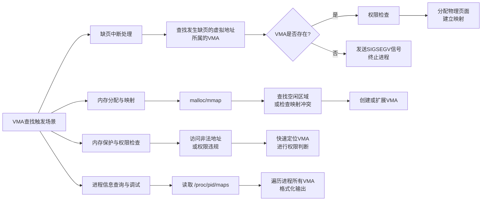
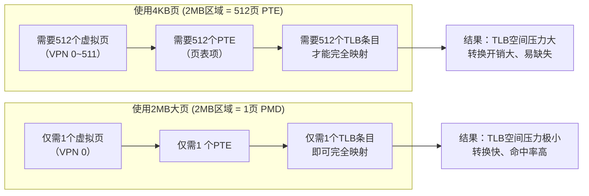
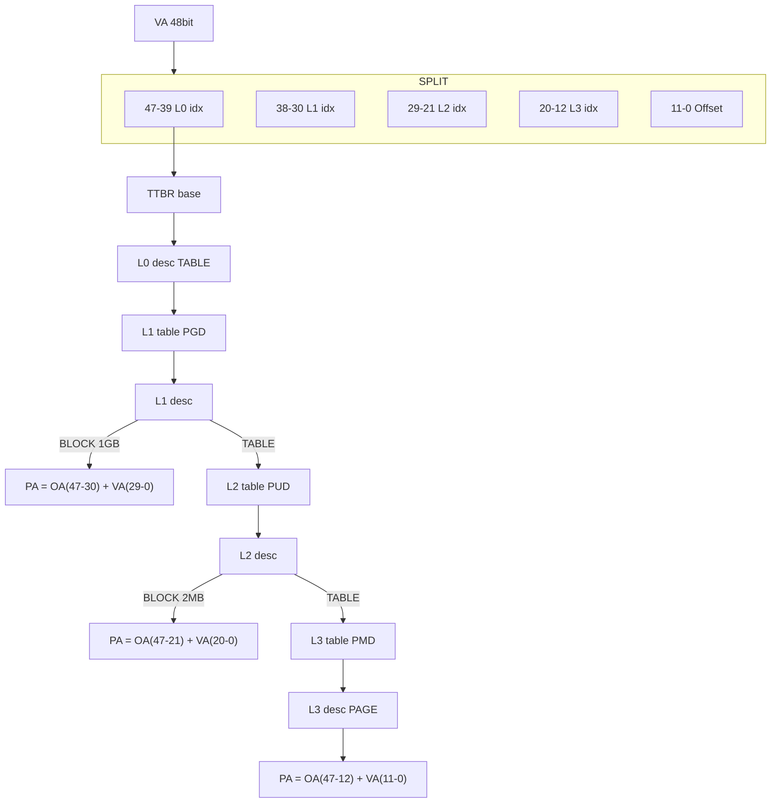
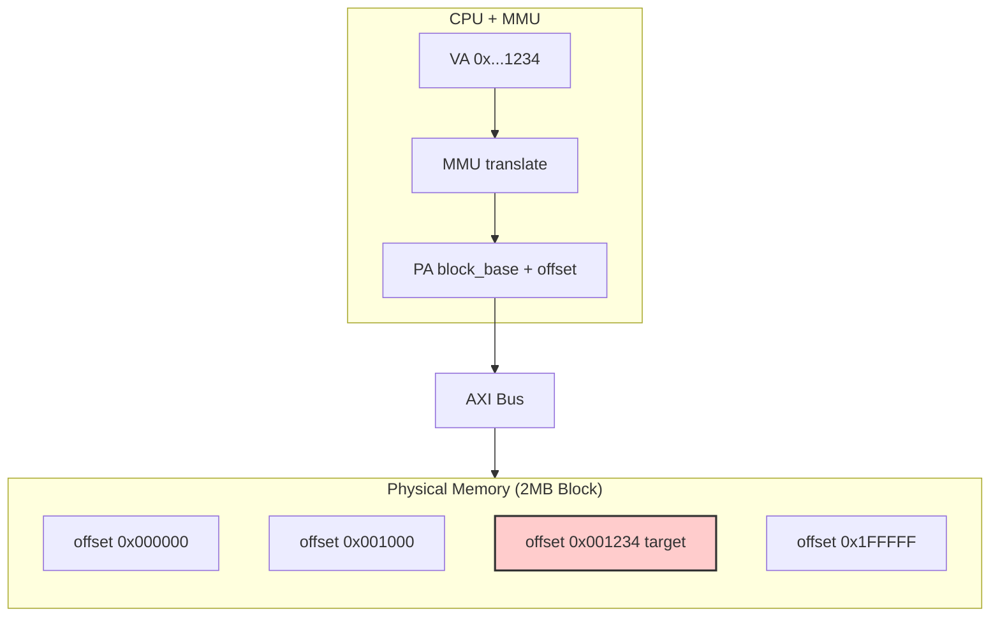
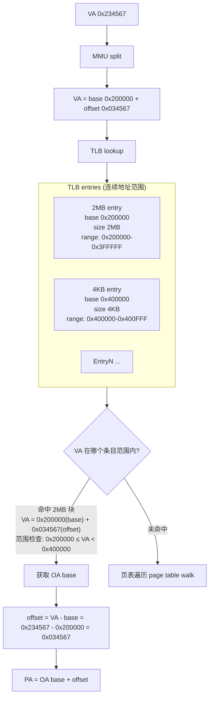

>[ARM64内存虚拟化](https://www.cnblogs.com/LoyenWang/p/13584020.html)

> [ARM内存屏障 DMB\DSB\ISB](https://zhuanlan.zhihu.com/p/601037646)

DSB SY：数据屏障指令，多核数据同步问题，主要解决内存数据还未写入，就被乱序的指令读取的问题。
- dsb(sy) 会等待其他核的广播应答后，才算完成

ISB：指令屏障，清空 ISB 后面的指令，并把还没执行的指令丢掉，重新取值（比如让CPU重新读取寄存器状态）。ISB 不会管TLB缓存是否一致，只管指令状态，所以只用 ISB 会存在缓存一致性问题。
- ISB不会等广播应答

# 内存管理篇

## 虚拟地址翻译流程

虚拟地址到物理地址的映射由 MMU 来实现，是纯硬件实现的，它的地址翻译流程如下所示，这里只画出了二级页表的情况，实际上现代系统普遍使用多级页表，ARM64 架构通常支持三级或四级页表（取决于虚拟地址位数和配置）：

现代 Linux 内核在 ARM64 上默认使用 **四级页表（PGD → PUD → PMD → PTE）**。

虽然地址翻译由 MMU 硬件完成，但页表由操作系统软件管理。需要通过软件维护页表，比如创建页表、更新页表项、通过设置页表项中的权限位来控制访问权限（如读写权限、用户态/内核态权限等）.

## 用户/内核空间页面管理

linux 系统把地址空间分为**用户空间和内核空间两部分**，用户空间的地址由用户态程序使用，内核空间的地址由操作系统内核使用。

- 较低的地址范围用于用户空间（0~3GB）
- 较高的地址范围用于内核空间（3GB~4GB）

<!--  -->

- 匿名页面（通常是进程的私有数据）、page cache、slab都有自己的链表结构来组织页面

- 对于页面回收而言，内核比较喜欢回收干净的page cache

- ksm是服务虚机的，系统中创建很多一样的虚机，会产生很多相同的匿名页面，所以ksm的作用就是把他们合并起来，减少内存占用

## 大页（Huge Page）

大页：mmu访问页表的消耗是很严重的，以二级页表为例，一次tlb miss就会导致两次内存访存；所以huge page的最大的好处是可以减少 tlb miss 次数，比如，你现在需要分配2mb内存，如果使用4k的页面，需要tlb miss 512次

<!--  -->

大页虽然对大内存很友好，但是分配小内存是就会有浪费的问题。

如果在开启了2MB大页的情况下，你的应用只需要4KB的内存，整个映射和查找过程操作系统必须在物理内存中找到一段连续的2MB物理内存块。这与普通4KB页不同，普通页只需4KB连续，而**大页强制要求2MB连续。**

结果：一个页表项（PDE）直接映射了2MB的物理空间。虽然你只用了4KB，但在硬件看来，这2MB空间现在都属于你。

地址计算：命中后，直接用物理地址高位（PPN）拼接虚拟地址的低位（Offset，即页内偏移），得到最终物理地址。对于2MB页，偏移量是21位。

现代操作系统的解决方案（**透明大页 THP**）：

Linux的透明大页（THP）机制很好地解决了你的疑虑。它的行为是动态的：
- 进程申请内存，内核默认按4KB页分配。
- 内核后台线程扫描，发现进程占用了大量连续的4KB页。
- 内核尝试将这些连续的4KB页合并成一个2MB大页。
- 如果进程后续只访问其中4KB，或者修改局部权限，内核甚至可以将大页拆分回4KB页。

结论： 如果是静态开启大页（如HugeTLB），映射和查找都按2MB粒度进行，TLB中只有一条记录，效率极高但内存浪费严重；如果是透明大页，内核会动态调整，尽量让你“既享受大页的速度，又不失小页的灵活”。

2MB大页的页表结构：

| 逻辑名称 | Linux内核常用名 | 作用 |
| --- | --- | --- |
| Page Global Directory | PGD | 一级索引 |
| Page Upper Directory | PUD | 二级索引 |
| Page Middle Directory | PMD | 三级索引（关键转折点） |
| Page Table Entry | PTE | 四级索引（2MB大页模式下被省略） |

以一个2MB大页为例，48 bit 地址长度为例，虚拟地址的页表翻译过程如下图所示，在：

<!--  -->

可以看出，在2MB大页模式下，PMD级别的页表项直接指向一个2MB的物理内存块，而不需要再访问PTE级别的页表了，这样就减少了一次内存访问，提高了地址翻译的效率。

在这种页表翻译的情况下，拿到实际 PA 物理地址后，也会通过地址总线访问内存

<!--  -->

访问 2mb 大页其中一个 4k 内存时，tlb的地址命中过程如下：

