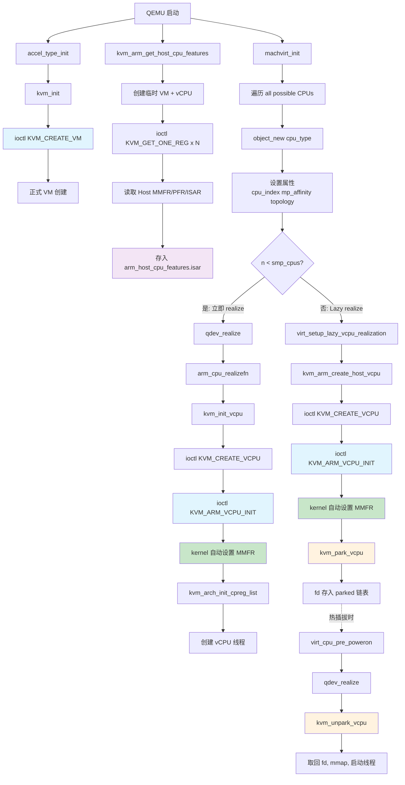
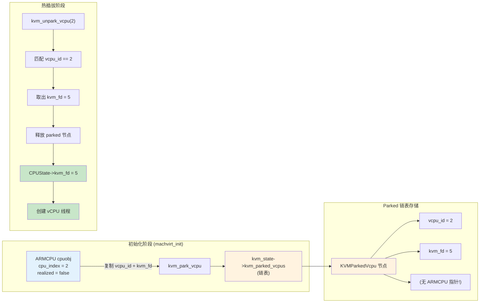
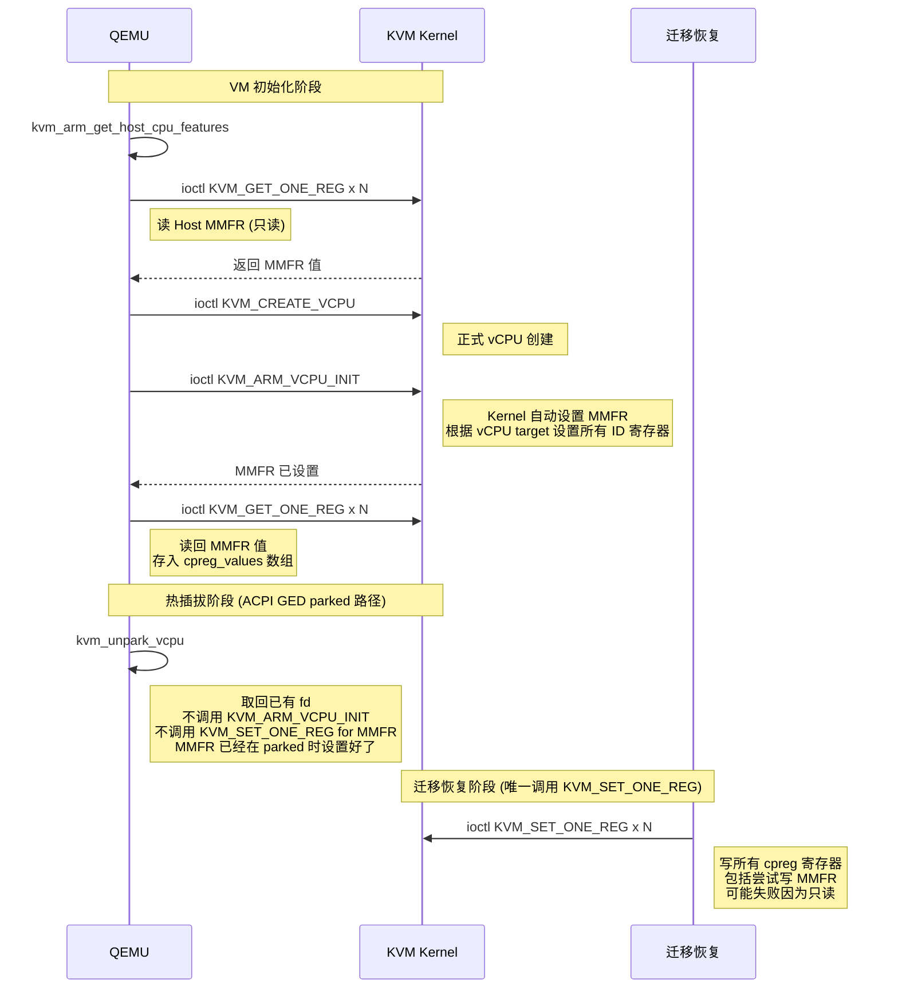

# QEMU Hotplug ARMv8 — VM 启动 MMFR 寄存器配置与 KVM ioctl 下发完整调用路径

> **源码分支**: `salil-mehta/qemu` @ `qemu-hotplug-armv8`
> **Commit**: `82dbd9a` — tcg: Defer TB flush for 'lazy realized' vCPUs on first region alloc

---

## 📋 总览

从 `machvirt_init` 开始，QEMU 配置 guest MMFR 寄存器并下发 KVM ioctl 经历 **4 个阶段**，涉及 **15+ 个关键函数** 和 **8+ 种 KVM ioctl**。

---

## 🔴 阶段 0：探测 Host CPU 特性（读 MMFR，不下发）

**时机**: 加速器初始化时，QEMU 启动早期

**函数**: `kvm_arm_get_host_cpu_features()` → `target/arm/kvm.c:245`

### 流程

1. 创建**临时 VM** → `kvm_arm_create_scratch_host_vcpu()` → `target/arm/kvm.c:104`
   - `ioctl(kvmfd, KVM_CREATE_VM, 0)` — 临时 VM fd
   - `ioctl(vmfd, KVM_ARM_PREFERRED_TARGET, &preferred)` — 获取推荐 target
   - `ioctl(vmfd, KVM_CREATE_VCPU, 0)` — 临时 vCPU fd
   - `ioctl(cpufd, KVM_ARM_VCPU_INIT, init)` — 初始化临时 vCPU

2. 通过 `KVM_GET_ONE_REG` **读取宿主机真实寄存器值**:

```c
// target/arm/kvm.c:245~370
get_host_cpu_reg(fd, ahcf, ID_AA64PFR0_EL1_IDX);
get_host_cpu_reg(fd, ahcf, ID_AA64ISAR0_EL1_IDX);
get_host_cpu_reg(fd, ahcf, ID_AA64ISAR1_EL1_IDX);
get_host_cpu_reg(fd, ahcf, ID_AA64ISAR2_EL1_IDX);
get_host_cpu_reg(fd, ahcf, ID_AA64MMFR0_EL1_IDX);  // ← MMFR0
get_host_cpu_reg(fd, ahcf, ID_AA64MMFR1_EL1_IDX);  // ← MMFR1
get_host_cpu_reg(fd, ahcf, ID_AA64MMFR2_EL1_IDX);  // ← MMFR2
get_host_cpu_reg(fd, ahcf, ID_AA64MMFR3_EL1_IDX);  // ← MMFR3
// AArch32 寄存器
get_host_cpu_reg(fd, ahcf, ID_MMFR0_EL1_IDX);
get_host_cpu_reg(fd, ahcf, ID_MMFR1_EL1_IDX);
get_host_cpu_reg(fd, ahcf, ID_MMFR2_EL1_IDX);
get_host_cpu_reg(fd, ahcf, ID_MMFR3_EL1_IDX);
get_host_cpu_reg(fd, ahcf, ID_MMFR4_EL1_IDX);
get_host_cpu_reg(fd, ahcf, ID_MMFR5_EL1_IDX);
```

3. 结果存入全局静态变量 `arm_host_cpu_features.isar`

### 关键实现

```c
// target/arm/kvm.c:233
static int get_host_cpu_reg(int fd, ARMHostCPUFeatures *ahcf,
                            ARMIDRegisterIdx index)
{
    uint64_t *reg = &ahcf->isar.idregs[index];
    return read_sys_reg64(fd, reg,
        idregs_sysreg_to_kvm_reg(id_register_sysreg[index]));
    // ↑ 内部调用 ioctl(fd, KVM_GET_ONE_REG, &idreg)
}
```

> 💡 **注意**: 此阶段只是**读取** host 值，不写入任何 guest 寄存器

---

## 🟡 阶段 1：创建 vCPU QOM 对象

**时机**: `machvirt_init` 遍历所有 possible CPUs 时

**函数**: `machvirt_init()` → `hw/arm/virt.c:2492`

### 关键代码路径

```c
// hw/arm/virt.c:2700~2793
possible_cpus = mc->possible_cpu_arch_ids(machine);

for (n = 0; n < possible_cpus->len; n++) {
    cpuobj = object_new(possible_cpus->cpus[n].type);  // ← 创建 ARMCPU QOM 对象

    // 设置属性
    object_property_set_int(cpuobj, "mp-affinity", ...);
    object_property_set_bool(cpuobj, "has_el2", ...);   // 根据 vms->virt 决定
    object_property_set_bool(cpuobj, "has_el3", ...);   // 根据 vms->secure 决定

    cs = CPU(cpuobj);
    cs->cpu_index = n;

    if (n < smp_cpus) {
        /* 'Present' & 'Enabled' vCPUs → 立即 realize */
        qdev_realize(DEVICE(cpuobj), NULL, &error_fatal);  // ← 触发 realize 链
        object_unref(cpuobj);
    } else {
        /* 'Present' & 'Disabled' vCPUs → lazy realization (hotplug 特性) */
        virt_setup_lazy_vcpu_realization(cpuobj, vms);  // ← hotplug 特有路径
    }
}
```

---

## 🟢 阶段 2：CPU Realize 调用链（核心路径）

**这是 hotplug 分支的关键差异点** — 分为**立即 realize** 和 **lazy realize** 两条路径。

### 路径 A：立即 realize（前 smp_cpus 个 vCPU）

```
qdev_realize(DEVICE(cpuobj))
  │
  └─ arm_cpu_realizefn()                          ← target/arm/cpu.c:1971
       │
       ├─ qemu_init_vcpu(cs)                      ← target/arm/cpu.c:2577
       │    └─ accel_init_vcpu()
       │         └─ accel_cpu_common_realize()    ← accel/accel-common.c:93
       │              ├─ cpu_target_realize()     ← KVM ARM: 空实现
       │              └─ cpu_common_realize()     ← accel/kvm/kvm-accel-ops.c:42
       │                   └─ kvm_init_vcpu(cs)   ← accel/kvm/kvm-all.c:557
       │                        │
       │                        ├─ kvm_arch_pre_create_vcpu()
       │                        ├─ kvm_create_vcpu()
       │                        │    └─ ioctl(kvmfd, KVM_CREATE_VCPU, vcpu_id)  ← 创建正式 vCPU
       │                        ├─ ioctl(s, KVM_GET_VCPU_MMAP_SIZE, 0)
       │                        ├─ mmap(..., cpu->kvm_fd, 0)                     ← mmap vCPU run 区域
       │                        │
       │                        └─ kvm_arch_init_vcpu(cs)  ← target/arm/kvm.c:1998 ★ 核心
       │
       └─ cpu_exec_realizefn(cs)                  ← target/arm/cpu.c:2085
            ├─ accel_cpu_common_realize()         ← 同上
            └─ cpu_list_add(), cpu_vmstate_register()
```

### 路径 B：Lazy Realization（hotplug 特性，disabled vCPUs）

```
virt_setup_lazy_vcpu_realization(cpuobj, vms)     ← hw/arm/virt.c:2442
  │
  ├─ qdev_disable(DEVICE(cpuobj))                 ← 标记为 administratively disabled
  ├─ object_property_set_int(cpuobj, "psci-conduit", ...)
  ├─ ARM_CPU(cpuobj)->power_state = PSCI_OFF
  │
  └─ if (kvm_enabled()):
       └─ kvm_arm_create_host_vcpu(ARM_CPU(cpuobj))  ← target/arm/kvm.c:1059
            │
            ├─ kvm_create_vcpu(cs)
            │    └─ ioctl(kvmfd, KVM_CREATE_VCPU, vcpu_id)
            │
            └─ kvm_arch_init_vcpu(cs)              ← 与路径 A 相同的初始化
                 │
                 └─ kvm_park_vcpu(cs)              ← accel/kvm/kvm-all.c:417
                      └─ 将 vCPU fd 存入 kvm_state->kvm_parked_vcpus 链表
```

> 💡 **Lazy realization 的核心思想**: 为 hotplug 预留的 vCPU **提前创建 KVM vCPU fd 并完成初始化**，但不 realize QOM 对象、不创建 vCPU 线程。vCPU fd 被"parked"在链表中，后续 hotplug 时通过 `kvm_unpark_vcpu()` 取出复用。

### kvm_create_vcpu 的 unpark 逻辑

```c
// accel/kvm/kvm-all.c:460
int kvm_create_vcpu(CPUState *cpu)
{
    unsigned long vcpu_id = kvm_arch_vcpu_id(cpu);

    // 先尝试从 parked 链表中取出已有的 vCPU fd
    kvm_fd = kvm_unpark_vcpu(s, vcpu_id);
    if (kvm_fd < 0) {
        // 未 parked → 创建新的 KVM vCPU
        kvm_fd = kvm_vm_ioctl(s, KVM_CREATE_VCPU, vcpu_id);
    }

    cpu->kvm_fd = kvm_fd;
    return 0;
}
```

---

## 🔵 阶段 3：KVM ioctl 下发 — MMFR 寄存器配置

**函数**: `kvm_arch_init_vcpu()` → `target/arm/kvm.c:1998`

这是**所有 MMFR 寄存器最终被配置的阶段**。

### 完整 ioctl 序列

```c
int kvm_arch_init_vcpu(CPUState *cs)
{
    ARMCPU *cpu = ARM_CPU(cs);
    CPUARMState *env = &cpu->env;

    /* 步骤 1: 准备 vCPU 特性 flags */
    memset(cpu->kvm_init_features, 0, sizeof(cpu->kvm_init_features));
    if (cs->start_powered_off)
        cpu->kvm_init_features[0] |= 1 << KVM_ARM_VCPU_POWER_OFF;
    if (kvm_check_extension(cs->kvm_state, KVM_CAP_ARM_PSCI_0_2))
        cpu->kvm_init_features[0] |= 1 << KVM_ARM_VCPU_PSCI_0_2;
    if (!arm_feature(env, ARM_FEATURE_AARCH64))
        cpu->kvm_init_features[0] |= 1 << KVM_ARM_VCPU_EL1_32BIT;
    if (cpu->has_pmu)
        cpu->kvm_init_features[0] |= 1 << KVM_ARM_VCPU_PMU_V3;
    if (cpu_isar_feature(aa64_sve, cpu))
        cpu->kvm_init_features[0] |= 1 << KVM_ARM_VCPU_SVE;
    if (cpu_isar_feature(aa64_pauth, cpu))
        cpu->kvm_init_features[0] |= (1 << KVM_ARM_VCPU_PTRAUTH_ADDRESS |
                                      1 << KVM_ARM_VCPU_PTRAUTH_GENERIC);
    if (cpu->has_el2 && kvm_arm_el2_supported())
        cpu->kvm_init_features[0] |= 1 << KVM_ARM_VCPU_HAS_EL2;

    /* 步骤 2: KVM_ARM_VCPU_INIT — 告诉 KVM vCPU 类型和特性 */
    ret = kvm_arm_vcpu_init(cpu);
    // ↑ ioctl(vcpufd, KVM_ARM_VCPU_INIT, &init)
    //   init.target = arm_host_cpu_features.target (阶段0读取)
    //   init.features[] = cpu->kvm_init_features

    /* 步骤 3: SVE 特殊处理（如果有） */
    if (cpu_isar_feature(aa64_sve, cpu)) {
        kvm_arm_sve_set_vls(cpu);     // ioctl(KVM_SET_ONE_REG, ZCR_EL1)
        kvm_arm_vcpu_finalize(cpu, KVM_ARM_VCPU_SVE);  // KVM_ARM_VCPU_FINALIZE
    }

    /* 步骤 4: 读取 PSCI 版本和 MPIDR */
    kvm_get_one_reg(cs, KVM_REG_ARM_PSCI_VERSION, &psciver);
    // ↑ ioctl(vcpufd, KVM_GET_ONE_REG)
    kvm_get_one_reg(cs, ARM64_SYS_REG(ARM_CPU_ID_MPIDR), &mpidr);

    /* 步骤 5: 建立 cpreg 列表 — MMFR 寄存器在这里被配置 */
    return kvm_arm_init_cpreg_list(cpu);
}
```

### kvm_arm_init_cpreg_list — MMFR 配置的核心

```c
// target/arm/kvm.c:835
static int kvm_arm_init_cpreg_list(ARMCPU *cpu)
{
    /* 1. 获取 KVM 支持的寄存器列表 */
    kvm_vcpu_ioctl(cs, KVM_GET_REG_LIST, &rl);      // 第一次：获取大小
    rlp = g_malloc(...);
    kvm_vcpu_ioctl(cs, KVM_GET_REG_LIST, rlp);      // 第二次：获取完整列表

    /* 2. 过滤并建立 cpreg_indexes 数组
     *    包含 ID_AA64MMFR0/1/2/3_EL1 等所有需要同步的寄存器 */
    for (i = 0; i < rlp->n; i++) {
        if (kvm_arm_reg_syncs_via_cpreg_list(rlp->reg[i])) {
            cpu->cpreg_indexes[arraylen] = rlp->reg[i];
            arraylen++;
        }
    }

    /* 3. write_kvmstate_to_list() — 从 QEMU 的寄存器定义读取值
     *    写入 cpu->cpreg_values 数组
     *    MMFR 值来源于 arm_host_cpu_features.isar (阶段0)
     *    经过 QEMU feature 裁剪逻辑处理 */
    write_kvmstate_to_list(cpu);
    // ↑ 内部对每个 cpreg_index 调用 ioctl(KVM_GET_ONE_REG) 读取初始值

    /* 4. 后续 VM 运行时，这些值通过 KVM_SET_ONE_REG 写入 guest vCPU */
}
```

---

## KVM_GET_REG_LIST 能获取哪些寄存器

### 寄存器 ID 编码格式

ARM64 的寄存器 ID 由 `KVM_REG_ARM64` (0x6...) 开头，内部按 coprocessor 分类：

```
KVM register ID 结构 (64-bit):
┌─────────────────────────────────────────┐
│ [63:60] [59:52]  [51:0]                │
│ Arch    Size     Register-specific      │
│ ARM64   U8-U2048 具体寄存器编码          │
└─────────────────────────────────────────┘
```

### 能获取到的寄存器分类

`KVM_GET_REG_LIST` 返回的寄存器取决于 **kernel 侧的实现**，主要包括以下几类：

#### 1. KVM_REG_ARM_CORE — Core 寄存器（通用寄存器 + 状态）

`KVM_REG_ARM_CORE | KVM_REG_ARM_CORE_REG(x)` 包括：
- **x0-x30** (31 个通用寄存器)
- **sp** (栈指针)
- **pc** (程序计数器)
- **pstate** (程序状态寄存器)
- **fpsimd** 寄存器 (v0-v31, fpsr, fpcr)
- **elr_el1** (异常链接寄存器)
- **spsr_el1** (保存的程序状态寄存器)
- **sp_el0, sp_el1** (不同 EL 级别的栈指针)

> 这些在 QEMU 中通过 `kvm_arm_reg_syncs_via_cpreg_list()` 过滤掉了（return false），因为它们由专门的代码同步，不走 cpreg list。

#### 2. System Registers — 系统寄存器（最重要的部分）

`KVM_REG_ARM64_SYSREG(op0, op1, crn, crm, op2)` 是 **MMFR 等 ID 寄存器所在的类别**。包括：

| 寄存器类型 | 具体寄存器 | 示例 |
|-----------|-----------|------|
| **ID 寄存器** | ID_AA64PFR0/1/2_EL1 | 处理器特性 |
| **ID 寄存器** | **ID_AA64MMFR0/1/2/3_EL1** | 内存管理特性 |
| **ID 寄存器** | ID_AA64ISAR0/1/2_EL1 | 指令集特性 |
| **ID 寄存器** | ID_AA64DFR0/1_EL1 | 调试特性 |
| **ID 寄存器** | ID_AA64ZFR0_EL1 | SVE 特性 |
| **ID 寄存器** | ID_MMFR0-5_EL1 (AArch32) | 32 位内存特性 |
| **ID 寄存器** | ID_ISAR0-6_EL1 (AArch32) | 32 位指令特性 |
| **SCTLR** | SCTLR_EL1 | 系统控制 |
| **TCR** | TCR_EL1 | 转换控制 |
| **TTBR** | TTBR0/1_EL1 | 转换表基址 |
| **MAIR** | MAIR_EL1 | 内存属性 |
| **VBAR** | VBAR_EL1 | 向量基址 |
| **MPIDR** | MPIDR_EL1 | CPU ID |
| **其他** | ESR_EL1, FAR_EL1 等 | 异常相关 |

#### 3. KVM_REG_ARM64_SVE — SVE 寄存器

包括：
- **KVM_REG_ARM64_SVE_VLS** — SVE 向量长度配置
- **KVM_REG_ARM64_SVE_ZREG(n, i)** — SVE 数据寄存器 (n=0-31)
- **KVM_REG_ARM64_SVE_PREG(n, i)** — SVE 谓词寄存器 (n=0-15)
- **KVM_REG_ARM64_SVE_FFR(i)** — SVE first fault register

#### 4. KVM_REG_ARM_FW — 固件寄存器

包括：
- **KVM_REG_ARM_PSCI_VERSION** — PSCI 版本
- **KVM_REG_ARM_PVTIME_STEAL** — 虚拟机时间窃取

### 取决于什么因素？

`KVM_GET_REG_LIST` 返回的寄存器列表取决于以下因素：

```
┌─────────────────────────────────────────────────┐
│ 决定 KVM_GET_REG_LIST 返回内容的因素             │
├─────────────────────────────────────────────────┤
│                                                 │
│  1. vCPU 初始化状态                              │
│     ├─ 必须先调用 KVM_ARM_VCPU_INIT              │
│     └─ 初始化后 kernel 才知道 vCPU target 类型    │
│                                                 │
│  2. vCPU target 类型                             │
│     ├─ ARM_CPU_TARGET_AEMV8A                     │
│     ├─ ARM_CPU_TARGET_CORTEX_A53                 │
│     ├─ ARM_CPU_TARGET_CORTEX_A57                 │
│     ├─ ARM_CPU_TARGET_CORTEX_A72                 │
│     ├─ ARM_CPU_TARGET_NEOVERSE_N1                │
│     ├─ ARM_CPU_TARGET_NEOVERSE_V1                │
│     └─ 不同 target 暴露的寄存器不同               │
│                                                 │
│  3. vCPU features flags                          │
│     ├─ KVM_ARM_VCPU_SVE → 暴露 SVE 寄存器        │
│     ├─ KVM_ARM_VCPU_PTRAUTH → 暴露 PAuth 寄存器  │
│     ├─ KVM_ARM_VCPU_PMU_V3 → 暴露 PMU 寄存器     │
│     └─ KVM_ARM_VCPU_HAS_EL2 → 暴露 EL2 寄存器    │
│                                                 │
│  4. Kernel 版本                                  │
│     ├─ 4.14 之前: 只暴露有限的系统寄存器          │
│     ├─ 4.15+: 暴露更多 ID 寄存器                 │
│     ├─ 5.x+: 暴露 SME, MTE 等新特性寄存器        │
│     └─ 6.x+: 暴露更多 ARMv8.x/ARMv9 寄存器       │
│                                                 │
│  5. VM 配置                                      │
│     ├─ VHE vs nVHE (影响 EL2 寄存器可见性)        │
│     ├─ IPA 位数 (影响内存相关寄存器)              │
│     └─ GIC 版本 (影响 GIC 相关寄存器)            │
│                                                 │
│  6. 宿主机硬件特性                               │
│     ├─ 宿主机是否支持 SVE                        │
│     ├─ 宿主机是否支持 MTE                        │
│     └─ 宿主机 CPU 实际支持的扩展                 │
└─────────────────────────────────────────────────┘
```

### 关键代码路径（Kernel 侧）

```c
// 简化版内核逻辑 (arch/arm64/kvm/sys_regs.c)
int kvm_arm_sys_reg_get_reg_list(struct kvm_vcpu *vcpu, u64 __user *uindices)
{
    /* 遍历所有已注册的 sys_reg_desc 表 */
    for (i = 0; i < ARRAY_SIZE(sys_reg_descs); i++) {
        const struct sys_reg_desc *r = &sys_reg_descs[i];
        
        /* 只暴露当前 vCPU 支持的特性对应的寄存器 */
        if (r->visibility && !r->visibility(vcpu))
            continue;  /* ← 不可见的寄存器不返回 */
        
        /* 添加到返回列表 */
        if (copy_to_user(uindices, &reg_id, sizeof(reg_id)))
            return -EFAULT;
        uindices++;
        num++;
    }
    return num;
}
```

`visibility` 函数决定是否暴露某个寄存器，例如：
- `ID_AA64ZFR0_EL1` 只有在 vCPU 有 SVE 特性时才暴露
- `ID_AA64MMFR2_EL1` 取决于宿主机和 kernel 版本

### 实际例子

```c
// 在代码中，KVM_GET_REG_LIST 返回后：
kvm_vcpu_ioctl(cs, KVM_GET_REG_LIST, rlp);

// rlp->reg[] 中可能包含（取决于上述因素）：
//
// 必然有的（所有 ARM64 vCPU）:
//   KVM_REG_ARM64_SYSREG(3,0,0,0,0)  → ID_AA64PFR0_EL1
//   KVM_REG_ARM64_SYSREG(3,0,0,0,1)  → ID_AA64PFR1_EL1
//   KVM_REG_ARM64_SYSREG(3,0,0,0,4)  → ID_AA64MMFR0_EL1  ← MMFR
//   KVM_REG_ARM64_SYSREG(3,0,0,0,5)  → ID_AA64MMFR1_EL1  ←
//   KVM_REG_ARM64_SYSREG(3,0,0,0,6)  → ID_AA64MMFR2_EL1  ←
//   KVM_REG_ARM64_SYSREG(3,0,0,0,7)  → ID_AA64MMFR3_EL1  ←
//   KVM_REG_ARM64_SYSREG(3,0,0,0,5)  → MPIDR_EL1
//   KVM_REG_ARM_CORE_REG(x0) ... KVM_REG_ARM_CORE_REG(x30)
//   KVM_REG_ARM_CORE_REG(sp)
//   KVM_REG_ARM_CORE_REG(pc)
//   KVM_REG_ARM_CORE_REG(pstate)
//
// 如果启用了 SVE:
//   KVM_REG_ARM64_SVE_VLS
//   KVM_REG_ARM64_SVE_ZREG(0,0) ... KVM_REG_ARM64_SVE_ZREG(31,3)
//   KVM_REG_ARM64_SVE_PREG(0,0) ... KVM_REG_ARM64_SVE_PREG(15,3)
//   KVM_REG_ARM64_SVE_FFR(0)
//   KVM_REG_ARM64_SYSREG(3,0,0,1,2) → ID_AA64ZFR0_EL1
//
// 如果启用了 PAuth:
//   KVM_REG_ARM64_SYSREG(3,0,2,2,0) → APIAKeyLo_EL1
//   ... 等 PAuth key 寄存器
```

---

## 📊 完整调用路径图

```
QEMU 启动
  │
  ├─ accel_type_init()
  │    └─ kvm_init(AccelState)              ← accel/kvm/kvm-all.c:2606
  │         └─ ioctl(kvmfd, KVM_CREATE_VM)  ← 第一个 KVM ioctl，创建正式 VM
  │
  ├─ kvm_arm_get_host_cpu_features()        ← target/arm/kvm.c:245
  │    └─ kvm_arm_create_scratch_host_vcpu()
  │         ├─ ioctl(KVM_CREATE_VM)         ← 临时 VM
  │         ├─ ioctl(KVM_ARM_PREFERRED_TARGET)
  │         ├─ ioctl(KVM_CREATE_VCPU)       ← 临时 vCPU
  │         └─ ioctl(KVM_ARM_VCPU_INIT)
  │    └─ get_host_cpu_reg() × N            ← 这里会包含get_host_cpu_reg(MMFR0/1/2/3)的调用，但是没有MMFR4
  │         └─ ioctl(KVM_GET_ONE_REG)       ← 读 host MMFR/PFR/ISAR 等
  │    └─ get_host_cpu_idregs()              ← 会捞一把kvm中所有writable的ID reg，其中那就包含了cpu->isar.idregs[MMFR4]=0
  │    └─ 结果 → arm_host_cpu_features.isar (全局静态)  ← 这个存储结果就是cpu->isar.idregs[MMFR0]，而cpu->isar.idregs[MMFR4]=0
  │
  └─ machvirt_init()                        ← hw/arm/virt.c:2492
       │
       ├─ for n = 0..max_cpus-1:
       │    ├─ object_new(cpu_type)          ← 创建 ARMCPU QOM 对象
       │    ├─ 设置 mp-affinity, has_el2, has_el3 等属性
       │    │
       │    └─ if (n < smp_cpus):           ← 路径 A: 立即 realize
       │         └─ qdev_realize(DEVICE(cpuobj))
       │              └─ arm_cpu_realizefn()  ← target/arm/cpu.c:1971
       │                   │
       │                   ├─ qemu_init_vcpu(cs)  ← line 2577
       │                   │    └─ accel_cpu_common_realize()
       │                   │         └─ cpu_common_realize()
       │                   │              └─ kvm_init_vcpu(cs)  ← kvm-all.c:557
       │                   │                   ├─ kvm_create_vcpu()
       │                   │                   │    └─ ioctl(KVM_CREATE_VCPU)  ← 正式 vCPU
       │                   │                   ├─ ioctl(KVM_GET_VCPU_MMAP_SIZE)
       │                   │                   ├─ mmap(vcpu run)
       │                   │                   │
       │                   │                   └─ kvm_arch_init_vcpu(cs)  ★★
       │                   │                        ├─ 假设在这里配置MMFR4.index_i=1给kvm 
       │                   │                        ├─ ioctl(KVM_ARM_VCPU_INIT)
       │                   │                        ├─ ioctl(KVM_ARM_VCPU_FINALIZE) [SVE]
       │                   │                        ├─ ioctl(KVM_GET_ONE_REG) × 2
       │                   │                        └─ kvm_arm_init_cpreg_list() -> write_kvmstate_to_list()
       │                   │                             ├─ ioctl(KVM_GET_REG_LIST) × 2 ← 这里是存在cpreg_values[MMFR4_i]里，而不是cpu->isar.idregs[MMFR4]
       │                   │                             └─ ioctl(KVM_GET_ONE_REG) × N
       │                   │                                  ← MMFR 寄存器值配置在此，cpreg_values[MMFRx_i] = kvm中捞上来的id寄存器的值，cpreg_values[MMFR4_i] = 1 有值
       │                   │                        └─ kvm_arm_writable_idregs_to_cpreg_list() ← 这里是热插拔特有的路径
       │                   │                             ├─ for each writable idreg:
       │                   │                                  ├─ cpreg_values[i] = cpu->isar.idregs[MMFRx]  ← 前面刚捞回来的kvm中的cpreg_values的值，又被覆盖成最开始get_host_cpu_idregs配置的值了（0）
       │                   │                                  ├─ MMFR
       │                   │
       │                   │                   └─ write_kvmstate_to_list()  ← 这里是热插拔特有的路径，会重新把KVM里的id寄存器的值写回给kvm
       │                   │                             ├─ KVM_SET_ONE_REG：cpreg_values[i] -> kvm，导致kvm中MMFR4的值又被覆盖成0了
       │                   └─ cpu_exec_realizefn(cs)
       │
       │    else:                            ← 路径 B: Lazy realization (hotplug)
       │         └─ virt_setup_lazy_vcpu_realization()  ← virt.c:2442
       │              ├─ qdev_disable()
       │              └─ kvm_arm_create_host_vcpu()      ← kvm.c:1059
       │                   ├─ kvm_create_vcpu()
       │                   │    └─ ioctl(KVM_CREATE_VCPU)
       │                   ├─ kvm_arch_init_vcpu(cs)      ← 同上，完整初始化
       │                   └─ kvm_park_vcpu()
       │                        └─ vCPU fd 存入 parked 链表
       │
       ├─ create_gic(vms)                     ← GIC 初始化，可能用到 MPIDR
       ├─ fdt_add_cpu_nodes(vms)              ← 生成设备树 CPU 节点
       └─ ... (其他设备初始化)
```

---

## 📋 KVM ioctl 下发顺序总结

| 序号 | ioctl | 调用位置 | 阶段 | 作用 |
|------|-------|---------|------|------|
| 1 | `KVM_CREATE_VM` | `kvm_init()` | 加速器初始化 | 创建正式 VM |
| 2 | `KVM_CREATE_VM` | `kvm_arm_create_scratch_host_vcpu()` | 阶段0 | 创建临时 VM |
| 3 | `KVM_ARM_PREFERRED_TARGET` | 同上 | 阶段0 | 获取推荐 CPU target |
| 4 | `KVM_CREATE_VCPU` | 同上 | 阶段0 | 创建临时 vCPU |
| 5 | `KVM_ARM_VCPU_INIT` | 同上 | 阶段0 | 初始化临时 vCPU |
| 6 | `KVM_GET_ONE_REG` × N | `get_host_cpu_reg()` | 阶段0 | 读取 host MMFR/PFR/ISAR |
| 7 | `KVM_CREATE_VCPU` | `kvm_create_vcpu()` | 阶段2 | 创建正式 vCPU（或 unpark） |
| 8 | `KVM_GET_VCPU_MMAP_SIZE` | `kvm_init_vcpu()` | 阶段2 | 获取 vCPU run 区域大小 |
| 9 | `mmap` | 同上 | 阶段2 | 映射 vCPU run 区域 |
| 10 | `KVM_ARM_VCPU_INIT` | `kvm_arm_vcpu_init()` | 阶段3 | 下发 vCPU target + features |
| 11 | `KVM_SET_ONE_REG` | `kvm_arm_sve_set_vls()` | 阶段3 (SVE) | 设置 ZCR_EL1 |
| 12 | `KVM_ARM_VCPU_FINALIZE` | `kvm_arm_vcpu_finalize()` | 阶段3 (SVE) | 锁定 SVE 向量长度 |
| 13 | `KVM_GET_ONE_REG` | `kvm_get_one_reg()` | 阶段3 | 读取 PSCI version, MPIDR |
| 14 | `KVM_GET_REG_LIST` × 2 | `kvm_arm_init_cpreg_list()` | 阶段3 | 获取完整寄存器列表 |
| 15 | `KVM_GET_ONE_REG` × N | `write_kvmstate_to_list()` | 阶段3 | 读取各寄存器初始值（含 MMFR） |

---

## 🔑 关键结论

1. **MMFR 值来源**: 从宿主机通过临时 vCPU 读取 → 存入 `arm_host_cpu_features.isar` → 经过 QEMU feature 裁剪 → 通过 `KVM_SET_ONE_REG` 写入 guest
2. **MMFR 配置时机**: 在 `kvm_arch_init_vcpu()` → `kvm_arm_init_cpreg_list()` 阶段建立 cpreg 列表，MMFR 的索引和值被记录，后续 VM 运行时通过 `KVM_SET_ONE_REG` 下发
3. **Hotplug 分支的关键差异**:
   - **立即 realize 路径**: `qdev_realize()` → `arm_cpu_realizefn()` → 创建 vCPU 线程
   - **Lazy realization 路径**: `kvm_arm_create_host_vcpu()` → `kvm_park_vcpu()` → vCPU fd 存入 parked 链表，不创建线程
   - Hotplug 启用时，disabled vCPUs 提前完成 KVM 初始化（包括 MMFR 配置），但处于 parked 状态
4. **Lazy vCPU 启用时**: `kvm_create_vcpu()` 先调用 `kvm_unpark_vcpu()` 从 parked 链表取出已有的 vCPU fd，跳过 `KVM_CREATE_VCPU` ioctl，直接复用已初始化的 vCPU

---

## 🔴 CPU 热插拔：ARMCPU 结构体生命周期

> 💡 **核心结论**: ARMCPU 结构体在**初始化阶段就已经创建**，热插拔时只是状态转换（unrealized → realized）

---

### 阶段 1：结构体分配 + initfn 默认值（`object_new`）

**时机**: `machvirt_init()` 遍历所有 possible CPUs 时

```c
// hw/arm/virt.c:2662
for (n = 0; n < possible_cpus->len; n++) {
    cpuobj = object_new(possible_cpus->cpus[n].type);
    // ↑ 这里分配了 ARMCPU 结构体的内存（通过 QEMU type system）
    //   相当于：ARMCPU *cpu = g_new0(ARMCPU, 1);
}
```

**同时触发 `arm_cpu_initfn()`** — 设置默认值：

```c
// target/arm/cpu.c:1449
static void arm_cpu_initfn(Object *obj)
{
    ARMCPU *cpu = ARM_CPU(obj);
    CPUARMState *env = &cpu->env;
    CPUState *cs = CPU(obj);

    // 注册属性
    object_property_add_bool(obj, "has_el2", ...);
    object_property_add_bool(obj, "has_el3", ...);
    object_property_add_int(obj, "mp-affinity", ...);

    // 设置默认值
    cs->cpu_index = -1;                    // 稍后赋值
    cpu->power_state = PSCI_ON;            // 默认开机
    cpu->kvm_target = QEMU_KVM_ARM_TARGET_NONE;
    cpu->host_cpu_probe_failed = false;
    cpu->start_powered_off = false;

    // ID 寄存器默认值
    cpu->isar.id_aa64pfr0 = 0;
    cpu->isar.id_aa64mmfr0 = 0;
    // ... 全部清零，等后续赋值
}
```

**此时赋值**：

| 字段 | 值来源 |
|------|--------|
| 结构体内存分配 | `g_new0(ARMCPU, 1)` |
| QOM 属性注册 | `arm_cpu_initfn()` |
| 基础默认值 | `arm_cpu_initfn()` |

---

### 阶段 2：machvirt_init 中批量赋值（包括热插拔的 vCPU）

```c
// hw/arm/virt.c:2662~2793
for (n = 0; n < possible_cpus->len; n++) {  // ← 遍历 ALL possible CPUs
    cpuobj = object_new(possible_cpus->cpus[n].type);

    cs = CPU(cpuobj);
    cs->cpu_index = n;
    // ↑ cpu_index 赋值

    object_property_set_int(cpuobj, "mp-affinity",
                            possible_cpus->cpus[n].arch_id, NULL);
    // ↑ mp_affinity 赋值

    object_property_set_int(cpuobj, "socket-id", virt_get_socket_id(n), NULL);
    object_property_set_int(cpuobj, "cluster-id", virt_get_cluster_id(n), NULL);
    object_property_set_int(cpuobj, "core-id", virt_get_core_id(n), NULL);
    object_property_set_int(cpuobj, "thread-id", virt_get_thread_id(n), NULL);
    // ↑ topology 赋值

    if (!vms->secure) {
        object_property_set_bool(cpuobj, "has_el3", false, NULL);
    }
    if (!vms->virt) {
        object_property_set_bool(cpuobj, "has_el2", false, NULL);
    }
    // ↑ 安全/虚拟化扩展赋值

    object_property_set_link(cpuobj, "memory", OBJECT(sysmem), ...);
    // ↑ 内存区域链接
}
```

**此时赋值**：

| 字段 | 赋值位置 | 值来源 |
|------|---------|--------|
| `cpu_index` | `machvirt_init` 循环中 | 循环索引 n |
| `mp_affinity` | `object_property_set_int` | `possible_cpus` 数组 |
| `socket/cluster/core/thread-id` | `object_property_set_xxx` | virt 计算函数 |
| `has_el2` | `object_property_set_bool` | `vms->virt` |
| `has_el3` | `object_property_set_bool` | `vms->secure` |
| `memory/secure-memory` | `object_property_set_link` | sysmem 区域 |

---

### 阶段 3：Lazy Realization（热插拔预留路径）

**时机**: `machvirt_init` 中，`n >= smp_cpus` 的 disabled vCPUs

```c
// hw/arm/virt.c:2773
if (n < smp_cpus) {
    qdev_realize(DEVICE(cpuobj), NULL, &error_fatal);  // 立即 realize
    object_unref(cpuobj);
} else {
    virt_setup_lazy_vcpu_realization(cpuobj, vms);     // ← 热插拔预留
}
```

Lazy realization 中额外赋值：

```c
// hw/arm/virt.c:2442
virt_setup_lazy_vcpu_realization(Object *cpuobj, VirtMachineState *vms)
{
    qdev_disable(DEVICE(cpuobj));
    // ↑ 标记 administratively disabled

    object_property_set_int(cpuobj, "psci-conduit", vms->psci_conduit, NULL);
    // ↑ PSCI conduit 赋值

    ARM_CPU(cpuobj)->power_state = PSCI_OFF;
    // ↑ 电源状态设为 OFF

    kvm_arm_create_host_vcpu(ARM_CPU(cpuobj));
    // ↓ 内部调用 kvm_create_vcpu + kvm_arch_init_vcpu + kvm_park_vcpu
}
```

**此时赋值**：

| 字段 | 赋值位置 | 值来源 |
|------|---------|--------|
| `power_state` | `virt_setup_lazy_vcpu_realization` | PSCI_OFF |
| `psci_conduit` | `object_property_set_int` | `vms->psci_conduit` |
| `kvm_fd` | `kvm_create_vcpu` | `KVM_CREATE_VCPU` ioctl |
| `kvm_state` | `kvm_create_vcpu` | 全局 `kvm_state` |
| `kvm_target` | `kvm_arch_init_vcpu` | host CPU target |
| `kvm_init_features[]` | `kvm_arch_init_vcpu` | CPU 特性 flags |
| `psci_version` | `kvm_arch_init_vcpu` | KVM 返回 |
| `mp_affinity` | `kvm_arch_init_vcpu` | KVM MPIDR 覆盖 |
| `cpreg_indexes/values` | `kvm_arm_init_cpreg_list` | KVM 寄存器列表 |

---

### 阶段 4：热插拔时 Realize（ARMCPU 最终激活）

**触发方式**: QMP `device_add` / ACPI CPU hotplug

```
QMP: device_add driver=host-arm-cpu,...
  │
  └─ object_property_set_bool(cpuobj, "realized", true)
       └─ device_set_realized()
            └─ arm_cpu_realizefn()  ← target/arm/cpu.c:1971
                 │
                 ├─ 创建 timer
                 │    cpu->gt_timer[GTIMER_PHYS] = timer_new(...)
                 │    cpu->gt_timer[GTIMER_VIRT] = timer_new(...)
                 │    // ... 6-7 个 timer
                 │
                 ├─ cpu_exec_realizefn()
                 │    └─ accel_cpu_common_realize()
                 │         └─ kvm_init_vcpu()
                 │              ├─ kvm_unpark_vcpu()  ← 从 parked 链表取回 fd
                 │              └─ mmap(vcpu run 区域)
                 │                   CPUState->kvm_run = mmap(...)
                 │
                 ├─ arm_cpu_finalize_features()
                 │    └─ 最终确定 CPU 特性（SVE、MTE 等）
                 │
                 ├─ qemu_init_vcpu()
                 │    └─ kvm_start_vcpu_thread()
                 │         └─ 创建 vCPU 线程
                 │              CPUState->thread = qemu_thread_create(...)
                 │              CPUState->thread_id = qemu_get_thread_id()
                 │
                 └─ cpu_reset(cs)
                      └─ 设置初始执行状态
                           CPUState->halted = 1 (powered off)
```

**此时赋值**：

| 字段 | 赋值位置 | 值来源 |
|------|---------|--------|
| `gt_timer[]` | `arm_cpu_realizefn` | 新建 timer 对象 |
| `kvm_run` | `kvm_init_vcpu` | mmap vCPU run 区域 |
| `thread` | `kvm_start_vcpu_thread` | vCPU 线程 |
| `thread_id` | `kvm_vcpu_thread_fn` | OS 线程 ID |
| `halted` | `cpu_reset` | 初始停机状态 |

---

### 完整时间线总结

```
object_new()           arm_cpu_initfn()      machvirt_init 循环       virt_setup_lazy
(分配结构体)           (设置默认值)          (批量赋值属性)          (kvm 初始化)
     │                      │                      │                       │
     │                      │                      │                       │
     ▼                      ▼                      ▼                       ▼
 ┌────────┐          ┌───────────────┐       ┌───────────────┐       ┌───────────────┐
 │ 结构体  │          │ 注册属性       │       │ cpu_index     │       │ kvm_fd        │
 │ 清零    │          │ has_el2/3     │       │ mp_affinity   │       │ kvm_target    │
 │ g_new0  │          │ start_powered │       │ topology      │       │ cpreg_indexes │
 └────────┘          │ MTE/memory    │       │ has_el2/3     │       │ kvm_features  │
                     │ 默认值        │       │ start_powered │       │ psci_version  │
                     └───────────────┘       │ memory link   │       │ power_state   │
                                             └───────────────┘       └───────────────┘
                                                                            │
                                                                            │ 热插拔触发
                                                                            ▼
                                                                ┌───────────────┐
                                                                │ kvm_run       │
                                                                │ gt_timer[]    │
                                                                │ thread        │
                                                                │ thread_id     │
                                                                │ halted        │
                                                                └───────────────┘
```

---

### vCPU fd 与 ARMCPU 结构体的关系

**间接关联，通过 cpu_index 匹配**

```
初始化阶段 (machvirt_init):
┌──────────────────────────────────────────────────┐
│ ARMCPU (cpuobj, index=2)                         │
│   ├── realized = false                           │
│   ├── power_state = PSCI_OFF                     │
│   ├── kvm_fd = 5 (ioctl 返回的 fd)               │
│   └── 不在 cpus_queue 中                         │
└──────────────────────────────────────────────────┘
         │
         │ kvm_park_vcpu() 时，只复制两个值:
         │   vcpu_id = cs->cpu_index  (2)
         │   kvm_fd  = cs->kvm_fd     (5)
         ▼
┌──────────────────────────────────────────────────┐
│ kvm_state->kvm_parked_vcpus (链表)                │
│   ┌─────────────────────────┐                    │
│   │ KVMParkedVcpu           │                    │
│   │   vcpu_id = 2           │                    │
│   │   kvm_fd  = 5           │                    │
│   │   (没有 ARMCPU 指针!)   │                    │
│   └─────────────────────────┘                    │
└──────────────────────────────────────────────────┘
```

**KVMParkedVcpu 结构体**：

```c
// accel/kvm/kvm-all.c:84
struct KVMParkedVcpu {
    unsigned long vcpu_id;   // ← 只存 cpu_index
    int kvm_fd;              // ← 只存 fd 值
    QLIST_ENTRY(KVMParkedVcpu) node;
};
```

> ⚠️ **关键**：`KVMParkedVcpu` **不包含任何指向 ARMCPU 或 CPUState 的指针**，只存了两个值。

**热插拔时的 unpark 逻辑**：

```c
// accel/kvm/kvm-all.c:460
int kvm_create_vcpu(CPUState *cpu)
{
    unsigned long vcpu_id = kvm_arch_vcpu_id(cpu);  // = cpu->cpu_index

    // 通过 cpu_index 在 parked 链表中查找匹配的 fd
    kvm_fd = kvm_unpark_vcpu(s, vcpu_id);
    if (kvm_fd < 0) {
        // 没找到 parked → 创建新的
        kvm_fd = kvm_vm_ioctl(s, KVM_CREATE_VCPU, vcpu_id);
    }

    cpu->kvm_fd = kvm_fd;  // fd 赋给 CPUState
    return 0;
}
```

---

### 关键结论

1. **ARMCPU 结构体在 `object_new()` 时就分配了**，不是热插拔时才创建
2. **初始化阶段就已经赋值了大部分字段**（cpu_index, mp_affinity, topology, has_el2/3 等）
3. **热插拔只是状态转换**：unrealized → realized，触发 `arm_cpu_realizefn` 完成最终激活
4. **KVM 相关字段在阶段3（lazy realization）就已经初始化**，热插拔时只是 unpark 复用
5. **vCPU fd 与 ARMCPU 通过 cpu_index 间接关联**，parked 链表中不存储 ARMCPU 指针

---

## 🔴 热插拔时 cpuobj 的来源：从哪里拿的？

> 💡 **核心结论**: 主要热插路径（ACPI GED）中，cpuobj **不是新创建的**，而是从 `machine->possible_cpus->cpus[n].cpu` 数组中**取回初始化时已创建的对象**

---

### cpuobj 的存储位置

在 `machvirt_init()` 初始化阶段，所有 possible CPUs（包括 disabled 的）的 ARMCPU 对象创建后，指针被保存到 `possible_cpus` 数组中：

```c
// hw/arm/virt.c:2793 — machvirt_init 中
machine->possible_cpus->cpus[n].cpu = cs;
// ↑ 所有 possible CPUs 的 ARMCPU 对象指针都存在这里
//   包括 smp_cpus（立即 realize）和 disabledcpus（lazy realize）
```

**CPUArchId 结构体定义**：

```c
// include/hw/boards.h:141
typedef struct CPUArchId {
    int64_t arch_id;                     // MPIDR
    CpuInstanceProperties props;         // socket/cluster/core/thread-id
    CPUState *cpu;                       // ← cpuobj 指针存在这里！
} CPUArchId;
```

---

### 3 条热插触发路径

热插拔有 **3 种触发方式**，cpuobj 来源各不相同：

---

#### 路径 A：ACPI GED 热插拔（主要路径）

**触发**: Guest OS 通过 ACPI 表触发 CPU power-on

```
Guest OS 写 ACPI GED 寄存器 (VIRT_ACPI_GED)
  │
  └─ ACPI GED MMIO read/write handler
       │
       └─ acpi_ged_pre_poweron_cb()          ← hw/acpi/generic_event_device.c:311
            │
            └─ acpi_cpu_device_check_cb(&s->cpuospm_state, dev, ...)
                 │
                 └─ ACPI OSPM 接口遍历 possible_cpus
                      │
                      └─ mc->possible_cpu_arch_ids(machine)
                           │
                           └─ machine->possible_cpus->cpus[n].cpu  ← ★ cpuobj 来源
                                │
                                └─ 传入 virt_cpu_pre_poweron()
                                     │
                                     └─ if (!dev->realized):
                                          qdev_realize(dev, NULL, errp)  ★ 激活
                                      else:
                                          virt_unpark_cpu_in_userspace(cs)
```

> 💡 **关键**：ACPI GED 的 OSPM 接口通过 `possible_cpu_arch_ids()` 获取所有 CPU 列表，然后通过 cpu_index 匹配找到对应的 ARMCPU 对象。**取回的是初始化时创建的同一个对象**。

---

#### 路径 B：QMP `device_add` 命令

**触发**: 管理员通过 QMP/HMP 手动添加 CPU

```
QMP: device_add driver=host-arm-cpu,...
  │
  └─ qmp_device_add()                     ← system/qdev-monitor.c:851
       │
       └─ qdev_device_add_from_qdict()     ← system/qdev-monitor.c:632
            │
            └─ dev = qdev_new(driver)      ← ⚠️ 创建 NEW 对象！
                 │
                 └─ object_new(TYPE_ARM_CPU)
                      │
                      └─ 全新的 ARMCPU 结构体（不是 pre-created 的！）
                           │
                           └─ qdev_realize(dev, bus, errp)
                                │
                                └─ arm_cpu_realizefn()
                                     │
                                     └─ kvm_init_vcpu()
                                          │
                                          └─ kvm_create_vcpu()
                                               │
                                               └─ kvm_unpark_vcpu()  ← 从 parked 取 fd
                                                    (通过 cpu_index 匹配)
```

> ⚠️ **注意**：QMP `device_add` 创建的是**全新的** ARMCPU 对象，不走 pre-created 路径。但它仍然可以通过 `kvm_unpark_vcpu()` 取回初始化时 parked 的 vCPU fd（通过 cpu_index 匹配）。

---

#### 路径 C：`-device` 命令行（启动时设置）

**触发**: 通过 QEMU 命令行在启动时启用 disabled vCPU

```
qemu-system-aarch64 -device cpu-<index>,...
  │
  └─ qemu_opts_foreach(qemu_find_opts("device"), device_init_func)
       │
       └─ device_init_func()                ← system/vl.c:1207
            │
            └─ qdev_device_add(opts, errp)
                 │
                 └─ 同路径 B: 创建新对象 + realize
```

---

### cpuobj 字段赋值时间线（完整汇总）

| 阶段 | cpuobj 状态 | 关键字段赋值 | 赋值位置 |
|------|-------------|-------------|---------|
| **1. object_new()** | 分配内存 | 结构体清零、QOM 属性注册、基础默认值 | `arm_cpu_initfn()` |
| **2. machvirt_init 循环** | 设置属性 | `cpu_index`, `mp_affinity`, topology, `has_el2/3`, `memory link` | `machvirt_init()` for 循环 |
| **3. lazy realize** | KVM 初始化 | `kvm_fd`, `kvm_target`, `cpreg_indexes/values`, `power_state=OFF` | `virt_setup_lazy_vcpu_realization()` |
| **4. 存储到数组** | 指针保存 | `machine->possible_cpus->cpus[n].cpu = cs` | `machvirt_init()` 循环末尾 |
| **5. 热插触发** | 取回 + realize | `kvm_run`, `gt_timer[]`, `thread`, `thread_id`, `halted` | `virt_cpu_pre_poweron()` → `arm_cpu_realizefn()` |

---

### 核心数据结构关系图

```
┌──────────────────────────────────────────────────────────┐
│ MachineState                                             │
│  └─ possible_cpus: CPUArchIdList *                       │
│       └─ cpus[] (长度 = maxcpus)                         │
│            ├─ [0]: cpu = &ARMCPU_0 (realized, running)   │
│            ├─ [1]: cpu = &ARMCPU_1 (realized, running)   │
│            ├─ [2]: cpu = &ARMCPU_2 (unrealized, parked)  │
│            └─ [3]: cpu = &ARMCPU_3 (unrealized, parked)  │
│                                                          │
│  └─ acpi_dev: DeviceState * (ACPI GED)                   │
│       └─ cpuospm_state: AcpiCpuOspmState                 │
│            └─ devs[] (通过 possible_cpu_arch_ids 关联)   │
└──────────────────────────────────────────────────────────┘

ACPI GED 热插时:
  GED 事件 → possible_cpus → cpus[n].cpu → dev → qdev_realize()

QMP device_add 时:
  device_add → qdev_new() → 新 ARMCPU → qdev_realize()
                                  → kvm_unpark_vcpu() (取回 parked fd)
```

---

### 关键结论

1. **ACPI GED 热插（主要路径）**：cpuobj 从 `machine->possible_cpus->cpus[n].cpu` 取回，是**初始化时创建的同一对象**，不是新分配的
2. **QMP device_add 路径**：创建的是**全新** ARMCPU 对象，不走 pre-created 路径，但可以通过 cpu_index 匹配取回 parked 的 vCPU fd
3. **lazy realization 的设计精髓**：在 `machvirt_init` 时就为所有 possible CPUs 创建对象并完成 KVM 初始化，只是处于 unrealized 状态；热插时只需调用 `qdev_realize()` 激活
4. **vCPU fd 通过 cpu_index 间接关联**：parked 链表只存 `(vcpu_id, kvm_fd)`，热插时通过 cpu_index 匹配取回

---

## 🔴 KVM_SET_ONE_REG 调用时机：每次热插都会执行吗？

> 💡 **核心结论**: MMFR 等 ID 寄存器**不是** QEMU 用 `KVM_SET_ONE_REG` 主动写入的，而是由 **KVM kernel 在 `KVM_ARM_VCPU_INIT` 时自动设置的**。每个 vCPU 只设置一次。

---

### MMFR 等 ID 寄存器：谁在配？谁在写？

```
MMFR 寄存器值设置路径:

┌─────────────────────────────────────────────────────┐
│ KVM kernel (Linux)                                  │
│                                                     │
│ KVM_ARM_VCPU_INIT ioctl 内部:                       │
│   根据 vCPU target (如 ARM_CPU_TARGET_CORTEX_A57)   │
│   自动设置所有 ID 寄存器：                           │
│   - ID_AA64MMFR0/1/2/3_EL1  ← MMFR                 │
│   - ID_AA64PFR0/1_EL1       ← PFR                  │
│   - ID_AA64ISAR0/1/2_EL1    ← ISAR                 │
│   - ID_AA64DFR0/1_EL1       ← DFR                  │
│   - ID_AA64AFR0/1_EL1       ← AFR                  │
│   - ID_AA64ZFR0_EL1         ← SVE (如果有)         │
│   - MPIDR_EL1               ← CPU ID               │
│                                                     │
│ 这些寄存器大部分是只读的，QEMU 无法用                 │
│ KVM_SET_ONE_REG 修改它们。                          │
└─────────────────────────────────────────────────────┘
```

---

### QEMU 侧 KVM_SET_ONE_REG 的实际调用场景

`KVM_SET_ONE_REG` 在 QEMU 中只出现在以下场景：

| 调用位置 | 触发时机 | 设置的寄存器 | 每次热插都会执行？ |
|---------|---------|-------------|------------------|
| `write_list_to_kvmstate()` | **VM 迁移恢复** (load state) | 所有 cpreg 寄存器 | ❌ 只在迁移时 |
| `kvm_arm_sve_set_vls()` | vCPU 初始化（有 SVE 时） | ZCR_EL1 | ✅ 有 SVE 就会 |
| `kvm_arm_sync_vcpu_to_env()` | vCPU 执行前同步 | GPR, PC, SP, PSTATE | ✅ 每次执行前 |
| `kvm_arm_sync_vcpu_from_env()` | vCPU 执行后同步 | GPR, PC, SP, PSTATE | ✅ 每次退出后 |

> ⚠️ **注意**：MMFR 等 ID 寄存器**不在以上任何列表中**。

---

### `write_kvmstate_to_list()` — 名字误导

```c
// target/arm/kvm.c:930
bool write_kvmstate_to_list(ARMCPU *cpu)
{
    for (i = 0; i < cpu->cpreg_array_len; i++) {
        uint64_t regidx = cpu->cpreg_indexes[i];

        ret = kvm_get_one_reg(cs, regidx, cpu->cpreg_values + i);
        // ↑ 用的是 KVM_GET_ONE_REG（读），不是 KVM_SET_ONE_REG（写）！
        // ↑ 从 KVM 读取当前值存入 QEMU 的 cpreg_values 数组
    }
}
```

> ⚠️ **名字容易误解**：这个函数实际是从 KVM **读**值到 QEMU，不是写值到 KVM。

真正写值到 KVM 的函数是：

```c
// target/arm/kvm.c:961
bool write_list_to_kvmstate(ARMCPU *cpu, int level)
{
    for (i = 0; i < cpu->cpreg_array_len; i++) {
        uint64_t regidx = cpu->cpreg_indexes[i];

        ret = kvm_set_one_reg(cs, regidx, cpu->cpreg_values + i);
        // ↑ 这里才是 KVM_SET_ONE_REG
        // ↑ 但只在迁移恢复时调用
    }
}
```

---

### 完整时间线：MMFR 寄存器生命周期

```
VM 初始化阶段:
┌────────────────────────────────────────────────────────────────┐
│ 1. kvm_arm_get_host_cpu_features()                             │
│      └─ ioctl(KVM_GET_ONE_REG) × N   ← 读 host MMFR（只读）    │
│                                                              │
│ 2. 每个 vCPU (立即 realize, n < smp_cpus):                     │
│      kvm_arch_init_vcpu()                                     │
│        ├─ ioctl(KVM_ARM_VCPU_INIT)   ← ★ kernel 自动设置 MMFR │
│        ├─ ioctl(KVM_GET_ONE_REG)     ← 读回 MMFR 值存入 cpreg │
│        └─ kvm_arm_init_cpreg_list()                           │
│             └─ write_kvmstate_to_list()                       │
│                  └─ ioctl(KVM_GET_ONE_REG) × N  ← 读，不是写   │
│                                                              │
│ 3. 每个 vCPU (lazy realize, n >= smp_cpus):                    │
│      kvm_arm_create_host_vcpu()                               │
│        ├─ ioctl(KVM_CREATE_VCPU)                              │
│        ├─ ioctl(KVM_ARM_VCPU_INIT)   ← ★ kernel 自动设置 MMFR │
│        ├─ kvm_arm_init_cpreg_list()  ← 读 MMFR，不写          │
│        └─ kvm_park_vcpu()            ← fd 存入 parked 链表    │
└────────────────────────────────────────────────────────────────┘

热插拔阶段:
┌────────────────────────────────────────────────────────────────┐
│ ACPI GED 路径 (parked vCPU 唤醒):                              │
│   virt_cpu_pre_poweron()                                       │
│     └─ qdev_realize(dev)                                       │
│          └─ kvm_init_vcpu()                                    │
│               └─ kvm_unpark_vcpu()  ← 取回已有 fd              │
│                   → 不调用 KVM_ARM_VCPU_INIT（已初始化过）      │
│                   → 不调用 KVM_SET_ONE_REG for MMFR            │
│                   → MMFR 已经在 parked 时设置好了               │
│                                                              │
│ QMP device_add 路径 (新 vCPU):                                 │
│   qdev_new() → qdev_realize()                                 │
│     └─ kvm_init_vcpu()                                        │
│          └─ kvm_arch_init_vcpu()                              │
│               └─ ioctl(KVM_ARM_VCPU_INIT)  ← ★ kernel 设置 MMFR│
│                                                              │
│ 迁移恢复路径 (唯一调用 KVM_SET_ONE_REG 写所有寄存器):           │
│   kvm_arm_cpu_post_load()                                      │
│     └─ write_list_to_kvmstate()                               │
│          └─ ioctl(KVM_SET_ONE_REG) × N  ← 所有寄存器          │
│              (包括尝试写 MMFR，可能失败因为只读)               │
└────────────────────────────────────────────────────────────────┘
```

---

### 关键结论

1. **MMFR 等 ID 寄存器由 KVM kernel 在 `KVM_ARM_VCPU_INIT` 时自动设置**，不是 QEMU 用 `KVM_SET_ONE_REG` 写的
2. **`KVM_ARM_VCPU_INIT` 每个 vCPU 只调用一次**：
   - **立即 realize**：初始化时调用一次
   - **Lazy realize**：初始化时调用一次（parked），热插时**不调用**（unpark 复用）
   - **device_add**：热插时调用一次（新 vCPU）
3. **ACPI GED 热插（parked vCPU 路径）不会执行 `KVM_SET_ONE_REG` 设置 MMFR**，因为 vCPU 在初始化时已经通过 `KVM_ARM_VCPU_INIT` 设置好了
4. **只有 VM 迁移恢复时才会调用 `KVM_SET_ONE_REG` 写所有寄存器**（包括尝试写 MMFR）
5. **`write_kvmstate_to_list()` 名字误导**：它实际是用 `KVM_GET_ONE_REG` **读** KVM 的值到 QEMU，不是写

---

## 📐 架构图表

> 💡 以下图表基于源码分析绘制，包含 3 张核心架构图（SVG 可视化），请在飞书文档中查看

### 1. QEMU VM 启动 — 完整架构流程



---

### 2. vCPU fd Park/Unpark 机制详解



---

### 3. MMFR 寄存器生命周期 — KVM_SET_ONE_REG 调用时机


