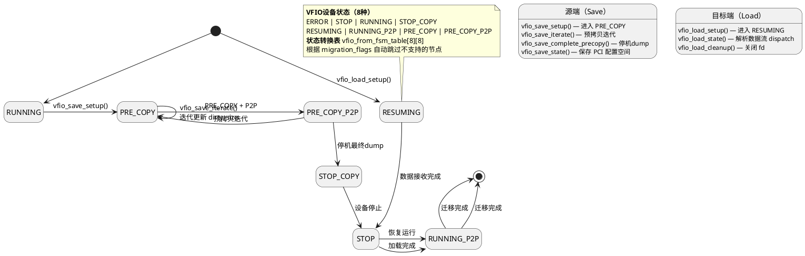

# 虚拟化：传统热迁移

热迁移（Live Migration）的本质是：在虚拟机运行过程中，将 VM 状态从源主机传输到目标主机，且中断时间可控。要做到这一点，必须先知道 VM 的哪些内存页在迁移周期内被修改过——这就是 **脏页跟踪（Dirty Page Tracking）**。

本文梳理两条独立的脏页跟踪路径：**CPU 侧**（KVM MMU）和 **设备侧**（VFIO/SMMU），以及它们如何共同跳过 MMIO BAR。

---

## 一、CPU 物理地址空间的构成

```
+----------------------+
| DRAM                 |  ← 普通内存，可缓存，可跟踪
+----------------------+
| PCI MMIO windows     |  ← 设备内存，不可缓存，不可跟踪
+----------------------+
| ACPI                 |  ← 设备内存，不可缓存
+----------------------+
| GIC/ITS              |  ← 设备内存，不可缓存
+----------------------+
```

物理地址空间大致分为两类：
- **Memory**（DRAM）：可缓存、有 writeback 语义、可参与 dirty tracking
- **Device**（MMIO、ACPI、GIC）：不可缓存、不可speculative、无 dirty 语义

## 二、传统热迁移的脏页跟踪机制

### 2.1 跟踪对象：Guest RAM Pages

热迁移中，跟踪的是 **guest RAM pages** 的变化。

 Dirty tracking 依赖 CPU 页表的硬件语义：
- **Writable PTE**：CPU 可写
- **Dirty Bit**：CPU 写操作后硬件自动置位
- **Writeback Cache**：写入后最终落盘

满足这些条件的内存才能被 dirty logging / writable fault 跟踪。

### 2.2 为什么 MMIO 不参与跟踪

MMIO 在 ARM64 对应 **DEVICE_nGnRE**，在 x86 对应 **UC/WC**。其页表属性决定了：

| 属性 | MMIO 的表现 | 对 dirty tracking 的影响 |
|------|-------------|------------------------|
| 不可缓存 | 写操作直接到设备 | 无 writeback，无法感知 "脏" |
| 不可 speculative | CPU 不会推测性访问 | 无 dirty bit 语义 |
| 无 side effect | 每次访问可能触发硬件行为 | 不能随意重复访问 |
| 不 coherent | 不参与缓存一致性协议 | 无法与其他 agent 协调 |

**结论**：MMIO BAR 的本质不是 "内存"，而是 "设备行为接口"（Device Transaction Interface）。它是 CPU 与 PCIe 设备之间的控制/数据交互窗口，不能当普通 RAM 使用。

## 三、VFIO 设备的热迁移

VFIO 直通设备涉及三类概念：

| 概念 | 由谁管理 | 在热迁移中的角色 |
|------|----------|-----------------|
| BAR mmap | MMU（stage-2） | 不能跟踪（页表属性决定） |
| DMA Buffer | SMMU/IOMMU | 跟踪 device DMA 写入 |
| PCI Config Space | PCI 总线 | 不跟踪 |

### vfio bar mmap区域

vfio bar mmap区域不应该热迁移中进行脏页跟踪，因为前一后换了一套设备，要重新建立mmap映射。

不跟踪的防护手段：qemu向kvm注册内存区域时，会通过KVM_SET_USER_MEMORY_REGION，里面有一个KVM_MEM_LOG_DIRTY_PAGES，普通ram会带上这个，从而阻止热迁移的脏页跟踪。而qemu根本不给这些页面加这个标签

```
1. VFIO BAR mmap 子区域创建
   memory_region_init_ram_device_ptr()          [memory.c:1674]
     → qemu_ram_alloc_from_ptr(size, ptr, mr)   [memory.c:1661]
       → qemu_ram_alloc_internal(..., RAM_PREALLOC)
         → new_block->flags = RAM_PREALLOC      [physmem.c:2537]
         → RAM_MIGRATABLE 未被设置！

   对比普通 RAM：
   memory_region_init_ram()
     → qemu_ram_alloc()
       → 后续 vmstate_register_ram()            [savevm.c:3516]
         → qemu_ram_set_migratable()             [savevm.c:3520]
         → RAM_MIGRATABLE ✓

2. KVM memslot 注册（VM 启动时）
   kvm_set_phys_mem()                           [kvm-all.c:1644]
     → memory_region_is_ram(mr) == true         ← ram_device 通过检查
     → 创建 KVM memslot（用于 guest 直接访问 MMIO）
     → 此时 dirty_log_mask = 0，未设 KVM_MEM_LOG_DIRTY_PAGES
     → 内核 dirty_bitmap = NULL

3. 迁移开始
   memory_global_dirty_log_start()
     → global_dirty_tracking = true
     → memory_region_transaction_commit()       ← 触发拓扑更新
       → kvm_set_phys_mem() 重新计算 memslot flags
         → kvm_mem_flags(mr)                    [kvm-all.c:785]

           memory_region_get_dirty_log_mask(mr)  [memory.c:1821]
             mask = mr->dirty_log_mask;         // = 0 (ram_device 的初始值)
             if (global_dirty_tracking &&
                 ((rb && qemu_ram_is_migratable(rb)) ||  ← false!
                  memory_region_is_iommu(mr)))           ← false!
                 mask |= (1 << DIRTY_MEMORY_MIGRATION);
             // mask 最终 = 0 → 不设置 KVM_MEM_LOG_DIRTY_PAGES!

   内核:
     if (!(new->flags & KVM_MEM_LOG_DIRTY_PAGES))
         new->dirty_bitmap = NULL;              ← 不分配，不跟踪

4. Guest 访问 MMIO BAR
   BAR memslot 没有 KVM_MEM_LOG_DIRTY_PAGES
   → 没有 write-protect
   → guest 直接访问，无 fault
   → 无脏页记录产生
```

总的来说，由于qemu对vfio bar进行mmap的时候，flags 不带 RAM_MIGRATABLE，导致热迁移中不会为它设置KVM_MEM_LOG_DIRTY_PAGES的flags，从而内核不会对它进行跟踪。

ACC 加速器设备完整的 VFIO BAR mmap流程如下：

```
  完整调用链 (从 QEMU 启动 ACC VFIO 设备开始)                                          
                                                                                       
  vfio_bars_register()                         [pci.c:1997]
    └→ vfio_bar_register()                     [pci.c:1970]                            
         └→ vfio_region_mmap(&bar->region)     [pci.c:1988]  ← 每个 BAR 都会调用       
                                                                                       
  进入条件 (vfio_region_mmap, region.c:360):                                           
  - region->mem != NULL ✓ — vfio_region_setup() 中已分配                               
  - region->nr_mmaps > 0 ✓ — 关键判定见下                                              
                                         
  nr_mmaps 如何产生 (vfio_region_setup(), region.c:231-268):                           
                                                                                       
  1. QEMU 向内核发起 VFIO_DEVICE_GET_REGION_INFO ioctl                                 
  2. ACC 驱动的 ioctl 对 BAR2 做了特殊处理 (hisi_acc_vfio_pci.c:1402-1412)：           
  info.flags = VFIO_REGION_INFO_FLAG_READ |                                            
               VFIO_REGION_INFO_FLAG_WRITE |                                           
               VFIO_REGION_INFO_FLAG_MMAP;   // ← 明确设置了 MMAP 标志                 
  2. 其他 BAR 走 vfio_pci_core_ioctl，也会根据 bar_mmap_supported 设置 MMAP。          
  3. QEMU 检查 !vbasedev->no_mmap && region->flags & VFIO_REGION_INFO_FLAG_MMAP → 通过 
  (no_mmap 默认 false, pci.c:3824)                                                     
  4. vfio_setup_region_sparse_mmaps() 尝试找 VFIO_REGION_INFO_CAP_SPARSE_MMAP → ACC    
  驱动没有实现 sparse mmap → 返回 -ENODEV                                              
  5. 回退到整区映射 (region.c:260-264):
  region->nr_mmaps = 1;          // ← 单个 mmap region                                 
  region->mmaps[0].offset = 0;                                                         
  region->mmaps[0].size = region->size;  // 等于 BAR 实际大小                          
                                                                                       
  mmap 子区域创建 (vfio_region_mmap(), region.c:407-441):                              
                                                                                       
  // 行 409-413: 从 VFIO 设备 fd 做实际 mmap                                           
  region->mmaps[i].mmap = mmap(map_align + offset, size, prot,                         
                                MAP_SHARED | MAP_FIXED, fd, ...); 
  // 行 427-430: 创建 ram_device MemoryRegion ← 你问的关键路径                         
  memory_region_init_ram_device_ptr(&region->mmaps[i].mem,                             
                                     memory_region_owner(region->mem),                 
                                     name, region->mmaps[i].size,                      
                                     region->mmaps[i].mmap);   // ptr = mmap 返回的地址
                                                                                       
  // 行 432: 将此子区域挂到父 MemoryRegion 下                                          
  memory_region_add_subregion(region->mem, region->mmaps[i].offset,                    
                               &region->mmaps[i].mem);                                 
                                                                                       
  memory_region_init_ram_device_ptr 内部 (memory.c:1674-1682):                         
                                                                                       
  → memory_region_init_io(mr, owner, &ram_device_mem_ops, mr, name, size);             
     mr->ram = true;                                                                   
     mr->ram_device = true;       // ← 标记为 RAM 设备类型                             
  → memory_region_set_ram_ptr(mr, size, ptr)   // memory.c:1656                        
      → qemu_ram_alloc_from_ptr(size, ptr, mr, &error_abort)  // physmem.c:2547        
         → qemu_ram_alloc_internal(size, size, NULL, host,                             
                                    RAM_PREALLOC, mr, errp)   // physmem.c:2460        
            → new_block->flags = RAM_PREALLOC;  // physmem.c:2537                      
            → // RAM_MIGRATABLE 未被设置！ 
```

### VFIO设备的内部状态

VFIO设备的内部状态，存在设备自己的硬件寄存器或内部RAM中，QEMU必须通过特殊的VFIO通道将其”抽取”出来，序列化后作为一段特殊的数据流传输。所以这些也不会被迁移。

VFIO在热迁移中，靠有限状态机来跟踪迁移状态

`include/uapi/linux/vfio.h:1238-1248` 定义了 8 种设备状态：

| 状态 | 含义 |
|------|------|
| **ERROR** | 错误状态 |
| **STOP** | 设备停止，不工作也不传输数据 |
| **RUNNING** | 设备正常运行 |
| **STOP_COPY** | 设备停止，正在传输最终状态数据 |
| **RESUMING** | 目标端正在恢复设备状态 |
| **RUNNING_P2P** | 运行中 + P2P（peer-to-peer） |
| **PRE_COPY** | 预拷贝阶段，设备运行中，可增量传输数据 |
| **PRE_COPY_P2P** | 预拷贝 + P2P |

内核维护一个静态的二维状态转换表 vfio_from_fsm_table[8][8]，定义每个 (当前状态,目标状态) 对的下一步骤。根据设备支持的 migration_flags（设备迁移能力位掩码：STOP_COPY / P2P / PRE_COPY），会自动跳过不支持的状态节点。

例如：STOP → RUNNING 会先经过 RUNNING_P2P（如果设备支持 P2P），让 QEMU 每次 ioctl 时逐步推进。

完整的迁移状态转换流程：



其中，内核侧的驱动的 mig_state 结构体以及迁移数据文件和kzalloc出来的数据，本质上是host侧的内核堆内存，属于 host kernel RAM，不会被“KVM guest dirty page tracking” 跟踪。他们的迁移是靠 VFIO 中 vendor migration callback进行打包，比如通过 vfio_pci_save_state()。

而QEMU侧整个VFIOMigration 整个结构体由 glib 堆分配，是本地缓存，也不会被跟踪。

总而言之，QEMU 用 memory_region_init_ram() 注册的才是 guest RAM，才可能被迁移和跟踪。不在 ram_list 链表中，KVM dirty log 根本看不到它们。

### 被设备驱动”钉住”（pinned）的内存页

cpu真实会访问到的页除了mmap的外，还有：被设备驱动“钉住”（pinned）的内存页。它们是设备与虚拟机内存进行数据交换的“窗口”和“契约”，其内容在迁移时必须被完整传输，以保证设备恢复后能找到正确的数据。比如**描述符环（Descriptor Ring）**

pre-copy-dirty-page-tracking=off 就是 QEMU 在预拷贝阶段对设备脏页的彻底封杀。表示预拷贝阶段完全不跟踪，只有停机后再一次性把这些东西迁移过去。

它的防护手段是，在qemu发起内存页进行ro防护时，qemu会自动过滤掉这些页，根本不会发给kvm。

```c
flowchart TD
    subgraph A[源端 VM 运行]
        A1_1[CPU: memcpy 搬发送数据] -->|写入 GVA| A_MMU[MMU 页表翻译: GVA到HPA]
        A1_2[CPU: 填描述符环] -->|写入 GVA| A_MMU
        
        A_MMU -->|写入| MEM1[物理内存: DMA Buffer与描述符环]

        A2_1[设备: DMA读描述符] -->|发起IOVA| A_SMMU[SMMU 页表翻译: IOVA到HPA且记账]
        A2_2[设备: DMA写收包数据] -->|发起IOVA| A_SMMU
        A2_3[设备: DMA写回描述符状态] -->|发起IOVA| A_SMMU
        
        A_SMMU -->|写入| MEM2[物理内存: DMA Buffer与描述符环]
        
        A1_2 -.->|描述符含IOVA供设备读| A2_1
        A1_2 -.->|敲门铃写BAR寄存器| A2_1
    end

    subgraph B[热迁移过程]
        A_MMU -->|写操作产生| M_MMU[CPU MMU 脏页位图]
        A_SMMU -->|DMA写操作产生| M_SMMU[SMMU 脏页位图]

        M_MMU --> BitOR[QEMU: 双位图按位OR合并]
        M_SMMU --> BitOR
        
        BitOR --> B1[轨道一: 内存脏页传输 - 描述符环与DMA Buffer]
        
        M_SMMU -.->|若无SMMU硬件支持| Fallback[退避策略: 所有Pin住的页面视为脏页]
        Fallback -.-> B1

        B2[轨道二: VFIO状态迁移 - 设备寄存器与上下文]
    end

    subgraph C[目的端 VM 恢复]
        B1 --> C1[内存数据就绪: 描述符环与缓冲区完整]
        B2 --> C2[设备状态就绪: 内部指针指向描述符环]
        
        C1 -.->|IOVA与数据匹配| C2
    end
```

### 3.1 VFIO 的 dirty tracking 路径

VFIO 跟踪的是 **device DMA 写入了哪些 guest RAM pages**，这些由 SMMU 管理，而非 MMU。

```
CPU                     Device (DMA)
   │                          │
   ▼                          ▼
Stage-2 MMU               SMMU/IOMMU
(user_mem_abort)    (vfio_iommu_type1 / device DMA logging)
   │                          │
   ▼                          ▼
跟踪 CPU 写入 GPA      跟踪 Device DMA 写入 IOVA
```

两条路径互相独立，各自覆盖各自的场景。

### 3.2 MMIO BAR 为什么不能被跟踪

MMIO BAR 的 VMA 类型是 `VM_PFNMAP`，其物理地址在 memblock 中是 "reserved"，不在 "memory" 中。这导致：

1. **QEMU 注册时不带 `KVM_MEM_LOG_DIRTY_PAGES` 标志** → dirty_bitmap 为 NULL
2. **`kvm_is_device_pfn()` 返回 true** → 即使触发 fault，也被标记为 device memory

---

## 四、KVM MMU 侧：MMIO BAR 如何跳过脏页跟踪

### 4.1 核心入口：user_mem_abort()

当 guest 第一次访问 MMIO BAR 触发 stage-2 fault 时进入（[arch/arm64/kvm/mmu.c:1476](arch/arm64/kvm/mmu.c#L1476)）。

### 4.2 两层判断决定是否跟踪

#### 第一层：logging_active — 脏页日志是否对该 memslot 启用

```c
bool logging_active = memslot_is_logging(memslot);
```

```c
static bool memslot_is_logging(struct kvm_memory_slot *memslot)
{
    return memslot->dirty_bitmap && !(memslot->flags & KVM_MEM_READONLY);
}
```

**关键事实**：QEMU 注册 MMIO BAR 为 KVM memslot 时，从来不带 `KVM_MEM_LOG_DIRTY_PAGES` 标志。因此：

- MMIO BAR 所在 memslot 的 `dirty_bitmap == NULL`
- `memslot_is_logging()` 返回 `false`
- `logging_active = false`

代码注释（mmu.c:1544-1547）明确写了：
```c
/*
 * logging_active is guaranteed to never be true for VM_PFNMAP
 * memslots.
 */
```

**结论**：脏页日志开启时，只有 RAM memslot 的 stage-2 PTE 会被 write-protect。MMIO BAR 的 stage-2 PTE 保持 writable，guest 写 MMIO 不会触发 permission fault。

#### 第二层：kvm_is_device_pfn() — PFN 是不是设备内存

即使 guest 第一次访问 MMIO BAR（初始 mapping fault），也会进入 `user_mem_abort()`：

```c
pfn = __gfn_to_pfn_memslot(memslot, gfn, false, false, NULL,
                           write_fault, &writable, NULL);
// ...
if (kvm_is_device_pfn(pfn)) {
    device = true;    // <--- 标记为设备内存
}
```

```c
static bool kvm_is_device_pfn(unsigned long pfn)
{
    return !pfn_is_map_memory(pfn);
}
```

`pfn_is_map_memory()` 问的是：这个物理地址在 memblock 里是不是 "memory"（普通 RAM）？MMIO BAR 的物理地址在 memblock 中是 "reserved"，不在 "memory" 里，所以返回 `false` → `kvm_is_device_pfn()` 返回 `true` → `device = true`。

### 4.3 device = true 触发的五种特殊处理

| 处理 | 代码位置 | 说明 |
|------|----------|------|
| 不设 DBM | mmu.c:1692 | 传统迁移和 HDBSS 都不会对 MMIO 做硬件脏页跟踪 |
| 设 Device 属性 | mmu.c:1698-1699 | MAIR 设为 Device nGnRE（非 Gathering、非 Reorder、Early Write Ack） |
| 禁止 THP | mmu.c:1657 | 永远按 base page 粒度映射 |
| 禁止执行 | mmu.c:1633 | MMIO 不可执行 |
| 禁止 MTE | mmu.c:1672 | 内存标签扩展不适用于设备内存 |

#### 1. 不设 DBM（Dirty Bit Management）

```c
if (!device && writable && kvm->arch.enable_hdbss && logging_active)
    prot |= KVM_PGTABLE_PROT_DBM;
```

`!device` 为 `false` → DBM 永远不会加到 MMIO 的 stage-2 PTE 上。

debug 检查：
```c
if (device && writable && kvm->arch.enable_hdbss && logging_active) {
    pr_info_ratelimited("KVM_HDBSS_DBG: BUG detected! "
        "DBM would be added to MMIO ...");
}
```

#### 2. 设置 Device 内存属性

```c
if (device)
    prot |= KVM_PGTABLE_PROT_DEVICE;
```

Stage-2 PTE 的 MAIR 字段被设为 **Device nGnRE**，而不是 Normal Cacheable。设备寄存器不能被 speculative access、不能合并、不能缓存。

#### 3. 禁止 THP

```c
if (vma_pagesize == PAGE_SIZE && !(force_pte || device)) {
    // THP adjustment
}
```

device memory 不参与 transparent hugepage 调整，永远按 base page 粒度映射。

#### 4. 禁止执行

```c
if (exec_fault && device)
    return -ENOEXEC;
```

#### 5. 禁止 MTE

```c
if (fault_status != ESR_ELx_FSC_PERM && !device && kvm_has_mte(kvm)) {
    // MTE handling
}
```

### 4.4 mark_page_dirty_in_slot() 是 no-op

代码在 mmu.c:1725-1728 无条件调用了：
```c
if (writable && !ret) {
    kvm_set_pfn_dirty(pfn);
    mark_page_dirty_in_slot(kvm, memslot, gfn);
}
```

但进入 `mark_page_dirty_in_slot()`（kvm_main.c:3450）：
```c
if (memslot && kvm_slot_dirty_track_enabled(memslot)) {
    // set_bit_le
}
```

`kvm_slot_dirty_track_enabled()`：
```c
static inline bool kvm_slot_dirty_track_enabled(const struct kvm_memory_slot *slot)
{
    return slot->flags & KVM_MEM_LOG_DIRTY_PAGES;
}
```

**MMIO BAR 的 memslot 没有 `KVM_MEM_LOG_DIRTY_PAGES` 标志** → 直接返回，set_bit_le 永远不会被执行。

这是一个**双重保险**：即使前面的 `logging_active` 和 `device` 检查都漏了，最终的 bitmap 写入也会被挡住。

---

## 五、完整代码链总结

```
Guest 第一次访问 MMIO BAR
  │
  ▼
user_mem_abort()                           [arch/arm64/kvm/mmu.c:1476]
  │
  ├─ logging_active = memslot_is_logging(memslot)
  │   └─ memslot->dirty_bitmap == NULL      [mmu.c:162]
  │       → logging_active = false          ← MMIO memslot 无 dirty_bitmap
  │
  ├─ pfn = __gfn_to_pfn_memslot()           [mmu.c:1604]
  │
  ├─ kvm_is_device_pfn(pfn)                 [mmu.c:1613]
  │   └─ !pfn_is_map_memory(pfn)            [mmu.c:187]
  │       └─ !memblock_is_map_memory()      ← MMIO 物理地址不在 memblock "memory" 中
  │           → device = true
  │
  ├─ 无 THP (device 阻止)                   [mmu.c:1657]
  ├─ 无 MTE (device 阻止)                   [mmu.c:1672]
  ├─ 无 DBM (device 阻止)                   [mmu.c:1692]
  ├─ 无 EXEC (device 阻止)                  [mmu.c:1633]
  ├─ prot |= KVM_PGTABLE_PROT_DEVICE        [mmu.c:1698]  ← Device nGnRE 属性
  │
  └─ mark_page_dirty_in_slot()              [mmu.c:1727]
      └─ kvm_slot_dirty_track_enabled()     [kvm_main.c:3450]
          └─ KVM_MEM_LOG_DIRTY_PAGES 未设置  ← MMIO memslot 无此标志
              → no-op

Guest 再次写 MMIO BAR（迁移脏页日志开启期间）
  │
  ▼
不触发任何 fault！
  └─ logging_active = false
      → stage-2 PTE 从未被 write-protect
      → 直接通过，无 dirty tracking
```

---

## 六、哪些页会被标成 DEVICE

**PCIe MMIO BAR**：
- ACC accelerator BAR
- GPU BAR
- NIC BAR
- NVMe BAR

来源：
```c
pci_iomap()
remap_pfn_range()
```

**PCI ECAM / Config Space**

ECAM window，例如 `0x40000000+`

**GIC/ITS 页**

```
GICD
GICR
ITS
```

---

## 七、对比：SMMU 路径 vs KVM MMU 路径

|                   | SMMU/IOMMU 路径                          | KVM MMU 路径                     |
|-------------------|------------------------------------------|----------------------------------|
| 跟踪对象          | Device DMA 写 IOVA                       | CPU 写 GPA                       |
| 谁写              | 设备                                     | Guest CPU                        |
| 跟踪什么          | DMA buffer（guest RAM）                   | 普通 RAM                         |
| 核心函数          | vfio_sync_dirty_bitmap()                 | user_mem_abort()                 |
| MMIO BAR 如何跳过 | vfio_listener_skipped_section()           | kvm_is_device_pfn() + logging_active=false |
| 关键标志          | !(is_iommuMapped && is_ram)              | memslot->dirty_bitmap == NULL    |

---

## 八、MMIO BAR 的本质总结

| 类别 | BAR中内容 | 典型用途 | 是否高频访问 | 是否适合 migration dirty tracking |
|------|-----------|----------|-------------|--------------------------------|
| 控制寄存器 | control/status register | 启停设备、reset、enable DMA | 低频 | 否 |
| Doorbell寄存器 | queue doorbell | 通知硬件有新任务 | 极高频 | 否 |
| Queue/Descriptor Window | SQ/CQ寄存器 | 提交/完成队列管理 | 高频 | 否 |
| ... | ... | ... | ... | ... |

MMIO BAR 不具有 normal memory semantics：
- 不能当普通 RAM 使用
- 不能 cache/writeback
- 可能有 side effect
- 可能触发硬件行为

在 `user_mem_abort` 中会被标志为 `device`，从而跳过所有脏页跟踪机制。

---

> 参考：[KVM同步脏页位图到Qemu](https://frankjkl.github.io/2019/04/07/QemuKVM-Qemu%E5%90%8C%E6%AD%A5KVM%E8%84%8F%E9%A1%B5%E4%BD%8D%E5%9B%BE/)