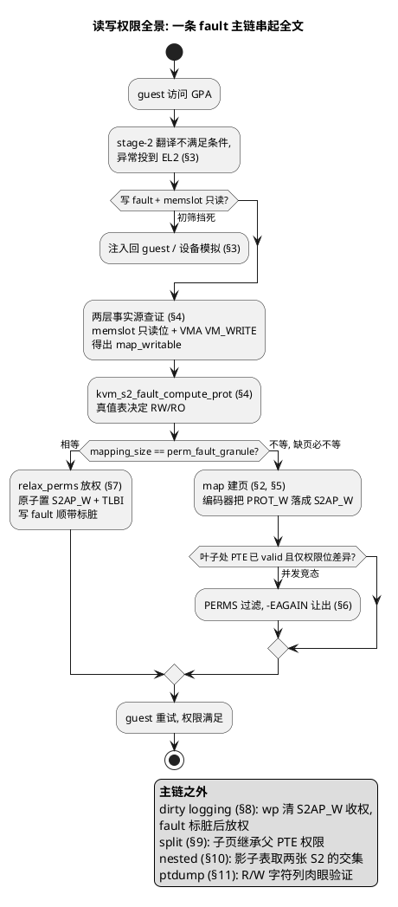
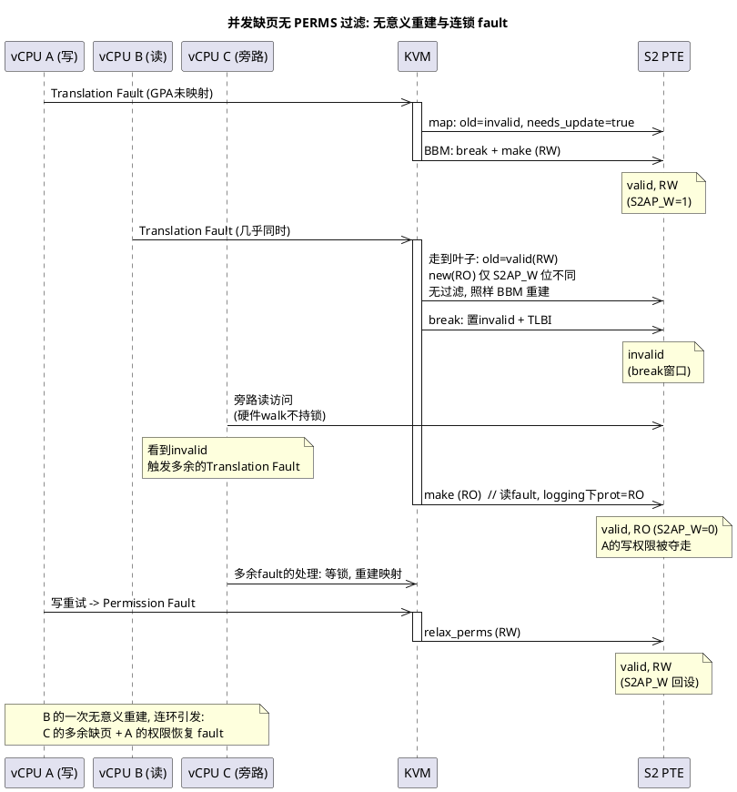
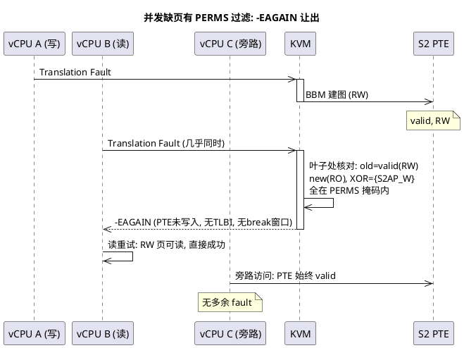
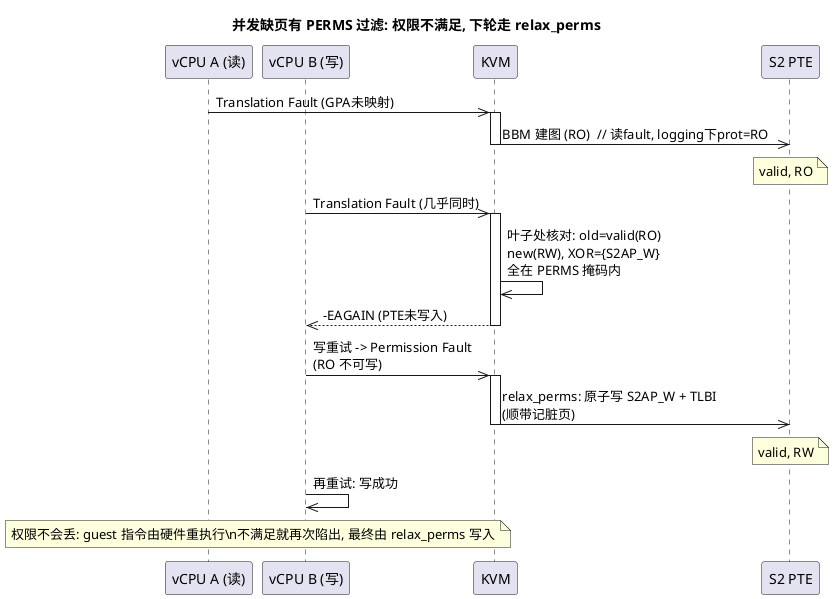

stage-2 页表（第二阶段翻译表）是 arm64 KVM 控制 guest 物理内存访问权限的唯一硬件来源。一次映射能不能被 guest 读、写、执行，全部由 stage-2 PTE（Page Table Entry，页表项）上的属性位决定。主线内核里这套权限体系分三层表示：

- **软件记录层 vma/memslot**：VMM 通过 ioctl 传给 KVM 的 memslot flags（`KVM_MEM_READONLY`、`KVM_MEM_LOG_DIRTY_PAGES`），加上宿主机进程的 VMA（Virtual Memory Area，虚拟内存区域）flags（`VM_WRITE`）。这是权限的事实源，建页权限全部从这两层现算
- **软件枚举层 prot**：`enum kvm_pgtable_prot`，KVM 内部传递权限的统一语言（`KVM_PGTABLE_PROT_R/W/X`）
- **硬件位层 PTE**：stage-2 PTE 上的 S2AP（Stage-2 Access Permission）、XN（eXecute Never）、AF（Access Flag）

三层之间的翻译经过两个函数：

- `stage2_set_prot_attr()` 把枚举**编码**成硬件位，供 make 时写到实际页表 PTE 中；
- `kvm_pgtable_stage2_pte_prot()` 把硬件位**解码**回枚举`enum kvm_pgtable_prot`。

全文围绕一条 fault 主链展开，下图是地图，每个环节标注了所在章节（代码取自主线，约 7.3-rc2）：



# 1. 权限位的两层表示：prot 枚举与 PTE 硬件位

先看硬件位层。stage-2 叶子描述符的属性位布局（4K 基页，非 LPA2）：

```
+----------+--------+-------+----------+---------------------+-----+-----+------+--------+---------+------+----+
| 63...59  |58...55 | 54:53 | 52...50  |   47 ........ 12    | 11  | 10  | 9:8  |  7:6   |   5:2   |  1   | 0  |
|   RESV   |   SW   |  XN   |   RESV   |  Output Addr (OA)   |resv | AF  |  SH  |  S2AP  | MemAttr | TYPE | V  |
+----------+--------+-------+----------+---------------------+-----+-----+------+--------+---------+------+----+
 \___ KVM_PTE_LEAF_ATTR_HI (63:50) ___/                       \___ KVM_PTE_LEAF_ATTR_LO (11:2) ___/
```

- **S2AP[1:0]（bits 7:6）**：**读写权限**。bit7 = S2AP_W（可写），bit6 = S2AP_R（可读），两位独立编码：
    - 架构允许只写映射（S2AP=0b10，**D8.4.2.1.1** Table D8-76，原文见附录A）。
    - 虽然架构允许，但 KVM 从不产出只写映射，因为 compute_prot 恒加 `KVM_PGTABLE_PROT_R`（必选项，第 4 节），W 才是可选项
- **XN[1:0]（bits 54:53）**：**执行权限**，两位联合编码四种执行粒度；基线架构只有 bit54 有效，FEAT_XNX 实现后四种组合才全部可用
- **AF（bit 10）**：**访问标志**，记录"这页被访问过没有"，是**页框回收**的判定依据之一
- **SW（bits 58:55）**：KVM 自留的软件位，不参与硬件翻译，pKVM 与 nested 各有用途（见第 9、10 节）

对应的软件枚举：

```c
/* linux/arch/arm64/include/asm/kvm_pgtable.h */
enum kvm_pgtable_prot {
  KVM_PGTABLE_PROT_W     = BIT(2),   /* 写 */
  KVM_PGTABLE_PROT_R     = BIT(3),   /* 读 */
  KVM_PGTABLE_PROT_SW0    = BIT(55), /* 软件位, 直通 PTE 的 SW 区 */
  ...                                 /* X/内存属性位, 与读写无关 */
};
```

从枚举位`prot`到 **PTE 位**的**flags->真实PTE属性位bit**的**忠实映射**，是编码器`stage2_set_prot_attr`来处理的（第 2 节）。

另外头文件里还有一个权限位掩码：

```c
/* linux/arch/arm64/include/asm/kvm_pgtable.h */
#define KVM_PTE_LEAF_ATTR_S2_PERMS  (KVM_PTE_LEAF_ATTR_LO_S2_S2AP_R | \
            KVM_PTE_LEAF_ATTR_LO_S2_S2AP_W | \
            KVM_PTE_LEAF_ATTR_HI_S2_XN)
```

`KVM_PTE_LEAF_ATTR_S2_PERMS` 圈出"纯权限位"的集合（S2AP_R、S2AP_W、XN）。它为**优化多核并发缺页产生的竞态问题而生**，是第 6 节的主角，此处先记住定义。

# 2. 编码器 stage2_set_prot_attr：从 prot 到 PTE 属性位

`stage2_set_prot_attr()` 是 stage-2 的编码器，一切新建映射的权限位都出自它：

```c
/* linux/arch/arm64/kvm/hyp/pgtable.c */
static int stage2_set_prot_attr(struct kvm_pgtable *pgt, enum kvm_pgtable_prot prot,
                                kvm_pte_t *ptep)
{
  // ... 内存属性三选一 (DEVICE/NORMAL/NC), XN 编码, SH, AF 恒置 ...

  /* 读写权限，枚举位逐个翻译成 S2AP */
  if (prot & KVM_PGTABLE_PROT_R)
    attr |= KVM_PTE_LEAF_ATTR_LO_S2_S2AP_R;
  if (prot & KVM_PGTABLE_PROT_W)
    attr |= KVM_PTE_LEAF_ATTR_LO_S2_S2AP_W;

  // ... AF 恒置, 软件位直通 ...
  *ptep = attr;
  return 0;
}
```

三件事值得注意：

- **AF 恒置**：每个新映射都带 AF=1，KVM 同时在 VTCR_EL2 开启硬件访问标志管理（HA 位），运行期由硬件自动维护。AF 唯一被清零的场景是宿主机页老化（mmu notifier 回调清位），清零后的首次访问触发 Access Flag Fault，由 `handle_access_fault()` 置回
- **SW 位直通**：`prot & KVM_PTE_LEAF_ATTR_HI_SW` 原样并入 PTE。nested 用这四位携带映射层级信息（第 10 节）
- **读写翻译是一对一的**：`PROT_R → S2AP_R`、`PROT_W → S2AP_W`，没有任何附加条件。可写性的全部决策都发生在上游的 prot 计算处（第 4 节），编码器**只做忠实翻译，不会胡乱修改**

从上面我们可知，编译器是服务于**建立PTE**的，所以我们只在**页表重建**时调用它。

编码器 `stage2_set_prot_attr` 只有两个调用方，恰好对应 prot 的两种来源：**现算与继承**：

```c
/* page fault 建立页表 */
user_mem_abort()                              /* [mmu.c] fault 建页: prot 现算 */
  +-> kvm_s2_fault_map()                      /* prot来源1：: compute_prot 现算 (第 4 节) */
    +-> kvm_pgtable_stage2_map()
      +-> stage2_set_prot_attr()              /* 编码: prot -> PTE 位, &map_data.attr */
      +-> kvm_pgtable_walk()
        +-> stage2_map_walker()               /* 回调, 按 visit 类型分发 (第 5 节) */
          +-> stage2_map_walker_try_leaf()
            +-> kvm_init_valid_leaf_pte()     /* phys + data->attr + level -> new PTE */

/* 拆大页 */
stage2_split_walker()                         /* [pgtable.c] eager split: prot 继承 */
  +-> kvm_pgtable_stage2_pte_prot()           /* 解码: 父 PTE -> prot（第 9 节） */
  +-> kvm_pgtable_stage2_create_unlinked()     /* prot来源2: 继承父 PTE 的 prot */
    +-> stage2_set_prot_attr()                /* 再编码: prot -> 子页 PTE 位, &map_data.attr */
```

- map 路径用于**缺页建立页表场景**，它的 prot 由 fault 处理**现算，来源是 memslot/VMA**（第 4 节）；
- split 路径用于**拆大页场景**，它的 **prot 从父 PTE 解码直接继承**，一解码一编码构成 round-trip（往返，第 9 节验证其无损性）。

prot 从哪里来、怎么算，是接下来三节的主线。

# 3. page fault 入口：guest 异常如何路由到 KVM

guest 访问一个 GPA（Guest Physical Address）时，若 MMU 硬件处理 stage-2 时不放行这次访问（映射不存在、权限不够、AF 未置），硬件会把异常 ESR 投到 EL2，KVM 根据路由表，从 `kvm_handle_guest_abort()` 接手处理异常。入口路由在 exit handler 表里，其中`ESR_ELx_EC_IABT_LOW`是`ESR`的`EC`域段：

```c
/* linux/arch/arm64/kvm/handle_exit.c */
[ESR_ELx_EC_IABT_LOW] = kvm_handle_guest_abort,   /* 指令预取中止 */
[ESR_ELx_EC_DABT_LOW] = kvm_handle_guest_abort,   /* 数据中止 */
```

`kvm_handle_guest_abort()` 主流程是一棵分诊树：

```c
kvm_handle_guest_abort()                   /* [mmu.c] */
  +-> esr_fsc_is_translation_fault()      /* IPA 超出上限? */
  |     +-> kvm_inject_size_fault()        /* 注回 guest */
  +-> kvm_walk_nested_s2()                  /* 嵌套虚拟化: 软件走 guest 自建 S2 (第 10 节) */
  |     +-> kvm_s2_handle_perm_fault()     /* 权限不足则注入回 L1 */
  +-> gfn_to_memslot()                      /* GPA 找 memslot */
  +-> gfn_to_hva_memslot_prot()            /* &writable, 初筛: hva 无效 或 写fault+memslot只读 */
  +-> kvm_inject_abt() / io_mem_abort()    /* 初筛未过: 注入回 guest / 设备模拟 */
  +-> esr_fsc_is_access_flag_fault()       /* AF fault？之前太久没被访问，内核扫描时把它置AF=0了，现在重新访问需要置回 1 */
  |     +-> handle_access_fault()          /* 置 young 恢复 AF 位, 返回 */
  +-> pkvm_mem_abort()                      /* protected VM (第 4 节) */
  +-> gmem_abort()                          /* guest_memfd (第 4 节) */
  +-> user_mem_abort()                      /* 普通用户内存, 本文主线 */
```

初筛由 `gfn_to_hva_memslot_prot()` 完成：把 GPA 换算成宿主机虚拟地址，同时报告 memslot 是否只读。结果有三种：

| 初筛结果 | 走向 |
|---|---|
| hva 无效（GPA 不在任何 memslot） | 注入回 guest，或转 `io_mem_abort()` 设备模拟 |
| 写 fault + memslot 只读 | 注入回 guest，**到不了建页路径** |
| 通过 | 进入 `user_mem_abort()` |

其中，KVM 关心的 fault 类型由 `ESR`（Exception Syndrome Register，异常综合征寄存器） 的 `FSC`（Fault Status Code）字段区分，白名单只有四类，不在名单内的 FSC 直接 `-EFAULT` 拒绝处理：

| FSC 编码 | fault 类型 | 含义 | 处理走向 |
|---|---|---|---|
| 0b0001xx | Translation Fault（缺页） | PTE 无效，映射不存在 | 建页（第 5 节） |
| 0b0010xx | Access Flag Fault | AF=0，访问标志未置 | 置 young 恢复 |
| 0b0011xx | Permission Fault（权限异常） | PTE 有效但权限不足 | 放权或注入（第 5、7 节） |
| 0b110101 | Excl. Atomic Fault | 不支持属性的原子访问 | 注入回 guest |

FSC 的低两位还编码了 fault 发生的页表层级（level 0-3），后面 `perm_fault_granule` 的计算要用它。并用`FSC`来判断**是不是写 fault**。

判断时看似只需读 WnR（Write not Read）位无脑确认是不是**写 fault**，但实际有个特判：

```c
/* linux/arch/arm64/include/asm/kvm_emulate.h */
static __always_inline bool kvm_is_write_fault(const struct kvm_vcpu *vcpu)
{
  if (kvm_vcpu_abt_iss1tw(vcpu)) {
    /* 1: S1PTW 置位表示异常发生在 guest stage-1 页表遍历期间。
       只有 Permission Fault 才算写: 此时是硬件在替 guest 更新
       stage-1 描述符的标志位（AF 等）被 stage-2 挡住 */
    return kvm_vcpu_trap_is_permission_fault(vcpu);
  }

  if (kvm_vcpu_trap_is_iabt(vcpu))
    return false;

  return kvm_vcpu_dabt_iswrite(vcpu);   /* 2: 常规情况看 WnR */
}
```

需要特判的根本原因是**页面回收**：guest 内核做页老化时，会把 stage-1 页表描述符的 AF 清 0。guest 开启硬件 AF/DBM 管理后，下一次 MMU 遍历发现 AF=0，**硬件直接对描述符发起一次隐式写**（目的是要把 AF 置 1），对 guest 完全无感。

这次隐式写同样要过 stage-2 翻译：若页表页在 stage-2 是只读（dirty logging 写保护、只读 memslot），就被拦下 fault 到 EL2，ESR 里 S1PTW=1。而 **WnR 记录的是 guest 原始指令的类型，不是硬件这次隐式写的类型**，guest 用 LDR（读指令）触发遍历，WnR 报"读"，但硬件实际在做的是"写 AF"。直接按 WnR 判，这次写拿不到 S2AP_W，硬件反复撞墙 fault，活锁。

解法是 S1PTW 置位时无视 WnR，改按 FSC 的 fault 类型裁决：

- **Permission Fault**：硬件在遍历中更新 AF/DBM 被 S2 权限挡住，视作写 fault，由 relax 给 S2AP_W 放行（第 7 节）
- **Translation Fault**：硬件只是在读描述符、映射还没建，视作读 fault，按缺页正常建页

S1PTW=0 时异常由 guest 指令直接访问数据触发，WnR 可信，即代码注释里的"常规情况看 WnR"。

# 4. 权限的事实源：memslot 与 VMA 两层

过了初筛，剩下的权限问题交给 `user_mem_abort()`。它做的第一件事是问：这块内存到底允不允许写？答案不在 PTE 里（PTE 还没建），而在两层软件记录里。由 `user_mem_abort()` 进行三步骤处理：

```c
user_mem_abort()
  +-> kvm_s2_fault_pin_pfn()        //步骤一：查证写权限
  +-> kvm_s2_fault_compute_prot()   //步骤二：将读写翻译成软件 prot 的 flags
  +-> kvm_s2_fault_map()            //步骤三：处理页表（如重建页表）
```

**1）步骤一**

在 `kvm_s2_fault_pin_pfn()` 中查证**写权限**：

```c
user_mem_abort()                         /* [mmu.c] */
  +-> kvm_s2_fault_pin_pfn()
    +-> kvm_s2_fault_get_vma_info()      /* VMA 尺寸/flags 快照 */
    +-> __kvm_faultin_pfn()              /* [kvm_main.c] slot, gfn, foll, &map_writable, &page */
      +-> kvm_follow_pfn()
        +-> memslot_is_readonly()        /* 第一层: memslot, slot */
        +-> hva_to_pfn()                 /* 第二层: HOST(QEMU) 的 VMA (GUP) */
          +-> hva_to_pfn_fast()          /*   写 fault 走 FOLL_WRITE 快路径 */
          +-> hva_to_pfn_slow()          /*   读 fault 在这里探测可写 */
```

两层各自把守一道门：

- **memslot 层**：VMM 注册内存区时如果传的是 `KVM_MEM_READONLY`，那么在 `kvm_follow_pfn()` 里会直接拒绝**写 fault**：

```c
/* Just the flags we need, copied from the kernel internals. */
#define FOLL_WRITE	0x01	/* check pte is writable */

/* linux/virt/kvm/kvm_main.c, kvm_follow_pfn() */
if (memslot_is_readonly(kfp->slot) && kfp->map_writable) {
  *kfp->map_writable = false;
  kfp->map_writable = NULL;     /* 后续 GUP 不再尝试可写 */
}
```

- **VMA 层**：宿主机进程 mmap 时的真实权限 `VM_WRITE`。KVM 不显式读这个 flag，而是通过 GUP（get_user_pages，内核抓页接口）返回的 `FOLL_WRITE` 来进行判断。
    - 其中，写 fault 的请求天然带 FOLL_WRITE，GUP 失败即无 VM_WRITE；
    - 读 fault 则不需要检查，因为 KVM 已经通过`get_user_pages`拿到了物理页了，证明**虚机 vmm 对这个 vma 是有访问权限的，Guest 可以放心读。**

```c
/* linux/virt/kvm/kvm_main.c, hva_to_pfn_slow() */
if (!(flags & FOLL_WRITE) && kfp->map_writable &&
    get_user_page_fast_only(kfp->hva, FOLL_WRITE, &wpage)) {
  put_page(page);
  page = wpage;                /* 换成同一个可写引用 */
  flags |= FOLL_WRITE;
}
out:
  *pfn = kvm_resolve_pfn(kfp, page, NULL, flags & FOLL_WRITE);
  /* kvm_resolve_pfn: *map_writable = writable, 探测结果落进出参 */
```

**两层都过，`map_writable` 才为真。它是**可写性的软件事实源**：后面的 prot 计算（本节下文）、relax 放权（第 7 节）全部以它为准，PTE 上的 S2AP_W 只是它的投影。**

上述是`kvm_handle_guest_abort`中普通内存的`user_mem_abort`**读写处理方式**，而`kvm_handle_guest_abort`中还有两条旁支路径，在这里也浅谈一下，后文不再展开：

- **pkvm_mem_abort()**：protected VM 的内存由 hypervisor 全权管理，`pin_user_pages(FOLL_WRITE)` 拿到页后直接以 `KVM_PGTABLE_PROT_RWX` 映射，不经过两层查证
- **gmem_abort()**：guest_memfd（CoCo 机密虚拟机的私有内存）路径，可写性只看 memslot 有没有 `KVM_MEM_READONLY`，权限异常同样走 relax 放权

**2）步骤二**

事实源在手，第二段 `kvm_s2_fault_compute_prot()` 把它翻译成 prot：

```c
user_mem_abort
  +-> kvm_s2_fault_compute_prot
  +-> kvm_s2_fault_map

/* linux/arch/arm64/kvm/mmu.c */
static int kvm_s2_fault_compute_prot(const struct kvm_s2_fault_desc *s2fd,
                                     const struct kvm_s2_fault_vma_info *s2vi,
                                     enum kvm_pgtable_prot *prot)
{
  *prot = KVM_PGTABLE_PROT_R;            /* 1: 恒可读 */

  /* 2: 可写的三个充分条件 */
  if (s2vi->map_writable && (s2vi->device ||
                             !memslot_is_logging(s2fd->memslot) ||
                             kvm_is_write_fault(s2fd->vcpu)))
    *prot |= KVM_PGTABLE_PROT_W;

  ...                                    /* 执行权限/内存属性编码, 与读写无关 */
}
```

条件 2 需要一张真值表。**前提是 `map_writable=1`**（两层门都过了，说明逻辑上是可写页），变的只是脏页跟踪是否介入。

dirty logging（脏页日志）是热迁移迭代期的脏页跟踪机制，memslot 开启 `KVM_MEM_LOG_DIRTY_PAGES` 后，**已建映射全部会写保护，新建映射的权限也有对应的跟踪策略**：

| 场景 | memslot logging | fault 类型 | W | 落表 |
|---|---|---|---|---|
| 普通内存 | 关 | 读/写 | 给 | RW |
| device 页 | 任意 | 读/写 | 给 | RW |
| 迁移迭代期 | 开 | 写 | 给 | RW，顺带记脏页 |
| 迁移迭代期 | 开 | 读 | **不给** | RO，读不标脏 |

由上述的表也可知，普通内存未开 logging 时 `!memslot_is_logging` 恒真短路，**读写 fault 算出的 prot 都是 RW，访问类型不参与计算**。

logging 例外：读 fault 故意建 RO，让未来的写还能 fault 出来被标脏；写 fault 则当场给 RW 并记脏，一步到位。`map_writable=0` 的页连 W 都没有，直接落 RO，不在表内。

**3）步骤三**

prot 现算完毕，第三段 `kvm_s2_fault_map()` 拿着它去动页表。怎么动，取决于下一节的分叉。

# 5. 建页路径：compute_prot 与 relax/map 分叉

`kvm_s2_fault_map()` 将要处理的有效 PTE 有两种状态：

- 页不存在（Translation Fault 建新页）
- 存在但权限不足（Permission Fault 要放权）。

两种状态的判据是**两个尺寸是否相等**：

```c
/* linux/arch/arm64/kvm/mmu.c, kvm_s2_fault_map() */

/* perm_fault_granule：硬件报告的故障粒度，如果是 perm fault or 映射尺寸改变的话是有值的 */
perm_fault_granule = (kvm_s2_fault_is_perm(s2fd) ?
                      kvm_vcpu_trap_get_perm_fault_granule(s2fd->vcpu) : 0);
/* mapping_size：KVM 期望的映射大小 */
mapping_size = s2vi->vma_pagesize;  
// ... THP 探测升级 / 权限 fault 粒度修正, 与权限计算无关 ...
if (mapping_size == perm_fault_granule) {
  /* 相等: 现有映射尺寸正合适, 只需放松权限, 原子更新 */
  ret = KVM_PGT_FN(kvm_pgtable_stage2_relax_perms)(pgt, gfn_to_gpa(gfn), prot, flags);
} else {
  /* 不等: 缺页(granule=0 必不等) 或映射尺寸要变, 走 map 重建 */
  ret = KVM_PGT_FN(kvm_pgtable_stage2_map)(pgt, gfn_to_gpa(gfn), mapping_size,
                                           __pfn_to_phys(pfn), prot, memcache, flags);
}
```

`perm_fault_granule`（权限 fault 粒度）从 FSC 的 level 字段算出：硬件报出"这次权限异常发生在第几级页表"，第 n 级对应粒度 `BIT(level_shift)`，正是现有映射的实际大小。缺页时它恒为 0，与任何 mapping_size 都不等，必走 map。两条路径的对比：

| | relax_perms 路径 | map 路径 |
|---|---|---|
| 何时进入 | Permission Fault 且两尺寸相等 | 缺页；或映射尺寸需变化 |
| PTE 状态 | valid，只需放松 | 无效，或需重建 |
| 动作 | 原子改权限位 + TLBI，无 BBM | 完整建页，除了 PERMS 过滤的情况外，都要 BBM |

map 路径的 walker 细节如下所示：

```c
user_mem_abort()
  +-> kvm_s2_fault_map()
    +->kvm_pgtable_stage2_map()                            /* [pgtable.c] */
      +-> stage2_set_prot_attr(prot)                    /* 编码（第 2 节） */
      +-> kvm_pgtable_walk()
        +-> stage2_map_walker()
          +-> TABLE_PRE: stage2_map_walk_table_pre()    /* 机会性把表收编成大块 */
          |     +-> stage2_map_walker_try_leaf()        /* 收编成功则 try_leaf + 释放旧表 */
          +-> LEAF: stage2_map_walk_leaf()
            +-> stage2_map_walker_try_leaf()            /* 正常路径: 叶子节点 */
            |     +-> stage2_leaf_mapping_allowed()?    /* 4K 请求装不进 2M block: -E2BIG */
            |     +-> kvm_init_valid_leaf_pte()        /* new = phys + attr + level */
            |     +-> stage2_pte_needs_update(old,new)? /* PERMS 权限位差异检查（第 6 节） */
            |     |     +-> false: return -EAGAIN       /* 跳过更新 */
            |     +-> stage2_try_break_pte()            /* BBM-break: 置 invalid + TLBI */
            |     +-> stage2_make_pte(new)              /* BBM-make: 写入新 PTE */
            +-> (-E2BIG) zalloc_page()                  /* 造新空表 */
              +-> stage2_try_break_pte()                /* BBM-break: block 失效 */
              +-> stage2_make_pte(表PTE)                /* BBM-make: block 换成表, 其余子页留待 fault */
```

最后一个容易忽略的细节（也是我们第 6 节要详细讲的内容）：

- map 路径在`stage2_pte_needs_update`中被`PERMS`过滤后返回 `-EAGAIN` 时（第 6 节的并发让出），`kvm_s2_fault_map()` 最后的 out 处理中会把它转成 0，fault 处理视为成功，vCPU 直接恢复运行。
- guest 指令由硬件重执行，权限够就继续跑，不够则再次 fault 出来，下一轮自然走 relax。

但在此之前必须回答一个问题：map 路径的叶子为什么会遇到**已建 PTE**而导致被**PERMS**过滤？缺页时 PTE 不是必然无效吗？答案是并发，这正是 PERMS 掩码存在的理由。

`mapping_size` 与 `perm_fault_granule` 相等的场景（relax 分支）第 7 节展开。

# 6. 并发缺页与 PERMS 过滤

**多个 vCPU 几乎同时访问同一个尚未建立映射的 GPA**，会全部触发 Translation Fault，各自进入 map 路径建页。先到者建好映射，后到者走到叶子时发现 PTE 已是 valid。

竞态的形态取决于是否开 logging（prot 怎么算见第 4 节真值表）：

- **未开 logging**：读写 fault 算出的 prot 都是 RW，old == new，后到者无过滤时会用 BBM 重建一模一样的映射，纯浪费（最常见形态）
- **开 logging**：prot 可能不同（写 fault RW、读 fault RO），仅权限位有差异，无过滤时权限被夺 + 恢复 fault + 连锁缺页（下图场景）
  - 写 fault: `kvm_s2_fault_compute_prot` 算出的 prot = RW, fault 处理中顺带记脏页
  - 读 fault: `kvm_s2_fault_compute_prot` 算出的 prot = RO, 保持写保护不走 relax, 让未来的写还能 fault 出来被标脏。

过滤逻辑由 commit "Filter out the case of only changing permissions from stage-2 map path" 引入。落到叶子上的差异检查：

```c
/* linux/arch/arm64/include/asm/kvm_pgtable.h */
#define KVM_PTE_LEAF_ATTR_S2_PERMS	(KVM_PTE_LEAF_ATTR_LO_S2_S2AP_R | \
 		KVM_PTE_LEAF_ATTR_LO_S2_S2AP_W | \
 		KVM_PTE_LEAF_ATTR_HI_S2_XN)

/* linux/arch/arm64/kvm/hyp/pgtable.c */
user_mem_abort                                 // [mmu.c]
  +-> kvm_s2_fault_map
    +-> if (mapping_size == perm_fault_granule)  // 期望映射大小 vs 硬件报告的权限故障粒度
    |     kvm_pgtable_stage2_relax_perms         // 相等: 仅放松权限, 原子更新 (见 relax_perms 路径)
    +-> else
          kvm_pgtable_stage2_map                 // 不等: 走 map 流程 (缺页/改变 block size)
            +-> stage2_map_walker_try_leaf       // [pgtable.c]
              +-> if (!stage2_pte_needs_update) return -EAGAIN;  // 叶子处核对: 完全相同或仅权限位差异 -> 让出
              +-> BBML;                          // 确有非权限位差异 -> 真重建
    +-> if (ret != -EAGAIN) return ret; else return 0; // -EAGAIN 转为 0, vCPU 恢复运行

stage2_pte_needs_update                         // [pgtable.c]
  +-> return ((old ^ new) & (~KVM_PTE_LEAF_ATTR_S2_PERMS));//差异检查: 过滤掉KVM_PTE_LEAF_ATTR_S2_PERMS的位，表示如果是PERMS位修改的话，不认为是old跟new不一致
```

落到调用方 `stage2_map_walker_try_leaf()` 中判断：`stage2_pte_needs_update()` 返回假，直接 `return -EAGAIN`。被让出后 guest 指令由硬件重执行：

- 已建权限满足访问：vCPU 直接跑下去，无事发生
- 权限仍不满足：指令再次陷出，下一轮走 relax_perms 放权（第 7 节）

没有过滤会怎样？以 A 写 fault 先到、B 读 fault 后到为例（logging 下 A 算出 prot=RW、B 算出 prot=RO，两次 make 要写进页表的权限位不同）：



后到者 B 若不过滤，会用 BBM 把 PTE 从 RW 重建为 RO。这次重建本身毫无意义（RW 页本来就满足读访问），代价却连环：

- **夺走先到者的写权限**：guest 下一次写触发 Permission Fault，等 relax 恢复
- **break 窗口伤及旁路**：break 把 PTE 置 invalid，到 make 写入前，任何 vCPU 访问该页都会触发本不该发生的缺页

有过滤后：



PTE 一位未动（new 只是局部变量），无 TLBI、无 break 窗口，B 的读重试直接成功。上图是已建权限满足访问的结局；反过来，A 读 fault 先到建 RO、B 写 fault 后到，XOR 同样落在掩码内被过滤，但 B 重试时 RO 不满足写，触发 Permission Fault，下一轮走 relax 恢复 RW：



**写权限不会被锁死**，因为放权的判断依据不是 PTE 而是 VMA/memslot：PTE 上的 S2AP_W=0 只说明"赢下建图的那次没带写"，不说明"写丢了"。fault 路径每轮都从事实源现算 prot（第 4 节），这是一切"写权限丢失"场景的最终兜底。

这一切只是性能优化而非正确性修复：BBM 保证时序正确，relax 对 R/W 只加不减，fault 绕几圈后总能收敛到满足所有访问的权限，不会死循环。commit message 里称无过滤时的现象为 useless small loops（无意义的小循环），PERMS 过滤省掉的就是这些循环里的 BBM/TLBI 和连锁 VM exit。

# 7. relax_perms：纯权限位的原子修改

Permission Fault 走到 relax 分支时（第 5 节的尺寸相等判定），`kvm_pgtable_stage2_relax_perms()` 只改权限位，不动输出地址：

```c
/* linux/arch/arm64/kvm/hyp/pgtable.c */
int kvm_pgtable_stage2_relax_perms(struct kvm_pgtable *pgt, u64 addr,
                                   enum kvm_pgtable_prot prot, enum kvm_pgtable_walk_flags flags)
{
  kvm_pte_t set = 0, clr = 0;
  s8 level;
  int ret;

  if (prot & KVM_PTE_LEAF_ATTR_HI_SW)
    return -EINVAL;                    /* 1: relax 不许夹带软件位 */

  if (prot & KVM_PGTABLE_PROT_R)
    set |= KVM_PTE_LEAF_ATTR_LO_S2_S2AP_R;
  if (prot & KVM_PGTABLE_PROT_W)
    set |= KVM_PTE_LEAF_ATTR_LO_S2_S2AP_W;   /* 2: W -> 置 S2AP_W */

  // ... 只有请求 X 时才动 XN 位 ...

  ret = stage2_update_leaf_attrs(pgt, addr, 1, set, clr, NULL, &level, flags);
  if (!ret || ret == -EAGAIN)
    kvm_call_hyp(__kvm_tlb_flush_vmid_ipa_nsh, ...);   /* 3: TLBI */
  return ret;
}
```

三个细节：

- **放权只加不减**：set 里的 S2AP_R/S2AP_W 只会被置上，不会被清掉。relax 的调用者全部是"放权"语义（fault 处理、gmem 权限异常），不存在收紧场景
- **XN 条件更新**：不请求 X 时 set/clr 完全不碰 XN 位。写 fault 引起的 relax 只该动 S2AP，顺带改执行权限会引入预期外的行为变化（"Only update XN attr when requested during S2 relaxation" 的主题）
- **SW 位拒绝**：nested 场景 prot 里携带的 SW 层级位（第 10 节）在这里被剥掉，PTE 里已有的 SW 位则原样保留

实际写入由 `stage2_attr_walker()` 完成：

```c
/* linux/arch/arm64/kvm/hyp/pgtable.c */
static int stage2_attr_walker(const struct kvm_pgtable_visit_ctx *ctx, ...)
{
  kvm_pte_t pte = ctx->old;
  struct stage2_attr_data *data = ctx->arg;
  ...
  data->pte = pte;                     /* 先存旧值 */
  pte &= ~data->attr_clr;              /* 清 clr 位 */
  pte |= data->attr_set;               /* 置 set 位 */

  if (data->pte != pte) {              /* 新旧有差异才写回 */
    // ... 加执行权限前先无效化 icache ...
    if (!stage2_try_set_pte(ctx, pte)) /* 共享遍历时 cmpxchg, 竞争失败 -> -EAGAIN */
      return -EAGAIN;
  }
  return 0;
}
```

**为什么 relax 敢不走 BBM？** ARM 架构规定（**D8.17.1**，原文见附录A），多线程共用页表时的修改分两类：

| 修改类型 | 必须 BBM？ | 原因 |
|---|---|---|
| 内存类型、OA、block size | 是 | TLB 可能同时持有新旧副本，行为不可预测 |
| 纯权限位放宽 | 否 | 新旧 PTE 指向同一块内存，不存在"翻译到不同内存、踩空、越界访问"的风险 |

所以 relax 一条 `pte = (old & ~clr) | set` 的原子更新就够。

更新之后仍需 TLBI（TLB 无效化）让新权限对后续访问可见，这是 **D8.17** 的要求（修改关联 VMID 的页表项后软件必须无效化对应 TLB 条目，原文见附录A）。

KVM 在 relax 成功后调用 `__kvm_tlb_flush_vmid_ipa_nsh`，并带上 level 作为 TTL hint（TLB 缓存层级提示，"Fix propagation of TLBI level in kvm_pgtable_stage2_relax_perms" 修复过它的传播）。

一般情况下，是在**热迁移脏页跟踪**的场景下会需要`relax perms`。我们前面说了，迁移完的页会执行`wrprotect`把原本**可写页->只读页**。当 guest 访问时，就会在`user_mem_abort`中给它`relax_perms`加上写权限，relax 返回后，`kvm_s2_fault_map` 最后会给这个页标脏，意味着下一轮迁移时需要把脏页迁走并重新`wrprotect`：

```c
/* linux/arch/arm64/kvm/mmu.c, kvm_s2_fault_map() */
if (writable && !ret) {
  phys_addr_t ipa = gfn_to_gpa(get_canonical_gfn(s2fd, s2vi));
  ipa &= ~(mapping_size - 1);
  mark_page_dirty_in_slot(kvm, s2fd->memslot, gpa_to_gfn(ipa));  /* 记入脏页位图 */
}
```

写 fault 的 relax（writable 为真）顺带把页记入 memslot 的脏页位图。整条链闭环：**写 fault → compute_prot 给 RW → relax 置 S2AP_W → 标脏 → TLBI → vCPU 恢复，写成功**。

放权的对偶面是收权。谁会把已建映射的 S2AP_W 清掉？dirty logging，下一节。

# 8. dirty logging 全周期：写保护、拆分与脏页记账

dirty logging 的目标是热迁移迭代期以 4K 粒度跟踪"哪些页被写过"。开启点在 VMM 调 `KVM_SET_USER_MEMORY_REGION` 传 `KVM_MEM_LOG_DIRTY_PAGES`，落到 `kvm_arch_commit_memory_region()`：

```c
/* linux/arch/arm64/kvm/mmu.c */
if (log_dirty_pages) {
  if (change == KVM_MR_DELETE)
    return;
  if (kvm_dirty_log_manual_protect_and_init_set(kvm))
    return;                          /* 手动模式: 分批交给 CLEAR ioctl */
  kvm_mmu_wp_memory_region(kvm, new->id);    /* 一步到位: 先写保护 */
  kvm_mmu_split_memory_region(kvm, new->id); /* 再拆大页 */
}
```

两种模式：

第一种：initially-all-set（脏位图初始全 1，逐批 CLEAR 时逐批写保护）适合大内存 VM 分摊停顿。

第二种：一步到位模式则开启当下全量处理。无论哪种，落到页表上的动作序列相同，先是写保护`kvm_pgtable_stage2_wrprotect`：

```c
kvm_arch_commit_memory_region()               /* [mmu.c] */
  +-> kvm_mmu_wp_memory_region()
    +-> kvm_stage2_wp_range()                /* 区间循环 + 中途可重调度 */
      +-> kvm_pgtable_stage2_wrprotect()     /* [pgtable.c] 写保护 */
        +-> stage2_update_leaf_attrs()      /* attr_clr=S2AP_W, IGNORE_EAGAIN */
          +-> stage2_attr_walker()           /* pte &= ~S2AP_W (原子) */
    +-> kvm_nested_s2_wp()                   /* 嵌套场景一并处理 */
    +-> kvm_flush_remote_tlbs_memslot()      /* 整槽 TLBI */

kvm_arch_mmu_enable_log_dirty_pt_masked()    /* [mmu.c] CLEAR ioctl 分批路径 */
  +-> kvm_stage2_wp_range()                  /* 同一个 wp */
  +-> kvm_mmu_split_huge_pages()             /* manual-protect 时顺手拆 */
```

`kvm_pgtable_stage2_wrprotect()` 复用 `stage2_update_leaf_attrs()`，只是这次 clr 位里放的是 S2AP_W。**page 和 block** 均统一清 S2AP_W，没有按 level 分化的逻辑。清完之后：

- **page（4K）**：RO。写 fault 出来 → 标脏 + relax 恢复 RW（第 7 节闭环），4K 粒度正合跟踪需求
- **block（2M）**：RO。若不拆，每次写都是 2M 粒度的整块恢复，跟踪粒度被放大 512 倍，而且跟标脏的粒度不一致（4KB），所以必然会丢脏页（不拆的话只能跟踪到第一个 4KB 脏页），所以必须拆

拆分大页有 eager 与 lazy 两条：

- **eager split**：VMM 显式开启（`KVM_CAP_ARM_EAGER_SPLIT_CHUNK_SIZE`，默认 0 关闭），开启时 `kvm_mmu_split_memory_region()` 分批把 block 全部拆完。走的正是第 2 节调用树里的 split 路径：`stage2_split_walker` 解码父 PTE 得到 prot，`kvm_pgtable_stage2_create_unlinked(prot)` 再编码铺满子表，BBM 换上
  - **子页权限完全继承父 PTE，不查 VMA/memslot**
  ```c
  kvm_arch_commit_memory_region()
    +-> kvm_mmu_wp_memory_region(kvm, new->id);    /* 一步到位: 先写保护 */
    +-> kvm_mmu_split_memory_region(kvm, new->id); /* 再拆大页 */
  ```
- **lazy split**：guest 真实写到 block 时触发。logging 下 `kvm_s2_resolve_vma_size()` 强制 `max_map_size = PAGE_SIZE`，写 fault 的 mapping_size(4K) 不等于 perm_fault_granule(2M)（第 5 节分叉），于是走 map 路径。map walker 里 try_leaf 返回 -E2BIG，造新空表替换 block：fault 页当次落位，其余子页留 invalid 等各自的 fault
  - **子页 prot 由本次 fault 现算**（写 fault 给 RW + 标脏）
  ```c
  user_mem_abort()                             /* [mmu.c] 写 fault 落在 2M RO block 上 */
    +-> kvm_s2_fault_map()
      +-> kvm_pgtable_stage2_map()             /* mapping_size(4K) != granule(2M): 走 map (第 5 节分叉) */
      |  +-> stage2_map_walker()                /* LEAF 回调 */
      |    +-> stage2_map_walker_try_leaf()     /* 4K 请求装不进 2M block: -E2BIG */
      |    +-> zalloc_page(memcache)            /* 造新空表 */
      |    +-> stage2_try_break_pte()           /* BBM-break: block 失效 */
      |    +-> stage2_make_pte(表PTE)           /* BBM-make: 拆大页，block 换成新表 */
      |    /* walk 框架重读 PTE 下降进新表: fault 页当次以 RW 落位, 其余子页留 invalid */
      +-> mark_page_dirty_in_slot()            /* writable && !ret: 顺带记脏页 */
  ```
  - 其余子页各自的 fault 建页；读 fault 建的 RO 子页再被写时，走 relax 放权：
  ```c
  user_mem_abort()                             /* [mmu.c] Permission Fault, mapping_size == granule(4K) */
    +-> kvm_s2_fault_map()
      +-> kvm_pgtable_stage2_relax_perms()     /* 尺寸相等: 原子放权 (第 7 节) */
        +-> stage2_update_leaf_attrs()         /* set |= S2AP_W */
          +-> stage2_attr_walker()             /* 原子置位, 无 BBM */
      +-> mark_page_dirty_in_slot()            /* 顺带记脏页 */
  ```

一个自然的问题：wp 已经把 block 清成 RO，写 fault 现算 prot 会不会也拿不到 W？不会。compute_prot 的 W 条件（第 4 节真值表）读的是 `map_writable`（VMA/memslot 事实源），logging 下写 fault 恒给 W。**写保护只改 PTE 硬件位，不碰软件记录**，这正是 fault 能恢复权限的原因，也是第 6 节"不丢写"论证的同一逻辑。

全周期时间线：

```
迁移开始: 
  VMM 传 KVM_MEM_LOG_DIRTY_PAGES
    -> kvm_arch_commit_memory_region
    -> wp: 全部映射清 S2AP_W (page/block 一律 RO)
    -> eager split (可选) / 留给 lazy
迭代期: 
  读 fault 新建页 -> prot=RO (真值表: logging+读fault 不给 W)
  写 4K RO page -> Permission Fault -> 标脏 + relax RW
  写 2M RO block -> map 路径 -> lazy split -> 4K 子页 RW + 标脏
  VMM 周期性读脏页位图, 按批 CLEAR (再 wp 已恢复的页)
迁移结束: 去 LOG_DIRTY_PAGES flag, 停止跟踪
```

迭代期的循环是 wp 与 fault 的拉锯：wp 收权制造 fault 机会，fault 标脏后放权，CLEAR 再收权。这套机制的全部收支都记在脏页位图上，VMM 读走后用于增量拷贝。

# 9. 解码器 kvm_pgtable_stage2_pte_prot 与调用点

编码的反方向是解码：软件拿到一个已建 PTE，读回它的权限。（一般拆大页我们就需要读原始 block 的权限作为新 4K 页的权限），`kvm_pgtable_stage2_pte_prot()` 是编码器的严格逆运算，不改写页表：

```c
/* linux/arch/arm64/kvm/hyp/pgtable.c */
enum kvm_pgtable_prot kvm_pgtable_stage2_pte_prot(kvm_pte_t pte)
{
  enum kvm_pgtable_prot prot = pte & KVM_PTE_LEAF_ATTR_HI_SW;  /* 1: SW 位透传 */

  if (!kvm_pte_valid(pte))
    return prot;                                /* 2: 无效 PTE 只带 SW 位 */

  if (pte & KVM_PTE_LEAF_ATTR_LO_S2_S2AP_R)
    prot |= KVM_PGTABLE_PROT_R;
  if (pte & KVM_PTE_LEAF_ATTR_LO_S2_S2AP_W)
    prot |= KVM_PGTABLE_PROT_W;                 /* 3: W 从 S2AP_W 读回 */

  // ... XN 两位解码回执行权限 ...
  return prot;
}
```

解码器 kvm_pgtable_stage2_pte_prot 的调用点按消费的位分三种：

```c
stage2_map_walker_try_leaf() / stage2_attr_walker()  /* [pgtable.c] 执行族: 只取 X 位, icache 判断用 */
  +-> stage2_pte_executable(new)
    +-> kvm_pgtable_stage2_pte_prot(pte)
stage2_split_walker()                              /* [pgtable.c] split 族: 唯一消费 W 位 */
  +-> kvm_pgtable_stage2_pte_prot()                /* 解码: 父 PTE -> prot（第 2 节调用树） */
pkvm: guest_get_page_state() 等                    /* [mem_protect.c] pKVM 族: 只取 SW 状态位(页归属) */
  +-> pkvm_getstate(kvm_pgtable_stage2_pte_prot(pte))
```

主线是两态世界（RW/RO），编码器产出什么解码器就读回什么，不丢权限。**唯一的"降级"来自 wp 在拆分前先清了 S2AP_W（第 8 节），但那是拿到`kvm_pgtable_stage2_pte_prot`返回值之后的收权动作，不是解码损失。**

# 10. nested：影子 stage-2 的权限

嵌套虚拟化（L0 上跑 L1，L1 里再跑 L2）时，L2 的内存翻译要过两张 stage-2：L1 为 L2 建的 S2，加上 L0 为 L1 建的 S2。KVM 的做法是软件遍历 guest 自建的页表，把两张表的翻译合成一张**影子 stage-2**（shadow stage-2），权限取两者的交集。

入口在第 3 节分诊树里：`kvm_walk_nested_s2()` 软件模拟硬件 walk，走 L1 给 L2 建的表，把 guest S2 描述符的 S2AP 读进 `out->readable/writable`：

```c
/* linux/arch/arm64/kvm/nested.c, walk_nested_s2_pgd() 尾部 */
out->readable  = desc & KVM_PTE_LEAF_ATTR_LO_S2_S2AP_R;
out->writable  = desc & KVM_PTE_LEAF_ATTR_LO_S2_S2AP_W;
```

guest 表说"不可写"时，L2 的写 fault 应该注回 L1 处理（L1 可能正等着给 L2 做 demand paging（按需分页）），L0 不越俎代庖：

```c
/* linux/arch/arm64/kvm/nested.c, kvm_s2_handle_perm_fault() */
write_fault = kvm_is_write_fault(vcpu);
forward_fault = ((write_fault && !trans->writable) ||
                 (!write_fault && !trans->readable));   /* 真: 注回 L1 */
```

guest 表放行的访问，才允许继续建影子映射，但权限要收窄到两张表的交集（L0 自己的 S2 也要允许）：

```c
/* linux/arch/arm64/kvm/mmu.c */
static enum kvm_pgtable_prot adjust_nested_fault_perms(struct kvm_s2_trans *nested,
                                                       enum kvm_pgtable_prot prot)
{
  if (!kvm_s2_trans_writable(nested))
    prot &= ~KVM_PGTABLE_PROT_W;                    /* guest 表不可写: 影子摘掉 W */
  if (!kvm_s2_trans_readable(nested))
    prot &= ~KVM_PGTABLE_PROT_R;
  return prot | kvm_encode_nested_level(nested);    /* SW 位编码映射层级 */
}
```

`kvm_encode_nested_level()` 把 guest 翻译的 level 写进 prot 的 SW0/SW1 两位（`KVM_NV_GUEST_MAP_SZ`），随编码器直通进 PTE 的 SW 区，供 TLBI 时反查这条映射对应 guest 表的哪一级。这也解释了第 7 节 relax 的 SW 位拒绝：relax 换入的 prot 若夹带 SW 位会污染 PTE 里已有的层级记录。

写保护同样覆盖影子表（第 8 节树里的 `kvm_nested_s2_wp()`），dirty logging 对 L2 一样成立。

# 11. ptdump：肉眼读权限

调试时想看一个 VM 的 stage-2 权限实况，ptdump（debugfs 的页表转储工具）把位翻译成字符列：

```c
/* linux/arch/arm64/kvm/ptdump.c */
static const struct ptdump_prot_bits stage2_pte_bits[] = {
  { .mask = KVM_PTE_LEAF_ATTR_LO_S2_S2AP_R, .set = "R", .clear = " " },
  { .mask = KVM_PTE_LEAF_ATTR_LO_S2_S2AP_W, .set = "W", .clear = " " },
  ...
};
```

dump 出一行映射，扫一眼就能对上全文分析：RW 是普通可写页，R 是写保护或只读槽。

# 附录A: ARM规则索引

**ARM DDI 0487 D8.17** — 页表项修改后的 TLB 无效化义务

> When a translation table entry associated with a specific VMID or ASID is modified, software is required to invalidate the corresponding TLB entry to ensure that the modified translation table entry is visible to subsequent execution, including speculative execution.
>
> 中文: 关联特定 VMID 或 ASID 的页表项被修改后, 软件必须无效化对应 TLB 条目, 确保修改后的页表项对后续执行（包括投机执行）可见。

**ARM DDI 0487 D8.17.1** — 不遵守 BBM 的后果

> If translation table entries are changed without appropriate TLB maintenance operations, including in the case where use of the break-before-make sequence is required but software does not follow the break-before-make sequence, it is possible that TLBs concurrently hold multiple different copies of those translation table entries. In this situation, the following behaviors are permitted for a speculative or architectural access to the address resolved by those TLB entries:
>
> - Use of the address matches multiple entries in a TLB, and a TLB conflict abort is detected. In this case, no access is made to memory based on those TLB entries. If the access is architectural, then the TLB conflict abort is reported as an exception.
> - The resulting behavior is CONSTRAINED UNPREDICTABLE, and gives a behavior consistent with translation using one of the matching entries, or an amalgamation of more than one of the matching entries, but cannot permit access to memory regions with permissions or attributes that would not be possible in the current Security state at the current Exception level.
>
> 中文: 页表项在缺少适当 TLB 维护（含要求 BBM 而未走 BBM）的情况下被修改时, TLB 可能同时持有多个不同副本。此时对相应地址的投机或架构访问允许的行为: (1) 命中多条 TLB 条目, 检测出 TLB conflict abort（架构访问则报告为异常, 不访问内存）; (2) 行为 CONSTRAINED UNPREDICTABLE，翻译结果与使用某一条或若干条的混合一致, 但不得访问超出当前 Security state 与 Exception level 下本不可能的权限或属性的内存区域。

**ARM DDI 0487 D8.4.2.1.1** — stage-2 S2AP 数据访问权限编码（Table D8-76）

> The following table shows encoding of the S2AP descriptor field: S2AP[1:0] = 00, No data access; 01, RO; 10, WO; 11, RW. If an attempt is made to access memory that is not permitted by the value of the S2AP field, then a stage 2 Permission fault is generated.
>
> 中文: S2AP 描述符字段的编码为：00 = 无数据访问，01 = 只读，10 = 只写，11 = 读写。若访问不为 S2AP 字段值所允许，则产生 stage-2 Permiss