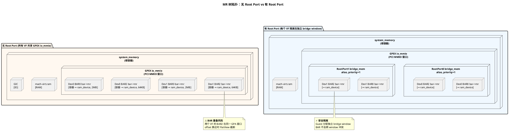
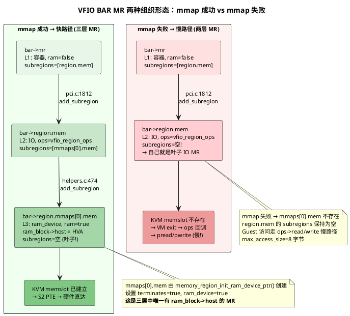
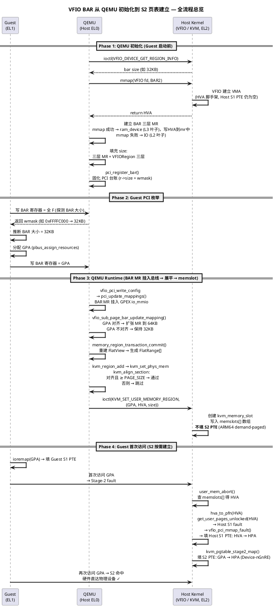
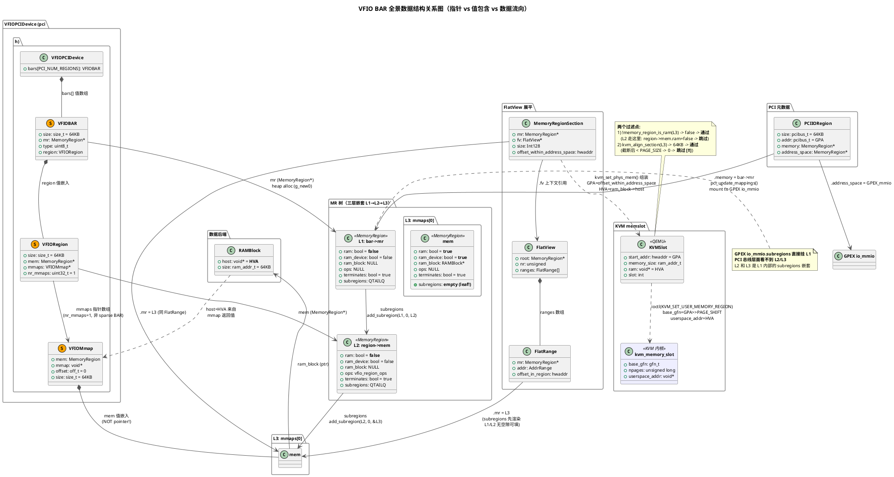
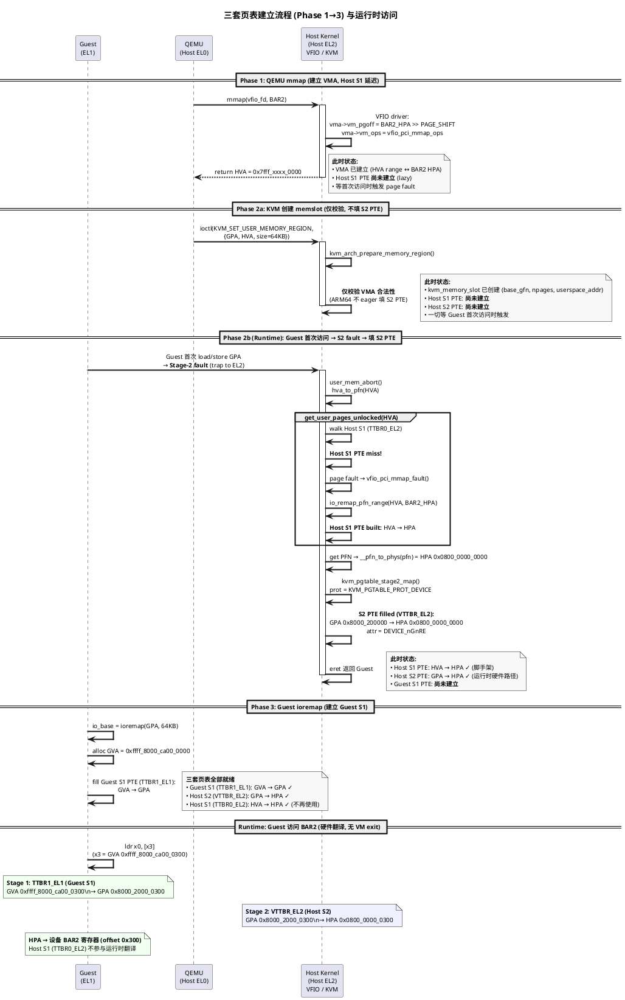

# 0. 本文定位

VFIO 设备直通让虚拟机直接访问物理 PCI 设备，绕过 QEMU 的软件模拟以获得接近原生的 I/O 性能。但"直接访问"四个字的背后，是 QEMU、KVM、Host 内核三套系统协同维护的复杂映射关系——Guest 看到的只是一个 PCI BAR 地址，这个地址要经过两层页表翻译才能到达物理设备。

本文是这个分析系列的**第一篇：基础参考文章**。定位是只讲正常链路——把 QEMU 和 KVM 各自维护的数据结构、它们之间的关联方式、以及从 BAR mmap 到 S2 页表建立的完整流程梳理清楚。内容包括：

- 四种地址空间（GVA/GPA/HVA/HPA）的定义与区别
- 三套页表（Guest S1、Host S1、Host S2）的协作关系与时序
- QEMU 的 MemoryRegion 树与 VFIO BAR 的三层 MR 嵌套结构
- FlatView 展平机制与 KVM memslot 注册流程
- 各数据结构的 size 字段在正常场景下的取值

**本文不涉及** BAR 空间重叠的异常场景分析——那是下一篇的内容。如果你是从问题文章索引过来的，可以直接跳到相关章节查阅数据结构定义或流程步骤。

代码引用来自 openEuler QEMU（`openeuler_qemu`）和 openEuler Kernel（`openeuler/kernel`），已逐一对照源码验证。

# 1. 四种地址空间

VFIO PCI 直通场景涉及四种地址，分属 Guest、QEMU、Host 内核三个主体管理。理解它们的区别是后续所有分析的前提。

| 地址 | 全称 | 谁分配 | 存在哪里 | 示例 |
|------|------|--------|----------|------|
| GVA | Guest Virtual Address | Guest 内核 (ioremap) | Guest S1 页表 PTE | `0xffff_8000_ca00_0300` |
| GPA | Guest Physical Address | QEMU 命令行(窗口基址) + Guest PCI 枚举(BAR 偏移) | BAR 配置寄存器、S2 PTE | `0x8000_2000_0300` |
| HVA | Host Virtual Address | Host 内核 (mmap 返回值) | QEMU `ram_block->host` | `0x7fff_a000_0300` |
| HPA | Host Physical Address | Host BIOS/PCI 枚举 | S2 PTE 的目标字段 | `0x0800_0000_0300` |

以 Guest 驱动访问设备 BAR2 内偏移 `0x300` 的寄存器为例，一条简单的 `ldr` 指令需要经过两次页表翻译：

```
Guest 指令: ldr x0, [x3]        (x3 = io_base + 0x300)

  GVA 0xffff_8000_ca00_0300
    ↓ Guest S1 (TTBR1_EL1)        ← Guest OS 管理
  GPA 0x8000_2000_0300
    ↓ Host S2 (VTTBR_EL2)         ← KVM 管理
  HPA 0x0800_0000_0300
    ↓ 物理总线
  设备寄存器
```

四种地址的高位含义各自独立，**互相之间没有数值上的映射关系**：

- GVA 的高位来自 Guest 内核的 vmalloc 区
- GPA 的高位来自 QEMU 分配的 Guest 物理地址空间布局
- HVA 的高位来自 Host 进程的 mmap 区域
- HPA 的高位来自 Host 的物理内存布局
- 唯一不变的是**低 16 位**（64KB 页内偏移），在四层翻译中保持一致

# 2. 三套页表

VFIO 直通场景涉及三套页表，VHE 模式下 Host 运行在 EL2，Guest 运行在 EL1。

| 寄存器 | 翻译 | 管理者 | 角色 |
|--------|------|--------|------|
| TTBR1_EL1 | GVA → GPA | Guest OS | Guest 自己的页表 |
| TTBR0_EL2 | HVA → HPA | Host 内核 | KVM 解析 HPA 时的"脚手架" |
| VTTBR_EL2 | GPA → HPA | KVM | 硬件 Stage-2 翻译 |

## 2.1 关键认知：ARM64 S2 是 Demand-paged

`ioctl(KVM_SET_USER_MEMORY_REGION)` 创建 memslot 时，KVM **仅校验 HVA/VMA 合法性，不填 S2 PTE**。真正的 S2 PTE 在 Guest 首次访问 GPA 时，由 Stage-2 fault handler 按需建立。

## 2.2 Runtime 翻译路径

Guest 访问设备时硬件走两阶段翻译，**Host S1 不参与运行时翻译**：

- **Stage 1** (TTBR1_EL1)：GVA → GPA，由 Guest OS 的 ioremap 建立
- **Stage 2** (VTTBR_EL2)：GPA → HPA，由 KVM 管理（demand-paged）

Host S1 (TTBR0_EL2) 唯一被用到的时刻：KVM 处理 Stage-2 fault 需要解析 HPA 时，通过 `get_user_pages_unlocked(HVA)` 沿 Host S1 查到物理页帧号。（即，只在建立S2页表的时候有用）

## 2.3 页表建立时序

三套页表的建立有严格的先后顺序：

- **Phase 1**：QEMU `mmap(VFIO fd)` → Host 建立 VMA，Host S1 PTE 仍为空（lazy）
- **Phase 2**：QEMU `ioctl(KVM_SET_USER_MEMORY_REGION)` → KVM 利用Host VMA 创建 memslot，仅校验，不填 S2 页表，S2 页表等fault的时候按需建立。
- **Phase 3**：Guest 内 `ioremap(GPA)` → 填 Guest S1 PTE
- **Runtime**：Guest 首次访问 GPA → Stage-2 fault：
  1. `user_mem_abort()` 查 memslot 得 HVA
  2. `get_user_pages_unlocked(HVA)` → Host S1 page fault → `vfio_pci_mmap_fault()` 填 Host S1 PTE
  3. `kvm_pgtable_stage2_map()` 填 S2 PTE（属性 `DEVICE_nGnRE`）

详细时序见[附录 A](#附录-a三套页表建立流程与运行时关系)。

# 3. QEMU 侧：MemoryRegion 树

从本节开始，我们自顶向下梳理 QEMU 进程中维护的数据结构。QEMU 使用一棵 **MemoryRegion 树**（以下简称 MR 树）来描述 Guest 的整个物理地址空间。

**MR 树拓扑对比：**



## 3.1 MR 的三种类型

每个 `MemoryRegion` 描述 GPA 空间中的一段区域，核心字段如下（`include/exec/memory.h`）：

```c
struct MemoryRegion {
    char *name;                 // "mach-virt.ram", "0000:00:01.0 base BAR 4"
    hwaddr addr;                // 在父 MR 内的偏移 (GPA = 父 MR 基址 + addr)
    Int128 size;                // 区域大小 (被 sub_page_bar 修改的就是这个字段)
    bool ram;                   // QEMU 可分配后端内存
    bool ram_device;            // VFIO mmap 的 BAR 空间
    int32_t priority;           // 在父 MR 的 subregions 链表中的排序权重
    QTAILQ_HEAD(, MemoryRegion) subregions;  // 子 MR 链表 (树拓扑)
    RAMBlock *ram_block;        // 如果 ram=true, 指向后端 RAM 块 (.host = HVA)
    const MemoryRegionOps *ops; // 如果 ram=false, 指向 IO 回调函数表 (没有 HVA)
};
```

| subregions | ram_block | 典型例子 | 说明 |
|---|---|---|---|
| 无 | 有 | `mmaps[0].mem`, `mach-virt.ram` | **叶子节点**，`ram_block->host` = HVA |
| 无 | 无 | GIC, UART 等纯 IO MR | **纯 IO MR 的叶子节点**只通过 `ops` 回调处理 MMIO |
| 有 | 无 | `bar->mr`, `region.mem` | 纯容器/IO 层，通过子 MR 定义内容 |
| 有 | 有 | 被 overlay 切割的 RAM | 罕见 |

**只有叶子 ram_device MR 才能触发 KVM memslot 注册，也只有叶子节点才不会再挂有subregions**——中间的容器 MR、alias MR、IO MR 没有 `ram_block`，在 memslot 创建阶段会被直接跳过。

- **`subregions`** → 树结构：这里是因为，每个MR都是三级结构，所以只有叶子MR才会存这个MR的实际数据，也只有叶子MR的`subregions`才会是空的。负责"这个 GPA 区间包含哪些子区域"
- **`ram_block`** → 数据后端：`ram_block->host` 是 HVA 指针。负责"实际数据在宿主机的哪个地址"

MR 叶子节点（L3） 按 `ram`、`ram_device`、`ops` 三个标志的组合分为三种核心类型，它们从根本上决定了 Guest 访问该区域时的处理路径：

| 类型 | 标志 | 有无 HVA | KVM 建 memslot? | Guest 访问路径 |
|------|------|---------|----------------|--------------|
| RAM | `ram=true, ram_device=false` | 有 (QEMU malloc) | 是 | S2 命中 → 硬件直达 |
| RAM device | `ram=true, ram_device=true` | 有 (mmap 返回) | 是 | S2 命中 → 硬件直达 |
| **IO** | **`ops != NULL, ram=false`**| **没有** | **否** | **S2 miss → VM exit → QEMU ops 回调** |


## 3.2 MR 树完整拓扑

下面展示从根到叶子的完整 MR 树。注意这棵树的每一层对应一个概念层级，我们分层阅读：

**第一层：根容器**

`system_memory` 是 QEMU 全局变量（`system/memory.c`），代表 Guest 的整个物理地址空间。它本身只是一个空容器——不存数据，不映射到任何实际内存，只通过子 MR 定义内容。

```
system_memory (根容器, 覆盖整个 GPA 空间, ram_block=NULL)
```

**第二层：平台级子区域**

根容器下挂载了 Guest 的所有平台设备地址空间——RAM、GIC、UART、以及 PCI 总线的 MMIO 窗口：

```
system_memory
  ├── mach-virt.ram        [GPA 0x0, 2GB]   ram=true, ram_block->host=HVA(QEMU malloc)
  ├── GIC                  [GPA 0x0800_0000]  IO, ops=gic_ops, ram_block=NULL
  ├── UART                  [GPA 0x0900_0000]  IO, ops=serial_ops, ram_block=NULL
  └── pcie-mmio (alias)     [GPA 0x8000_0000_0000]  → GPEX io_mmio (整个 PCI 总线的 MMIO 空间)
```

其中 `pcie-mmio` 是一个 alias MR，把 GPEX `io_mmio`（PCI host bridge 的 MMIO 地址空间）映射到 `system_memory` 的高地址区间。

**第三层：PCI 设备 BAR**

这一层的结构取决于是否配置了 PCIe Root Port，两者有本质区别：

*无 Root Port 时*：

所有 VF 直接挂在 bus 0 上，BAR MR 都是 GPEX `io_mmio` 的同级子区域

从bar->mr 到 bar.region.mem 到 bar.region.mem.mmaps[0].mem，就是ram_device MR树的三层结构：

```
pcie-mmio → GPEX io_mmio
  ├── Dev0 BAR0 bar->mr  [offset 0x000000]  → region.mem → mmaps[0].mem (ram_device, 2MB)
  ├── Dev0 BAR2 bar->mr  [offset 0x200000]  → region.mem → mmaps[0].mem (ram_device, 64KB)
  ├── Dev1 BAR0 bar->mr  [offset 0x400000]  → region.mem → mmaps[0].mem (ram_device, 2MB)
  └── Dev1 BAR2 bar->mr  [offset 0x208000]  → region.mem → mmaps[0].mem (ram_device, 64KB)
```

*有 Root Port 时*：

每个 Root Port 是一个 PCI Bridge，拥有独立的 `sec_bus.address_space_mem`。Bridge 通过 `pci_bridge_init_alias`在父总线地址空间中创建一个 alias MR（bridge window），映射到自己的 `sec_bus.address_space_mem`。

Guest 为每个 Root Port 分配独立的 bridge window，window 之间不重叠，因此不同 Root Port 下的 VF BAR 不会在 GPA 空间中冲突：

```
pcie-mmio → GPEX io_mmio
  └── RootPort0 bridge_mem (alias)  [offset = bridge window base]
        │   pci_bridge_init_alias 创建的 alias, priority=1
        └── → RootPort0 sec_bus.address_space_mem
              └── Dev0 bar->mr  → ... → mmaps[0].mem (ram_device)

  └── RootPort1 bridge_mem (alias)  [offset = 另一个 bridge window base]
        └── → RootPort1 sec_bus.address_space_mem
              └── Dev1 bar->mr  → ... → mmaps[0].mem (ram_device)
```

两种拓扑的核心差异在于：无 Root Port 时，多个 VF 的 BAR 在同一个 GPA 窗口中竞争空间；有 Root Port 时，每个 VF 被隔离在独立的 bridge window 中。


# 4. QEMU 侧：VFIO BAR 的三层 MR 嵌套

VFIO BAR 的数据结构包含 `VFIOBAR` → `VFIORegion` → `VFIOMmap` 三层，正好对应 `subregions` 链上由浅入深的三个 MR 节点（L1→L2→L3）：

- `VFIOBAR`：持有 `bar->mr`（L1，纯容器，无 ram_block，无 ops）
- `VFIORegion`：持有 `region->mem`（L2，IO 层，`ops=vfio_region_ops`，无 ram_block）
- `VFIOMmap`：内嵌 `mmaps[0].mem`（L3，ram_device 叶子，`ram_block->host=HVA`，真正与 KVM memslot 对接的一层）

```c
struct VFIOBAR {
  struct MemoryRegion *mr; // L1 MR
  struct VFIORegion region;
  //...
}

struct VFIORegion {
  struct MemoryRegion *mem; // L2 MR
  struct VFIOMmap *mmaps; //mmaps[0].mem挂着 L3 MR
}

struct VFIOMmap {
  struct MemoryRegion *mem; // L3 MR，叶子节点，存这段数据的实际属性
}
```

## 4.1 subregions 链：一个 BAR 的三个 MR 如何串联

下面以 VF 的 BAR2（64KB，非 sparse）为例，展示三个 MR 如何通过 `subregions` 和指针形成父子链。

**图 A：指针/值 与 subregions 嵌套**

```
VFIOPCIDevice (pci.h:137)
  └── .bars[2]  ──────────── VFIOBAR (值包含) ────────
       │
       ├── .mr ───────────────→ [bar->mr]  ● L1
       │   (MemoryRegion *,       堆分配
       │     pci.c:1806 g_new0)   .ram = false
       │                          .ram_device = false
       │                          .ram_block = NULL
       │                          .subregions ──┐
       │                                        │  ② 指针引用[bar.region.mem]
       │    ┌───────────────────────────────────┘
       │    │  pci.c:1812
       │    │  memory_region_add_subregion(bar->mr, 0, bar->region.mem)
       │    │
       └── .region ─────────── VFIORegion (值包含) ──
            │
            ├── .mem ──────────→ [region.mem]  ● L2
            │   (MemoryRegion *,    堆分配
            │     helpers.c:164     .ram = false
            │     init_io)          .ram_device = false
            │                       .ram_block = NULL
            │                       .ops = vfio_region_ops
            │                       .subregions ──┐
            │                                     │  ② 指针引用[bar.region.mem.mmaps[i].mem]
            │     ┌───────────────────────────────┘
            │     │  helpers.c:474
            │     │  memory_region_add_subregion(region->mem,
            │     │       region->mmaps[i].offset,
            │     │       &region->mmaps[i].mem)
            │     │
            └── .mmaps ─────────→ [VFIOMmap 数组]
                  │                (g_new0, helpers.c:386)
                  │
                  ├── mmaps[0] ── VFIOMmap (值包含) ──
                  │   ├── .mmap = 0x7fff_xxxx ←──── mmap() 返回值 (HVA)
                  │   │                  ③ 值嵌入 (不是指针!)
                  │   └── .mem ─── [mmaps[0].mem]  ● L3
                  │                     .ram = true
                  │                     .ram_device = true
                  │                     .ops = NULL
                  │                     .ram_block ──→ RAMBlock
                  │                     .terminates    .host = HVA ✓
                  │                     = true         .size = 64KB
                  │                     .subregions = 空 ← 叶子!
                  │
                  └── mmaps[1] ── VFIOMmap (值包含) ──  ← 仅 sparse BAR
                      ├── .mmap = 0x7fff_yyyy              存在 (nr_mmaps>1)
                      └── .mem ─── [mmaps[1].mem]  ● L3'
                                    (同上, 另一个叶子 MR)
```

> **关于 mmaps 数量**：
>
> 绝大多数 PCI BAR 是连续的，此时 `nr_mmaps = 1`，单个 `mmaps[0]` 覆盖整个 BAR。
>
> 多个 mmaps 仅出现在 **sparse BAR** 场景（BAR 内部存在不连续的可映射区域，如 GPU VRAM 被寄存器窗口打断）。本文后续均以 `nr_mmaps = 1` 为前提。

## 4.2 mmap 成功 vs 失败 —— BAR 结构的两种形态

QEMU mmap BAR的时候，可能会成功，也可能失败：

- BAR mmap 成功时，BAR 的 MR 会有三层 MR，且 `mmaps[0].mem` 挂载了 `ram_block`。
  - 也就是会存 Host VMA 返回的 HVA。可以用于后面引导建立 S2 映射。
  - 可以直接执行 BAR 的 read/write，由 guest 驱动通过系统调用直接访问。

- BAR mmap 失败时，BAR 的 MR 只有两层 MR，且 `mmaps[0].mem` 挂载了 `ram_block`。
  - 也就是会存 `NULL`。不能用于引导建立 S2 映射
  - 此时的叶子节点`ops`变量注册了 `ops->read/write`回调函数，guest 驱动访问 BAR 时会触发 VM exit，由 QEMU 通过 pread/pwrite 借助 host vfio 的`pread(VFIO_FD)/pwrite(VFIO_FD)`走慢路径访问设备。

叶子节点的各种属性和处理流程参考[3.1 MR 的三种类型](#31-mr-的三种类型)。

MMIO 快/慢 路径访问流程参考[附录 B：ops 回调与 MMIO 慢路径派发](#附录-bops-回调与-mmio-慢路径派发)。



> **注意**：`bar->mr` 虽然调用 `memory_region_init_io()` 但传入 `ops=NULL`，所以 L1 是没有 IO 回调的纯容器。真正有 IO 回调的是 L2 `bar->region.mem`（`ops=vfio_region_ops`）。

## 4.3 BAR 如何挂入 PCI 总线 MR 树

三个 MR 的内部嵌套（L1→L2→L3）建立后，L1 `bar->mr` 还需要挂入 PCI 总线的 MMIO 地址空间。这个流程分三个阶段，横跨 QEMU 初始化和 Guest 运行时。

### 4.3.1 [QEMU EL0] pci_register_bar：PCI 台账固化

QEMU 初始化时，`vfio_bar_register` 的最后一步调用 `pci_register_bar`。此时 Guest 尚未启动，这一步只做**元数据记录**——不涉及任何 GPA 分配，bar->mr 还挂在"空中"。

每个 PCI BAR 对应一个 `PCIIORegion`（`hw/pci/pci.c:1321-1333`）：

```c
pcibus_t size = memory_region_size(bar->mr);  // 从已建好的 MR 读大小

r = &pci_dev->io_regions[BAR2];
r->size          = size;                  
r->addr          = PCI_BAR_UNMAPPED;     // GPA 尚未分配
r->memory        = bar->mr;              // → L1 (内含 L2→L3)
r->address_space = bus->address_space_mem; // → GPEX io_mmio
wmask = ~(size - 1);                     // 0xFFFFFFFFFFFF0000，guest就靠这个mask去感知BAR的大小
```

`r->size` 的值来自【Host VFIO】驱动的`VFIO_DEVICE_GET_REGION_INFO`，赋值后不再改变（不受后续 MR size 变化的影响）：

```
[QEMU EL0]
+-> ioctl(VFIO_DEVICE_GET_REGION_INFO)   ← QEMU 向 Host VFIO 驱动查询 BAR 信息
  +-> info->size = 32KB

+-> vfio_region_setup()               
  +-> bar->region.size = info->size = 32KB

+-> vfio_bar_prepare()                  
  +-> bar->size = bar->region.size = 32KB

+-> vfio_bar_register()                  
  +-> memory_region_init_io(bar->mr, ..., bar->size)
  +-> bar->mr.size = 32KB //预填，vfio_bar_register 时用原始 BAR 大小初始化，后续 vfio_sub_page_bar_update_mapping 如果发现 BAR 基地址 64KB 对齐，会调用 memory_region_set_size
  把它扩成 64KB

+-> pci_register_bar()  
  +-> r->size = memory_region_size(bar->mr) = 32KB
```

`wmask` 写入虚拟 PCI 配置空间后，Guest 可通过 PCI 协议探测 BAR 大小。

### 4.3.2 [Guest EL1] PCI 枚举：读大小 + 分配 GPA + 写 BAR

Guest OS 启动后，PCI 子系统扫描总线，对每个 BAR 执行三步：

1. **读 BAR 大小**：写全 1 到 BAR 配置寄存器 → VM exit → QEMU 模拟硬件写0的行为，返回 `val & wmask` → Guest 推断 BAR = 32KB
2. **分配 GPA**：`pbus_assign_resources_sorted` → `pci_assign_resource` → 在 PCI MMIO 窗口内找对齐的可用区间 → 算出 GPA
3. **写 BAR 寄存器**：`pci_write_config_dword(dev, BAR2, GPA)` → VM exit → QEMU

### 4.3.3 [QEMU EL0] pci_update_mappings：BAR MR 挂入 GPA

Guest 写 BAR 寄存器触发 VM exit，QEMU 的 `pci_default_write_config` 更新配置空间后调用 `pci_update_mappings()`（`hw/pci/pci.c:1511-1553`）：

```c
new_addr = pci_bar_address(d, i, r->type, r->size);  // 读 Guest 写的 GPA + 对齐校验
if (new_addr == r->addr) continue;                     // 没变就跳过

// 删旧映射
if (r->addr != PCI_BAR_UNMAPPED)
    memory_region_del_subregion(r->address_space, r->memory);

r->addr = new_addr;

// 挂入 PCI 地址空间
memory_region_add_subregion_overlap(
    r->address_space,   // GPEX io_mmio
    r->addr,            // offset = GPA - MMIO base
    r->memory,          // bar->mr (L1, 内含 L2→L3)
    1);                 // priority=1
```

**pci_register_bar 是初始化时"建台账"，pci_update_mappings 是运行时"挂牌子"——前者记录元数据，后者把 bar->mr 挂到 Guest 分配的 GPA 区间上。** MR 树变化后标记 FlatView 脏，下一节讲后续的 FlatView 重建和 memslot 注册。

# 5. QEMU 侧：FlatView 展平与 memslot 注册

MR 树经 `pci_update_mappings` 挂入 GPA 后，只是标记了"脏"，真正的 FlatView 重建和 memslot 注册由后续的 `vfio_sub_page_bar_update_mapping` → `memory_region_transaction_commit` 触发。

本节自底向上讲三层逻辑：FlatView 怎样渲染、渲染前 MR 能否扩张、渲染后 section 怎样进入 KVM。

包括渲染->MR扩展->重叠处理->构建section->KVM MemorySlot的流程见[附录 C](#附录-cbar-重叠场景下的完整调用链)。

## 5.1 FlatView 与 FlatRange

MR 树是嵌套结构，KVM 需要按 GPA 线性查找。

QEMU 将 MR 树**展开**为 FlatView，FlatVIew是一组按 GPA 排序、互不重叠的 `FlatRange` 数组。

这里相当于把MR作为脚手架来创建 FlatRange。然后FlatRange再产生ADD/DEL事件，生成对应的section，section再注册到KVM创建kvm MemorySlot。

```c
// memory.h:1278
struct FlatView {
    unsigned ref;
    FlatRange *ranges;       // 数组指针
    unsigned nr;             // 有效元素个数
    unsigned nr_allocated;   // 已分配容量
    MemoryRegion *root;      // 根 MR
};

// memory.c:222
struct FlatRange {
    MemoryRegion *mr;           // 指向对应的 MR
    hwaddr offset_in_region;    // 在 MR 内部的偏移
    AddrRange addr;             // {start: GPA, size: 字节数}
    uint8_t dirty_log_mask;
    bool romd_mode;
    bool readonly;
    bool nonvolatile;
    bool unmergeable;
};
```

qemu自动监听发现MR树更改了，会调用`generate_memory_topology()` 递归遍历 MR 树 → `render_memory_region()` 渲染生成 `FlatRange[]` → `flatview_simplify()` 合并相邻同类区间（也就是截断重叠部分）。

## 5.2 FlatView 渲染

`render_memory_region()`保证 FlatRange 数组互不重叠，且该函数在构建 FlatView 时，用的是`mr size`来构建，而不是`vfio size`。渲染一个 MR 时：

1. **先递归渲染 subregions**（QTAILQ 顺序，同 priority 时后插入的排前面）
2. **再渲染自身到空隙**（gap-filling：`Render the region itself into any gaps left by the current view`）

**场景一：BAR 不重叠**

两个 VF 的 BAR2 GPA 区间互不干扰。以 VF0 BAR2=32KB@0x8000_200000、VF1 BAR2=32KB@0x8000_400000 为例（间隔 2MB，无重叠）。

MR 树：
```
GPEX io_mmio
  ├── VF0 BAR2  [GPA 0x8000_200000, size=32KB]  (MR)
  └── VF1 BAR2  [GPA 0x8000_400000, size=32KB]  (MR)
```

render_memory_region() 遍历 subregions 后，生成的 FlatRange 数组：
```
FlatRange[0]: { .mr=VF0 BAR2, .addr={start=0x8000_200000, size=32KB} }
FlatRange[1]: { .mr=VF1 BAR2, .addr={start=0x8000_400000, size=32KB} }
```
两个 FlatRange 互不重叠，各自完整，size = MR.size。

**场景二：BAR 重叠 — 裁剪**

两个 VF 的 BAR2 GPA 区间有交集。假定在64KB的PAGESIZE环境下，有：

- VF0：BAR2 物理大小 32KB，GPA=0x8000_200000（GPA 64KB 对齐）→ `vfio_sub_page_bar_update_mapping` 扩张 MR 到 64KB，范围 [0x8000_200000, 0x8000_20ffff]
- VF1：BAR2 物理大小 32KB，GPA=0x8000_208000（低 16 位=0x8000，不对齐）→ 不扩张，MR 保持 32KB，范围 [0x8000_208000, 0x8000_20ffff]

重叠区间：[0x8000_208000, 0x8000_20ffff] = 32KB。

VF1 后插入（Guest 枚举顺序），在 QTAILQ 头部，先渲染。

MR 树：
```
GPEX io_mmio
  ├── VF1 BAR2  [GPA 0x8000_208000, size=32KB]  (后插入→QTAILQ头部, 未扩张)
  └── VF0 BAR2  [GPA 0x8000_200000, size=64KB]  (先插入→QTAILQ尾部, 已扩张)
```

render_memory_region() 先渲染 VF1（QTAILQ 头部），再渲染 VF0 到空隙：
```
Step 1: 渲染 VF1 BAR2 → FlatRange[0]: { .mr=VF1, .addr={0x8000_208000, 32KB} }
Step 2: 渲染 VF0 BAR2 → gap-filling:
         [0x8000_200000, 0x8000_208000) 是空隙 → FlatRange[1]: { .mr=VF0, .addr={0x8000_200000, 32KB} }
         0x8000_208000 之后已被 VF1 占用 → VF0 其余 32KB 被裁剪!
```

最终 FlatRange 数组：
```
FlatRange[0]: { .mr=VF1 BAR2, .addr={start=0x8000_208000, size=32KB} }  ← 完整, MR.size=32KB
FlatRange[1]: { .mr=VF0 BAR2, .addr={start=0x8000_200000, size=32KB} }  ← 被裁剪! MR.size=64KB, FlatRange.size=32KB
```

**关键**：

VF0 MR 的 size 仍是 64KB，但 FlatRange 的 `addr.size` 已经是裁剪后的值（32KB）。后续 `MemoryRegionSection` 的 size 来自 FlatRange，不是来自 MR，所以也是 32KB。

**这个时候，如果PAGESIZE是64KB的话就有问题了，后续的 kvm_align_section 会把这个 section 过滤掉，导致 memslot 没有创建**

## 5.3 vfio_sub_page_bar_update_mapping：FlatView 重建前的扩张机会

在 `memory_region_transaction_commit` 触发 FlatView 重建**之前**，还有一次修改 MR size 的机会：

`vfio_pci_write_config` 在 `pci_default_write_config`之后调用 `vfio_sub_page_bar_update_mapping()`尝试扩展BAR 的 MR size到64KB：

核心逻辑：

```c
if (bar_addr != PCI_BAR_UNMAPPED &&
    !(bar_addr & ~qemu_real_host_page_mask())) {   // BAR 基地址是否 64KB 对齐?
    size = qemu_real_host_page_size();             // → 64KB
}
// 否则 size 保持 region->size = 32KB
```

扩展成功的话，通过 `memory_region_set_size` 将新 size=64KB 写入三级 MR：

```c
memory_region_transaction_begin();
memory_region_set_size(base_mr, size);    // bar->mr (L1) -> 64KB
memory_region_set_size(region_mr, size);  // region->mem (L2) -> 64KB
memory_region_set_size(mmap_mr, size);    // mmaps[0].mem (L3)  -> 64KB
memory_region_transaction_commit();       // → 触发 FlatView 重建，用的就是MR size=64KB
```

**两种情况：**

- **BAR 基地址 64KB 对齐**（如 `0x8000_200000`）：扩张成功 → 三级 MR 的 size 全部变为 64KB → FlatView 渲染后 FlatRange 也是 64KB
- **BAR 基地址不对齐**（如 `0x8000_208000`，低 16 位 = `0x8000` ≠ 0）：`!(bar_addr & ~PAGE_MASK)` 为 false → size 保持 32KB → 三级 MR 的 size 仍是 32KB

> **关于 `qemu_real_host_page_size()`**：这个值来自 Host 内核的 `PAGE_SIZE`（`sysconf(_SC_PAGESIZE)`），ARM64 64KB 页内核下固定返回 **64KB**。它和 BAR 本身的大小无关——它代表着"Host 能管理的最小内存页粒度"，也是 KVM memslot 的最小粒度。

注意 `r->size`（PCIIORegion）不受影响——它在 `pci_register_bar` 时就固化了，之后的 MR size 变化不会回写给它。

## 5.4 kvm_align_section：决定 section 是否进入 KVM memslot

`memory_region_transaction_commit` 触发 FlatView 重建后，QEMU 对比新旧 FlatView，通过 **MemoryListener** 机制将差异派发给 KVM：

```
transaction commit
  → generate_memory_topology()       // 重建 FlatView
  → address_space_update_topology    // diff old vs new
    → region_del → kvm_region_del()  // 旧 section 入队
    → region_add → kvm_region_add()  // 新 section 入队
  → kvm_region_commit()              // 批量提交
    → kvm_set_phys_mem(section, add=true/false)
```

`kvm_set_phys_mem()`有两个过滤点：

**过滤点 1：`!memory_region_is_ram(mr)`**

IO 类型 MR（如 L2 `region.mem`，`ram=false`）直接跳过——mmap 失败时 BAR 只剩 IO MR，不会注册 memslot 给 KVM。

**过滤点 2：`kvm_align_section`（`kvm-all.c:266`）**

将 section 的 GPA 向上对齐到 PAGE_SIZE 边界，截断超出部分：

```c
aligned = ROUND_UP(section->offset_within_address_space, qemu_real_host_page_size());
delta   = aligned - section->offset_within_address_space;   // 对齐所需的 padding
*start  = aligned;

if (delta > size) {      // 比如 bar size是32KB，不够PAGESIZE，无法扩展
    return 0;            // → 跳过! 不建 memslot
}
return (size - delta) & qemu_real_host_page_mask();  // 对齐后的有效大小
```

这里`kvm_align_section`失败后还有一次扩展尝试，扩展失败后才是真的不能创建 memslot：

**两种典型结果：**

| 场景 | section.size | section GPA | delta | 结果 |
|------|-------------|-------------|-------|------|
| 扩张成功 | 64KB | 64KB 对齐 (0x8000_200000) | 0 | 返回 64KB → **通过** |
| 扩张失败 | 32KB | 不对齐 (0x8000_208000) | 0x8000 = 32KB | delta ≥ size → 返回 0 → **跳过** |

通过`kvm_align_section`过滤后，QEMU 组装 `KVMSlot` 发起 `ioctl(KVM_SET_USER_MEMORY_REGION)`：

```c
typedef struct KVMSlot {
    hwaddr start_addr;       // aligned GPA
    ram_addr_t memory_size;  // kvm_align_section 返回值
    void *ram;               // HVA = L3.ram_block->host
    int slot;                // KVM memslot ID
} KVMSlot;
// → ioctl(KVM_SET_USER_MEMORY_REGION, {GPA, HVA, size})
```

`KVMSlot` 是快照——记录 ioctl 发送到内核那一刻的 GPA/HVA/size 三元组，不持有 FlatView 或 FlatRange 的引用。

# 6. KVM 侧：memslot 与 S2 页表

上一章从 QEMU 侧梳理了 MR 树 → FlatView → KVMSlot 的链路。KVMSlot 通过 `ioctl(KVM_SET_USER_MEMORY_REGION)` 发送到内核后，由 KVM 接管。本章说明 KVM 如何组织这些 memslot 以及它们如何驱动 S2 页表的建立。

## 6.1 KVM memslot 的三级嵌套结构

KVM 中 memslot 的组织形式是三层嵌套：

```
struct kvm (一个 VM 实例)
  │
  └─ struct kvm_memslots *memslots[KVM_ADDRESS_SPACE_NUM]
       │
       │  KVM_ADDRESS_SPACE_NUM = 1 (普通 VM, 无 SMMU 多地址空间)
       │
       └─ memslots[0] → struct kvm_memslots  (容器, 只有一个)
            ├─ int used_slots            ← 实际使用的 memslot 数量
            ├─ u64 generation            ← 版本号 (RCU 无锁读)
            │
            └─ struct kvm_memory_slot memslots[32767]  ← 大数组!
                 │  (每个元素: base_gfn=GPA>>16, npages=页数, userspace_addr=HVA)
                 │
                 ├─ [0]: {base_gfn=0x0,        npages=32768, userspace_addr=HVA_ram}    RAM (2GB)
                 ├─ [1]: {base_gfn=0x8000_0000, npages=32,    userspace_addr=HVA_bar4}   VF0 BAR4 (2MB)
                 ├─ [2]: {base_gfn=0x8000_2000, npages=1,     userspace_addr=HVA_bar2}   VF0 BAR2 (64KB)
                 ├─ [3]: {base_gfn=0x8000_4000, npages=32,    userspace_addr=HVA_bar4_2} VF1 BAR4 (2MB)
                 ├─ [4]: 空
                 └─ ...
```

三层结构的职责：

| 层 | 类型 | 说明 |
|---|---|---|
| `kvm->memslots[]` | 指针数组，通常 1 个元素 | `memslots[0]` 指向唯一的 `kvm_memslots` 容器 |
| `kvm_memslots` | 容器结构体 | 内含 memslot 数组 + `used_slots` 计数 + `generation` 版本号 |
| `kvm_memory_slot` | 单个 memslot | 描述一段连续 GPA 区间 |

memslot 数量上限：`KVM_MEM_SLOTS_NUM = 32767`。每个 VM 可以有最多 32767 个 memslot，远超实际需要。

## 6.2 kvm_memory_slot 结构体

```c
struct kvm_memory_slot {
    gfn_t base_gfn;                // 起始 GPA >> PAGE_SHIFT (16)
    unsigned long npages;          // 页数 (GPA 区间大小 = npages × PAGE_SIZE)
    unsigned long userspace_addr;  // HVA (QEMU 用户态地址) — 不是 HPA!
    u32 flags;                     // KVM_MEM_READONLY 等 (热迁移标脏中很重要)
    int id;                        // slot ID
    u16 as_id;                     // address space ID
};
```

以 VF0 BAR2 为例（GPA=0x8000_200000，size=64KB）：

```
base_gfn       = 0x8000_2000,                // GPA 0x8000_200000 >> 16
npages         = 1,                           // 64KB / 64KB = 1 页
userspace_addr = 0x7fff_yyyy_0000,            // QEMU mmap 返回的 HVA
flags          = 0,
```

**memslot 不存 HPA，存的是 HVA。** KVM 需要 HPA 时通过 `get_user_pages(userspace_addr)` 动态查 Host S1（TTBR0_EL2）页表获取。

## 6.3 memslot 与 S2 页表的关系

`ioctl(KVM_SET_USER_MEMORY_REGION)` 只是创建 KVM memslot 数据结构——**它不填 S2 PTE**。实际建立 GPA→HPA 的 S2 页表发生在 S2 fault 时，以 memslot 为脚手架：

```
ioctl(KVM_SET_USER_MEMORY_REGION, {GPA, HVA, size})
  → __kvm_set_memory_region()
    → kvm_set_memslot()              // 创建 kvm_memory_slot, 写入 memslots[] 数组
    → kvm_arch_commit_memory_region() // ARM64 架构回调 — 不填 S2 PTE!

... Guest 首次访问 GPA ...

Stage-2 fault
  → user_mem_abort()
    → 查 memslots[] 得 kvm_memory_slot
    → get_user_pages(userspace_addr) // 沿 Host S1 (TTBR0_EL2) 查 HPA
    → HPA = 0x0800_0000_0000
    → kvm_pgtable_stage2_map()       // 填 S2 PTE (VTTBR_EL2):
        GPA 0x8000_2000_0000 → HPA 0x0800_0000_0000 (Device-nGnRE)
```

每个 memslot 对应 S2 页表中的一段 GPA→HPA 映射区间。注意这个过程与 [2.3 页表建立时序](#23-页表建立时序) 的 Phase 2 和 Runtime 阶段一致——memslot 创建时只是"登记"，真正的页表建立由 Guest 访问触发。

## 6.4 QEMU KVMSlot vs KVM kvm_memory_slot

QEMU 内部也维护了一份 memslot 缓存叫 `KVMSlot`，与内核的 `kvm_memory_slot` 通过 ioctl 同步：

```
QEMU [EL0] KVMSlot (缓存):            KVM [EL2] kvm_memory_slot (权威):
  ┌─────────────────────┐            ┌──────────────────────────┐
  │ start_addr  (GPA)   │  ioctl    │ base_gfn    (GPA>>16)   │
  │ memory_size (64KB)  │ ───────→  │ npages      (页数)      │
  │ ram         (HVA)   │ KVM_SET   │ userspace_addr (HVA)    │
  │ flags       (0)     │           │ flags                   │
  │ dirty_bmap  (...)   │           │                          │
  └─────────────────────┘            └──────────────────────────┘
```

QEMU 的 `KVMSlot` 只是本地缓存——QEMU 不需要每次都查内核状态，直接用缓存的 `start_addr` + `memory_size` 就知道当前 memslot 的 GPA 范围，用于后续比对 FlatView 变化。

# 7. 完整数据链路

前面的章节是"纵向"的——每章聚焦一层（QEMU MR 树、FlatView、KVM memslot）。本章做"横向"串联，把从 QEMU 初始化到 S2 页表建立的完整流程按时间顺序串起来。

## 7.1 流程概览

```
【qemu】QEMU侧向host发起ioctl(VFIO_DEVICE_GET_REGION_INFO)
    【host】VFIO返回bar size
        【host】QEMU根据这个bar size发起mmap，host vfio处理这个mmap建立VMA（HVA脚手架，Host S1 PTE仍为空）
        【qemu】QEMU利用mmap结果建立设备MR：返回HVA → 三层ram_device MR；未返回HVA → 二层IO MR
        【qemu】利用bar size填充三层MR的size，以及VFIORegion三层（VFIOBAR/VFIORegion/VFIOMmap）的size
        【qemu】pci_register_bar()：利用bar size填充PCIIORegion的size作为PCI固化台账（含wmask供guest推测bar大小）
    【guest】Guest探测PCI设备，写全F向QEMU拿BAR size，QEMU通过wmask返回（如0xFFFFC000代表32KB）
        【guest】Guest拿到bar大小后分配GPA，写BAR寄存器
    【qemu】vfio_pci_write_config → pci_default_write_config → pci_update_mappings()：BAR MR挂入PCI总线
        【qemu】vfio_sub_page_bar_update_mapping()：检查BAR基地址是否PAGESIZE对齐，对齐则把三级MR的size扩张到host_page_size（64KB），不对齐则保持原值
        【qemu】memory_region_transaction_commit()：重建FlatView，render_memory_region()把BAR的MR展平成FlatRange，生成ADD/DEL事件
        【qemu】kvm_region_add → kvm_set_phys_mem：kvm_align_section检查section是否PAGESIZE对齐，不对齐或比PAGESIZE小的跳过，不投给kvm
        【qemu】通过检查后，生成KVMSlot(GPA, HVA, size)，通过ioctl(KVM_SET_USER_MEMORY_REGION)让host kvm创建kvm_memory_slot
    【host】等s2 fault时，KVM根据kvm_memory_slot为脚手架，通过get_user_pages_unlocked(HVA)从host获取HPA，建立S2 PTE

至此，S2建立，Guest正常访问BAR空间。
```



## 7.2 全量数据结构关系图



**关键区分**：

| 符号 | PlantUML 含义 | 代码层面 |
|------|-------------|---------|
| `◆` (实心菱形) | 组合（composition），值嵌入 | `mmaps[0].mem` 直接嵌入 `VFIOMmap`，`VFIOBAR` 值数组嵌入 `VFIOPCIDevice` |
| `→` (箭头) | 关联（association），指针 | `bar->mr` 是堆上的 `MemoryRegion*` |
| `⇢` (虚线) | 依赖（dependency），数据流动 | `RAMBlock.host` 的值来自 `mmap` 返回值；`KVMSlot` 由 `MemoryRegionSection` 组装 |

**关键要点**（均在 7.1 流程中对应）：

- **HVA 的唯一来源**：`mmaps[i].mmap` → 经 `memory_region_init_ram_device_ptr()` 存入 `L3.ram_block->host`
- **GPA 的来源**：Guest 分配（PCI 枚举）→ 写 BAR 寄存器 → QEMU `pci_update_mappings()` 读出，缓存到 `r->addr`，挂入 GPEX io_mmio → 展平后在 `FlatRange.addr.start`
- **只有 L3 级叶子节点 进 FlatView**：`render_memory_region` 先渲染 subregions，L3 占满区域后 L1/L2 无空隙可填（IO级别的L2叶子节点也不进FlatView）
- **只有 L3 进 kvm的memslot**：`kvm_set_phys_mem` 检查 `memory_region_is_ram()`，L2 的 `ram=false` 直接跳过

从 MR 树到 KVM S2 页表的 L3→FlatRange→KVMSlot→kvm_memory_slot 数据流 ASCII 图见[附录 D](#附录-d从-l3-到-kvm-s2-页表的-ascii-数据流图)。

# 8. 正常场景走一遍

以单 VF、vfio-pci 驱动、BAR2 物理大小 64KB、Host PAGE_SIZE=64KB 为例，按时间顺序走一遍完整链路。原理细节引用前文章节。

**① QEMU 初始化**（[4.3.1](#431-qemu-el0-pci_register_barpci-台账固化)）

```
ioctl(VFIO_DEVICE_GET_REGION_INFO) → info.size=64KB
mmap(VFIO_fd, 64KB) → HVA, Host 建 VMA（Host S1 PTE 仍空）
vfio_region_setup → 创建三层 MR:
  bar->mr → region.mem → mmaps[0].mem (ram_device, ram_block->host=HVA)
pci_register_bar → r->size=64KB, wmask=0xFFFF_FFFF_FFFF_0000 写入虚拟 PCI 配置空间
```

**② Guest PCI 枚举**（[4.3.2](#432-guest-el1-pci-枚举读大小--分配-gpa--写-bar)）

```
Guest 写 BAR = 全 F → QEMU 返回 wmask → Guest 推断 BAR2=64KB
Guest 分配 GPA=0x8000_200000（64KB 对齐）
Guest 写 BAR 寄存器 = 0x8000_200000 → VM exit → QEMU 拦截
```

**③ BAR MR 挂入 PCI 总线 + 扩张**（[4.3.3](#433-qemu-el0-pci_update_mappingsbar-mr-挂入-gpa) + [5.3](#53-vfio_sub_page_bar_update_mappingflatview-重建前的扩张机会)）

```
vfio_pci_write_config → pci_default_write_config → pci_update_mappings()
  → bar->mr 挂入 GPEX io_mmio, offset=0x200000

vfio_sub_page_bar_update_mapping()
  → bar_addr=0x8000_200000, 64KB 对齐 → 扩张! 三级 MR size → 64KB
  → memory_region_transaction_commit() 触发 FlatView 重建
```

**④ FlatView 展平 + KVM memslot 注册**（[5.2](#52-flatview-渲染) + [5.4](#54-kvm_align_section决定-section-是否进入-kvm-memslot)）

```
render_memory_region() → FlatRange: {.mr=L3, .addr={0x8000_200000, 64KB}}
新旧 FlatView diff → ADD 事件
kvm_set_phys_mem:
  memory_region_is_ram(L3) = true ✓
  kvm_align_section: GPA 已对齐, delta=0 → 返回 64KB ✓
  → KVMSlot{GPA=0x8000_200000, HVA, size=64KB}
  → ioctl(KVM_SET_USER_MEMORY_REGION)
```

**⑤ KVM 创建 memslot**（[6.1](#61-kvm-memslot-的三级嵌套结构) + [2.1](#21-关键认知arm64-s2-是-demand-paged)）

```
__kvm_set_memory_region → kvm_check_memslot_overlap → 无重叠 ✓
kvm_memory_slot{base_gfn=0x8000_2000, npages=1, userspace_addr=HVA}
仅校验 VMA, 不填 S2 PTE（ARM64 demand-paged）
```

**⑥ Guest 首次访问 → S2 按需建立**（[2.3](#23-页表建立时序) + [6.3](#63-memslot-与-s2-页表的关系)）

```
Guest: ioremap(GPA 0x8000_200000) → 填 Guest S1 PTE (TTBR1_EL1)
Guest: ldr [GVA] → Stage-1 命中, Stage-2 miss → VM exit

KVM user_mem_abort():
  查 memslots[] → HVA
  get_user_pages_unlocked(HVA) → Host S1 fault → vfio_pci_mmap_fault()
    → io_remap_pfn_range → 填 Host S1 PTE: HVA → HPA
  kvm_pgtable_stage2_map() → 填 S2 PTE: GPA 0x8000_200000 → HPA (Device-nGnRE)
```

**⑦ 正常访问**

```
Guest 再次 ldr [GVA]:
  Guest S1 (TTBR1_EL1):  GVA → GPA
  Host S2  (VTTBR_EL2):  GPA → HPA → 设备寄存器
全程无 VM exit, 硬件直达 ✓
```

正常场景下所有 size 字段均为 64KB（详见 [7.2](#72-全量数据结构关系图) 类图标注），mmap 成功，ram_device MR 创建，扩张生效，FlatView 完整，memslot 建立，S2 就绪。

---

# 附录 A：三套页表建立流程与运行时关系

**时序图：**



# 附录 B：ops 回调与 MMIO 慢路径派发

`ops`（`MemoryRegionOps *`）定义了该 MR 的 MMIO 读写回调。它与 `ram` 互斥——`ram=true` 走硬件直达，`ops != NULL` 走 QEMU 软件模拟：

```c
struct MemoryRegionOps {
    uint64_t (*read)(void *opaque, hwaddr addr, unsigned size);     // MMIO 读
    void (*write)(void *opaque, hwaddr addr, uint64_t data, unsigned size); // MMIO 写
    struct {
        unsigned min_access_size;   // 最小单次访问粒度 (1, 2, 4, 8)
        unsigned max_access_size;   // 最大单次访问粒度 (最大 8 字节)
    } valid;
};
```

两类 MR 的根本区别：

| | `ops = NULL, ram = true` | `ops != NULL, ram = false` |
|---|---|---|
| 例子 | `mach-virt.ram`, `mmaps[0].mem` | `region.mem`, GIC, UART |
| Guest 访问路径 | S2 命中 → 硬件直达设备 | S2 miss → VM exit → QEMU ops 回调 |
| KVM 建 memslot? | 是 | 否 |
| 速度 | 快（无 VM exit） | 慢（每次都要退出到 QEMU） |
| 访问粒度限制 | 无（任意大小） | 受 `ops->valid.max_access_size` 限制（最大 8 字节） |

VFIO BAR 场景下快路径与慢路径的分界取决于 mmap 是否成功：

```
mmap 成功时 (ram_device MR 存在):
  mmaps[0].mem  ← ops = NULL, ram = true
  → KVM memslot → S2 PTE → Guest 直接 S2 访问 → 硬件直达 (fast path)

mmap 失败时 (仅有 IO MR):
  region.mem    ← ops = vfio_region_ops, ram = false
  → 无 memslot, 无 S2 映射
  → Guest 访问 → S2 miss → VM exit → KVM_EXIT_MMIO → QEMU
  → ops->read/write → vfio_region_read() → pread(VFIO_fd) (slow path)
```

慢路径的完整派发流程：CPU 触发 Data Abort，硬件填写 ESR 寄存器给 KVM，KVM 通过 `kvm_run` 结构体把 MMIO 请求返回给 QEMU：

```
Guest ldr → S2 miss → VM exit

KVM [Host EL2] 解码 ESR, 填充 kvm_run:
  kvm_run->mmio.phys_addr = GPA 0x8000_200300
  kvm_run->mmio.len       = 8
  kvm_run->mmio.is_write  = false
  kvm_run->exit_reason    = KVM_EXIT_MMIO
  → 返回 QEMU

QEMU [Host EL0] 收到 KVM_EXIT_MMIO:
  address_space_rw(GPA)
  → 查 FlatView → 找到 region.mem
  → 调用 region.mem->ops->read(...)   ← QEMU 自己的代码, 还在 EL0
  → vfio_region_read() → pread(VFIO_fd) → syscall → 进入 Host EL2
```

VFIO region ops（`hw/vfio/helpers.c:260`）的回调是 `.read = vfio_region_read` / `.write = vfio_region_write`，内部调 `pread(vfio_fd, ..., fd_offset+addr)` / `pwrite(...)` 完成设备访问。`max_access_size = 8`，慢路径只支持 1~8 字节单次访问。

> **慢路径的隐患**：当 BAR2 mmap 失败后，只剩下 `region.mem`（IO 类型，`ops->valid.max_access_size = 8`）。Guest 执行 `ldp x0, x1, [x3]` 时是 128-bit（16 字节）原子操作，超出 VFIO region ops 的最大粒度，KVM 的 ISV=0 也无法解码指令 → 只能向 Guest 注入 SEA → kernel panic。

---

# 附录 C：BAR 重叠场景下的完整调用链

以下是以 Guest 写入 VF2 BAR2 基地址 `0x8000408000`（不对齐 64KB）为例的完整调用链，展示了 BAR 重叠时 memslot 注册失败的每一步。本篇为基础文章，此附录供后续问题篇索引。

```
Guest 写入 VF2 BAR2 配置空间
  │
  └─→ vfio_pci_write_config()                    ← pci.c:1339
      │
      ├─→ pci_default_write_config()
      │   └─→ pci_update_mappings(VF2)
      │       │  VF2 BAR2 addr: UNMAPPED → 0x8000408000
      │       └─→ memory_region_add_subregion_overlap()
      │          (VF2 bar->mr 挂入 PCI 地址空间, 设 update_pending=true)
      │          (不触发 FlatView 重建 — 仅标记 dirty)
      │
      ├─→ vfio_sub_page_bar_update_mapping(VF2)  ← pci.c:1345/1171
      │   │  if (bar_addr 页对齐?) → size=64KB : size=32KB
      │   │  0x8000408000 不对齐 → size=32KB, 不扩张!
      │   │
      │   ├─→ memory_region_transaction_begin()   ← depth: 0→1
      │   │   (扩张逻辑: set_size MR, 但 VF2 不对齐→跳过)
      │   │   (memory_region_update_pending 仍为 true)
      │   │
      │   └─→ memory_region_transaction_commit()  ← depth: 1→0, 触发!
      │       │
      │       └─→ memory_region_commit()           ← memory.c:1137
      │           │
      │           ├─→ flatviews_reset()            ← 清 FlatView 缓存
      │           │
      │           ├─→ MEMORY_LISTENER_CALL_GLOBAL(begin)
      │           │
      │           ├─→ address_space_set_flatview() ← memory.c:1064
      │           │   │
      │           │   ├─→ generate_memory_topology()
      │           │   │   └─→ render_memory_region()
      │           │   │       递归遍历 subregions → disjoint FlatRange[]
      │           │   │       (最新插入的 MR 先渲染 → 重叠时后者被 gap-filling 裁剪)
      │           │   │
      │           │   ├─→ flatview_simplify()      ← 合并相邻同类区间
      │           │   │
      │           │   ├─→ address_space_update_topology_pass(false) ← DEL
      │           │   │   │  old_view vs new_view diff
      │           │   │   │  old 有 new 无/不同 →
      │           │   │   └─→ MEMORY_LISTENER_CALL(region_del)
      │           │   │       └─→ kvm_region_del()  ← 深拷贝 section, 入队 transaction_del
      │           │   │
      │           │   └─→ address_space_update_topology_pass(true)  ← ADD
      │           │       │  new 有 old 无 →
      │           │       └─→ MEMORY_LISTENER_CALL(region_add)
      │           │           └─→ kvm_region_add()  ← 深拷贝 section, 入队 transaction_add
      │           │
      │           └─→ MEMORY_LISTENER_CALL_GLOBAL(commit)
      │               │
      │               └─→ kvm_region_commit()       ← kvm-all.c:1632
      │                   │  先全部 DEL, 再全部 ADD (批量原子)
      │                   │
      │                   ├─→ for each DEL:
      │                   │   └─→ kvm_set_phys_mem(section, add=false)
      │                   │       │  !memory_region_is_ram(mr)? → skip
      │                   │       │  kvm_align_section → < PAGE_SIZE? → skip
      │                   │       └─→ ioctl(KVM_SET_USER_MEMORY_REGION, slot=0)
      │                   │
      │                   └─→ for each ADD:
      │                       └─→ kvm_set_phys_mem(section, add=true)
      │                           │  !memory_region_is_ram(mr)? → skip
      │                           │  kvm_align_section → 32KB < 64KB → return 0 → SKIP!
      │                           └─ (不到达 ioctl)
      │
      └────── 结果: DEL 删了旧 memslot, ADD 全被 kvm_align_section 裁掉
              → 两个 VF 都没有 S2 页表
```

---

# 附录 D：从 L3 到 KVM S2 页表的 ASCII 数据流图

以下 ASCII 流程图展示正常场景下（BAR 扩张成功，64KB 对齐），数据如何从 QEMU 的 L3 MR 叶子节点一步步流到 KVM 的 S2 PTE：

```
QEMU EL0                                              KVM EL2
─────────────                                         ─────────

VFIO BAR 三层 MR (L1→L2→L3)
  bar->mr (L1, 容器, ram=false)           ← GPEX io_mmio 直接挂的就是它
    └─ subregions:
       bar->region.mem (L2, IO, ram=false, ops=vfio_region_ops)
         └─ subregions:
            bar->region.mmaps[0].mem (L3, ram_device, ram=true)
              .ram_block->host = HVA              ← HVA 的唯一来源 (mmap 返回值)
              .subregions = empty                  ← 叶子节点, terminates=true
       │
       ↓ render_memory_region (递归渲染)
       │   L3 先渲染占满区域, L1/L2 无空隙可填
       │   → FlatRange 只记录 L3
FlatRange
  .mr = L3 (mmaps[0].mem, ram_device)
  .addr.size = 实际区间大小
       │
       ↓ section_from_flat_range (memory.c:237)
MemoryRegionSection
  .mr = L3 (同 FlatRange.mr, ram_device)
  .size = FlatRange.addr.size
  .offset_within_address_space = GPA
       │
       ↓ kvm_region_add → kvm_region_commit
       │   (先 DEL 后 ADD, 事务性提交)
       ↓ kvm_set_phys_mem (kvm-all.c:1338)
       │
       ├─ !memory_region_is_ram(mr)?  → 跳过 (L2 走这条路, 因为 L2.ram=false)
       ├─ kvm_align_section → 0?      → 跳过 (小于 PAGE_SIZE)
       │
       │  L3 通过两个检查:
       │    memory_region_is_ram(L3) = true  (ram_device)
       │    kvm_align_section → 64KB (≥ PAGE_SIZE)
       │
       ↓ 组装 KVMSlot
KVMSlot
  .start_addr = GPA
  .memory_size = 页对齐后大小
  .ram = memory_region_get_ram_ptr(L3) → HVA    ← 从 L3.ram_block->host 取出
       │
       ↓ ioctl(KVM_SET_USER_MEMORY_REGION)
       │
                                            kvm_memory_slot <b>创建</b>
                                              .base_gfn = GPA >> PAGE_SHIFT
                                              .npages = 页数
                                              .userspace_addr = HVA
                                                   │
                                                   │  <b>S2 PTE 尚未建立!</b>
                                                   │  ARM64 S2 是 demand-paged
                                                   │  等 Guest 首次访问才触发 fault
                                                   │
                                            ─ ─ ─ ─ Guest 首次访问 GPA ─ ─ ─ ─
                                                   │
                                                   ↓ Stage-2 fault → user_mem_abort()
                                                   │   hva_to_pfn(HVA)
                                                   │   ├─ hva_to_pfn_fast(): follow_page()
                                                   │   │  → 查 Host S1 (TTBR0_EL2)
                                                   │   │  → Host S1 PTE miss!
                                                   │   └─ hva_to_pfn_slow(): get_user_pages_unlocked()
                                                   │      → page fault → vfio_pci_mmap_fault()
                                                   │      → io_remap_pfn_range(HVA, HPA)
                                                   │      → Host S1 PTE built: HVA → HPA
                                                   │
                                                   ↓ kvm_pgtable_stage2_map()
                                                   │   __pfn_to_phys(pfn), prot=DEVICE
                                                   ↓ 填 S2 PTE (VTTBR_EL2)
                                              GPA → HPA (DEVICE_nGnRE)
```
