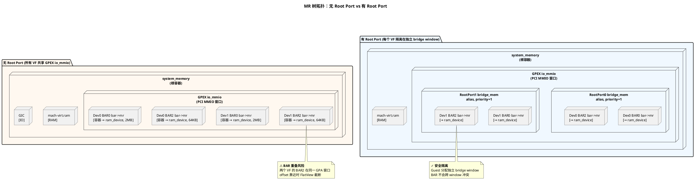
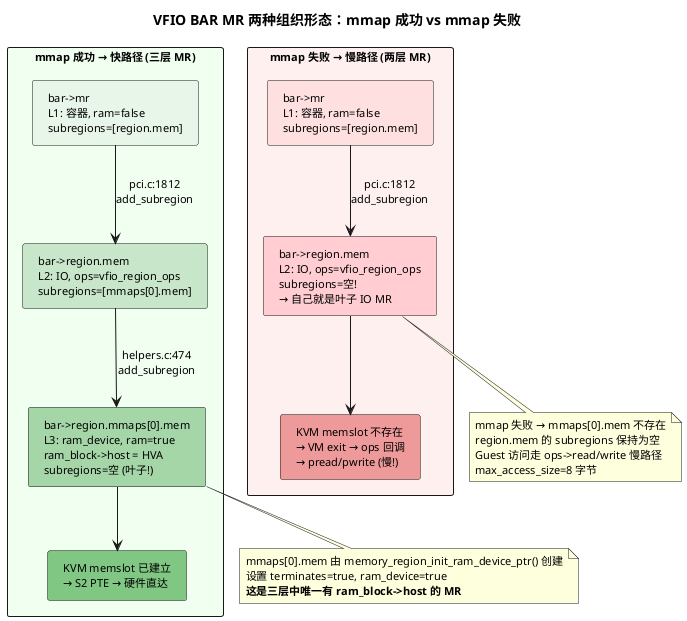
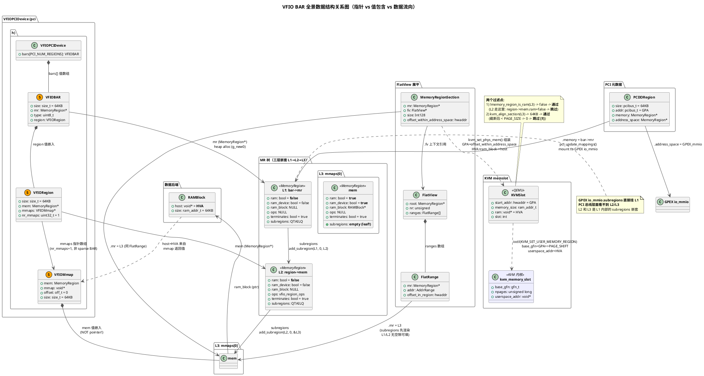
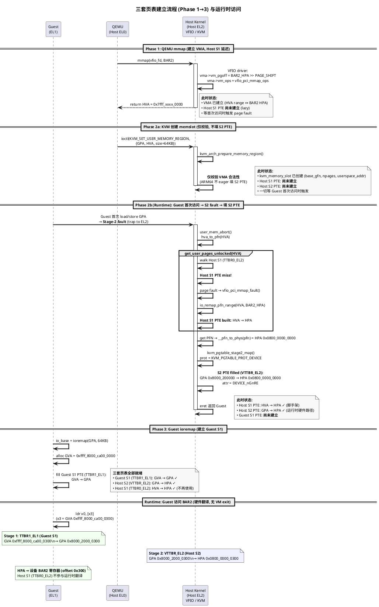

# 0. 背景

VFIO 设备直通让虚拟机直接访问物理 PCI 设备，绕开 QEMU 的软件模拟以获得接近原生的 I/O 性能。但"直接访问"四个字的背后，是 QEMU、KVM、Host 内核三套系统协同维护的复杂映射关系——Guest 看到的只是一个 PCI BAR 地址，这个地址要经过两层页表翻译才能到达物理设备。

ARM64 64KB PAGE_SIZE 环境下，这个问题更加棘手：页大小与 BAR 空间大小恰好同级（64KB），一旦多个 VF 的 BAR 被分配到相邻 GPA 区间，就容易出现空间重叠，导致 FlatView 渲染时 BAR 被截断、memslot 注册失败，最终 Guest 访问设备时触发 kernel panic。

本文是这个分析系列的第一篇，目标是**把正常场景下的数据结构链路梳理清楚**——四种地址空间的定义、三套页表的协作关系、QEMU 与 KVM 各自维护的关键结构体及其关联方式。只有先理清"正常情况下每一步发生了什么"，才能在后续文章中分析"BAR 重叠时在哪一步出了什么问题"。

代码引用来自 openEuler QEMU（`openeuler_qemu`）和 openEuler Kernel（`openeuler/kernel`），已逐一对照源码验证。

# 1. 四种地址空间

VFIO PCI 直通场景涉及四种地址，分属 Guest、QEMU、Host 内核三个主体管理。理解它们的区别是后续所有分析的前提。

| 地址 | 全称 | 谁分配 | 存在哪里 | 示例 |
|------|------|--------|----------|------|
| GVA | Guest Virtual Address | Guest 内核 (ioremap) | Guest S1 页表 PTE | `0xffff_8000_ca00_0300` |
| GPA | Guest Physical Address | QEMU 命令行(窗口基址) + Guest PCI 枚举(BAR 偏移) | BAR 配置寄存器、S2 PTE | `0x8000_2000_0300` |
| HVA | Host Virtual Address | Host 内核 (mmap 返回值) | QEMU `ram_block->host` | `0x7fff_a000_0300` |
| HPA | Host Physical Address | Host BIOS/PCI 枚举 | S2 PTE 的目标字段 | `0x0800_0000_0300` |

以 Guest 驱动访问设备 BAR2 内偏移 `0x300` 的寄存器为例，一条简单的 `ldr` 指令需要经过两次页表翻译：

```
Guest 指令: ldr x0, [x3]        (x3 = io_base + 0x300)

  GVA 0xffff_8000_ca00_0300
    ↓ Guest S1 (TTBR1_EL1)        ← Guest OS 管理
  GPA 0x8000_2000_0300
    ↓ Host S2 (VTTBR_EL2)         ← KVM 管理
  HPA 0x0800_0000_0300
    ↓ 物理总线
  设备寄存器
```

四种地址的高位含义各自独立，互相之间没有数值上的映射关系——GVA 的高位来自 Guest 内核的 vmalloc 区，GPA 来自 QEMU 分配的 Guest 物理地址空间布局，HVA 来自 Host 进程的 mmap 区域，HPA 来自 Host 的物理内存布局。唯一不变的是低 16 位（64KB 页内偏移），在四级翻译中保持一致。

# 2. 三套页表的协作

四种地址需要三套页表来完成翻译。VHE 模式下 Host 内核运行在 EL2，Guest 运行在 EL1。运行时 Guest 访问设备需要 Guest S1 + Host S2 两套页表，**这两套都是按需建立（demand-paged）**。

此外还有第三套——Host S1 用户页表（TTBR0_EL2）——作为 KVM 解析 HPA 时的"脚手架"。

**为什么要这个脚手架？** KVM 不直接知道 HPA。当 Guest 首次访问某个 GPA 时触发 Stage-2 page fault，KVM 的 fault handler `user_mem_abort()`（`arch/arm64/kvm/mmu.c:1472`）负责处理：
1. 通过 memslot 找到对应的 HVA
2. 调用 `__gfn_to_pfn_memslot()` → `hva_to_pfn()` 解析 HVA 对应的物理页帧号
3. `hva_to_pfn()` 先走快路径（`follow_page` 查 Host S1 PTE），若 PTE 未建立则走慢路径（`get_user_pages_unlocked()` 触发 Host S1 page fault → VFIO 驱动的 `vfio_pci_mmap_fault()` → `io_remap_pfn_range()` 建立 Host S1 PTE → 拿到 HPA）
4. 最后调用 `kvm_pgtable_stage2_map()` 将 `GPA → HPA` 填入 S2 PTE，页表属性设为 `DEVICE_nGnRE`

**注意**：和 x86 不同，ARM64 的 S2 PTE **不是在 `ioctl(KVM_SET_USER_MEMORY_REGION)` 时立即建立的**。`kvm_arch_prepare_memory_region()` 只校验 HVA 有效性和 VMA 存在性，`kvm_arch_commit_memory_region()` 只处理 dirty logging。真正的 S2 PTE 建立发生在 Guest 首次访问时的 Stage-2 fault 路径中。

| 寄存器 | 翻译关系 | 页表由谁管理 | 角色 |
|--------|---------|------------|------|
| TTBR1_EL1 | GVA → GPA | Guest OS | Guest 自己的翻译 |
| TTBR0_EL2 | HVA → HPA | Host 内核 | S2 fault 解析 HPA 时的"脚手架" |
| VTTBR_EL2 | GPA → HPA | KVM (Host 内核) | Guest 运行时的硬件路径 |

三套页表的建立有严格的先后顺序：

**Phase 1** — QEMU mmap 获取 HVA（只建 VMA，Host S1 PTE 延迟建立）
**Phase 2** — QEMU `ioctl(KVM_SET_USER_MEMORY_REGION)` → KVM 创建 `kvm_memory_slot`（S2 PTE **尚未建立**，仍是 demand-paged）
**Phase 3** — Guest 内部执行 ioremap 建立 Guest S1
**Runtime** — Guest 首次访问 GPA → Stage-2 fault → `user_mem_abort()` → `get_user_pages_unlocked()` 触发 Host S1 PTE 建立 → `kvm_pgtable_stage2_map()` 填 S2 PTE

运行时只有 Guest S1 + Host S2 参与翻译，Host S1 不参与。详细流程见[附录 A](#附录-a三套页表建立流程与运行时关系)。

# 3. QEMU 侧：MemoryRegion 树

从本节开始，我们自顶向下梳理 QEMU 进程中维护的数据结构。QEMU 使用一棵 **MemoryRegion 树**（以下简称 MR 树）来描述 Guest 的整个物理地址空间。理解这棵树的结构是理解 BAR 空间分配的关键。

## 3.1 MR 的三种类型

每个 `MemoryRegion` 描述 GPA 空间中的一段区域，核心字段如下（`include/exec/memory.h`）：

```c
struct MemoryRegion {
    char *name;                 // "mach-virt.ram", "0000:00:01.0 base BAR 4"
    hwaddr addr;                // 在父 MR 内的偏移 (GPA = 父 MR 基址 + addr)
    Int128 size;                // 区域大小 (被 sub_page_bar 修改的就是这个字段)
    bool ram;                   // RAM 类型? (QEMU 可分配后端内存)
    bool ram_device;            // ram_device? (VFIO mmap 的 BAR)
    int32_t priority;           // 在父的子链表中的优先级 (pci_update_mappings=1, sub_page_bar=0)
    QTAILQ_HEAD(, MemoryRegion) subregions;  // 子 MR 链表 (树拓扑)
    RAMBlock *ram_block;        // 如果 ram=true, 指向后端 RAM 块 (.host = HVA)
    const MemoryRegionOps *ops; // 如果 ram=false, 指向 IO 回调函数表 (没有 HVA)
};
```

这里有一个容易混淆的地方：`subregions` 和 `ram_block` 是两个独立的维度，分别对应"拓扑"和"存储"：

- **`subregions`** → 树结构：QTAILQ 链表，存子 MR。负责"这个 GPA 区间包含哪些子区域"
- **`ram_block`** → 数据后端：`ram_block->host` 是 HVA 指针。负责"实际数据在宿主机的哪个地址"

| subregions | ram_block | 典型例子 | 说明 |
|---|---|---|---|
| 有 | 无 | `bar->mr`, `region.mem` | 纯容器/IO 层，通过子 MR 定义内容 |
| 无 | 有 | `mmaps[0].mem`, `mach-virt.ram` | **叶子节点**，`ram_block->host` = HVA |
| 有 | 有 | 被 overlay 切割的 RAM | 罕见 |
| 无 | 无 | GIC, UART 等纯 IO MR | **纯 IO MR 的叶子节点**只通过 `ops` 回调处理 MMIO |

**只有叶子 ram_device MR 才能触发 KVM memslot 注册，也只有叶子节点才不会再挂有subregions**——中间的容器 MR、alias MR、IO MR 没有 `ram_block`，在 memslot 创建阶段会被直接跳过。

按 `ram`、`ram_device`、`ops` 三个标志的组合，MR 叶子节点（L3） 分为三种核心类型，它们从根本上决定了 Guest 访问该区域时的处理路径：

| 类型 | 标志 | 有无 HVA | KVM 建 memslot? | Guest 访问路径 |
|------|------|---------|----------------|--------------|
| RAM | `ram=true, ram_device=false` | 有 (QEMU malloc) | 是 | S2 命中 → 硬件直达 |
| RAM device | `ram=true, ram_device=true` | 有 (mmap 返回) | 是 | S2 命中 → 硬件直达 |
| IO | `ops != NULL, ram=false` | 没有 | 否 | S2 miss → VM exit → QEMU ops 回调 |


## 3.2 MR 树完整拓扑

下面展示从根到叶子的完整 MR 树。注意这棵树的每一层对应一个概念层级，我们分层阅读：

**第一层：根容器**

`system_memory` 是 QEMU 全局变量（`system/memory.c`），代表 Guest 的整个物理地址空间。它本身只是一个空容器——不存数据，不映射到任何实际内存，只通过子 MR 定义内容。

```
system_memory (根容器, 覆盖整个 GPA 空间, ram_block=NULL)
```

**第二层：平台级子区域**

根容器下挂载了 Guest 的所有平台设备地址空间——RAM、GIC、UART、以及 PCI 总线的 MMIO 窗口：

```
system_memory
  ├── mach-virt.ram        [GPA 0x0, 2GB]   ram=true, ram_block->host=HVA(QEMU malloc)
  ├── GIC                  [GPA 0x0800_0000]  IO, ops=gic_ops, ram_block=NULL
  ├── UART                  [GPA 0x0900_0000]  IO, ops=serial_ops, ram_block=NULL
  └── pcie-mmio (alias)     [GPA 0x8000_0000_0000]  → GPEX io_mmio (整个 PCI 总线的 MMIO 空间)
```

其中 `pcie-mmio` 是一个 alias MR，把 GPEX `io_mmio`（PCI host bridge 的 MMIO 地址空间）映射到 `system_memory` 的高地址区间。

**第三层：PCI 设备 BAR**

这一层的结构取决于是否配置了 PCIe Root Port，两者有本质区别：

*无 Root Port 时*——所有 VF 直接挂在 bus 0 上，BAR MR 都是 GPEX `io_mmio` 的同级子区域。Guest 为各 BAR 分配的 GPA 如果间隔不够，MR 在 GPA 空间中就会重叠：

```
pcie-mmio → GPEX io_mmio
  ├── Dev0 BAR0 bar->mr  [offset 0x000000]  → region.mem → mmaps[0].mem (ram_device, 2MB)
  ├── Dev0 BAR2 bar->mr  [offset 0x200000]  → region.mem → mmaps[0].mem (ram_device, 64KB)
  ├── Dev1 BAR0 bar->mr  [offset 0x400000]  → region.mem → mmaps[0].mem (ram_device, 2MB)
  ├── Dev1 BAR2 bar->mr  [offset 0x208000]  → region.mem → mmaps[0].mem (ram_device, 64KB)
  │   (pci_update_mappings 逐个遍历 PCI_NUM_REGIONS, 每个 BAR 独立挂入 GPEX io_mmio)
  │   (两个 VF 的 BAR2 offset 可能靠太近 → GPA 重叠)
```

*有 Root Port 时*——每个 Root Port 是一个 PCI Bridge（`pci_bridge.c:382`），拥有独立的 `sec_bus.address_space_mem`。Bridge 通过 `pci_bridge_init_alias`（`pci_bridge.c:161`）在父总线地址空间中创建一个 alias MR（bridge window），映射到自己的 `sec_bus.address_space_mem`。Guest 为每个 Root Port 分配独立的 bridge window，window 之间不重叠，因此不同 Root Port 下的 VF BAR 不会在 GPA 空间中冲突：

```
pcie-mmio → GPEX io_mmio
  └── RootPort0 bridge_mem (alias)  [offset = bridge window base]
        │   pci_bridge_init_alias 创建的 alias, priority=1
        └── → RootPort0 sec_bus.address_space_mem
              └── Dev0 bar->mr  → ... → mmaps[0].mem (ram_device)

  └── RootPort1 bridge_mem (alias)  [offset = 另一个 bridge window base]
        └── → RootPort1 sec_bus.address_space_mem
              └── Dev1 bar->mr  → ... → mmaps[0].mem (ram_device)
```

**这一拓扑差异是后续多 VF 场景中 BAR 重叠问题的前置条件**：无 Root Port 时，多个 VF 的 BAR 在同一个 GPA 窗口中竞争空间；有 Root Port 时，每个 VF 被隔离在独立的 bridge window 中。

**MR 树拓扑对比（PlantUML）：**



# 4. QEMU 侧：VFIO BAR 的三层 MR 嵌套

理解 VFIO BAR 数据结构的关键是**区分两样东西**：

- **C 结构体**（`VFIOBAR` / `VFIORegion` / `VFIOMmap`）——它们是数据的**容器**，定义谁拥有谁
- **MemoryRegion**（MR 树节点）——它们定义 GPA 空间的拓扑，通过 `subregions` 链表形成父子关系

容易混淆的根源是命名：`mr`、`mem`、`mmap`、`ram_block` 看起来相似但分属不同层级。

## 4.1 subregions 链：一个 BAR 的三个 MR 如何串联

下面以 VF 的 BAR2（64KB，非 sparse）为例，展示三个 MR 如何通过 `subregions` 和指针形成父子链。

**图 A：指针/值 与 subregions 嵌套**

```
VFIOPCIDevice (pci.h:137)
  └── .bars[2]  ──────────── VFIOBAR (值包含) ────────
       │
       ├── .mr ───────────────→ [bar->mr]  ● L1
       │   (MemoryRegion *,       堆分配
       │     pci.c:1806 g_new0)   .ram = false
       │                          .ram_device = false
       │                          .ram_block = NULL
       │                          .subregions ──┐
       │                                        │  ② 指针引用[bar.region.mem]
       │    ┌───────────────────────────────────┘
       │    │  pci.c:1812
       │    │  memory_region_add_subregion(bar->mr, 0, bar->region.mem)
       │    │
       └── .region ─────────── VFIORegion (值包含) ──
            │
            ├── .mem ──────────→ [region.mem]  ● L2
            │   (MemoryRegion *,    堆分配
            │     helpers.c:164     .ram = false
            │     init_io)          .ram_device = false
            │                       .ram_block = NULL
            │                       .ops = vfio_region_ops
            │                       .subregions ──┐
            │                                     │  ② 指针引用[bar.region.mem.mmaps[i].mem]
            │     ┌───────────────────────────────┘
            │     │  helpers.c:474
            │     │  memory_region_add_subregion(region->mem,
            │     │       region->mmaps[i].offset,
            │     │       &region->mmaps[i].mem)
            │     │
            └── .mmaps ─────────→ [VFIOMmap 数组]
                  │                (g_new0, helpers.c:386)
                  │
                  ├── mmaps[0] ── VFIOMmap (值包含) ──
                  │   ├── .mmap = 0x7fff_xxxx ←──── mmap() 返回值 (HVA)
                  │   │                  ③ 值嵌入 (不是指针!)
                  │   └── .mem ─── [mmaps[0].mem]  ● L3
                  │                     .ram = true
                  │                     .ram_device = true
                  │                     .ops = NULL
                  │                     .ram_block ──→ RAMBlock
                  │                     .terminates    .host = HVA ✓
                  │                     = true         .size = 64KB
                  │                     .subregions = 空 ← 叶子!
                  │
                  └── mmaps[1] ── VFIOMmap (值包含) ──  ← 仅 sparse BAR
                      ├── .mmap = 0x7fff_yyyy              存在 (nr_mmaps>1)
                      └── .mem ─── [mmaps[1].mem]  ● L3'
                                    (同上, 另一个叶子 MR)
```

> **关于 mmaps 数量**：绝大多数 PCI BAR 是连续的可映射区域，此时 `nr_mmaps = 1`，`mmaps[0]` 覆盖整个 BAR（无论 BAR 多大——64KB、128KB、2MB 都只有一个 mmaps 条目）。多个 mmaps 仅出现在 **sparse BAR** 场景——某些设备的 BAR 内部存在不连续的可映射区域（如 GPU 的 VRAM 被寄存器窗口打断），此时每个 sparse area 各自对应一个 mmaps 条目。本文后续讨论均以 `nr_mmaps = 1` 为前提。

**关键点**：

| 连接 | 方式 | 代码位置 |
|------|------|---------|
| ① `bar->mr` → L1 MR | 指针 (`g_new0` 堆分配) | `pci.c:1806` |
| ② L1.subregions 挂 L2 | `memory_region_add_subregion(bar->mr, 0, bar->region.mem)` | `pci.c:1812` |
| ③ `bar->region.mem` → L2 MR | 指针 (堆分配) | `helpers.c:164` |
| ④ L2.subregions 挂 L3 | `memory_region_add_subregion(region->mem, offset, &mmaps[i].mem)` | `helpers.c:474` |
| ⑤ `mmaps[i].mem` → L3 MR | **值包含** (嵌入 VFIOMmap 内部) | `helpers.c:469` |
| ⑥ L3.ram_block→HVA | `mmaps[i].mmap` 赋给 `ram_block->host` | `helpers.c:469-472` |

**mmaps[1] 存在吗？** 是的——当 BAR 是 **sparse 类型**时（`nr_mmaps > 1`），每个 sparse area 独立 mmap，各自生成一个叶子 MR 挂在 `region.mem` 的 `subregions` 下。非 sparse 时 `nr_mmaps = 1`。

## 4.2 mmap 成功 vs 失败 —— BAR 结构的两种形态



> **注意**：`bar->mr` 虽然调用 `memory_region_init_io()` 但传入 `ops=NULL`，所以 L1 是没有 IO 回调的纯容器。真正有 IO 回调的是 L2 `bar->region.mem`（`ops=vfio_region_ops`）。

## 4.3 BAR 如何挂入 PCI 总线 MR 树

三个 MR 的内部嵌套（L1→L2→L3）建立后，L1 `bar->mr` 还需要挂入 PCI 总线的 MMIO 地址空间。这一步由 `pci_update_mappings()`（`hw/pci/pci.c:1559`）在 Guest 写入 BAR 寄存器时触发：

```c
// r = &d->io_regions[i]  — PCIIORegion
// r->address_space = GPEX io_mmio (或 bridge 的 address_space_mem)
// r->memory        = bar->mr (L1)
// r->addr          = Guest 分配的 GPA 基址
memory_region_add_subregion_overlap(r->address_space, r->addr, r->memory, 1);
```

`PCIIORegion` 是 BAR 的"台账"——记录 BAR 的大小和 GPA 地址。它在 `pci_register_bar()`（`pci.c:1323`）中初始化：

```c
r->size  = memory_region_size(bar->mr);  // = 64KB, 之后不再改变
r->addr  = PCI_BAR_UNMAPPED;            // 尚未分配 GPA
wmask    = ~(size - 1);                 // 0xFFFFFFFFFFFF0000
```

Guest PCI 枚举时写 BAR=全 1，QEMU 返回 `val & wmask`，Guest 由此推断 BAR 大小。**`r->size` 决定了 Guest 为 BAR 保留的 GPA 窗口大小，也决定了多个 BAR 的 GPA 间隔——这是后续 BAR 重叠问题的根源。**

# 5. QEMU 侧：FlatView 展平与 memslot 注册

## 5.1 FlatView 与 FlatRange

MR 树是嵌套结构，但 KVM 需要按 GPA 线性查找。QEMU 的解决方案是：把 MR 树**展开**成 FlatView——一组按 GPA 排序、互不重叠的 `FlatRange` 数组。

`FlatView` 是容器，`FlatRange` 是数组元素。两者是一对多关系：

```c
// memory.h:1278 — FlatView = FlatRange[] + 元数据
struct FlatView {
    unsigned ref;
    FlatRange *ranges;       // 数组指针
    unsigned nr;             // 有效元素个数
    unsigned nr_allocated;   // 已分配容量
    MemoryRegion *root;      // 根 MR
};

// memory.c:222 — FlatRange = 一个 GPA 区段
struct FlatRange {
    MemoryRegion *mr;           // 指向对应的 MR
    hwaddr offset_in_region;    // 在 MR 内部的偏移
    AddrRange addr;             // {start: GPA, size: 字节数}
    uint8_t dirty_log_mask;
    bool romd_mode;
    bool readonly;
    bool nonvolatile;
    bool unmergeable;
};
```

`generate_memory_topology()`（`memory.c:756`）调用 `render_memory_region()` 递归遍历 MR 树的 `subregions` 链表，生成 `FlatRange[]` 数组，再调用 `flatview_simplify()` 合并相邻同类区间。

## 5.2 FlatView 渲染规则与 BAR 重叠截断

FlatView 的 FlatRange 数组是 **disjoint（互不重叠）** 的，这是 `render_memory_region()`（`memory.c:604`）的核心保证。渲染一条 MR 时：

1. **先递归渲染 subregions**（`memory.c:646`，QTAILQ 顺序——同 priority 时后插入的排前面）
2. **再渲染自身到空隙**（`memory.c:666`，gap-filling：`Render the region itself into any gaps left by the current view`）

因此当两个 BAR 的 GPA 区间重叠时，subregion 链表中靠前的 BAR 先占满空间，靠后的 BAR 被 gap-filling 裁剪，FlatRange 的 `addr.size < mr->size`——**BAR 重叠截断就发生在这一步。**

## 5.3 从 FlatView 到 KVM memslot 的完整调用链

**QEMU 通过 MemoryListener 机制监听 MR 树变更。** KVM 注册了一个 `KVMMemoryListener`（`kvm-all.c`），其 `region_add`/`region_del` 回调会在 FlatView 变化时被调用。FlatView 本身不直接参与 KVM memslot 创建——它通过 `MemoryRegionSection` 作为中介。

以 **Guest 写 VF2 BAR 基地址** 这个典型触发场景为例，完整调用链如下：

```
Guest 写入 VF2 BAR2 配置空间
  │
  └─→ vfio_pci_write_config()                    ← pci.c:1339
      │
      ├─→ pci_default_write_config()
      │   └─→ pci_update_mappings(VF2)
      │       │  VF2 BAR2 addr: UNMAPPED → 0x8000408000
      │       └─→ memory_region_add_subregion_overlap()
      │          (VF2 bar->mr 挂入 PCI 地址空间, 设 update_pending=true)
      │          (不触发 FlatView 重建 — 仅标记 dirty)
      │
      ├─→ vfio_sub_page_bar_update_mapping(VF2)  ← pci.c:1345/1171
      │   │  if (bar_addr 页对齐?) → size=64KB : size=32KB
      │   │  0x8000408000 不对齐 → size=32KB, 不扩张!
      │   │
      │   ├─→ memory_region_transaction_begin()   ← depth: 0→1
      │   │   (扩张逻辑: set_size MR, 但 VF2 不对齐→跳过)
      │   │   (memory_region_update_pending 仍为 true)
      │   │
      │   └─→ memory_region_transaction_commit()  ← depth: 1→0, 触发!
      │       │
      │       └─→ memory_region_commit()           ← memory.c:1137
      │           │
      │           ├─→ flatviews_reset()            ← 清 FlatView 缓存
      │           │
      │           ├─→ MEMORY_LISTENER_CALL_GLOBAL(begin)
      │           │
      │           ├─→ address_space_set_flatview() ← memory.c:1064
      │           │   │
      │           │   ├─→ generate_memory_topology()
      │           │   │   └─→ render_memory_region()
      │           │   │       递归遍历 subregions → disjoint FlatRange[]
      │           │   │       (最新插入的 MR 先渲染 → 重叠时后者被 gap-filling 裁剪)
      │           │   │
      │           │   ├─→ flatview_simplify()      ← 合并相邻同类区间
      │           │   │
      │           │   ├─→ address_space_update_topology_pass(false) ← DEL
      │           │   │   │  old_view vs new_view diff
      │           │   │   │  old 有 new 无/不同 →
      │           │   │   └─→ MEMORY_LISTENER_CALL(region_del)
      │           │   │       └─→ kvm_region_del()  ← 深拷贝 section, 入队 transaction_del
      │           │   │
      │           │   └─→ address_space_update_topology_pass(true)  ← ADD
      │           │       │  new 有 old 无 →
      │           │       └─→ MEMORY_LISTENER_CALL(region_add)
      │           │           └─→ kvm_region_add()  ← 深拷贝 section, 入队 transaction_add
      │           │
      │           └─→ MEMORY_LISTENER_CALL_GLOBAL(commit)
      │               │
      │               └─→ kvm_region_commit()       ← kvm-all.c:1632
      │                   │  先全部 DEL, 再全部 ADD (批量原子)
      │                   │
      │                   ├─→ for each DEL:
      │                   │   └─→ kvm_set_phys_mem(section, add=false)
      │                   │       │  !memory_region_is_ram(mr)? → skip
      │                   │       │  kvm_align_section → < PAGE_SIZE? → skip
      │                   │       └─→ ioctl(KVM_SET_USER_MEMORY_REGION, slot=0)
      │                   │
      │                   └─→ for each ADD:
      │                       └─→ kvm_set_phys_mem(section, add=true)
      │                           │  !memory_region_is_ram(mr)? → skip
      │                           │  kvm_align_section → 32KB < 64KB → return 0 → SKIP!
      │                           └─ (不到达 ioctl)
      │
      └────── 结果: DEL 删了旧 memslot, ADD 全被 kvm_align_section 裁掉
              → 两个 VF 都没有 S2 页表
```

**关键结论**：

- **MemoryListener 是桥梁**：MR 树变更 → FlatView diff → `region_add`/`region_del` 回调派发给所有 listener。KVM 的 `KVMMemoryListener` 收到回调后**只排队不执行**，真正的 memslot 创建在 `kvm_region_commit()` 中批量提交
- **`section->size` 来自 FlatRange 裁剪后大小**：`section_from_flat_range()`（`memory.c:237`）取的是 `fr->addr.size`，不是 `mr->size`。MR 可能是 64KB，但 FlatRange 被 gap-filling 裁剪后只剩 32KB，section 也就只有 32KB
- **`vfio_sub_page_bar_update_mapping` 是扩张的最后机会**：它在 transaction commit 之前执行，如果 BAR 基地址 64KB 对齐就扩张 MR 到 64KB；不对齐就保持原样，后续 `kvm_align_section` 必然裁掉

## 5.4 两个关键过滤点

链路中有两个位置可能导致 ram_device MR 被跳过、memslot 不被创建：

1. **`!memory_region_is_ram(mr)`**（`kvm-all.c:1349`）：IO 类型 MR（`ram=false`）直接跳过——这解释了为什么 mmap 失败时 `bar->region.mem`（L2）不会触发 memslot 注册
2. **`kvm_align_section → 0`**（`kvm-all.c:266`）：section size 小于 PAGE_SIZE 时返回 0——如果 BAR 被 FlatView 截断后剩余区间不足一个页，memslot 就不会被创建

QEMU 内部用 `KVMSlot` 结构缓存已注册的 memslot 信息：

```c
typedef struct KVMSlot {
    hwaddr start_addr;       // GPA (来自 section->offset_within_address_space)
    ram_addr_t memory_size;  // 大小, 页对齐后 (来自 kvm_align_section)
    void *ram;               // HVA (来自 memory_region_get_ram_ptr(section->mr))
    int slot;                // KVM memslot ID
    int flags;
} KVMSlot;
```

`KVMSlot` 不存 FlatView 指针，也不存 FlatRange 引用——它是"快照"，记录的是 `ioctl` 发送到内核的那一刻的 GPA/HVA/size 三元组。

# 6. KVM 侧：memslot 与 S2 页表

Host 内核（EL2）中，`kvm_memory_slot` 是内核侧的 memslot，存 `base_gfn`（GPA>>PAGE_SHIFT）、`npages`（页数）、`userspace_addr`（HVA）。

memslot 不存 HPA——KVM 需要 HPA 时通过 `get_user_pages(userspace_addr)` 动态查 Host S1 页表获取。每个 memslot 对应 S2 页表中的一段 GPA→HPA 映射，KVM 在创建 memslot 的同时填入 S2 PTE。

# 7. 完整数据链路

从 QEMU MR 树到 KVM S2 页表的完整关联链路。先把全部数据结构的关系画在一张 PlantUML 类图上，再看数据如何从 L3 一步步流向 KVM：

**全量数据结构关系图（PlantUML 类图）：**



**关键区分**：

| 符号 | PlantUML 含义 | 代码层面 |
|------|-------------|---------|
| `◆` (实心菱形) | 组合（composition），值嵌入 | `mmaps[0].mem` 直接嵌入 `VFIOMmap`，`VFIOBAR` 值数组嵌入 `VFIOPCIDevice` |
| `→` (箭头) | 关联（association），指针 | `bar->mr` 是堆上的 `MemoryRegion*` |
| `⇢` (虚线) | 依赖（dependency），数据流动 | `RAMBlock.host` 的值来自 `mmap` 返回值；`KVMSlot` 由 `MemoryRegionSection` 组装 |

**核心要点**：

- **HVA 的唯一来源**：`mmaps[i].mmap` → 经 `memory_region_init_ram_device_ptr()` 存入 `L3.ram_block->host`
- **GPA 的来源**：`PCIIORegion.addr` → `pci_update_mappings()` 挂入 GPEX io_mmio → 展平后在 `FlatRange.addr.start`
- **只有 L3 进 FlatView**：`render_memory_region` 先渲染 subregions，L3 占满区域后 L1/L2 无空隙可填
- **只有 L3 进 memslot**：`kvm_set_phys_mem` 检查 `memory_region_is_ram()`，L2 的 `ram=false` 直接跳过
- **BAR 重叠的破坏链**：两个 BAR 的 GPA 太近 → `render_memory_region()` 截断后渲染者 → `FlatRange.addr.size < MR.size` → `kvm_align_section` 返回 0 → memslot 不创建

下面用 ASCII 流程图展示数据如何从 L3 一步步流向 KVM：


```
QEMU EL0                                              KVM EL2
─────────────                                         ─────────

VFIO BAR 三层 MR (L1→L2→L3)
  bar->mr (L1, 容器, ram=false)           ← GPEX io_mmio 直接挂的就是它
    └─ subregions:
       bar->region.mem (L2, IO, ram=false, ops=vfio_region_ops)
         └─ subregions:
            bar->region.mmaps[0].mem (L3, ram_device, ram=true)
              .ram_block->host = HVA              ← HVA 的唯一来源 (mmap 返回值)
              .subregions = empty                  ← 叶子节点, terminates=true
       │
       ↓ render_memory_region (递归渲染)
       │   L3 先渲染占满区域, L1/L2 无空隙可填
       │   → FlatRange 只记录 L3
FlatRange
  .mr = L3 (mmaps[0].mem, ram_device)
  .addr.size = 实际区间大小
       │
       ↓ section_from_flat_range (memory.c:237)
MemoryRegionSection
  .mr = L3 (同 FlatRange.mr, ram_device)
  .size = FlatRange.addr.size
  .offset_within_address_space = GPA
       │
       ↓ kvm_region_add → kvm_region_commit
       │   (先 DEL 后 ADD, 事务性提交)
       ↓ kvm_set_phys_mem (kvm-all.c:1338)
       │
       ├─ !memory_region_is_ram(mr)?  → 跳过 (L2 走这条路, 因为 L2.ram=false)
       ├─ kvm_align_section → 0?      → 跳过 (小于 PAGE_SIZE)
       │
       │  L3 通过两个检查:
       │    memory_region_is_ram(L3) = true  (ram_device)
       │    kvm_align_section → 64KB (≥ PAGE_SIZE)
       │
       ↓ 组装 KVMSlot
KVMSlot
  .start_addr = GPA
  .memory_size = 页对齐后大小
  .ram = memory_region_get_ram_ptr(L3) → HVA    ← 从 L3.ram_block->host 取出
       │
       ↓ ioctl(KVM_SET_USER_MEMORY_REGION)
       │
                                            kvm_memory_slot <b>创建</b>
                                              .base_gfn = GPA >> PAGE_SHIFT
                                              .npages = 页数
                                              .userspace_addr = HVA
                                                   │
                                                   │  <b>S2 PTE 尚未建立!</b>
                                                   │  ARM64 S2 是 demand-paged
                                                   │  等 Guest 首次访问才触发 fault
                                                   │
                                            ─ ─ ─ ─ Guest 首次访问 GPA ─ ─ ─ ─
                                                   │
                                                   ↓ Stage-2 fault → user_mem_abort()
                                                   │   hva_to_pfn(HVA)
                                                   │   ├─ hva_to_pfn_fast(): follow_page()
                                                   │   │  → 查 Host S1 (TTBR0_EL2)
                                                   │   │  → Host S1 PTE miss!
                                                   │   └─ hva_to_pfn_slow(): get_user_pages_unlocked()
                                                   │      → page fault → vfio_pci_mmap_fault()
                                                   │      → io_remap_pfn_range(HVA, HPA)
                                                   │      → Host S1 PTE built: HVA → HPA
                                                   │
                                                   ↓ kvm_pgtable_stage2_map()
                                                   │   __pfn_to_phys(pfn), prot=DEVICE
                                                   ↓ 填 S2 PTE (VTTBR_EL2)
                                              GPA → HPA (DEVICE_nGnRE)
```

这条链路中，**FlatView 渲染是第一个可能出问题的环节**：如果 BAR 重叠导致 FlatRange 被截断，后续的 section size 就会小于预期，进而被 `kvm_align_section` 过滤掉，最终 memslot 不完整或缺失。

**数据链路活动图：**

```plantuml
@startuml
skinparam backgroundColor white
skinparam defaultFontSize 10
skinparam activityBorderColor #555555
skinparam arrowColor #555555

title <b>从 QEMU MR 树到 KVM S2 页表的完整数据链路 (标注 L1/L2/L3)</b>

start

:**L3: bar->region.mmaps[0].mem** (ram_device)
<b>.ram_block->host = HVA</b>
.terminates = true, .subregions = empty;

note right
  <b>L1→L2→L3 嵌套关系</b>
  L1 (bar->mr, ram=false, 容器)
    → L2 (bar->region.mem, ram=false, IO)
      → L3 (mmaps[0].mem, ram_device, 叶子)

  GPEX io_mmio 直接挂 L1
  PCI 总线只看得到 L1
  L2/L3 是 L1 内部 subregions 嵌套
end note

partition "FlatView 展平 (QEMU EL0)" {
  :render_memory_region()
  递归遍历 L1→L2→L3 subregions;

  note right
    <b>渲染规则 (memory.c:646-652)</b>
    1. 先渲染 subregions (递归)
    2. 再渲染自身到空隙

    L3 先渲染, 占满整个区域
    L1/L2 terminates=true 但无空隙可填
    → FlatRange 只记录 L3
  end note

  if (两个 BAR GPA 重叠?) then (是 ⚠)
    :<b>后渲染的 BAR 被截断</b>
    FlatRange.addr.size < MR.size;
  else (否 ✓)
    :FlatRange.addr.size = MR.size;
  endif

  :生成 FlatRange
  <b>.mr = L3</b> (mmaps[0].mem)
  .addr.size = 实际区间大小;
}

partition "Section 生成" {
  :section_from_flat_range()
  → MemoryRegionSection
  <b>.mr = L3</b> (同 FlatRange)
  .size = FlatRange.addr.size
  .offset_within_address_space = GPA;
}

partition "memslot 注册 (kvm_region_add → commit)" {

  if (!memory_region_is_ram(mr)?) then (是, 如 L2)
    :<b>跳过, 不建 memslot</b>
    IO 类型 region.mem (L2) 走这里;
    stop
  else (否 → L3 通过)
  endif

  if (kvm_align_section → 0?) then (是 ⚠)
    :<b>跳过, section size < PAGE_SIZE</b>
    (BAR 被截断后剩余不足一个页);
    stop
  else (否 ✓, L3 通过)
  endif

  :组装 KVMSlot
  .start_addr = GPA
  .memory_size = 页对齐后大小
  .ram = memory_region_get_ram_ptr(<b>L3</b>);

  :ioctl(KVM_SET_USER_MEMORY_REGION);
}

partition "KVM 内核: memslot 创建 (Host EL2)" {
  :kvm_memory_slot 创建
  .base_gfn = GPA >> PAGE_SHIFT
  .npages = 页数
  .userspace_addr = HVA;

  :kvm_arch_prepare_memory_region()
  <b>仅校验 VMA 合法性</b>
  (ARM64 不 eager 填 S2 PTE);

  note right
    <b>ARM64 与 x86 的区别</b>
    x86: kvm_arch_commit_memory_region()
         → get_user_pages() → fill S2 PTE
         (eager, 建 memslot 时即填)

    ARM64: S2 PTE <b>延迟创建</b>
          → Guest 首次访问时
          → Stage-2 fault 再填
  end note
}

partition "KVM 内核: S2 缺页处理 (Host EL2, Runtime)" {
  :Guest 首次访问 GPA
  → Stage-2 fault (trap to EL2);

  :user_mem_abort()
  hva_to_pfn(HVA);

  :hva_to_pfn_fast() → follow_page()
  → 查 Host S1 (TTBR0_EL2)
  → Host S1 PTE miss!;

  :hva_to_pfn_slow()
  get_user_pages_unlocked(HVA);

  :Host page fault
  → vfio_pci_mmap_fault()
  → io_remap_pfn_range(HVA, BAR2_HPA)
  → <b>Host S1 PTE built:</b> HVA → HPA;

  :kvm_pgtable_stage2_map()
  __pfn_to_phys(pfn)
  prot = DEVICE (KVM_PGTABLE_PROT_DEVICE);

  :<b>S2 PTE filled (VTTBR_EL2)</b>
  GPA → HPA (DEVICE_nGnRE);
}

:Guest 访问 → S2 命中 → 硬件直达设备;

stop

@enduml
```



# 8. 实例：正常场景下的取值

以 `vfio-pci` 驱动绑定一个 BAR2 物理大小为 64KB 的设备为例，64KB PAGE_SIZE 环境下，QEMU 启动后各结构体的 size 字段值全部一致：

| 结构体 | 字段 | 类型 | 值 | 来源 |
|--------|------|------|-----|------|
| `VFIORegion` | `.size` | `size_t` | 64KB (0x10000) | `ioctl` 返回的 `info.size` |
| `VFIOBAR` | `.size` | `size_t` | 64KB | `bar->size = bar->region.size` (pci.c:1785) |
| `VFIOMmap` | `.size` | `size_t` | 64KB | `mmaps[0].size = region->size` (helpers.c:388) |
| `MemoryRegion` (bar->mr) | `.size` | `Int128` | 64KB | `memory_region_init_io(..., bar->size)` (pci.c:1808) |
| `MemoryRegion` (region->mem) | `.size` | `Int128` | 64KB | region setup 时设定 |
| `MemoryRegion` (mmaps[0].mem) | `.size` | `Int128` | 64KB | `memory_region_init_ram_device_ptr(..., mmaps[0].size)` (helpers.c:469) |
| `RAMBlock` | `.size` | `ram_addr_t` | 64KB | `qemu_ram_alloc_from_ptr(size=64KB, ...)` (memory.c:1719) |
| `PCIIORegion` | `.size` | `pcibus_t` | 64KB | `r->size = memory_region_size(bar->mr)` (pci.c:1323) |
| wmask | — | `uint64_t` | 0xFFFFFFFFFFFF0000 | `~(64KB - 1)` (pci.c:1330) |

正常场景下，所有 size 字段均为 64KB，mmap 成功，ram_device MR 创建，FlatView 渲染完整，KVM memslot 建立，S2 页表就绪。Guest 访问 BAR2 时 S2 命中，硬件直达设备，无 VM exit。

后续文章将分析：**当多个 VF 的 BAR 分配到相邻 GPA、且间隔不足以容纳完整 BAR 空间时，上述链路中的哪一步会出现异常、如何一步一步导致 Guest kernel panic。**

---

# 附录 A：三套页表建立流程与运行时关系

**时序图：**



# 附录 B：ops 回调与 MMIO 慢路径派发

`ops`（`MemoryRegionOps *`）定义了该 MR 的 MMIO 读写回调。它与 `ram` 互斥——`ram=true` 走硬件直达，`ops != NULL` 走 QEMU 软件模拟：

```c
struct MemoryRegionOps {
    uint64_t (*read)(void *opaque, hwaddr addr, unsigned size);     // MMIO 读
    void (*write)(void *opaque, hwaddr addr, uint64_t data, unsigned size); // MMIO 写
    struct {
        unsigned min_access_size;   // 最小单次访问粒度 (1, 2, 4, 8)
        unsigned max_access_size;   // 最大单次访问粒度 (最大 8 字节)
    } valid;
};
```

两类 MR 的根本区别：

| | `ops = NULL, ram = true` | `ops != NULL, ram = false` |
|---|---|---|
| 例子 | `mach-virt.ram`, `mmaps[0].mem` | `region.mem`, GIC, UART |
| Guest 访问路径 | S2 命中 → 硬件直达设备 | S2 miss → VM exit → QEMU ops 回调 |
| KVM 建 memslot? | 是 | 否 |
| 速度 | 快（无 VM exit） | 慢（每次都要退出到 QEMU） |
| 访问粒度限制 | 无（任意大小） | 受 `ops->valid.max_access_size` 限制（最大 8 字节） |

VFIO BAR 场景下快路径与慢路径的分界取决于 mmap 是否成功：

```
mmap 成功时 (ram_device MR 存在):
  mmaps[0].mem  ← ops = NULL, ram = true
  → KVM memslot → S2 PTE → Guest 直接 S2 访问 → 硬件直达 (fast path)

mmap 失败时 (仅有 IO MR):
  region.mem    ← ops = vfio_region_ops, ram = false
  → 无 memslot, 无 S2 映射
  → Guest 访问 → S2 miss → VM exit → KVM_EXIT_MMIO → QEMU
  → ops->read/write → vfio_region_read() → pread(VFIO_fd) (slow path)
```

慢路径的完整派发流程：CPU 触发 Data Abort，硬件填写 ESR 寄存器给 KVM，KVM 通过 `kvm_run` 结构体把 MMIO 请求返回给 QEMU：

```
Guest ldr → S2 miss → VM exit

KVM [Host EL2] 解码 ESR, 填充 kvm_run:
  kvm_run->mmio.phys_addr = GPA 0x8000_200300
  kvm_run->mmio.len       = 8
  kvm_run->mmio.is_write  = false
  kvm_run->exit_reason    = KVM_EXIT_MMIO
  → 返回 QEMU

QEMU [Host EL0] 收到 KVM_EXIT_MMIO:
  address_space_rw(GPA)
  → 查 FlatView → 找到 region.mem
  → 调用 region.mem->ops->read(...)   ← QEMU 自己的代码, 还在 EL0
  → vfio_region_read() → pread(VFIO_fd) → syscall → 进入 Host EL2
```

VFIO region ops（`hw/vfio/helpers.c:260`）的回调是 `.read = vfio_region_read` / `.write = vfio_region_write`，内部调 `pread(vfio_fd, ..., fd_offset+addr)` / `pwrite(...)` 完成设备访问。`max_access_size = 8`，慢路径只支持 1~8 字节单次访问。

> **慢路径的隐患**：当 BAR2 mmap 失败后，只剩下 `region.mem`（IO 类型，`ops->valid.max_access_size = 8`）。Guest 执行 `ldp x0, x1, [x3]` 时是 128-bit（16 字节）原子操作，超出 VFIO region ops 的最大粒度，KVM 的 ISV=0 也无法解码指令 → 只能向 Guest 注入 SEA → kernel panic。
