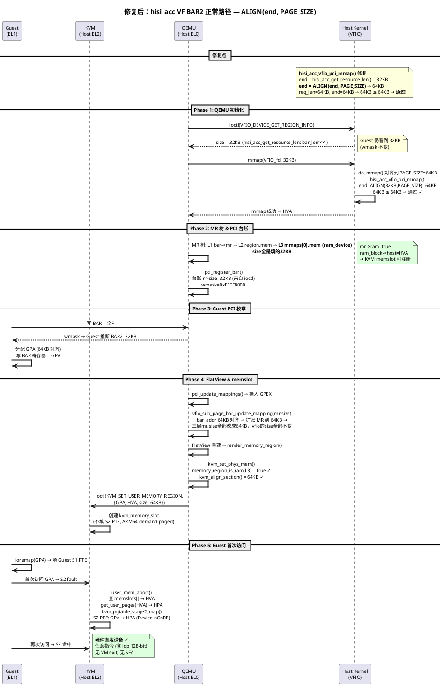
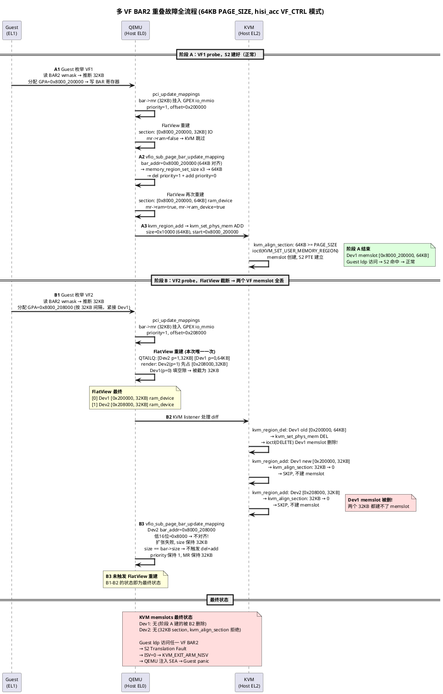

# 一、单VF问题

host 和 guest的基础页大小：**64KB PAGE_SIZE**

使用 `hisi_acc_vfio_pci` 绑定加速器 VF 透传给虚拟机，在 Guest 内 `insmod hisi_zip.ko` 触发 Synchronous External Abort (SEA)，kernel panic。使用通用 `vfio-pci` 驱动绑定时正常。

## 1. 问题描述

### 1.1 崩溃日志

```
[Guest] insmod hisi_zip.ko uacce_mode=1 pf_q_num=32
[Host]  qemu-system-aarch64: VFIO_MAP_DMA failed: Bad address

[Guest] Internal error: synchronous external abort: 0000000096000010 [#1] SMP
[Guest] pc : hisi_qm_wait_mb_ready+0x44/0xc8 [hisi_qm]
[Guest] lr : qm_mb_nolock+0x30/0x158 [hisi_qm]

[Guest] Call trace:
[Guest]  hisi_qm_wait_mb_ready  →  qm_mb_nolock  →  hisi_qm_mb_read
[Guest]  → qm_get_vft_v2  →  qm_get_pci_res  →  hisi_qm_pci_init
[Guest]  → hisi_qm_init  →  hisi_zip_probe

[Guest] Kernel panic - not syncing: Fatal exception
```

### 1.2 PCI 枚举差异

| | hisi_acc_vfio_pci (崩溃) | vfio-pci (正常) |
|---|---|---|
| Guest 看到的 BAR2 | **0x8000200000-0x8000207fff (32KB)** | 0x8000200000-0x800020ffff (64KB) |
| Host PAGE_SIZE | 64KB | 64KB |
| 关系 | 32KB < 64KB | 64KB = 64KB |

**关键线索**：同样的 VF 硬件（物理 BAR2 都是 64KB），`hisi_acc_vfio_pci` 让 Guest 看到 32KB，`vfio-pci` 让 Guest 看到 64KB。只有前者崩溃。

## 2. 问题分析

### 2.1 hisi_acc 驱动截断 BAR2 为 32KB

`hisi_acc_vfio_pci` 在 VF_CTRL 迁移模式下，将 BAR2 截半——前 32KB 是功能寄存器（暴露给 Guest），后 32KB 是迁移寄存器（Host 独占）。

**`hisi_acc_get_resource_len()`**:

```c
static size_t hisi_acc_get_resource_len(struct vfio_pci_core_device *vdev,
                                        unsigned int index)
{
    struct hisi_acc_vf_core_device *hisi_acc_vdev =
            hisi_acc_drvdata(vdev->pdev);
    size_t bar_len, ret_len;

    bar_len = pci_resource_len(vdev->pdev, index);

    if (hisi_acc_vdev->drv_mode == HW_ACC_MIG_VF_CTRL) {
        ret_len = bar_len >> 1;             // 64KB >> 1 = 32KB
        return ret_len;
    }
    return bar_len;
}
```

此返回值用于 `VFIO_DEVICE_GET_REGION_INFO` ioctl → QEMU 据此创建 MemoryRegion → Guest PCI 枚举读 wmask 得到 BAR2=32KB。详细机制见第一篇 **4.3.1 [QEMU EL0] pci_register_bar：PCI 台账固化**。

### 2.2 32KB < 64KB PAGE_SIZE → mmap 失败 → 无 S2

QEMU 通过 mmap 获取 HVA（第一篇 **4.2 mmap 成功 vs 失败 —— BAR 结构的两种形态**），mmap 成功后才创建 ram_device MR（`mr->ram=true`），只有这类 MR 才会触发 KVM memslot 注册（第一篇 **5.4 kvm_align_section：决定 section 是否进入 KVM memslot**）。

**`hisi_acc_vfio_pci_mmap()`**:

```c
static int hisi_acc_vfio_pci_mmap(struct vfio_device *core_vdev,
                                  struct vm_area_struct *vma)
{
    struct vfio_pci_core_device *vdev =
        container_of(core_vdev, struct vfio_pci_core_device, vdev);
    unsigned int index;

    index = vma->vm_pgoff >> (VFIO_PCI_OFFSET_SHIFT - PAGE_SHIFT);
    if (index == VFIO_PCI_BAR2_REGION_INDEX) {
        u64 req_len, pgoff, req_start;
        resource_size_t end;

        end = hisi_acc_get_resource_len(vdev, index);       // = 32KB
        req_len = vma->vm_end - vma->vm_start;              // = 64KB (内核 PAGE_SIZE 对齐)
        pgoff = vma->vm_pgoff &
            ((1U << (VFIO_PCI_OFFSET_SHIFT - PAGE_SHIFT)) - 1);
        req_start = pgoff << PAGE_SHIFT;

        if (req_start + req_len > end)                      // 0 + 64KB > 32KB → true
            return -EINVAL;                                 // mmap 被拒绝!
    }

    return vfio_pci_core_mmap(core_vdev, vma);
}
```

**完整调用链**:

```
→ QEMU mmap(VFIO_fd, 32KB)
  → 内核将 mmap 请求对齐到 PAGE_SIZE=64KB
  → hisi_acc_vfio_pci_mmap() 检查: 0 + 64KB > 32KB → -EINVAL
  → mmap 失败!host vma 不建立，也不会返回HVA给qemu
→ 无 ram_device MR → KVM 不建 memslot
→ Guest 访问 BAR2 → S2 缺页
```

### 2.3 mmap 失败后 BAR2 在各层的状态

mmap 虽然失败，但 **MR 树和 FlatView 仍然有 BAR2 的记录**

- 只是没有 ram_device 层。
- QEMU 的 KVMSlot 和 KVM 的 memslot **都不会创建**
- 但 GPA 仍然存在于台账和 FlatView 中，用于 MMIO 的 GPA→MR 派发。

#### 2.3.1 PCI 台账记录 GPA

Guest PCI 枚举时看到 BAR2=32KB（来自 wmask），分配 GPA `0x8000_200000` 并写入 BAR 寄存器。QEMU 收到写操作后，`pci_update_mappings` 记录 GPA（详见第一篇 **4.3.3 [QEMU EL0] pci_update_mappings：BAR MR 挂入 GPA**）。

#### 2.3.2 MR 树：只有 IO 层，没有 ram_device 层

`bar->mr` 挂入 GPEX io_mmio 后，MR 树包含两层：

```
GPEX io_mmio.subregions:
  bar->mr [offset=0x00200000, priority=1, IO, 32KB]
    └── region.mem [IO, ops=vfio_region_ops, ram=false]
         (无 mmaps[0].mem — mmap 失败时不会创建)
```

这与第一篇 **4.2 mmap 成功 vs 失败 —— BAR 结构的两种形态** 中的"mmap 失败形态"一致——只有两层 IO 容器，缺少 L3 ram_device 叶子节点。

#### 2.3.3 FlatView：有 IO section，但 `mr->ram=false`

FlatView 展平后，该 GPA 区间有一个 IO 类型的 section（第一篇 **5.2 FlatView 渲染**）：

```
FlatView.ranges[]:
  Section: GPA [0x8000_200000, 0x8000_207fff], 32KB
           mr = region.mem
           mr->ram = false     ← IO 类型
           mr->ops = vfio_region_ops
```

#### 2.3.4 KVM memslot 和 QEMU KVMSlot：都不创建

KVM listener 处理 FlatView 变化时，`kvm_set_phys_mem` 对 IO section 直接跳过（第一篇 **5.4 kvm_align_section：决定 section 是否进入 KVM memslot**）：

```c
static void kvm_set_phys_mem(KVMMemoryListener *kml,
                             MemoryRegionSection *section, bool add)
{
    MemoryRegion *mr = section->mr;
    if (!memory_region_is_ram(mr)) {   // mr->ram = false → 跳过!
        return;                         // 不创建 QEMU KVMSlot
                                        // 不发出 ioctl
                                        // 不创建 KVM memslot
    }
    // ...
}
```

**各层状态总结**：

| 层 | BAR2 GPA 存在? | 说明 |
|---|---|---|
| PCI 台账 `r->addr` | **是** (0x8000_200000) | Guest 写入后 pci_update_mappings 记录 |
| MR 树 | **是** (IO 类型, 仅 L1→L2) | 缺少 L3 ram_device |
| FlatView section | **是** (IO, mr->ram=false) | 用于 QEMU MMIO 派发 |
| QEMU KVMSlot | **否** | mr->ram=false → kvm_set_phys_mem 跳过 |
| KVM memslot | **否** | ioctl 未发出 |
| KVM S2 PTE | **否** | 无 memslot → S2 无映射（第一篇 **6.3 memslot 与 S2 页表的关系**） |

### 2.4 GPA 在 MMIO 仿真中的作用

当 Guest 访问 BAR2 → S2 缺页 → VM exit，KVM 将故障 IPA（即 GPA）传给 QEMU。QEMU 通过 FlatView 找到对应的 IO section 和 ops 回调，走慢路径：

```
KVM [EL2]:
  CPU 硬件填写 HPFAR = 故障 IPA = GPA 0x8000_200300
  → ISV=0 → KVM_EXIT_ARM_NISV → GPA 传给 QEMU (arm_nisv.fault_ipa)

  如果 ISV=1 (单寄存器 ldr):
  → KVM_EXIT_MMIO → GPA 填入 kvm_run->mmio.phys_addr

QEMU [EL0]:
  收到 GPA → address_space_rw(GPA) → 查 FlatView
  → 找到 Section: [0x8000_200000, 32KB, mr=region.mem]
  → vfio_region_ops.read() → vfio_region_read()
  → pread(VFIO_fd, ..., fd_offset + 0x300) → 内核读设备
```

**GPA 虽然不在 memslot/S2 中，但存于台账和 FlatView——这是 QEMU MMIO 慢路径派发的关键。**

### 2.5 单寄存器 ldr 的 MMIO 仿真路径 (ISV=1)

在理解 ldp 为什么崩溃之前，先看一个正常工作的 MMIO 仿真路径：假设 Guest 执行普通的 `ldr x0, [x3]`（8 字节单寄存器读），S2 缺页时：

```
Guest [EL1]: ldr x0, [x3]  (x3 = io_base + 0x300)
  → GVA → GPA (Guest S1 ✓) → S2 缺页 → VM exit

KVM [EL2]: io_mem_abort()
  → ISV=1 → 解码 ESR_EL2:
      is_write=false, len=8, rt=x0
  → kvm_io_bus_read 失败 (VFIO 设备不在 KVM_MMIO_BUS 上)
  → 构造 KVM_EXIT_MMIO: {GPA=0x8000_200300, len=8, is_read}
  → 返回 QEMU

QEMU [EL0]:
  → address_space_rw(GPA) → 查 FlatView → 找到 region.mem
  → vfio_region_ops.read() → vfio_region_read()
  → pread(VFIO_fd, buf, 8, fd_offset+0x300)
    → syscall → Host 内核 VFIO 驱动 → 读设备 → 返回数据

KVM [EL2]: kvm_handle_mmio_return()
  → vcpu_set_reg(vcpu, x0, data)   ← 写回 Guest x0
  → kvm_incr_pc(vcpu)              ← 跳过已仿真的 ldr
  → Guest 继续执行 ✅
```

**QEMU 侧的 ops 注册**:

```c
const MemoryRegionOps vfio_region_ops = {
    .read = vfio_region_read,
    .write = vfio_region_write,
    .valid = {
        .min_access_size = 1,
        .max_access_size = 8,     // ← 最大只支持 8 字节!
    },
};
```

**关键限制**: `max_access_size = 8` → VFIO 慢路径只支持 1~8 字节。`ldr`（8 字节）可通过 `pread` 完成。`ldp`（16 字节）在进入 QEMU 之前就被 KVM 拦截（ISV=0），根本走不到这里。

### 2.6 ldp 128-bit 指令 ISV=0 → 无法 MMIO 仿真 → SEA

崩溃发生在 `qm_mb_read` 读取 mailbox 寄存器时。该函数使用 ARM64 inline asm `ldp` 做 128-bit 原子读：

**`qm_mb_read` 中的 ldp inline asm**:

```c
asm volatile("ldp %0, %1, %3\n"
             "stp %0, %1, %2\n"
             : "=&r" (tmp0), "=&r" (tmp1), "+Q" (mailbox)
             : "Q" (*((char __iomem *)fun_base))
             : "memory");
```

`ldp` 是双寄存器加载指令，一次读 16 字节（128-bit）。对于 S2 缺页触发的 Data Abort：

- CPU 写入 ESR_EL2 的 **ISV=0** —— ARM 规范下 ldp/stp 等多寄存器操作的 syndrome 格式无法完整描述两个目标寄存器
- KVM 无法解码指令 → 不知道是读还是写、多大、哪个寄存器
- 无法构造 MMIO 请求 → 只能返回 `KVM_EXIT_ARM_NISV`
- QEMU 收到 NISV → `kvm_arm_handle_dabt_nisv()` 注入 SEA → Guest panic

KVM 的处理逻辑:

```c
int io_mem_abort(struct kvm_vcpu *vcpu, phys_addr_t fault_ipa)
{
    if (!kvm_vcpu_dabt_isvalid(vcpu)) {    // ISV == 0 ?
        if (test_bit(KVM_ARCH_FLAG_RETURN_NISV_IO_ABORT_TO_USER,
                     &vcpu->kvm->arch.flags)) {
            run->exit_reason = KVM_EXIT_ARM_NISV;
            run->arm_nisv.esr_iss = kvm_vcpu_dabt_iss_nisv_sanitized(vcpu);
            run->arm_nisv.fault_ipa = fault_ipa;
            return 0;
        }
        return -ENOSYS;
    }
    // ISV=1: 正常解码指令信息...
}
```

QEMU 侧收到 NISV 后注入 SEA:

```c
static int kvm_arm_handle_dabt_nisv(CPUState *cs, uint64_t esr_iss,
                                    uint64_t fault_ipa)
{
    if (cap_has_inject_ext_dabt) {
        struct kvm_vcpu_events events = {};
        events.exception.ext_dabt_pending = 1;
        if (!kvm_vcpu_ioctl(cs, KVM_SET_VCPU_EVENTS, &events)) {
            env->ext_dabt_raised = 1;
            return 0;     // SEA 注入成功, Guest 将收到 Synchronous External Abort
        }
    }
    return -1;
}
```

**对比 2.5 的 ldr 路径**: ldr 的 ISV=1 让整个 MMIO 仿真链路畅通。ldp 的 ISV=0 在第一关 KVM 就被拦截——连 MMIO 请求都构造不出来，更不可能走到 QEMU 的 pread/pwrite 慢路径。hisi_qm 驱动固定用 `ldp` 做 128-bit 原子读，无法改成单寄存器操作。

### 2.7 完整故障链

```
hisi_acc_get_resource_len: bar_len>>1 = 32KB
  → Guest 看到 BAR2=32KB (wmask)
  → QEMU mmap 失败 (32KB < 64KB PAGE_SIZE)
  → 无 ram_device MR → KVM 不建 memslot → S2 无映射
  → Guest ldp 访问 mailbox → S2 Translation Fault
  → ISV=0 → KVM_EXIT_ARM_NISV → QEMU 注入 SEA
  → Guest kernel panic
```

### 2.8 为什么 vfio-pci 正常

通用 vfio-pci 不截断 BAR2 → `VFIO_DEVICE_GET_REGION_INFO` 返回 64KB → QEMU mmap 64KB = PAGE_SIZE → 成功 → ram_device MR → KVM memslot → S2 映射 → ldp 通过 S2 直达硬件，全程无 VM exit。

正常流程详见第一篇 **8. 正常场景走一遍**。

### 2.9 三条 MMIO 访问路径对比

Guest 对 BAR2 的访问有三种可能路径，取决于 S2 映射状态和指令类型：

| | 路径1: S2 直达 | 路径2: QEMU 慢路径仿真 | 路径3: ISV=0 失败 |
|---|---|---|---|
| 条件 | S2 有映射 (ram_device) | S2 无映射 + ISV=1 | S2 无映射 + ISV=0 |
| VM exit? | 无（硬件直达） | 有 | 有 |
| QEMU 参与? | 无 | 有 (pread/pwrite) | 无法参与 |
| 指令要求 | 任意 | 单寄存器 (≤8B) | ldp/stp 等 |
| 性能 | 最快 | 慢 (EL2→EL0→EL2) | 崩溃 |
| 本场景 | vfio-pci | — | hisi_acc (ldp) |

**hisi_acc 场景走了路径3**: S2 无映射 + ldp ISV=0 → 无法仿真 → SEA。

### 2.10 全流程总览：正常路径 vs 故障路径

```plantuml
@startuml
skinparam backgroundColor white
skinparam defaultFontSize 10
skinparam sequenceMessageAlign center
skinparam participantBorderColor #555555
skinparam sequenceArrowThickness 2

title <b>VFIO BAR 全流程：正常路径 (vfio-pci) vs 故障路径 (hisi_acc) — PAGE_SIZE=64KB</b>

participant "Guest\n(EL1)" as Guest
participant "KVM\n(Host EL2)" as KVM
participant "QEMU\n(Host EL0)" as QEMU
participant "Host Kernel\n(VFIO)" as Kernel

== Phase 1: QEMU 初始化 — BAR 大小 & mmap ==

QEMU -> Kernel : ioctl(VFIO_DEVICE_GET_REGION_INFO)
alt vfio-pci
    Kernel --> QEMU : size = 64KB (pci_resource_len)
    QEMU -> Kernel : mmap(VFIO_fd, 64KB)
else hisi_acc VF_CTRL
    Kernel --> QEMU : size = 32KB (hisi_acc_get_resource_len: bar_len>>1)
    QEMU -> Kernel : mmap(VFIO_fd, 32KB)
end

Kernel -> Kernel : do_mmap() 对齐到 PAGE_SIZE=64KB

alt vfio-pci (end=64KB)
    Kernel -> Kernel : hisi_acc_vfio_pci_mmap()\nreq_len=64KB, end=64KB\n64KB = 64KB → 通过
    Kernel --> QEMU : mmap 成功 → HVA
else hisi_acc (end=32KB)
    Kernel -> Kernel : hisi_acc_vfio_pci_mmap()\nreq_len=64KB, end=32KB\n64KB > 32KB → -EINVAL
    Kernel --> QEMU : mmap 失败!
end

== Phase 2: MR 树构建 & PCI 台账 ==

alt mmap 成功 (vfio-pci)
    QEMU -> QEMU : MR 树: L1 bar->mr → L2 region.mem → <b>L3 mmaps[0].mem (ram_device)</b>
    note right #DFD: mr->ram=true\nram_block->host=HVA
    QEMU -> QEMU : pci_register_bar()\n固化台账 r->size + wmask

else mmap 失败 (hisi_acc)
    QEMU -> QEMU : MR 树: L1 bar->mr → <b>L2 region.mem (IO, 叶子)</b>
    note right #FFD: mr->ram=false\nops=vfio_region_ops\n无 L3 ram_device
end

== Phase 3: Guest PCI 枚举 ==

Guest -> QEMU : 写 BAR = 全F (探测)
QEMU --> Guest : 返回 wmask
Guest -> Guest : 推断 BAR 大小\n分配 GPA\n写 BAR 寄存器 = GPA

== Phase 4: FlatView 展平 & memslot 注册 ==

QEMU -> QEMU : pci_update_mappings()\nBAR MR 挂入 GPEX io_mmio
QEMU -> QEMU : vfio_sub_page_bar_update_mapping()

alt mmap 成功 (vfio-pci)
    QEMU -> QEMU : GPA 对齐 → 扩张 MR size 到 64KB
else mmap 失败 (hisi_acc)
    QEMU -> QEMU : mmap=NULL → 跳过\n保持 32KB IO 类型
end

QEMU -> QEMU : memory_region_transaction_commit()\nFlatView 重建 → render_memory_region()

QEMU -> QEMU : kvm_region_add() → kvm_set_phys_mem()

alt mr->ram = true (vfio-pci, ram_device L3)
    QEMU -> QEMU : kvm_align_section()\nGPA 对齐 + 64KB ≥ PAGE_SIZE ✓
    QEMU -> KVM : ioctl(KVM_SET_USER_MEMORY_REGION,\n{GPA, HVA, size=64KB})
    KVM -> KVM : 创建 kvm_memory_slot\n写入 memslots[]\n<b>不填 S2 PTE</b> (ARM64 demand-paged)
    note right #DFD: memslot 就绪

else mr->ram = false (hisi_acc, IO L2)
    QEMU -> QEMU : memory_region_is_ram() = false\n跳过! 不创建 memslot
    note right #FFD: GPA 仅存于 FlatView\n(MMIO 慢路径派发用)
end

== Phase 5: Guest 首次访问 BAR2 ==

Guest -> Guest : ioremap(GPA)\n填 Guest S1 PTE

alt vfio-pci: S2 有 memslot
    Guest -> KVM : 首次访问 GPA → S2 fault
    KVM -> KVM : user_mem_abort()\n查 memslots[] → HVA
    KVM -> KVM : get_user_pages(HVA) → HPA\nkvm_pgtable_stage2_map()\nS2 PTE: GPA → HPA (Device-nGnRE)
    Guest -> KVM : 再次访问 → S2 命中
    note right #DFD: <b>硬件直达设备 ✓</b>\n任意指令 (含 ldp 128-bit)\n无 VM exit

else hisi_acc: S2 无 memslot
    Guest -> KVM : 首次访问 GPA → S2 Translation Fault\nVM exit → io_mem_abort()

    alt ISV=1 (ldr, ≤8B 单寄存器)
        KVM -> KVM : 解码 ESR: len=8, rt=x0, is_read
        KVM -> QEMU : KVM_EXIT_MMIO\n{GPA, len=8, is_read}
        QEMU -> QEMU : address_space_rw(GPA)\n查 FlatView → region.mem
        QEMU -> Kernel : vfio_region_read()\npread(VFIO_fd, 8, fd_offset+addr)
        Kernel --> QEMU : 设备数据
        QEMU -> KVM : 写回 Guest x0
        KVM -> Guest : 继续执行
        note right #FFD: <b>慢路径 ✓</b>\n性能差 (EL2→EL0→EL2)

    else ISV=0 (ldp, 16B 多寄存器)
        KVM -> KVM : <b>无法解码指令!</b>\n不知 len/rt/is_write
        KVM -> QEMU : KVM_EXIT_ARM_NISV\n{fault_ipa, esr_iss}
        QEMU -> QEMU : kvm_arm_handle_dabt_nisv()\nKVM_SET_VCPU_EVENTS\next_dabt_pending = 1
        QEMU -> Guest : <b>注入 SEA</b>
        note right #FDD: <b>Guest kernel panic!</b>\nInternal error: synchronous\nexternal abort\nhisi_qm_wait_mb_ready → ldp

    end
end

@enduml
```



> 图中 `#DFD` / `#FFD` / `#FDD` 分别表示绿色（正常）、浅黄（警告）、浅红（致命）背景，用于快速区分三条路径的走向。详细机制见第一篇各章节。

## 3. 解决方案

### 3.1 推荐方案：修改 `hisi_acc_vfio_pci_mmap` 检查

在 mmap 检查中将 `hisi_acc_get_resource_len` 返回值 ALIGN 到 PAGE_SIZE：

**修复代码**:

```c
if (index == VFIO_PCI_BAR2_REGION_INDEX) {
    end = hisi_acc_get_resource_len(vdev, index);
    end = ALIGN(end, PAGE_SIZE);          // 修复: 32KB → 64KB
    req_len = vma->vm_end - vma->vm_start;  // = 64KB (内核 PAGE_SIZE 对齐)
    if (req_start + req_len > end)         // 0 + 64KB > 64KB → false
        return -EINVAL;
}
```

**修复效果**：

```
修复前: end=32KB, req_len=64KB → 64KB > 32KB → mmap 拒绝
修复后: end=64KB, req_len=64KB → 64KB = 64KB → mmap 通过
  → ram_device MR 创建 → KVM memslot → S2 建立
  → Guest ldp 直接 S2 访问 → 正常
```

**注意**: 此修复只解决了 mmap 检查——让 ram_device MR 和 S2 能建立。但 Guest 仍然从 BAR wmask 读到的 BAR2=32KB（因为 `hisi_acc_get_resource_len` 本身仍返回 32KB）。单 VF 场景无影响——BAR2 独占一个 64KB 页，不会与其他 BAR 重叠。多 VF 场景则需要额外处理（见后续多 VF 分析）。

### 3.2 替代方案

**方案A**: 修改 `hisi_acc_get_resource_len` 本身 ALIGN 返回值（同时影响 `VFIO_DEVICE_GET_REGION_INFO` → Guest 看到 64KB）

**方案B**: 使用 PF_CTRL 迁移模式（迁移寄存器移到 PF BAR2）→ 无需截断 VF BAR2

### 3.3 修复后全流程（方案A 推荐方案效果）




# 二、多VF问题

单 VF 修复（mmap ALIGN）后，同时直通两个 VF 到同一 PCI Bus（无 PCIe Root Port 隔离）时，仍然出现 `hisi_qm_wait_mb_ready` SEA crash。

## 1. 问题描述

### 1.1 现象

- **单 VF**：修复后正常（mmap 通过 → ram_device → S2 建立 → ldp 直达硬件）
- **双 VF 同 PCI Bus**：仍然 SEA crash
- **双 VF + PCIe Root Port 隔离**：两个 VF 均正常

### 1.2 核心疑问

mmap 已经是 64KB，为什么还会重叠？

**mmap 修复只改了 mmap 检查路径**——让 ram_device MR 能创建。但 `hisi_acc_get_resource_len` 本身仍返回 32KB，Guest 通过 `VFIO_DEVICE_GET_REGION_INFO` → wmask 看到的 BAR2 仍然是 32KB。

| 路径 | 返回值 | 影响 |
|------|--------|------|
| ioctl → Guest BAR 枚举 | **32KB** | Guest 按 32KB 间隔分配 GPA |
| mmap 检查 | **64KB** (ALIGN 后) | ram_device MR 创建成功 |

两条路径的值不一致 → Guest 按 32KB 间隔分配 GPA，但 QEMU 扩张后的是 64KB MR → GPA 重叠。

## 2. 问题分析

### 2.1 Guest 按 32KB 分配 GPA

Guest PCI 枚举时读 BAR wmask → 推断 BAR2=32KB → 两个 VF 连续分配：

```
Dev1 BAR2: GPA 0x8000_200000 ~ 0x8000_207fff  (32KB)
Dev2 BAR2: GPA 0x8000_208000 ~ 0x8000_20ffff  (32KB)
```

**两者在同一 64KB 页内**（GPA 0x8000_200000 ~ 0x8000_20ffff）。

### 2.2 vfio_sub_page_bar_update_mapping 扩张与限制

Guest 写 BAR 寄存器后，`vfio_sub_page_bar_update_mapping` 尝试将 MR size 从 32KB 扩张到 PAGE_SIZE=64KB（详见第一篇 **5.3 vfio_sub_page_bar_update_mapping：FlatView 重建前的扩张机会**）：

```c
bar_addr = r->addr;
if (bar_addr != PCI_BAR_UNMAPPED &&
    !(bar_addr & ~qemu_real_host_page_mask())) {   // BAR 基地址是否 64KB 对齐?
    size = qemu_real_host_page_size();             // → 64KB
}
// 否则 size 保持 region->size = 32KB
```

扩张成功时，通过 `memory_region_set_size` 将三层 MR 的 size 全部改为 64KB，并以 priority=0 重新注册（第一篇 **5.3 vfio_sub_page_bar_update_mapping：FlatView 重建前的扩张机会** 详细机制）。

**注意**：`memory_region_set_size` 只改 `MemoryRegion.size`（`Int128`），**不会**反向同步到 VFIO 三层结构体（`VFIOBAR.size` / `VFIORegion.size` / `VFIOMmap.size`）和 PCI 台账（`PCIIORegion.size`），这些仍保持 32KB。

**关键**：扩张条件要求 BAR 基地址 64KB 对齐。

- Dev1（0x8000_200000）对齐 → 扩张成功。mr.size变成64KB
- Dev2（0x8000_208000，低 16 位 = 0x8000 ≠ 0）**不对齐 → 扩张失败**，MR 保持 32KB。

### 2.3 FlatView 截断：两个 32KB section

扩张后 GPEX io_mmio 子 MR 链表状态：

```
Dev2: priority=1, bar->mr size=32KB  at offset=0x208000  (未扩张, 未重新注册)
Dev1: priority=0, bar->mr size=64KB  at offset=0x200000  (已扩张, 重新注册)
```

FlatView 渲染（`render_memory_region`，第一篇 **5.2 FlatView 渲染**）按 priority 降序遍历：

1. **Dev2 (priority=1, 32KB)** 先渲染 → `mmaps[0].mem` (ram_device) 占据 [0x208000, 0x20ffff] 32KB
2. **Dev1 (priority=0, 64KB)** 填空隙 → [0x200000, 0x208000) 空隙 32KB 填入 → [0x208000, 0x20ffff] 已被 Dev2 占据 → 消耗

```
FlatView 最终:
  [0] Dev1 ram_device [0x8000_200000, 0x8000_208000) 32KB  ← 被截断!
  [1] Dev2 ram_device [0x8000_208000, 0x8000_20ffff] 32KB  ← 未扩张
```

两个 section 都是 32KB。

### 2.4 kvm_align_section 拒绝两个 section

`kvm_set_phys_mem` → `kvm_align_section`（第一篇 **5.4 kvm_align_section：决定 section 是否进入 KVM memslot**）：

```
Dev1: 32KB → (0x8000 & PAGE_MASK) = 0 → 返回 0 → skip → S2 丢失!
Dev2: 32KB → (0x8000 & PAGE_MASK) = 0 → 返回 0 → skip → S2 未建!
```

**两个 VF 都没有 memslot** → S2 无映射 → Guest ldp 访问 → S2 fault → ISV=0 → SEA。

### 2.5 完整故障链（分阶段）

以下基于 debug patch 的实际日志，按 Guest probe 时序分两阶段还原完整故障过程。

#### 阶段 A：VF1 probe，S2 建好（正常）

Guest 枚举 VF1 → 读 BAR wmask → 推断 BAR2=32KB → 分配 GPA `0x8000_200000` → 写 BAR 寄存器。

**Step A1: `pci_update_mappings` 挂 MR → 触发 FlatView 重建**

```
DEBUG: hw/pci/pci.c: Dev1: BAR2 addr ADD: new_gpa=0x8000200000 size=0x8000 mr_name=bar2
```

`pci_update_mappings` 将 Dev1 的 `bar->mr`（含 32KB IO MR `region.mem`）以 priority=1 挂到 GPEX io_mmio offset=0x200000。MR 树变化触发 FlatView 重建：

```
DEBUG: kvm_region_add: sec_off=0x8000200000 sec_size=0x8000 mr=bar2 mr->ram=0 mr->ram_device=0
```

此时 `bar->mr` 内部只有 IO 类型的 `region.mem`（`mr->ram=false`），`kvm_set_phys_mem` 直接跳过——尚无 ram_device MR，memslot 尚未创建。

**Step A2: `vfio_sub_page_bar_update_mapping` 扩张到 64KB + 重新注册**

Dev1 `bar_addr = 0x8000_200000`，低 16 位 = 0 → 64KB **对齐** → 扩张条件满足：

```
vfio_sub_page_bar_update_mapping: BAR2 bar_addr=0x8000200000 (aligned to 64KB)
  → memory_region_set_size(base_mr, 0x10000)     // bar->mr → 64KB
  → memory_region_set_size(region_mr, 0x10000)    // region.mem → 64KB
  → memory_region_set_size(mmap_mr, 0x10000)      // mmaps[0].mem (ram_device) → 64KB
  → memory_region_del_subregion(bus, base_mr)     // 删除 priority=1 旧 MR
  → memory_region_add_subregion_overlap(bus, offset=0x200000, base_mr, priority=0)  // 重新加入
```

此次 del+add 触发第二次 FlatView 重建：

```
DEBUG: kvm_region_del: sec_off=0x8000200000 sec_size=0x8000 mr=bar2 mr->ram=0 mr->ram_device=0
DEBUG: kvm_region_add: sec_off=0x8000200000 sec_size=0x10000 mr=bar2 mr->ram=1 mr->ram_device=1
```

**Step A3: KVM memslot 创建**

`kvm_set_phys_mem` 处理 ADD section：

```
DEBUG: kvm_align_section: sec_off=0x8000200000 sec_size=0x10000 -> aligned_start=0x8000200000 aligned_size=0x10000 (delta=0x0, PAGE_SIZE=0x10000)
DEBUG: kvm_set_phys_mem ADD mr=bar2 mr->ram=1 mr->ram_device=1 start_addr=0x8000200000 size=0x10000
```

64KB section 对齐且 `mr->ram_device=true` → `ioctl(KVM_SET_USER_MEMORY_REGION)` 成功。

**阶段 A 结束状态**：

```
KVM memslots:
  Dev1: memslot [0x8000_200000, 64KB] → S2 ✓

QTAILQ (GPEX io_mmio):
  [Dev1: priority=0, offset=0x200000, size=64KB, ram_device]
```

#### 阶段 B：VF2 probe，FlatView 截断 → 两个 VF memslot 全丢

Guest 枚举 VF2 → 读 BAR wmask → 推断 BAR2=32KB → 分配 GPA `0x8000_208000`（因为按 32KB 间隔分配，紧接着 Dev1）→ 写 BAR 寄存器。

**Step B1: `pci_update_mappings` 挂 Dev2 → FlatView 重建**

```
DEBUG: hw/pci/pci.c: Dev2: BAR2 addr ADD: new_gpa=0x8000208000 size=0x8000 mr_name=bar2
DEBUG: kvm_region_add: sec_off=0x8000208000 sec_size=0x8000 mr=bar2 mr->ram=1 mr->ram_device=1
```

Dev2 的 `bar->mr`（未扩张，32KB）以 priority=1 挂入 GPEX io_mmio offset=0x208000，触发 FlatView 重建。

**此时的 MR 树（QTAILQ）**：

```
[Dev2: priority=1, offset=0x208000, size=32KB, ram_device]  ← 新加入, priority 更高, 排前面
[Dev1: priority=0, offset=0x200000, size=64KB, ram_device]  ← 阶段 A 已扩张
```

FlatView 按 priority 降序遍历子 MR 链表：

```
render_memory_region (GPEX io_mmio):
  1) Dev2 (priority=1, 32KB, 排在链表前面):
     flatview_insert [0x208000, 0x20ffff] mr=Dev2_bar2 (ram_device, 32KB)

  2) Dev1 (priority=0, 64KB):
     gap [0x200000, 0x208000) → flatview_insert 32KB       ← 只插入空隙!
     [0x208000, 0x20ffff] 已被 Dev2 占据 → 消耗掉          ← 64KB 被截为 32KB
```

**FlatView 最终**：

```
[0] Dev1 ram_device [0x8000_200000, 0x8000_208000) 32KB  ← 被截断!
[1] Dev2 ram_device [0x8000_208000, 0x8000_20ffff] 32KB  ← 未扩张 (32KB)
```

两个 section 都是 32KB。

**Step B2: KVM listener 处理 diff**

对比阶段 A 的旧 FlatView（Dev1 [0x200000, 64KB]）与新 FlatView（两个 32KB）：

```
kvm_region_del: Dev1 old section [0x8000_200000, 64KB] mr->ram_device=1
  → kvm_set_phys_mem DEL mr=bar2 start_addr=0x8000_200000 size=0x10000
  → ioctl(KVM_SET_USER_MEMORY_REGION, DELETE)           ← Dev1 memslot 删除!

kvm_region_add: Dev1 new section [0x8000_200000, 32KB] mr->ram_device=1
  → kvm_align_section: sec_off=0x8000_200000 sec_size=0x8000
    → aligned_start=0x8000_200000 aligned_size=0x0 (PAGE_SIZE=0x10000)
  → size=0 → SKIP                                      ← Dev1 32KB 建不了 memslot

kvm_region_add: Dev2 new section [0x8000_208000, 32KB] mr->ram_device=1
  → kvm_align_section: sec_off=0x8000_208000 sec_size=0x8000
    → aligned_start=0x8000_200000 aligned_size=0x0 (delta=0x8000, PAGE_SIZE=0x10000)
  → size=0 → SKIP                                      ← Dev2 32KB 也建不了 memslot
```

**Step B3: Dev2 `vfio_sub_page_bar_update_mapping` — 扩张失败，不重新注册**

```
vfio_sub_page_bar_update_mapping: BAR2 bar_addr=0x8000_208000
  → !(0x8000_208000 & ~0xFFFF) = false                  ← 低 16 位 = 0x8000 ≠ 0, 不对齐!
  → size 保持 region->size = 0x8000 (32KB)              ← 扩张失败
  → size == bar->size (0x8000 == 0x8000)                ← size 无变化
  → 跳过 memory_region_del + memory_region_add          ← 不重新注册!
  → Dev2 保持 priority=1, MR 保持 32KB
```

由于未触发 del+add，FlatView 不会再次重建。Step B1-B2 的状态即为最终状态。

#### 最终稳定状态

```
KVM memslots:
  Dev1: 无  (Step B2 DEL 删除阶段 A 建的 memslot)
  Dev2: 无  (32KB section 被 kvm_align_section 拒绝)

Guest 访问 Dev1 BAR2 → S2 Translation Fault → ISV=0 (ldp) → SEA
Guest 访问 Dev2 BAR2 → S2 Translation Fault → ISV=0 (ldp) → SEA
```

**关键小结**：阶段 B 的 FlatView 重建**只触发了一次**（由 Step B1 的 `pci_update_mappings` 触发）。这次重建同时完成了两件事——Dev1 的 64KB 被 Dev2 priority=1 截断为 32KB，KVM listener 对比新旧 FlatView：DEL Dev1 64KB + ADD 两个 32KB（全部被 `kvm_align_section` 拒绝）。最终两个 VF 都没有 memslot。

### 2.6 全流程 PlantUML 时序图



## 3. 解决方案

### 3.1 推荐方案：PCIe Root Port 隔离

通过 PCIe Root Port 将两个 VF 隔离到不同 PCI Bus：

- Guest 为每个 Bus 分配独立的 MMIO 窗口
- 两个 VF 的 BAR2 GPA 分别在各自的 MMIO 窗口中，间隔充足
- 两个 GPA 都 64KB 对齐 → 扩张成功 → 无重叠截断
- 两个 VF 的 S2 都能正常建立

### 3.2 替代方案：修改 hisi_acc_get_resource_len

让 ioctl 返回值和 mmap 允许值一致：

```c
static size_t hisi_acc_get_resource_len(...)
{
    if (hisi_acc_vdev->drv_mode == HW_ACC_MIG_VF_CTRL) {
        ret_len = bar_len >> 1;
        ret_len = ALIGN(ret_len, PAGE_SIZE);   // 32KB → 64KB
        return ret_len;
    }
    return bar_len;
}
```

效果：Guest 看到 BAR2=64KB → 按 64KB 间隔分配 GPA → 无重叠。

**代价**：暴露了 BAR2 后 32KB（迁移寄存器区域）给 Guest，存在安全隐患。当前仍推荐 Root Port 隔离方案。
